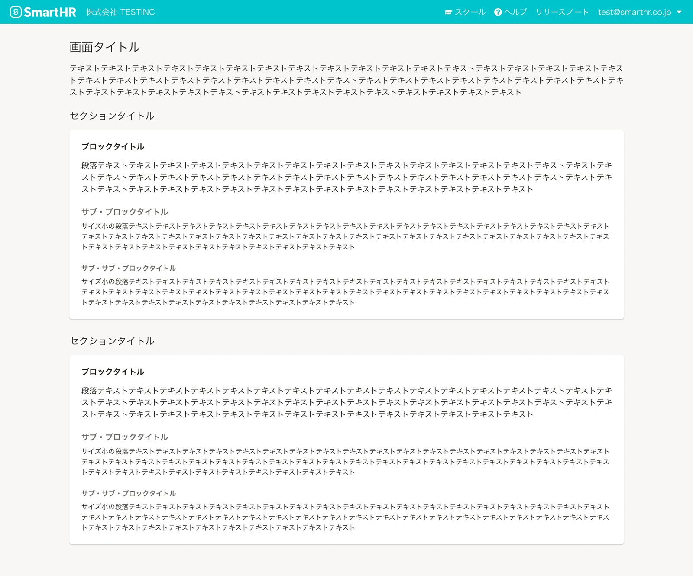

import ComponentPropsTable from '@/components/article/ComponentPropsTable.astro'
import ComponentStory from '@/components/article/ComponentStory.astro'
import CodeBlock from '@/components/article/CodeBlock.astro'
import TableWrapper from '@/components/article/TableWrapper.astro'

import { Heading, Stack, Table, Td, Th, Text } from 'smarthr-ui'

見出し要素の代替として直後のコンテンツの見出しを示すコンポーネントです。「[セクション](/products/design-patterns/visual-grouping/#h3-5)」や「[ブロック](/products/design-patterns/visual-grouping/#h3-6)」に見出しをつけるときに使います。

<ComponentStory name="Heading" />


## 使用上の注意

コンテンツのアウトラインに沿って、順に使用することを想定しています。  
例えば、ブロックタイトルの前にサブ・ブロックタイトルを使わないようにしましょう。


## 種類
見出しレベルに合わせた5種類を定義しています。
SmartHR UIでは、タイプ（`type`props）で種類を指定できます。

```tsx editable
<Stack>
  <PageHeading autoPageTitle={false}>画面タイトル（fontSize: XL）</PageHeading>
  <Section>
    <Stack>
      <Heading type="sectionTitle">セクションタイトル（type: sectionTitle, fontSize: L）</Heading>
      <Heading type="blockTitle">ブロックタイトル（type: blockTitle, fontSize: M）</Heading>
      <Heading type="subBlockTitle">サブ・ブロックタイトル（type: subBlockTitle, fontSize: M）</Heading>
      <Heading type="subSubBlockTitle">サブ・サブ・ブロックタイトル（type: subSubBlockTitle, fontSize: S）</Heading>
    </Stack>
  </Section>
</Stack>
```

### 画面タイトル

画面のタイトルには[PageHeading](/products/components/heading/page-heading/)コンポーネントを使用してください。`screenTitle`タイプと`h1`要素が自動的に設定されます。

### セクションタイトル

サイズは`XXL`、`XL`、`L`から選択できます。デフォルトは`L`です。

<TableWrapper>
  <Table>
    <thead>
      <tr>
        <Th>タイプ</Th>
        <Th>フォントサイズ</Th>
        <Th>ウェイト</Th>
        <Th>色</Th>
        <Th>サンプル</Th>
      </tr>
    </thead>
    <tbody>
      <tr>
        <Td>sectionTitle</Td>
        <Td><a href="/products/design-tokens/typography/"><code>XXL</code></a></Td>
        <Td>normal</Td>
        <Td><a href="/products/design-tokens/color/#h3-2"><code>TEXT_BLACK</code></a></Td>
        <Td><Heading size="XXL" tag="span">well-working 労働にまつわる社会課題をなくし、誰もがその人らしく働ける社会をつくる。</Heading></Td>
      </tr>
      <tr>
        <Td>sectionTitle</Td>
        <Td><a href="/products/design-tokens/typography/"><code>XL</code></a></Td>
        <Td>normal</Td>
        <Td><a href="/products/design-tokens/color/#h3-2"><code>TEXT_BLACK</code></a></Td>
        <Td><Heading size="XL" tag="span">well-working 労働にまつわる社会課題をなくし、誰もがその人らしく働ける社会をつくる。</Heading></Td>
      </tr>
      <tr>
        <Td>sectionTitle</Td>
        <Td><a href="/products/design-tokens/typography/"><code>L（デフォルト）</code></a></Td>
        <Td>normal</Td>
        <Td><a href="/products/design-tokens/color/#h3-2"><code>TEXT_BLACK</code></a></Td>
        <Td><Heading tag="span">well-working 労働にまつわる社会課題をなくし、誰もがその人らしく働ける社会をつくる。</Heading></Td>
      </tr>
    </tbody>
  </Table>
</TableWrapper>

### ブロックタイトル

<TableWrapper>
  <Table>
    <thead>
      <tr>
        <Th>タイプ</Th>
        <Th>フォントサイズ</Th>
        <Th>ウェイト</Th>
        <Th>色</Th>
        <Th>サンプル</Th>
      </tr>
    </thead>
    <tbody>
      <tr>
        <Td>blockTitle</Td>
        <Td><a href="/products/design-tokens/typography/"><code>M</code></a></Td>
        <Td>bold</Td>
        <Td><a href="/products/design-tokens/color/#h3-2"><code>TEXT_BLACK</code></a></Td>
        <Td><Heading type="blockTitle" tag="span">well-working 労働にまつわる社会課題をなくし、誰もがその人らしく働ける社会をつくる。</Heading></Td>
      </tr>
    </tbody>
  </Table>
</TableWrapper>

### サブ・ブロックタイトル

<TableWrapper>
  <Table>
    <thead>
      <tr>
        <Th>タイプ</Th>
        <Th>フォントサイズ</Th>
        <Th>ウェイト</Th>
        <Th>色</Th>
        <Th>サンプル</Th>
      </tr>
    </thead>
    <tbody>
      <tr>
        <Td>subBlockTitle</Td>
        <Td><a href="/products/design-tokens/typography/"><code>M</code></a></Td>
        <Td>bold</Td>
        <Td><a href="/products/design-tokens/color/#h3-2"><code>TEXT_GREY</code></a></Td>
        <Td><Heading type="subBlockTitle" tag="span">well-working 労働にまつわる社会課題をなくし、誰もがその人らしく働ける社会をつくる。</Heading></Td>
      </tr>
    </tbody>
  </Table>
</TableWrapper>

### サブ・サブ・ブロックタイトル

<TableWrapper>
  <Table>
    <thead>
      <tr>
        <Th>タイプ</Th>
        <Th>フォントサイズ</Th>
        <Th>ウェイト</Th>
        <Th>色</Th>
        <Th>サンプル</Th>
      </tr>
    </thead>
    <tbody>
      <tr>
        <Td>subSubBlockTitle</Td>
        <Td><a href="/products/design-tokens/typography/"><code>S</code></a></Td>
        <Td>bold</Td>
        <Td><a href="/products/design-tokens/color/#h3-2"><code>TEXT_GREY</code></a></Td>
        <Td><Heading type="subSubBlockTitle" tag="span">well-working 労働にまつわる社会課題をなくし、誰もがその人らしく働ける社会をつくる。</Heading></Td>
      </tr>
    </tbody>
  </Table>
</TableWrapper>


## レイアウト
アウトラインに合わせた使用例は以下のとおりです。  
余白については、[余白の取り方](/products/design-patterns/spacing-layout-pattern/)を参照してください。



## アクセシビリティ

### 関連ページ

- [ページのタイトルがページの内容を表している | アクセシビリティガイドライン](/accessibility/guidelines/title/)
- [ページのメインコンテンツに見出しが付与されている | アクセシビリティガイドライン](/accessibility/guidelines/heading/)
- [画面の左側に見出しやUIを配置する | 弱視・ロービジョンのユーザビリティチェックリスト](/accessibility/insight/low-vision/left-layout/)

## ライティング
関連するライティングガイドラインを参照してください。
- [画面タイトルや項目名には名詞を使用する](/products/contents/ui-text/app-writing/#h2-2)

## モバイル

モバイルでは、サイズがXXLのタイポグラフィは小さく調整されます。詳しくは[タイポグラフィ](/products/design-tokens/typography/)のページを参照してください。

## Props

<ComponentPropsTable name="Heading" />
