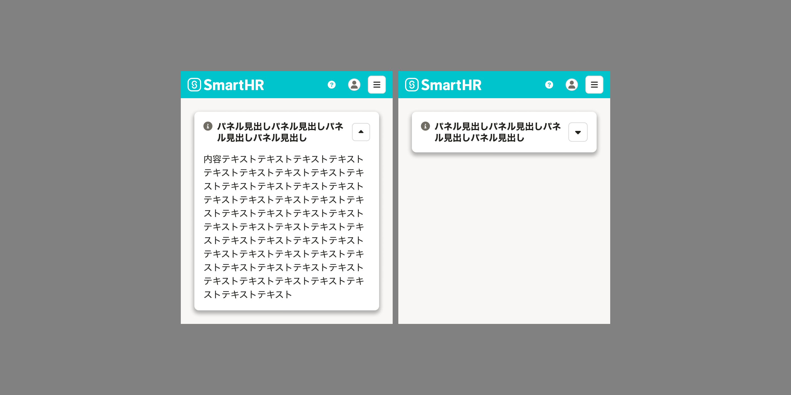
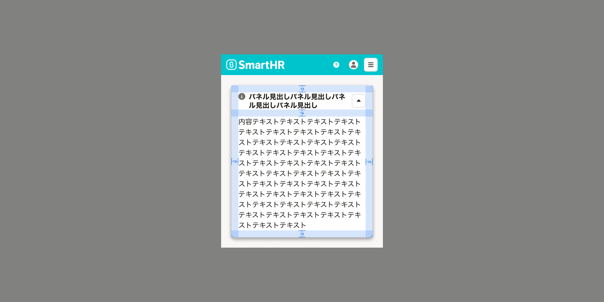

import { Image } from 'astro:assets'
import ComponentPropsTable from '@/components/article/ComponentPropsTable.astro'
import ComponentStory from '@/components/article/ComponentStory.astro'
import DoAndDont from '@/components/article/DoAndDont.astro'
import ImgWithDesc from '@/components/article/ImgWithDesc.astro'
import { Cluster, Text } from 'smarthr-ui'

import imageDo from './images/information-panel-on-base-do.png'
import imageDont from './images/information-panel-on-base-dont.png'

ユーザーに伝えたい情報を他の要素より視覚的に目立たせるためのコンポーネントです。伝えたい情報の種類によってアイコンを切り替えて使います。

<ComponentStory name="InformationPanel" />

## 使用上の注意

### 短い一文で説明できるものに使用しない

見出しと内容を必ずセットにして使用してください。短い一文で説明できる場合は、[ResponseMessage](/products/components/response-message/)や[NotificationBar[base="base"]](/products/components/notification-bar/)が適しています。

詳しい使い分けは[フィードバック - 同期的な処理が完了したとき](/products/design-patterns/feedback/#h3-6)を参照してください。

### Baseのなかに直接配置しない

InformationPanelの[レイヤー順序](/products/design-tokens/z-index/#h2-1)は`3`です。レイヤー順序が`1`の[Base](/products/components/base/)の中に直接配置しないでください。

[削除ダイアログの注意事項](/products/design-patterns/delete-dialog/#h3-4)など、Baseのなかで見出しと内容をグルーピングしたい場合は、[BaseColumnでメッセージを表示するパターン](/products/components/base/base-column/)を使用してください。

<Cluster gap={{ row: 0, column: 1 }}>
  <DoAndDont type="do" width="calc(50% - 8px)">
    <Image slot="img" src={imageDo} alt="Do" />
    <Text slot="label">Baseのなかで「BaseColumnのメッセージを表示するパターン」を用いて代替されている</Text>
  </DoAndDont>
  <DoAndDont type="dont" width="calc(50% - 8px)">
    <Image slot="img" src={imageDont} alt="Dont" />
    <Text slot="label">Baseのなかに直接InformationPanelが置かれている</Text>
  </DoAndDont>
</Cluster>

## 状態

### デフォルト

利用者に伝えたい情報を表示するためのコンポーネントなため、デフォルトでは開閉ボタンを表示しません。

全文表示したままだと操作の妨げになるなど、利用者の使い勝手に影響する場合は開閉ボタンの表示を検討してください。その際、利用者のストレスを生みやすいため、開閉状態の保持を合せて検討してください。

## レイアウト

### [WIP] モバイル

モバイルで自動的に切り替わるようにコンポーネントを改修予定です。

#### 開閉ボタン

モバイルでは画面の表示領域が狭いため、開閉ボタンがアイコンボタンに変更されます。

<ImgWithDesc description="開閉ボタンがある場合、モバイルではアイコンボタンで表示される">

</ImgWithDesc>

#### 余白

コンポーネント内部の余白は[パディング](/products/design-patterns/spacing-layout-pattern/#h2-4)の通りに16pxに変更されます。

<ImgWithDesc description="モバイルでのコンポーネント内の余白は16pxに変更される">

</ImgWithDesc>

前後の要素との余白については[マージン](/products/design-patterns/spacing-layout-pattern/#h2-3)を参照してください。

## Props

<ComponentPropsTable name="InformationPanel" />
