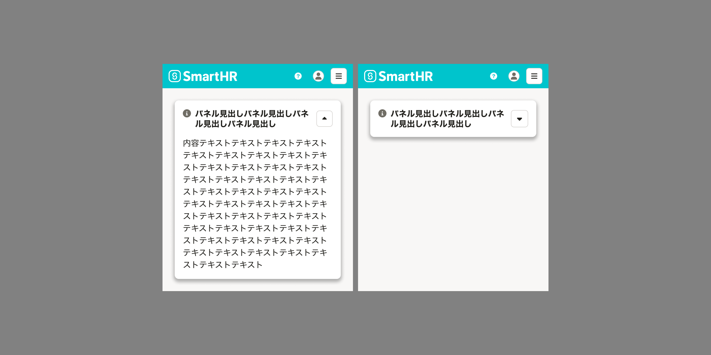
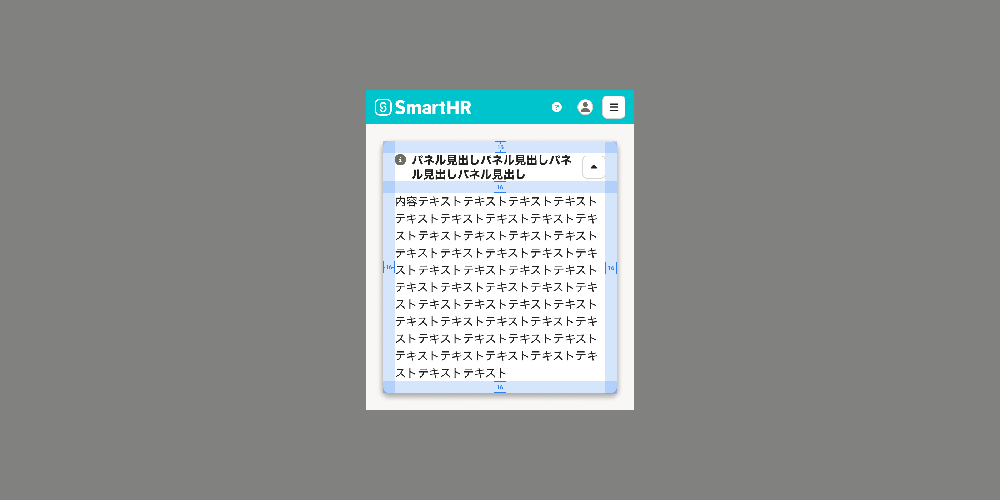

import ComponentPropsTable from '@/components/article/ComponentPropsTable.astro'
import Checklist from '@/components/article/Checklist/Checklist.astro'
import ComponentStory from '@/components/article/ComponentStory.astro'
import DoAndDont from '@/components/article/DoAndDont.astro'
import ImgWithDesc from '@/components/article/ImgWithDesc.astro'
import { Text, ResponseMessage, Groupbox } from 'smarthr-ui'

ユーザーに伝えたい情報を視覚的に目立たせるパネルコンポーネントです。複数行のテキストや複数項目の不備一覧など、[ResponseMessage](/products/components/response-message/)や[NotificationBar](/products/components/notification-bar/)では収まらない量のフィードバック情報などを表示するときに使います。

<ComponentStory name="InformationPanel" />

## 使用上の注意

### 短い一文で説明できるものに使用しない

見出しと内容を必ずセットにして使用してください。短い一文で説明できる場合は、[ResponseMessage](/products/components/response-message/)や[NotificationBar[base="base"]](/products/components/notification-bar/)が適しています。

詳しい使い分けは[フィードバック - 同期的な処理が完了したとき](/products/design-patterns/feedback/#h3-6)を参照してください。

### 白背景の中に配置しない

InformationPanelの背景色は白いため、[Panel](/products/components/panel/)やダイアログコンテンツなど背景が白い要素の中にそのまま配置しないでください。

[Groupbox](/products/components/groupbox/)のなかや、背景色を[`COLUMN`や`OVER_BACKGROUND`](/products/design-tokens/color/#h3-3)などの白以外に変更したPanelやダイアログコンテンツのなかであれば配置できます。

InformationPanelでは視覚的に強調されすぎる場合は、[削除ダイアログの注意事項](/products/design-patterns/delete-dialog/#h3-4)のようにGroupboxを使った代替パターンも検討してください。

<DoAndDont type="do">
  <div slot="img">
```tsx editable background=BACKGROUND hideCode
<Panel padding={1.5} className="shr-w-full shr-bg-over-background">
  <InformationPanel type="warning" heading="Panelの中で目立たせたい情報">
    <p>Panelの中で目立たせたい内容。</p>
  </InformationPanel>
</Panel>
```
  </div>
  <Text slot="label">Panelの背景色が`OVER_BACKGROUND`になっている</Text>
</DoAndDont>

<DoAndDont type="do">
  <div slot="img">
```tsx editable background=BACKGROUND hideCode
<Panel padding={1.5} className="shr-w-full">
  <Groupbox>
    <Stack>
      <Heading type="blockTitle" icon={<WarningIcon />}>Panelの中で目立たせたい情報</Heading>
      <p>Panelの中で目立たせたい内容。</p>
    </Stack>
  </Groupbox>
</Panel>
```
  </div>
  <Text slot="label">PanelのなかでGroupboxを使って代替されている</Text>
</DoAndDont>

<DoAndDont type="dont">
  <div slot="img">
```tsx editable background=BACKGROUND hideCode
<Panel padding={1.5} className="shr-w-full">
  {/* eslint-disable-next-line smarthr/design-system-guideline-prohibit-information-panel-in-white-bg */}
  <InformationPanel type="warning" heading="Panelの中で目立たせたい情報">
    <p>Panelの中で目立たせたい内容。</p>
  </InformationPanel>
</Panel>
```
  </div>
  <Text slot="label">Panelが白背景のままInformationPanelが置かれている</Text>
</DoAndDont>

## レイアウト

### [WIP] モバイル

<Groupbox className="shr-mt-2">
  <ResponseMessage>モバイルで自動的に切り替わるようにコンポーネントを改修予定です。</ResponseMessage>
</Groupbox>

#### 開閉ボタン

モバイルでは画面の表示領域が狭いため、開閉ボタンをアイコンボタンで表示します。

<ImgWithDesc description="開閉ボタンがある場合、モバイルではアイコンボタンで表示する">

</ImgWithDesc>

#### 余白

コンポーネント内部の余白は[パディング](/products/design-patterns/spacing-layout-pattern/#h2-4)の通りに16pxに変更します。

<ImgWithDesc description="モバイルでのコンポーネント内の余白は16pxに変更する">

</ImgWithDesc>

前後の要素との余白については[マージン](/products/design-patterns/spacing-layout-pattern/#h2-3)を参照してください。

## 状態

### デフォルト

利用者に伝えたい情報を表示するためのコンポーネントなため、デフォルトでは開閉ボタンを表示しません。

全文表示したままだと操作の妨げになるなど、利用者の使い勝手に影響する場合は開閉ボタンの表示を検討してください。その際、利用者のストレスを生みやすいため、開閉状態の保持を合せて検討してください。

## 使い方チェックリスト

<Checklist name="InformationPanel" />

## Props

<ComponentPropsTable name="InformationPanel" />
