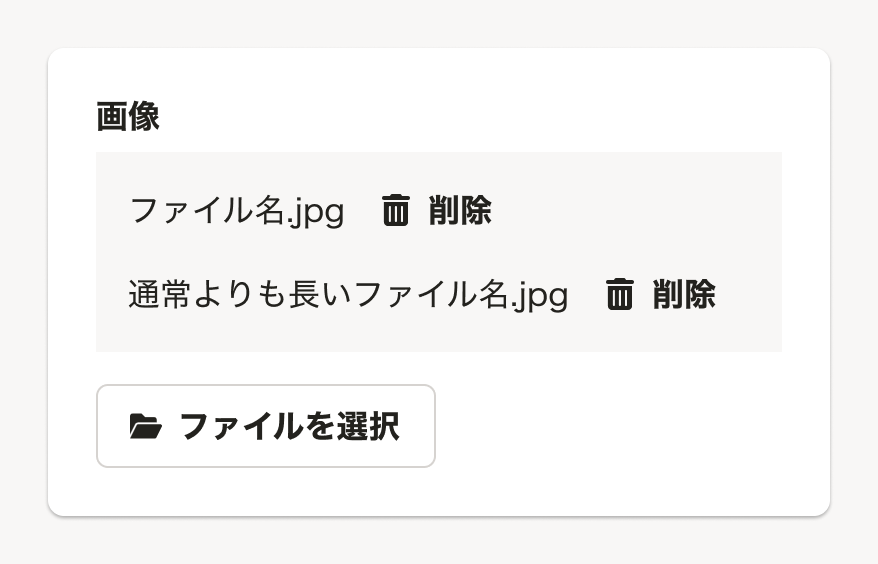

import ComponentPropsTable from '@/components/article/ComponentPropsTable.astro'
import ComponentStory from '@/components/article/ComponentStory.astro'
import DoAndDont from '@/components/article/DoAndDont.astro'

import { Image } from 'astro:assets'
import {
  Text,
  Cluster
} from 'smarthr-ui'

import inputFileLabelDo from './images/input-file-label-do.png'
import inputFileLabelDont from './images/input-file-label-dont.png'

ファイルを選択するためのコンポーネントです。`input[type="file"]`の代わりに使用します。選択したファイル名の一覧を表示する領域を持っています。

[DropZone](/products/components/drop-zone/)の内部でも使用されています。

<ComponentStory name="InputFile" />

## 使用上の注意
### ドラッグアンドドロップでのファイル選択
ファイルの探索方法はユーザーの行動に依存するため、ドラッグアンドドロップでのファイル選択を提供したい場合など、ファイル選択UIとしてより多くの操作方法を提供できる[DropZone](/products/components/drop-zone/)の使用も検討してください。

ただし、DropZoneは視線を強く誘導する効果を持つため、以下の場合はInputFileを推奨します。

- DropZoneを一定以上の大きさでレイアウトすることが難しい場合
- 1つの画面に複数のファイル選択UIを配置する必要がある場合
    - 複数のDropZoneを配置すると、過剰なメリハリによって他の入力項目の閲覧性が低下する可能性があります。

## 状態

### ファイルリストの表示
`hasFileList`propsで`true`を指定すると、ファイルリストを表示できます。

## アクセシビリティ
InputFileのような入力要素では、入力すべき内容をユーザーに明確に伝えるラベルの提供が必要です。また、スクリーンリーダーなどの支援技術に情報を伝えるためにAccessible Nameも設定してください。
[FormControl](/products/components/form-control/)と組み合わせた使用する場合、`title`でラベルを設定することで、同じ内容がAccessible Nameとしても提供されます。

### InputFileでラベルを提供する
InputFileでは、入力要素として「何を入力すべきか」を示すラベルを[FormControl](/products/components/form-control/)の`title`で設定してください。

InputFileのボタンには「ファイルを選択する」のラベルが表示されますが、この文言だけではユーザーは選択するファイルを特定できません。
アップロードしてほしいファイルの内容をラベルで明示することで、迷わず適切なファイルを選択できます。

<Cluster gap={{ row: 0, column: 1 }}>
  <DoAndDont type="do" width="calc(50% - 8px)">
    <Image slot="img" src={inputFileLabelDo} alt="証明書の写真というラベルとセットで表示されているInputFile" />
    <Text slot="label">アップロードしてほしいファイル「証明書の写真」をラベルで明示します。</Text>
  </DoAndDont>
  <DoAndDont type="dont" width="calc(50% - 8px)">
    <Image slot="img" src={inputFileLabelDont} alt="証明書の種類を選択するSelectと並んだラベルのないInputFile" />
    <Text slot="label">選択すべきファイルを明示しない場合、誤ったデータを入力する危険性があります。</Text>
  </DoAndDont>
</Cluster>

### InputFileでラベルを省略する場合
InputFileを使用する画面・ダイアログなどの領域内において、入力の目的が十分にテキストで説明されており、見た目上のラベルが冗長な情報になると判断できる場合には、見た目上のラベルを省略できます。
ラベルを省略する場合も、Accessible Nameを漏れなく提供するために、以下のような方法で実装してください。

- [FormControl](/products/components/form-control/)の`label.dangerouslyHide`を使用して、ラベルを不可視化する
- `aria-label`で、入力する内容を特定できるAccessible Nameを設定する

## モバイル
目的のファイルを探すまでに、モバイルではステップが増えることがあるため、選択が複数回に分かれるケースがあります。
そのため、必要に応じて multiplyAppendable の利用を検討してください。

## Props

<ComponentPropsTable name="InputFile" />

