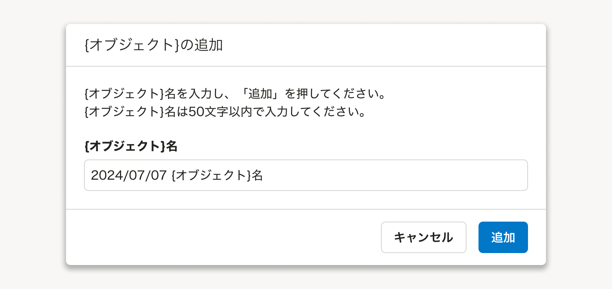
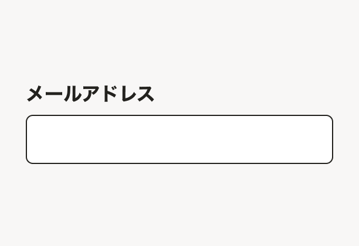
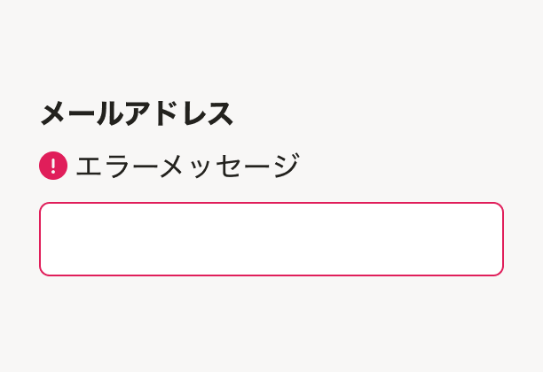
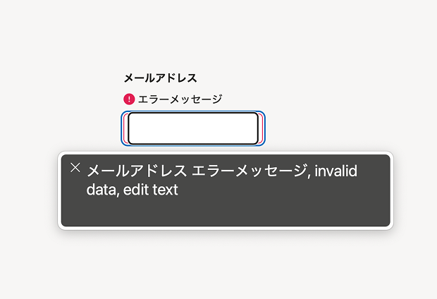
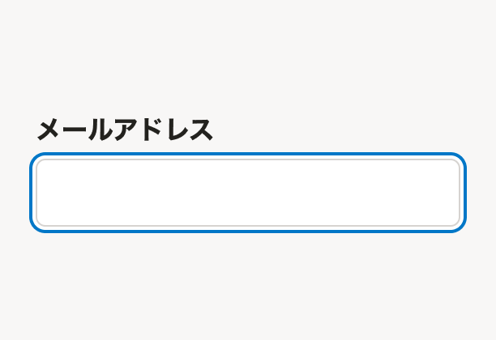

import { Image } from 'astro:assets'
import ComponentPreview from '@/components/ComponentPreview/ComponentPreview'
import ComponentPropsTable from '@/components/article/ComponentPropsTable.astro'
import ComponentStory from '@/components/article/ComponentStory.astro'
import DoAndDont from '@/components/article/DoAndDont.astro'
import { BaseColumn, Cluster, CurrencyInput, FaMagnifyingGlassIcon, Text } from 'smarthr-ui'
import Grid from '@/components/article/Grid.astro'
import ImgWithDesc from '@/components/article/ImgWithDesc.astro'

import inputWidthDo from './images/input-width-do.png'
import inputWidthDont from './images/input-width-dont.png'
import inputFocused from './images/focused-input.png'
import inputError from './images/error-input.png'
import inputForcedColor from './images/forced-color-input.png'

テキストや数値などの情報を1行で入力するためのコンポーネントです。`input[type="text"]`や`input[type="number"]`などの代わりとして使用します。

<ComponentStory name="Input" />

## 使用上の注意

### 適切な幅に調整して使用する

入力する内容をあらかじめ精査し適切な幅になるよう調整して使用してください。

<Cluster gap={{ row: 0, column: 1 }}>
  <DoAndDont type="do" width="calc(50% - 8px)">
    <Image slot="img" src={inputWidthDo} alt="Do" />
    <Text slot="label">入力する内容の量が精査され、幅が調整されている</Text>
  </DoAndDont>
  <DoAndDont type="dont" width="calc(50% - 8px)">
    <Image slot="img" src={inputWidthDont} alt="Dont" />
    <Text slot="label">入力する内容の量が精査されず、幅が調整されていない</Text>
  </DoAndDont>
</Cluster>

適切な幅は以下の判断基準を参考にしてください。

- Inputは常に1行で表示され、幅を超える入力内容を確認するにはスクロールが必要になってしまいます。十分な幅を確保してください。
- 入力する内容の文字数の予測が付く場合、過剰に幅を確保しないでください。過剰に幅を取ると入力するべきものがわかりづらくなったり、[視線誘導](/products/design-patterns/visual-guidance/)の妨げになってしまうことがあります。
- フォーム全体で見たときにレイアウトに統一性がなく感じられるときは、他の要素とのバランスを考慮して幅を調整してください。

### ユースケースに応じてコンポーネントを使い分ける

#### 複数行のテキスト入力が想定される場合は使用しない

改行を含めたテキストの入力を受け付ける場合は[Textarea](/products/components/textarea/)を使用してください。

#### データの編集や送信を伴わない画面では使用しない

データの編集や送信を伴わない画面でデータを表示する場合は[DefinitionList](/products/components/definition-list/)を使用してください。

### 入力項目の説明や例をプレースホルダで表示しない

入力項目の説明や例を載せる場合は[FormControl](/products/components/form-control/)のヘルプメッセージ（`helpMessage`）や入力例（`exampleMessage`）などを用い別途表示してください。どうしても表示領域が確保できない場合は[Tooltip](/products/components/tooltip/)を使うこともできます。

プレースホルダ（`placeholder`）を使い入力項目の説明や例を載せてしまうと、入力中にプレースホルダの内容が確認できず入力補助として成立しないため非推奨です。


## Inputを使用したコンポーネント

開発で頻繁に利用する実装をコンポーネント化しています。

### CurrencyInput

金額を入力するためのコンポーネントです。金額を入力するときはCurrencyInputを使用してください。

入力値が整数であった場合、入力欄からフォーカスを外したときに3桁ごとにカンマが入った値で表示されます。

```tsx editable
<CurrencyInput
  defaultValue="1000"
/>
```

### SearchInput

検索欄のためのコンポーネントです。[よくあるテーブルのオブジェクトの検索](/products/design-patterns/smarthr-table/#h4-4)などに使用します。

`tooltipMessage`を使用して入力内容に対する説明を補足してください。

`prefix`は検索アイコン「<FaMagnifyingGlassIcon alt="FaMagnifyingGlassIcon 虫眼鏡のアイコン" />」に固定されています。

```tsx editable noIframe withStyled
render(() => {
  const [query, setQuery] = React.useState('須磨 英子')
  return (
    <SearchInput
      tooltipMessage="氏名、ヨミガナ、社員番号で検索できます。"
      value={query}
      onChange={(e) => { setQuery(e.target.value) }}
      onClickClear={() => { setQuery('') }}
    />
  )
})
```

`onClickClear`を使用すると、入力内容のクリアボタンが表示されます。検索ボタンのあるフォーム（インクリメンタル検索をしないフォーム）内のSearchInputでは入力内容のクリアボタンで検索まで実行せず、入力内容の削除にとどめてください。

import SearchInputDont from './_components/SearchInputDont'

<DoAndDont type="dont">
  <BaseColumn slot="img">
    <SearchInputDont />
  </BaseColumn>
  <Text slot="label">検索ボタンのあるフォーム内のSearchInputで、入力内容のクリアボタンを押すと検索まで実行される</Text>
</DoAndDont>

## レイアウト

### プレフィックス・サフィックス

入力欄の前後にアイコンや単位を示すテキストなどの要素を置くことができます。

#### 要素の設置判断基準

要素の位置と種類、位置に基づく役割は以下の表を参考にしてください。

import SampleInputWithPrefixIcon from './_components/SampleInputWithPrefixIcon'
import SampleInputWithSuffixIcon from './_components/SampleInputWithSuffixIcon'

| 位置 | 要素の種類 | 表示例 | 要素の役割 |
| :-- | :-- | :-- | :-- |
| プレフィックス（`prefix`）| アイコン | <SampleInputWithPrefixIcon /> | 入力内容を想起させるために使用します。 |
| プレフィックス（`prefix`）| テキスト| <CurrencyInput name="exampleprefixtext" defaultValue="1000" prefix="$" client:load /> | 入力内容を想起させるために使用します。 <br /> 一般的に内容に対して前方に置かれる単位（例: 米ドル）に用いてください。 |
| サフィックス（`suffix`）| アイコン | <SampleInputWithSuffixIcon />| 操作を想起させるため、または操作を提供するために使用します。 |
| サフィックス（`suffix`）| テキスト | <CurrencyInput name="examplesuffixtext" defaultValue="1000" suffix="円" client:load /> | 入力内容を想起させるために使用します。<br />一般的に内容に対して後方に置かれる単位（例: 日本円）に用いてください。 |

入力内容を想起させるアイコンは、以下の判断基準を参考につけてください。

- 基本的には明確に必要なときにのみアイコンをつけてください。アイコンが多すぎると、ユーザーがアイコンの意味を理解することが難しくなり、開発者としてもアイコンを作成・選定するコストがかかります。
- SmartHR上で頻出する操作に関しては、アイコンをつけることを推奨します（例: SearchInput）。

## 状態

### デフォルト
何も入力されていない状態をデフォルトとしてください。

ユーザーの入力作業が向上したり、ミスを減らせる場合には[デフォルト値](/products/design-patterns/default_value/)を設定すること検討します。  
新規作成画面などで、Inputをオブジェクト名の入力欄として使用する際に、自動的にオブジェクト名を決められる場合は `yyyy/mm/dd + オブジェクト名` のようにデフォルト値を設定することを推奨します。



### 読み取り専用（readOnly）

Inputの意匠を残しつつデータを表示し、入力は受け付けない状態を表現したスタイルです。

当該画面では編集できないが別の場所でユーザーが入力したことがあり、その値がフォームの送信内容に含まれていることを示すことが重要な場合に使用します。

例えば、すでに登録済みで変更できないメールアドレスを、入力済みとして送信したい場合に使用します。

```tsx editable
<FormControl
  title="メールアドレス"
>
  <Input
    value="example@example.com"
    readOnly
  />
</FormControl>
```

### 無効（disabled）

入力を受け付けない状態を表現したスタイルです。

通常は編集ができるが一時的または権限の制約により編集ができない場合に使用します。ユーザーに編集させたくないが送信内容に含めたい値は、フォームには表示しないか読み取り専用（`readOnly`）を使用することも検討してください。

ユーザーはなぜ無効になっているのかわからないことがあります。[権限による表示制御](/products/design-patterns/access-control-pattern/)のデザインパターンを参考にして、そもそも無効ではなくフォーム自体を非表示にしたり、無効状態の理由を付近に表示することを検討してください。

```tsx editable
<Input
  name="disabled"
  value="一時的に編集できない値"
  disabled
/>
```

## アクセシビリティ
### 基本的なアクセシビリティ機能
**FormControlとの統合:** FormControlと組み合わせることで、ラベルとInputの関連付け、補助テキストやエラーメッセージの適切な関連付けが自動的に行なわれます。詳しくは、[FormControlのドキュメント](/products/components/form-control/)を参照してください。

**強制カラーモード対応:** ユーザーがテキストを読みやすくするために[強制カラーモード](https://developer.mozilla.org/ja/docs/Web/CSS/@media/forced-colors)を設定した場合、Inputのボーダーの色が適切に表示されるように実装されています（図1）。
<Grid autoRepeat="auto-fill">
  <ImgWithDesc description='図1: 強制カラーモードを有効にした場合の見た目の例。ボーダーの色が濃くなり、境界がわかりやすくなる'>
    
  </ImgWithDesc>
</Grid>
**エラー状態:** [error属性](https://github.com/kufu/smarthr-ui/blob/75eb34543a7bf10e77a251fb110bee7d456d8849/packages/smarthr-ui/src/components/Input/Input.tsx#L163)を設定するとaria-invalid属性が自動的に付与され、スクリーンリーダーでフォーカス時にエラー状態であることが通知されます（図2-1、図2-2）。
  <Grid>
    <ImgWithDesc description='図2-1: errorを設定した場合の見た目の例'>
      
    </ImgWithDesc>
    <ImgWithDesc description='図2-2: errorを設定した場合のスクリーンリーダーでの読み上げの例。「エラーメッセージ」と「無効なデータ」がアナウンスされます'>
      
    </ImgWithDesc>
  </Grid>
**キーボード操作:** Inputコンポーネントは、キーボード操作を前提に設計されています。
- <kbd>Tab</kbd>キーでフォーカスの移動が可能。
- フォーカス状態が視覚的に明確に表示される（図3）。
<Grid autoRepeat="auto-fill">
  <ImgWithDesc description='図3: フォーカス状態の見た目の例'>
    
  </ImgWithDesc>
</Grid>

### 開発時の考慮点
Inputコンポーネントを使用する際は、以下の点に注意して実装してください。

- **FormControlと併用する:** Inputコンポーネントは必ずFormControlコンポーネントと併用して、ユーザーがInputに何を入力すべきかが理解できる適切なラベルを設定してください。これにより、スクリーンリーダーユーザーが入力項目の目的を理解できるようになります。
  - eslint-plugin-smarthrの[smarthr/a11y-input-in-form-control](https://github.com/kufu/eslint-plugin-smarthr/tree/main/rules/a11y-input-in-form-control/)ルールは、InputにFormControlを組み合わせることを促すものです。支援技術に入力の目的が伝わらないリスクを防ぐため、有効にして使用することを推奨します。
- **アクセシブルネームの確認:** 設定したラベルがInputのアクセシブルネームとして正しく関連付けられていることを確認してください。詳しくは、[フォームパーツにアクセシブルネームがある](/accessibility/check-list/accessible-name/)を参照してください。

#### 良い実装例

```tsx editable

<FormControl 
  title="メールアドレス"
>
  <Input 
    name="email" 
    type="email"
  />
</FormControl>

```

FormControlとInputを適切に組み合わせ、titleで指定したテキストが`<label>`としてInputに関連付けられ、可視ラベルとアクセシブルネームが適切に設定されるため、すべてのユーザーが入力内容を理解しやすいフォームになります。

#### 悪い実装例

```tsx editable

<Stack gap={0.5}>
  <Text styleType="blockTitle">メールアドレス</Text>
  <Input
    name="email"
    type="email"
  />
  <div style={{ color: 'red' }}>
    正しいメールアドレスの形式で入力してください 
  </div>
</Stack>

```

この実装には以下の問題があります。
- FormControlを使用していないため、ラベルとInputが自動的に関連付けられずアクセシブルネームが設定されず、スクリーンリーダーユーザーが入力内容を理解しづらいフォームになってしまいます。
- エラーメッセージがInputと適切に関連付けられておらず、スクリーンリーダーでフォーカス時にエラー状態であることが通知されません。

## Props

<ComponentPropsTable name="Input" />