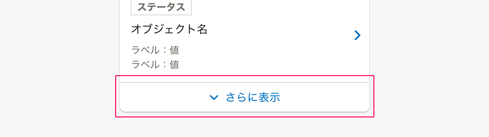

import ComponentPropsTable from '@/components/article/ComponentPropsTable.astro'
import ComponentStory from '@/components/article/ComponentStory.astro'

import ImgWithDesc from '@/components/article/ImgWithDesc.astro'

主に「[よくあるテーブル](/products/design-patterns/smarthr-table/)」などコレクションにおけるページを切り替えるためのコンポーネントです。使用する場所によって機能を落とせます。

<ComponentStory name="Pagination" />

### モバイル

以下の理由から、モバイルでのPaginationの表示には注意が必要です。Paginationの代わりに「さらに表示」ボタンを表示することを検討してください。

- 水平方向に複数の操作が並ぶPaginationは誤操作を招きやすい
- ユーザーはモバイル環境では垂直方向のスクロールで情報を閲覧する操作に慣れている

参考：[よくあるリストの「さらに表示」ボタン](/products/design-patterns/smarthr-list/#h3-4)

ただし、次のような場合にはモバイルでもPaginationが適していることがあります。

- 表示されるデータの件数が多いと想定される場合
- 一覧上から特定のデータを探して操作することが主要な使われ方として想定される場合

モバイルでPaginationを表示する場合は、画面の幅が狭いため、`withoutNumber`propsを有効にするか、`Padding`propsに0~1の値を設定してください。

<ImgWithDesc description="paddingを1に設定したPagination">
    
</ImgWithDesc>

## Props

<ComponentPropsTable name="Pagination" />

