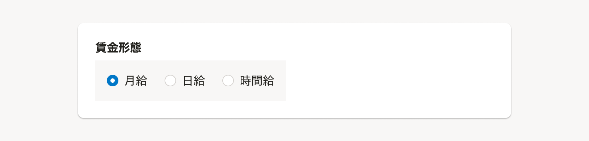

import { Image } from 'astro:assets'
import ComponentPropsTable from '@/components/article/ComponentPropsTable.astro'
import ComponentStory from '@/components/article/ComponentStory.astro'
import DoAndDont from '@/components/article/DoAndDont.astro'
import { Cluster, Text } from 'smarthr-ui'

import RadioButtonDo from './images/radio-button-do.png';
import RadioButtonDont from './images/radio-button-dont.png';
import RadioButtonAlignmentDo from './images/radio-button-alignment-do.png';
import RadioButtonAlignmenDont from './images/radio-button-alignment-dont.png';

選択肢の中から単一の値を選択して入力できるコンポーネントです。
`input[type='radio']`の代わりとして使用します。

<ComponentStory name="RadioButton" />

## 使用上の注意

### ユースケースに応じてコンポーネントを使い分ける

#### 選択肢が多すぎる場合は別のコンポーネントを検討する

基本的に、選択肢の中から単一の値を選択して入力させる場合は、初期状態で選択肢が一覧しやすいラジオボタンを使用します。

- 選択肢のラベルテキストが長大になる場合や、選択肢が表示領域内にすべて表示しきれないほど存在する場合では、[Select](/products/components/select/)や[SingleComboBox](/products/components/combo-box/single-combo-box/)も検討します。
  - ただし選択肢の一覧性が下がり、操作の手間が増えるので、選択肢の数が不定で予測できないなどの理由がない限りはラジオボタンの使用を推奨します。

#### 選択肢のラベルテキストはなるべく簡潔に同程度の文量で収める

ラジオボタンのラベルテキストは、同程度の文量や行数になるように調整してください。
ラジオボタンは性質上、テキストの文量によって幅が変化します。極端に行数や文量の異なる選択肢が混ざると、ユーザーが視認できる領域の差異が大きくなるため、選択肢を間違える恐れがあります。

選択肢を適切に選択させるために補足説明のテキストやステータスラベルを含む複数の要素を追加したい場合や、ラベルテキストが短く画面内の他の要素と比べて認識しづらいなどの理由で、選択肢を視覚的に強調して表示したい場合は[RadioButtonPanel](/products/components/radio-button-panel/)を検討してください。

#### ビューの切り替えを操作するUIとして使用しない

ラジオボタンは入力後に、`送信`や`保存`といったtype属性が`submit`のボタンなどを押すことで入力内容が反映される場合に使用してください。 
ラジオボタンは1クリックで選択肢ごとに異なる結果となるため、誤入力によって意図しない結果が反映されてしまう可能性あります。

コレクションなどでオブジェクトの表示方法を切り替える場合や、表示領域上`submit`のボタンの配置が難しい場合など、即時反映を前提とする箇所では[TabBar](/products/components/tab-bar/)や[SegmentedControl](/products/components/segmented-control/)、または[Switch](/products/components/switch/)を使用してください。

#### ラジオボタンの並び順

横幅に十分なスペースがある場合は、基本的に横並びにすることで縦幅が長くなりすぎることを防ぎます。

<Cluster gap={{ row: 0, column: 1 }}>
  <DoAndDont type="do" width="calc(50% - 8px)">
    <Image slot="img" src={RadioButtonAlignmentDo} alt="スクリーンショット: ラジオボタンの縦横に配置するレイアウトのDo" />
    <Text slot="label">横幅に十分なスペースがある場合は、基本的に横並びにします。</Text>
  </DoAndDont>

  <DoAndDont type="dont" width="calc(50% - 8px)">
    <Image slot="img" src={RadioButtonAlignmenDont} alt="スクリーンショット: ラジオボタンの縦横に配置するレイアウトのDon't" />
    <Text slot="label">縦並びにすると、親項目の幅に対して要素の配置が偏ってしまい、視認性が低下する恐れがあります。</Text>
  </DoAndDont>
</Cluster>

ただし、選択肢の文字が長くなる場合は縦並びを検討します。


### ラジオボタン内に操作可能な要素を含めない

ラジオボタン内には、ヘルプページへのリンクやInputなど、ユーザーが値を選択する以外の操作可能な要素は配置しないでください。
これらを配置してしまうと、ユーザーがフォーム入力するための操作難易度が上がり、誤操作などにつながるためです。（[※1](#h2-3)）

- リンクを置きたい場合は、[Fieldset](/products/components/fieldset/)の`helpMessage` propsなどを使用します。
- ComboBoxなどで選択肢に応じて段階的に別の操作をさせたい場合は、[RadioButton](/products/components/radio-button/)と`disabled`状態を組み合わせるか、[ステップを複数に分けたモード](/products/design-patterns/modal-ui/#h3-5)を検討します。

<Cluster gap={1}>
  <DoAndDont type="do" width="calc(50% - 8px)">
    <Image slot="img" src={RadioButtonDo} alt="Do" width="346" />
    <Text slot="label">ユーザーは選択する操作に集中でき、それ以外の操作と区別しやすい</Text>
  </DoAndDont>
  <DoAndDont type="dont" width="calc(50% - 8px)">
    <Image slot="img" src={RadioButtonDont} alt="Dont" width="346" />
    <Text slot="label">ユーザーが選択操作に集中できず、操作難易度が上がる</Text>
  </DoAndDont>
</Cluster>


## 状態 

### デフォルト

RadioButtonは常に1つの選択肢が選択されているコンポーネントのため、選択肢の中から1つデフォルト値に設定するものを決めてください。（参考：[デフォルト値に設定する値](/products/design-patterns/default_value/#h3-0)）




## デザインパターン

### 選択肢のグルーピング

例えば設定画面などで、チェックボックスやラジオボタンのように複数の選択肢を持つ項目を、いくつも並べて表示する場合は、ラベルがかかる範囲や設定項目ごとの選択肢を区別しやすくするために[BaseColumn](/products/components/base/base-column/)でグルーピングする場合があります。

[共通設定の操作権限項目](/products/design-patterns/access-control-setting-pattern-core-features/)のデザインパターンもあわせて参考にしてください。

```tsx editable
<>
    <Fieldset
        title="設定項目"
        innerMargin={0.5}
    >
        <BaseColumn>
            <Cluster gap={{ row: 1, column: 1.5 }}>
                <RadioButton name="sample">選択肢 1</RadioButton>
                <RadioButton name="sample">選択肢 2</RadioButton>
                <RadioButton name="sample">選択肢 3</RadioButton>
                <RadioButton name="sample">選択肢 4</RadioButton>
                <RadioButton name="sample">選択肢 5</RadioButton>
            </Cluster>
        </BaseColumn>
    </Fieldset>
</>
```


## Props

<ComponentPropsTable name="RadioButton" />

## 関連リンク

- [デザインパターン（基本機能）/共通設定の操作権限項目](/products/design-patterns/access-control-setting-pattern-core-features/)

## 参考文献

※1. [\<label\>: The Label element - HTML: HyperText Markup Language | MDN](https://developer.mozilla.org/en-US/docs/Web/HTML/Element/label#interactive_content)
