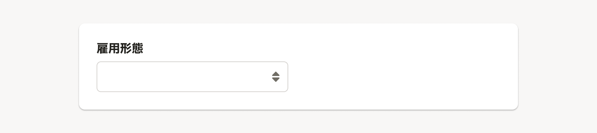

import ComponentPropsTable from '@/components/article/ComponentPropsTable.astro'
import ComponentStory from '@/components/article/ComponentStory.astro'

`select`の代わりに使用するコンポーネントです。[Input](/products/components/input/)と見た目を揃えるために存在します。

<ComponentStory name="Select" />

## 使用上の注意

### 選択肢が6個以上の場合に使用する

基本的に選択肢の数が6個以上になる場合はSelectを使用します。初期状態では選択肢を一覧できないことに注意してください。

ユーザーがスムーズに操作できるよう、選択肢の数に応じてSelectコンポーネント以外の使用も考えられます。

#### 選択肢が5個以下の場合

一般的に人は4±1個の情報のまとまりまでしか短期的に記憶できないと言われています。選択肢が5個以下であれば、初期状態で選択肢が一覧できる[RadioButton](/products/components/radio-button/)の使用を推奨します。
ただし、RadioButtonで配置するスペースがない場合はSelectも使用可能です。

#### 選択肢の数が不定の場合

ユーザーの設定や条件によって選択肢の数が増減するなど、実装時に数を固定できない場合は、想定される最大数を考慮して使用するコンポーネントを判断してください。

### SingleComboboxとの使い分け

単一選択かつ、ユーザーに選択肢をフィルタリングさせたい場合は[SingleCombobox](/products/components/combo-box/single-combo-box/)の使用を検討してください。

### 即時反映が期待されるビューの切り替えには使わない

Selectは入力後に、送信や保存といったtype属性が`submit`のボタンなどを押すことで入力内容が反映される場合に使います。即時反映が期待されるビューの切り替えには使わないでください。

ビューの切り替えには[TabBar](/products/components/tab-bar/)や[SegmentedControl](/products/components/segmented-control/)、[SideNav](/products/components/side-nav/)を使います。

## 状態

### デフォルト

[デフォルト値](/products/design-patterns/default_value/)の「何も入力がない状態で表示する」という考え方に従って、空の状態で表示します。

ユーザーの入力作業が向上したり、ミスを減らせる場合には他の選択肢を設定することを検討します。

## Props

<ComponentPropsTable name="Select" />

