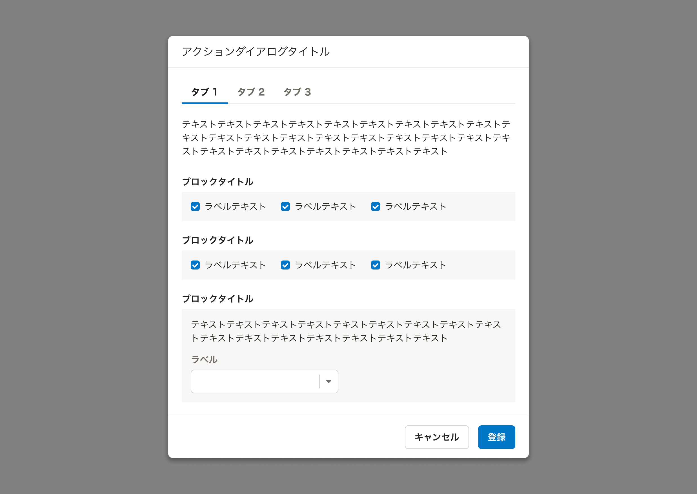
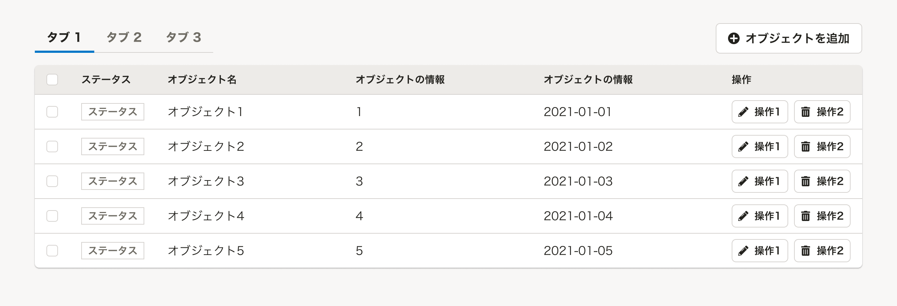

import ComponentPropsTable from '@/components/article/ComponentPropsTable.astro'
import ComponentStory from '@/components/article/ComponentStory.astro'

ユーザーの関心が近いものを並列化し、ビューを切り替えるためのコンポーネントです。

<ComponentStory name="TabBar" />

## 使用上の注意

### 同じオブジェクトの異なる状態を切り替えて表示する目的に使用しない
TabBarは異なるオブジェクトやビューを切り替えるために使用してください。同じオブジェクトについて異なる状態を切り替えたい場合は[SegmentedControl](/products/components/segmented-control/)の使用を検討してください。

### 下線なし（`bordered=false`）のTabBarは非推奨
タブとして操作できるか認知がしにくく、ビューへの影響範囲が不明瞭なため、下線なしのTabBarは非推奨です。

### 下線によって影響範囲を明示する
TabBarは、下線によって影響するビューの範囲を明示して使用してください。



下線が他のコンポーネントと競合する場合、最低限TabBarItemがある範囲までは下線が必要です。



## レイアウト

### IconやBadgeの有無
TabBarItem内にIconやBadgeを追加することでタブそのものやタブ内のビューに関する情報を補足できます。具体例は以下の通りです。

* タブ内のビューで選択しているオブジェクトの数をBadgeで示す
* タブ内のビューでエラーが発生していることをIconで示す
    * Iconはデフォルトではテキスト情報を持たないため、視覚情報と同等の情報を代替テキストなどを使って提供してください

```tsx editable codeBlock noIframe
<TabBar>
  <TabItem suffix={<Badge count={4} />} id="tabitem1" onClick={() => null} selected>
    基本情報
  </TabItem>
  <TabItem suffix={<FaCircleExclamationIcon color="DANGER" alt="エラーあり"/>} id="tabitem2" onClick={() => null}>
    家族情報
  </TabItem>
  <TabItem disabled disabledDetail={{ message: 'この情報は使えません。' }} id="tabitem3">
    その他
  </TabItem>
</TabBar>
```

## Props

<ComponentPropsTable name="TabBar" />

