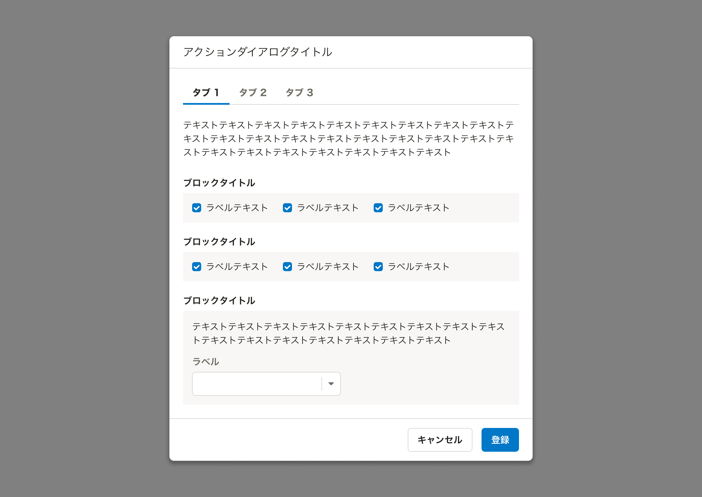

import ComponentPropsTable from '@/components/article/ComponentPropsTable.astro'
import ComponentStory from '@/components/article/ComponentStory.astro'
import DoAndDont from '@/components/article/DoAndDont.astro'
import { TabBarWithReel } from './_components'
import { BaseColumn, Text } from 'smarthr-ui'

ユーザーの関心が近いものを並列化し、ビューを切り替えるためのコンポーネントです。

<ComponentStory name="TabBar" />

## 使用上の注意

### 同じオブジェクトの異なる状態を切り替えて表示する目的に使用しない
TabBarは異なるオブジェクトやビューを切り替えるために使用してください。同じオブジェクトについて異なる状態を切り替えたい場合は[SegmentedControl](/products/components/segmented-control/)の使用を検討してください。

### ビューへの影響範囲を明確にする
TabBarを使用する際は、影響するビューの範囲を明確にしてください。

基本的には、下線を設けることで影響するビューの範囲を明確にします。



下線がなくても影響範囲が明確だと判断できる場合、下線を省略（`bordered=false`）できます。


## レイアウト

### IconやBadgeの有無
TabBarItem内にIconやBadgeを追加することでタブそのものやタブ内のビューに関する情報を補足できます。具体例は以下のとおりです。

* タブ内のビューで選択しているオブジェクトの数をBadgeで示す
* タブ内のビューでエラーが発生していることをIconで示す
    * Iconはデフォルトではテキスト情報を持たないため、視覚情報と同等の情報を代替テキストなどを使って提供してください

```tsx editable noIframe
<TabBar>
  <TabItem suffix={<Badge count={4} />} id="tabitem1" onClick={() => null} selected>
    基本情報
  </TabItem>
  <TabItem suffix={<FaCircleExclamationIcon color="DANGER" alt="エラーあり"/>} id="tabitem2" onClick={() => null}>
    家族情報
  </TabItem>
  <TabItem disabled disabledDetail={{ message: 'この情報は使えません。' }} id="tabitem3">
    その他
  </TabItem>
</TabBar>
```

## モバイル

### スクロールですべてのタブを操作できるようにする

モバイル表示など横幅の狭い画面で、TabBarが画面に収まらない場合、[Reel](/products/components/layout/reel/)を使ってください。水平方向にスクロールして、すべてのタブを操作できるようにします。

<DoAndDont type="do" width={320}>
  <BaseColumn slot="img" as="figure" aria-labelledby="caption" style={{ display: 'flex', alignItems: 'center', margin: 'unset', minHeight: '6rem' }}>
    <TabBarWithReel />
  </BaseColumn>
      <Text as="figcaption" slot="label" id="caption">
      <p style={{ lineHeight: 1.5 }}>Reelを使用して水平方向にスクロールさせる。</p>
    </Text>
</DoAndDont>

## Props

<ComponentPropsTable name="TabBar" showTitle />
<ComponentPropsTable name="TabItem" showTitle />
