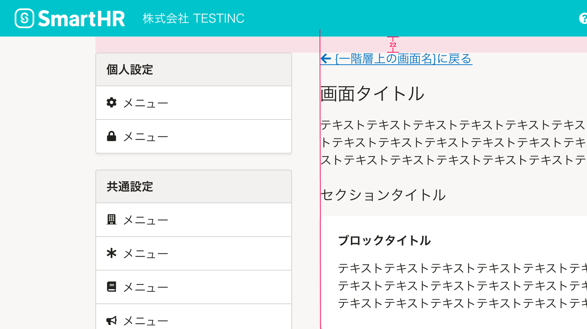
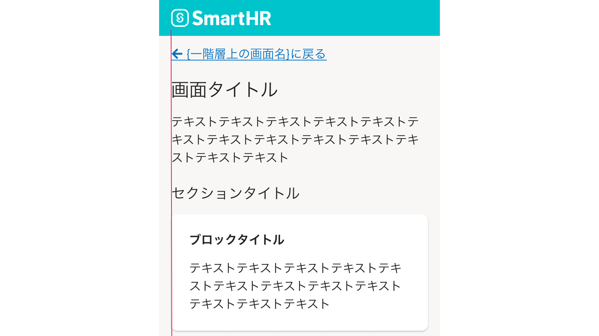

import ComponentPropsTable from '@/components/article/ComponentPropsTable.astro'
import ComponentStory from '@/components/article/ComponentStory.astro'
import { FaArrowLeftIcon } from 'smarthr-ui'

一階層上のコンテンツに戻るためのテキストリンクです。

<ComponentStory name="UpwardLink" />

## レイアウト

### 余白
[余白の取り方](/products/design-patterns/spacing-layout-pattern/)を参照してください。

### インデント
「一階層上に移動するリンクである」ことをユーザーに示し、認知を促すため、リンクテキストとメインコンテンツの左端を揃えます。

ただし、以下に示すように、<FaArrowLeftIcon alt="左矢印" /> アイコンのインデント分の余白を十分に確保できない場合は例外的に`indent`を無効にします。

#### 例外1. メインコンテンツにサイドナビゲーションが隣接する場合
[基本機能の共通設定](/products/design-patterns/main-admin-core-features/)のように、メインコンテンツにサイドナビゲーションが隣接する場合は、`indent`を無効にします。

#### 例外2. モバイルでの表示
モバイル（スマートフォンや画面幅が狭い場合）では、`indent`を無効にします。
（参考：[メディアクエリ](/products/design-tokens/media-query/)）

## ライティング

基本的に「`{一階層上の画面名}に戻る`」と表記します。

パーマリンクで直接移動してきた場合など、一階層上のコンテンツの特定や類推が難しい場合は、下記のように「`{一階層上の画面名}{一階層上のコンテンツの種類}に戻る`」と表記します。

| 一階層上のコンテンツ | リンクテキスト | 例 |
| :--- | :--- | :--- |
| コレクション （[よくあるテーブル](/products/design-patterns/smarthr-table/)） | `{一階層上の画面名}一覧に戻る` | *「権限一覧に戻る」* （「権限に戻る」だけでは、上の階層に権限に関するどのコンテンツかを類推しにくいため） |

## Props

<ComponentPropsTable name="UpwardLink" showTitle />
