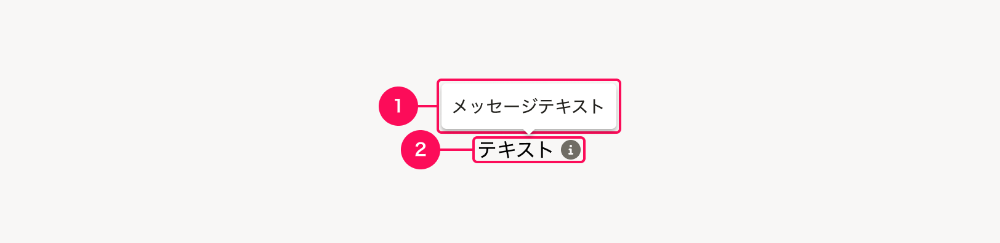

import {
  WarningIcon,
  FaArrowDownIcon,
  FaArrowLeftIcon,
  FaArrowRightIcon,
  FaArrowUpIcon,
  FaExternalLinkAltIcon,
  FaQuestionCircleIcon,
  FaInfoCircleIcon,
  FaUserAltIcon,
  FaFileIcon,
  FaPlusCircleIcon,
} from 'smarthr-ui'
import { Button, Cluster, Tooltip, Text } from 'smarthr-ui'
import ComponentPreview from '@/components/ComponentPreview/ComponentPreview'
import ComponentStory from '@/components/article/ComponentStory.astro'
import ComponentPropsTable from '@/components/article/ComponentPropsTable.astro'

import Warning from './_components/Warning'
import DynamicTooltip from './_components/DynamicTooltip.astro'

<Warning />

Tooltipコンポーネントは、UI上のスペースが限られている場合に、補足テキストを一時的に表示するために使います。

- 補足的な説明テキストを表示する場合
- アイコンだけのボタンにラベルを表示する場合
- 省略されたテキストを全文表示する場合

<ComponentStory name="Tooltip" />

## 使用上の注意

### Tooltipの使用を避けるケース

Tooltip内の情報は隠れるため、操作に必要な情報の表示への使用は避けましょう。ユーザーが把握しておかないと操作が進められないような重要な情報は、常に表示することを検討してください。

重要な情報とは、フォームの入力に必要な情報などが該当します。具体例は次のとおりです。
- パスワードに使用できる文字や、エラーになる入力値などの入力要件
- 入力エラーとなった際のエラーメッセージ
- 操作補助になる情報（ショートカットなど）

### 例外
- ユーザーの操作過程で「確認が必須ではない」程度の付加的な情報を表示する目的での使用
- Tooltipによる表示が提供されているコンポーネントにおいて、利用基準に沿った使用
  - [LineClamp](/products/components/line-clamp/)
    - 折り返して表示することがどうしても難しい場合
  - [SearchInput](/products/components/input/search-input/)
    - 検索キーワードに該当する検索結果が得られなかったとき、再検索を行なうめのヒントを見える場所に必ず表示したうえで、補助としてTooltipのメッセージを使う場合
  - [Button](/products/components/button/) の `disabledDetail` props 使用時
    - [DropdownMenuButton](/products/components/dropdown/dropdown-menu-button/) 内のButtonで使う場合（配置できるスペースがドロップダウン内に限られるため仕方なく使う）
    - Button単独の場合でも、ユーザーの操作過程で「確認が必須ではない」程度の付加的な情報を表示する目的で使う場合
    - 上記以外のケースは、Tooltipを使わずにdisabledである理由を見える場所に表示する

## 種類
Tooltipはトリガー要素に`focus`や`hover`で表示します。詳しくは[トリガーパターン](#h3-3)を参照してください。

## レイアウト

### 構成
1. [Tooltip](#h4-0)  
2. [トリガー](#h4-1)

#### 1. Tooltip
Tooltipそのものです。吹き出し形式で補足的なテキストを表示します。

#### 2. トリガー
Tooltipが表示されるきっかけとなる要素を「トリガー」と呼びます。  
トリガーは、Tooltipが表示されることをユーザーに示唆するために、マウスオーバーが可能な要素であることを想起させるテキスト、アイコン、色を組み合わせます。

### Tooltipの配置
Tooltipの配置は8種類の選択肢があります。

- 矢印の出る方向を`horizontal`（横）と`vertical`（縦）の組み合わせで指定します。
- レイアウトによってTooltipの一部が見切れる場合があるため、Tooltip全体が表示されるように指定してください。
- `horizontal`（横）と`vertical`（縦）の両方に`auto`を指定すると、レイアウトを加味して自動的に方向を決めてくれます。

#### 上配置
<ComponentPreview>
  <DynamicTooltip
    message="horizontal=left & vertical=bottom (default)"
    triggerType="icon"
    horizontal="left"
    vertical="bottom">
    <Cluster align="center" gap={0.25}>
      <FaArrowUpIcon color="TEXT_LINK" />
      <Text color="TEXT_LINK">left & bottom</Text>
    </Cluster>
  </DynamicTooltip>

  <DynamicTooltip
    message="horizontal=center & vertical=bottom"
    triggerType="icon"
    horizontal="center"
    vertical="bottom">
    <Cluster align="center" gap={0.25}>
      <FaArrowUpIcon color="TEXT_LINK" />
      <Text color="TEXT_LINK">center & bottom</Text>
    </Cluster>
  </DynamicTooltip>

  <DynamicTooltip
    message="horizontal=right & vertical=bottom"
    triggerType="icon"
    horizontal="right"
    vertical="bottom">
    <Cluster align="center" gap={0.25}>
      <FaArrowUpIcon color="TEXT_LINK" />
      <Text color="TEXT_LINK">right & bottom</Text>
    </Cluster>
  </DynamicTooltip>
</ComponentPreview>

#### 下配置
<ComponentPreview>
  <DynamicTooltip
    message="horizontal=left & vertical=top (default)"
    triggerType="icon"
    horizontal="left"
    vertical="top">
    <Cluster align="center" gap={0.25}>
      <FaArrowDownIcon color="TEXT_LINK" />
      <Text color="TEXT_LINK">left & top</Text>
    </Cluster>
  </DynamicTooltip>

  <DynamicTooltip
    message="horizontal=center & vertical=top"
    triggerType="icon"
    horizontal="center"
    vertical="top">
    <Cluster align="center" gap={0.25}>
      <FaArrowDownIcon color="TEXT_LINK" />
      <Text color="TEXT_LINK">center & top</Text>
    </Cluster>
  </DynamicTooltip>

  <DynamicTooltip
    message="horizontal=right & vertical=top"
    triggerType="icon"
    horizontal="right"
    vertical="top">
    <Cluster align="center" gap={0.25}>
      <FaArrowDownIcon color="TEXT_LINK" />
      <Text color="TEXT_LINK">right & top</Text>
    </Cluster>
  </DynamicTooltip>
</ComponentPreview>

#### 横配置
<ComponentPreview>
    <DynamicTooltip
    message="horizontal=left & vertical=middle"
    triggerType="icon"
    horizontal="left"
    vertical="middle">
    <Cluster align="center" gap={0.25}>
      <FaArrowRightIcon color="TEXT_LINK" />
      <Text color="TEXT_LINK">left & middle</Text>
    </Cluster>
  </DynamicTooltip>
  <DynamicTooltip
    message="horizontal=right & vertical=middle"
    triggerType="icon"
    horizontal="right"
    vertical="middle">
    <Cluster align="center" gap={0.25}>
      <FaArrowLeftIcon color="TEXT_LINK" />
      <Text color="TEXT_LINK">right & middle</Text>
    </Cluster>
  </DynamicTooltip>
</ComponentPreview>

#### 自動配置
<ComponentPreview>
    <DynamicTooltip
    message="horizontal=auto & vertical=auto"
    triggerType="icon"
    horizontal="auto"
    vertical="auto">
    <Cluster align="center" gap={0.25}>
      <FaArrowDownIcon color="TEXT_LINK" />
      <Text color="TEXT_LINK">auto & auto</Text>
    </Cluster>
  </DynamicTooltip>
</ComponentPreview>

## ライティング
関連するライティングガイドラインを参照してください。
- [tooltipのライティング](/products/contents/ui-text/app-writing/#h2-12)

## デザインパターン

### Tooltipのトリガーパターン
トリガーは、用途によっていくつかの種類に分けられます。

- A. [テキスト＋アイコン](#h4-6)
- B. [アイコンのみ](#h4-7)
- C. [アイコンボタン](#h4-8)
- D. [省略テキスト](#h4-9)

#### A. テキスト＋アイコン
<ComponentPreview>
  <DynamicTooltip
    message="補足テキストがはいります。"
    triggerType="icon"
    horizontal="left"
    vertical="bottom">
      <Cluster align="center" gap={0.25}>
        <Text color="TEXT_LINK">テキスト</Text>
        <FaInfoCircleIcon color="TEXT_LINK" />
      </Cluster>
  </DynamicTooltip>
</ComponentPreview>

文章でさらに補足したい内容がある場合に使います。  
補足する対象となるテキストの横に「<FaInfoCircleIcon color="TEXT_LINK" />」アイコン（`FaInfoCircleIcon`）を配置し、補足情報の存在を明確に表示します。
アイコンの色は、テキストと同様に[`TEXT_LINK`](/products/design-tokens/color/#h2-2)とすることで、マウスオーバーが可能であることを示唆します。

#### B. アイコンのみ
<ComponentPreview>
  <DynamicTooltip
    message="ユーザーの名前"
    triggerType="icon"
    horizontal="left"
    vertical="bottom">
      <FaUserAltIcon color="TEXT_LINK" />
  </DynamicTooltip>
  <DynamicTooltip
    message="書類の名称"
    triggerType="icon"
    horizontal="left"
    vertical="bottom">
      <FaFileIcon color="TEXT_LINK" />
  </DynamicTooltip>
</ComponentPreview>

充分にスペースを確保できないときに、アイコン単体をトリガーにするパターンですが、**どうしても他に方法がないときだけ**使用してください。  
何を対象とした補足説明なのかを明確にするために、可能な限り「[テキスト＋アイコン](#h4-6)」を採用することを推奨します。

アイコンは、マウスオーバーが可能であることを示唆するためにリンク色（[`TEXT_LINK`](/products/design-tokens/color/#h2-2)）を使います。

- アイコン単体で意味が伝わるようであれば、Tooltipは不要です。
- アイコンに必ず代替テキストを設定します。

##### テキストとあわせて使用
<ComponentPreview>
  <Cluster align="center" gap={0.25}>
    <Text color="TEXT_BLACK">テキスト</Text>
    <DynamicTooltip
      message="補足テキストがはいります。"
      triggerType="icon"
      horizontal="left"
      vertical="bottom">
        <FaInfoCircleIcon color="TEXT_GREY" />
    </DynamicTooltip>
  </Cluster>
  <Cluster align="center" gap={0.25}>
    <Text color="TEXT_BLACK" weight="bold">タイトル</Text>
    <DynamicTooltip
      message="補足テキストがはいります。"
      triggerType="icon"
      horizontal="left"
      vertical="bottom">
        <FaInfoCircleIcon color="TEXT_GREY" />
    </DynamicTooltip>
  </Cluster>
</ComponentPreview>

トリガーとなるのはアイコンのみで、タイトルや[よくあるテーブルのオブジェクト名](/products/design-patterns/smarthr-table/#h4-0)のテキストとあわせて使います。  
タイトルや[よくあるテーブルのオブジェクト名の遷移リンク](/products/design-patterns/smarthr-table/#h5-3)の役割を阻害しないために、アイコンのみに[`TEXT_GRAY`](/products/design-tokens/color/#h2-2)を使います。

##### ステータスの補足に使用
<ComponentPreview>
  <Cluster align="center" gap={0.25}>
    <DynamicTooltip
      message="ステータスがはいります。"
      triggerType="icon"
      horizontal="left"
      vertical="bottom">
        <WarningIcon color="WARNING" />
    </DynamicTooltip>
    <Text color="TEXT_LINK">テキスト</Text>
  </Cluster>
  <Cluster align="center" gap={0.25}>
    <DynamicTooltip
      message="ステータスがはいります。"
      triggerType="icon"
      horizontal="left"
      vertical="bottom">
        <FaInfoCircleIcon color="DANGER" />
    </DynamicTooltip>
    <Text color="TEXT_LINK">テキスト</Text>
  </Cluster>
</ComponentPreview>

ステータスの補足説明を加えるときにはテキストの左に配置し、ステータスの色に合わせます。  
トリガーはステータスアイコンのみとなるので、テキストはリンクとして使用できます。
#### C. アイコンボタン
<ComponentPreview>
  <DynamicTooltip
    message="ラベルがはいります。"
    triggerType="icon"
    horizontal="left"
    vertical="bottom">
      <Button square><FaPlusCircleIcon alt="追加" /></Button>
  </DynamicTooltip>
</ComponentPreview>

[Buttonのアイコンボタン](/products/components/button/#h4-1)のように、ラベルテキストを表示できないボタンに、（ラベルテキスト相当の）機能を表す補足をTooltipで表示するパターンです。

[Textボタン](/products/components/button/#h3-3)のアイコンボタンには使用しません。

ボタンは明確なアクションを促す役割を持つため、ラベルテキスト以上の説明を表示したい場合は、ラベルテキストがあるボタンの採用や、説明テキストが入るようなレイアウトを検討しましょう。

#### D. 省略テキスト
<ComponentPreview>
  <DynamicTooltip
    message="省略されたすべてのテキストがはいります。"
    horizontal="left"
    vertical="bottom">
      <Cluster align="center" gap={0.25}>
        <Text color="TEXT_BLACK">テキストを省略...</Text>
      </Cluster>
  </DynamicTooltip>
</ComponentPreview>

テキストを表示するスペースを十分確保できないときに、テキスト全体をトリガーとして、省略したすべてのテキストをTooltipで表示するパターンです。  

テキストは、`ellipsis`を使い省略されていることを示します。  

単純に文章を省略したい場合には、[LineClamp](/products/components/line-clamp/)を使用してください。

## Props

<ComponentPropsTable name="Tooltip" />
