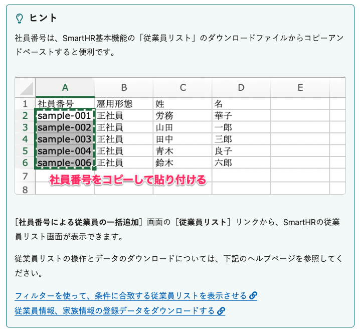
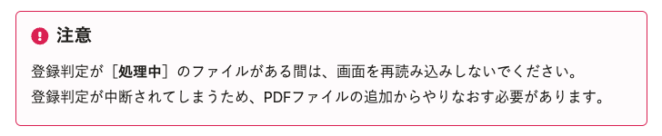
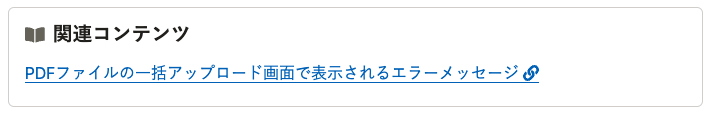
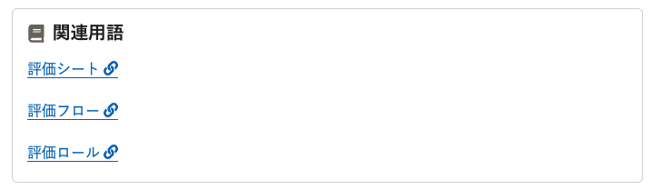

{}
## ヘルプページの並び順
以下の観点で、ヘルプページの並び順を判断します。

{}
### ユーザーがアプリケーションを操作する流れで並んでいるか
ユーザーがアプリケーションを操作する流れを踏まえ、CRUD（Create、Read、Update、Delete）を意識して並び順を決めましょう。

{}
### ユーザーに見てほしいページを優先して配置しているか
はじめてアプリケーションを操作するユーザーに参照してほしいページなど、ユーザーに早く認知してほしいページがある場合は優先して配置します。

{}
### 関連するページを近くに配置しているか
関連する情報が書かれているページ同士は近くに配置するようにします。

{}
#### 例
- [届出書類｜ヘルプセンター｜SmartHR](https://support.smarthr.jp/ja/help/sections/360008955494/)
- [招待｜ヘルプセンター｜SmartHR](https://support.smarthr.jp/ja/help/sections/8c43d156-b95f-44d7-91d0-47a102062ec0/)

{}
## ヘルプページの構成要素
ヘルプページは、以下の要素で構成します。それぞれの要素が、ユーザーに情報を伝えるために担っている役割を説明します。

- タイトル（必須）
- リード
- 見出し（必須）
- 本文（必須）
- 画像
- 囲み

{}
### タイトル
どんな内容が書かれているかを想起できる表現をして、ユーザーが「読みたい情報がどこに書かれているか」を理解できるようにします。  
ヘルプセンターを訪問したユーザーが、操作手順やトラブルシューティング、仕様の一覧を探していることを念頭において考えます。

インデックスに並んだときの一覧性を意識し、タイトルのライティングには規則性を持たせます。

{}
### リード
ユーザーがページの内容を理解するためのメンタルモデルを構築しやすいよう、このページで書かれている内容の全体感を説明します。

{}
### 見出し
本文のアウトラインを把握できる表現をします。  
見出しはページ全体の目次としても機能するので、「どんな内容」を「どういう順序」で「どれくらいの粒度」で書かれているかを把握する助けもします。

ヘルプページの見出しは、見出し1〜5まであります。  
本文で記載する内容を見出しを使って構造化します。ヘルプページの構成を考えるときには、まず見出しの設計をして、情報のボリューム、伝える単位を切り分けることからはじめると良いです。

{}
### 本文
本文もなるべく簡潔に、一文一義「1つの文に1つの事柄を書く」ようにします。

ただし、ヘルプページで記載する内容は、ある条件下の挙動を説明するなど、情報が込み入っているケースも少なくありません。  
情報を補う修飾節が必要な場合は、情報のチャンク（ぱっと見たときに"意味的な塊"を感じる単位）を意識して読点を使用しましょう。

{}
### 画像
文章での説明が困難な場合には、概念図を作成したり、注釈を加えたスクリーンショットを併用します。

詳しくは、[ヘルプセンターで使用する画像要素](/products/contents/help-center/image/)を参照してください。
 
{}
### 囲み
本文で説明する主軸となる流れから、脱線する情報は囲みとして提供します。

ヘルプページでは、囲みに4つのスタイルを用意しています。  
囲みの中身は本文を配置します。Tipsに限って、見出しを設置しても構いません。

{}
#### ヒント
ページで説明している内容に加えて、知っておくとユーザーにメリットがある情報を紹介します。

{}
#### 注意
注意を促したい場合に使います。  
この情報を理解しないとユーザーが求めている情報を得られなかったり、意図しない結果に繋がったりする可能性のある、重要度の高い情報を記載します。

{}
#### 関連コンテンツ
ページで説明している内容に関連するリンクを紹介するときに使います。  

{}
#### 関連用語
用語ページで関連用語を紹介するときに使います。

