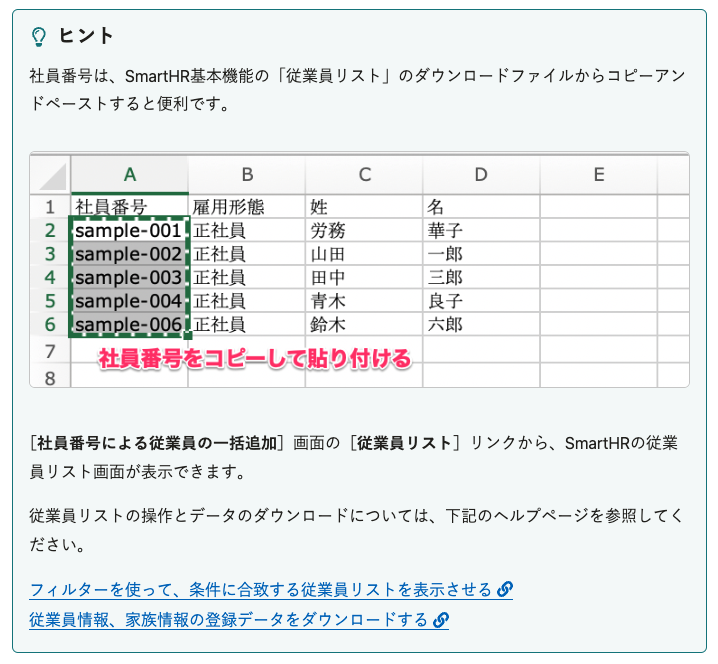
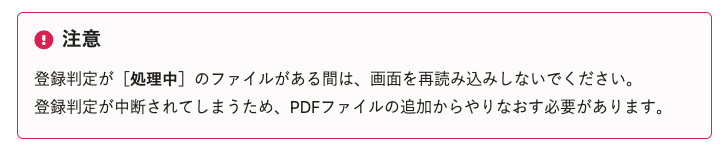
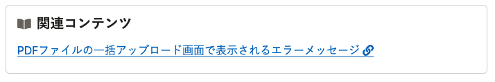
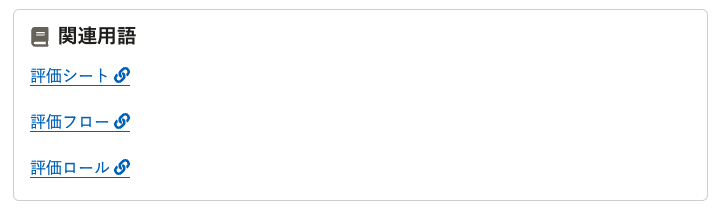

ヘルプページは、以下の要素で構成します。それぞれの要素が、ユーザーに情報を伝えるために担っている役割を説明します。

{}
## タイトル（必須）
どんな内容が書かれているかを想起できる表現をして、ユーザーが「読みたい情報がどこに書かれているか」を理解できるようにします。  
ヘルプセンターを訪問したユーザーが、操作手順やトラブルシューティング、仕様の一覧を探していることを念頭において考えます。

インデックスに並んだときの一覧性を意識し、タイトルのライティングには規則性を持たせます。

{}
## リード
ユーザーがページの内容を理解するためのメンタルモデルを構築しやすいよう、このページで書かれている内容の全体感を説明します。

{}
## 見出し（必須）
本文のアウトラインを把握できる表現をします。  
見出しはページ全体の目次としても機能するので、「どんな内容」を「どういう順序」で「どれくらいの粒度」で書かれているかを把握する助けもします。

本文で記載する内容を見出しを使って構造化します。ヘルプページの構成を考えるときには、まず見出しの設計をして、情報のボリューム、伝える単位を切り分けることからはじめると良いです。

なお、太字（Bold）テキストを見出し代わりに使うことは避けてください。見た目は見出しに似ていても、ページ内ナビゲーションや検索の機能を果たしません。また、太字が乱用されると本当に強調したい箇所が埋もれます。

{}
### 見出しの深さ
見出しの深さは見出し4（H4）以内に収めましょう。  
階層が深くなるほど、ユーザーは見出し同士の関係を把握しづらくなります。ページの構造をシンプルに保つことで、ユーザーが「自分がページのどの階層にいるか」を把握しやすくなります。

見出し5以上が必要に感じる場合は、情報の整理方法を再検討するサインです。箇条書き・表・ページ分割などの代替手段を検討しましょう。

{}
### 見出しの一意性
同じページ内で、同じまたは似た見出しが重複しないようにしましょう。  
見出しが一意であれば、ユーザーは迷わず目的のセクションに到達できます。

同じまたは似た見出しが複数あると、ユーザーは「どちらに自分の目的の情報があるか」を判断するために両方を読み比べる必要が生じます。

類似した見出しが生まれる場合は、以下の対応を検討しましょう。
- 内容が実質的に同じ場合は、セクションの統合を検討する
- 内容が異なる場合は、より具体的な表現に変更して区別する

{}
## 本文（必須）
本文もなるべく簡潔に、一文一義「1つの文に1つの事柄を書く」ようにします。

ただし、ヘルプページで記載する内容は、ある条件下の挙動を説明するなど、情報が込み入っているケースも少なくありません。  
情報を補う修飾節が必要な場合は、情報のチャンク（ぱっと見たときに"意味的な塊"を感じる単位）を意識して読点を使用しましょう。

{}
## 画像
文章での説明が困難な場合には、概念図を作成したり、注釈を加えたスクリーンショットを併用します。

詳しくは、[ヘルプセンターで使用する画像要素](/products/contents/help-center/image/)を参照してください。
 
{}
## 囲み
本文で説明する主軸となる流れから、脱線する情報は囲みとして提供します。

ヘルプページでは、囲みに4つのスタイルを用意しています。  
囲みの中身は本文を配置します。Tipsに限って、見出しを設置しても構いません。

{}
### ヒント
ページで説明している内容に加えて、知っておくとユーザーにメリットがある情報を紹介します。

{}
### 注意
注意を促したい場合に使います。  
この情報を理解しないとユーザーが求めている情報を得られなかったり、意図しない結果に繋がったりする可能性のある、重要度の高い情報を記載します。

{}
### 関連コンテンツ
ページで説明している内容に関連するリンクを紹介するときに使います。  

{}
### 関連用語
用語ページで関連用語を紹介するときに使います。

