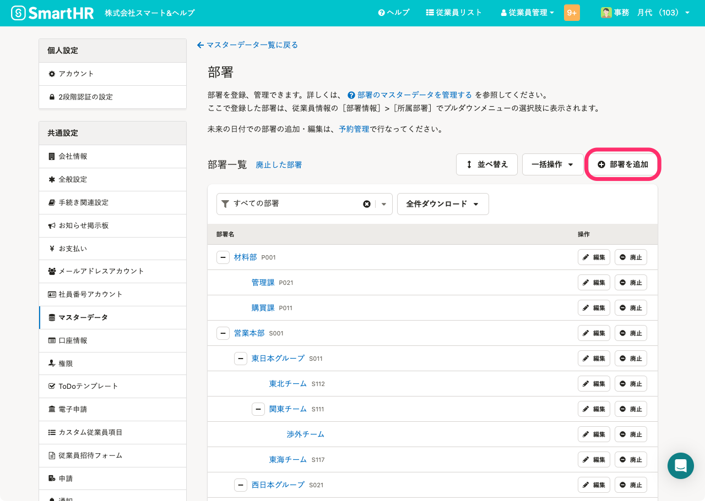
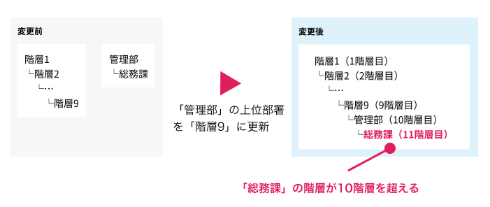
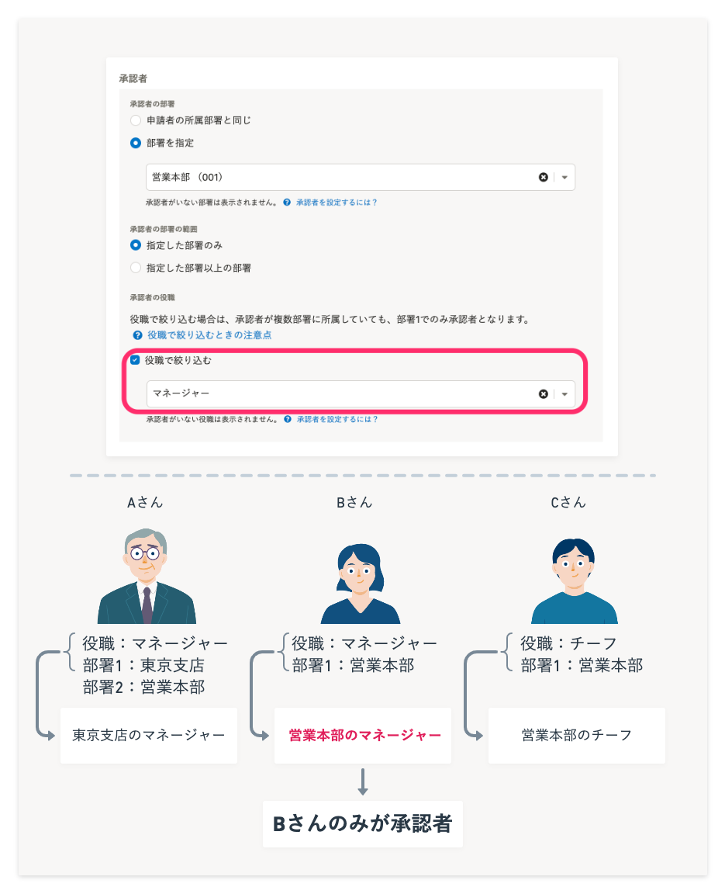
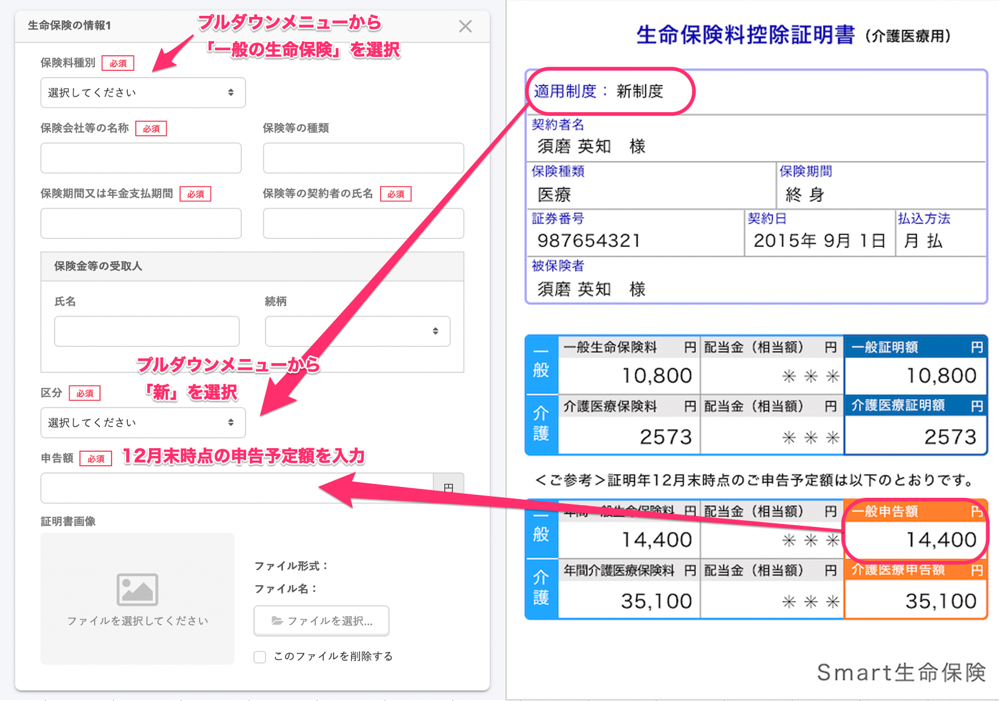

SmartHRヘルプセンターに掲載する画像に関する考え方をまとめています。  
文章での説明が困難な場合には、概念図を作成したり、注釈を加えたスクリーンショットを併用したりします。

{<a id="screenshot-posting-policy" />}
## スクリーンショット掲載の考え方

### アクセシビリティの観点から、スクリーンショットはできるだけ使わず、テキストで説明する

アクセシビリティの観点、および情報量が増えて可読性が下がることを防ぐ観点から、スクリーンショットの使用は最小限にします。ヘルプページの作成・修正時は、ユーザーがプロダクトの画面を表示したうえでヘルプページを閲覧している想定で、まずはテキストのみで説明できないか検討してください。

#### スクリーンショットを使うシーン

操作対象の特定が難しい場合や、操作対象の明示以外に画像で伝えたいことがある場合は、スクリーンショットを使います。

- 操作対象が同じ画面に複数あり、言葉では場所を示しづらい場合
- 画面の活用方法を説明する場合
  - 例：画面内のどこにどんなエリアやボタンがあるのかを説明するスクリーンショット
- ヘルプページの場合：主題となる操作画面とは別の画面を説明する場合
  - 例：Tipsなどで、操作に関連する設定画面などを示すスクリーンショット

#### スクリーンショットを使わないシーン

対象の画面やラベルを言葉で表現できる場合は、スクリーンショットを使わずにテキストで説明します。どの画面のどこを操作するのかを明記するようにしましょう。ただし、必要なスクリーンショットまで省略することで、伝えるべき情報を伝えられないコンテンツになっていないか、という観点は常に持ちましょう。

- ボタンを押す、単純な選択や入力の操作だけの場合
  - 例：hoge画面で［ダウンロード］を押します。
  - 例：［hoge］欄の［次へ］を押します。
- 一覧画面でステータスが変わったことを示す場合
  - 例：ステータスが［完了］になったことを確認します。

#### 従業員向けのヘルプページの場合

操作をスマートフォン表示で確認して、パソコン表示とUIが異なったり、わかりづらかったりする画面がないか確認します。  
パソコンからの閲覧と画面やUIが異なる場合は、スマートフォンでの操作のスクリーンショットやテキストを追加します。

### スクリーンショットを使う場合は、ユーザーに注目させたい部分を囲みや矢印をつけて強調する

スクリーンショットを使う場合は、ユーザーに注目させたい部分を囲みまたは矢印で強調します。ボタンや画面内のエリアを強調する場合は、囲みで強調します。囲みを使うと見てほしい部分が読み取りづらくなる場合は、矢印で強調します。ただし、必要以上の強調はユーザーにとってノイズになってしまうため、囲みと矢印は同時に使わないようにしましょう。

強調する箇所は、1つのスクリーンショットにつき、1部分を基本とします。複数の部分を流れで説明したい場合は、丸数字（①②③）で番号を振って、ユーザーに見てほしい順番をわかりやすくします。  
アクセシビリティやメンテナンスの観点から、画像内にテキストを載せないようにしましょう。

また、「[関連する情報は近くに配置する](/products/contents/help-center/basic-rule/#place-relevant-information-nearby)」にしたがって、スクリーンショットと対応する説明文を近くに配置すると、意図が伝わりやすくなります。

### スクリーンショットを使う場合は、ユーザーの操作に必要ない部分を取り除く

スクリーンショットに写っているのがどの画面なのかを、ユーザーが判断しやすいようにしましょう。また、ユーザーの操作に必要ない部分は除いた範囲でスクリーンショットを撮ってください。

操作の起点となる画面は、SmartHRのどの画面から操作するのかをユーザーが把握できるように、ヘッダーも含めたスクリーンショットを使いましょう。  
以降の画面は、ヘッダーを除いてトリミングすることを推奨します。どの画面から操作するのかは操作の起点で明示できているため、伝えなくても済む部分を取り除いて、ユーザーが次の操作に集中できるようにします。

{<a id="body-and-alt-text-guidelines" />}
## 本文と代替テキストのガイドライン

基本的な考え方は、アクセシビリティガイドラインの[画像の代替テキスト](https://smarthr.design/accessibility/alternative-text/)と同様です。

画像を使用する際も、必要なことは本文テキストに記載し、画像はなくても伝わるようにします。  
本文テキストとの重複を避けるため、代替テキストには「何のスクリーンショットなのか」「何を説明する図なのか」を端的に記載します。

以下に、画像の種類ごとの例を示します。

### SmartHRの画面

SmartHRの画面のスクリーンショットで操作の位置を示す場合は下記のように書きます。  
画像内で囲みをつけている箇所は本文中に記載しているため、代替テキストには含めません。

本文：部署画面で［部署を追加］を押します。

代替テキスト：部署画面のスクリーンショット

画像：

### 概念図

機能の概念を説明する際などに使う図の代替テキストは、図で何を説明しているのかを代替テキストに書きます。  
図で説明している内容は、基本的に本文にも記載します。

本文：履歴を追加すると、部署の階層が最大値の10階層を超える場合に発生するエラーです。  
例えば、下記のイメージのようなケースがあります。「階層1」は「部署9」まで、8つの下位部署を持っています。「管理部」は「総務課」を下位部署に持っています。  
「管理部」の履歴を更新し、「階層9」を上位部署に設定した場合、「管理部」の下位部署である「総務課」の履歴も更新されます。  
その結果、総務課の階層が11階層目となり、10階層を超えてしまうため、エラーとなります。

代替テキスト：エラーが発生する状況を説明する図

画像：

#### 図の内容を文字で表すのが難しい場合

図で伝えたい内容の要約を代替テキストに書きます。

本文：  
例えば、下記のように設定した場合は、部署1が［営業本部］かつ役職が［マネージャー］のBさんのみが承認者となります。

* ［承認者の部署］：［部署を指定］>［営業本部］
* ［承認者の役職］：［役職で絞り込む］>［マネージャー］

代替テキスト：経路の設定画面で承認者を部署と役職で指定した画面のスクリーンショット。その下には3人の登場人物を例に、本文の内容を説明するイラストがある。

画像：  

### 書類

SmartHRの画面と同じく、画像で表している内容を本文中に記載します。

本文：  
一般の生命保険  
証明書の内容を確認して、適用制度や申告額などを入力します。  
- ［保険料種別］で［一般の生命保険］を選択  
- 証明書の「適用制度」を確認し、画面で［区分］を選択  
- 証明書の「一般申告額」を確認し、画面の［申告額］に金額を入力

代替テキスト：SmartHRの画面と保険料控除証明書の対応を表す図

画像：  
