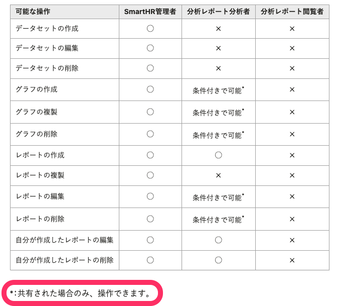

## 基本的な考え方

仕様の一覧のヘルプページでは、設定項目や一定条件における制限など、仕様に関する情報を網羅的に伝えます。

ユーザーは疑問を解消するためにページを訪れるため、上から通して読まなくても目当ての情報を見つけられることが大切です。

同じ粒度の情報が一覧性高く、網羅的に並ぶ状態を目指してください。

## 作成時に考慮すること

仕様の一覧では、最新の情報が網羅されていることが重要なため、情報が不足してしまうとヘルプページとしての価値が落ちてしまいます。

仕様の変更にあわせて、定期的にメンテンスが必要になることを見越して、扱う情報の範囲を判断してください。

## 構成
仕様の一覧に関するヘルプページは、以下のセクションを組み合わせて構成します。

|\#|要素|内容|必須|
|:----|:----|:----|:----|
|1|タイトル|何の仕様についてどんな情報がまとまっているか|○|
|2|リード|何の仕様についてどんな情報がまとまっているかを一文で説明する|○|
|3|本文|表もしくは平文を用いて情報を羅列する|○|

## 本文の書き方

扱う情報によって、表を用いた表記と箇条書きを用いた表記を使い分けてください。

### 表が適している場合
項目ごとに説明する条件が同じ、かつ、その条件が2つ以上ある場合には表が適しています。
項目が並列で表示され、情報を見比べやすいというメリットがあります。

特に、同じ条件で各項目を見比べたいという読み手の要望がある場合は表が適しています。

例：A〜Cの権限がそれぞれ「作成」「編集」「削除」の操作をできるかどうかをまとめたい場合、以下のように権限と操作の対応を表にすると、わかりやすくなります。

|権限|作成|編集|削除|
|:----|:----|:----|:----|
|A|◯|◯|◯|
|B|◯|◯|×|
|C|×|◯|×|

表を使うときは[見やすくメンテナンスしやすい形式](/products/contents/help-center/basic-rule/#use-table-with-readable-and-maintainable-format)で書きましょう。

### 表内で記号を使う場合

記号は文化や文脈によって解釈が異なる可能性があるため、使用には注意が必要です。  
表内で記号を使う場合は、正確かつ曖昧さがない情報が読み手に届くよう配慮します。  

#### 日本語の場合

表内では下記の記号を使います。
- `◯`：
  「はい」や「正しい」「できる」の意味を示します。
- `×`：
  「いいえ」や「誤り」「できない」の意味を示します。
- `-`（ハイフン）：
  「該当なし」など、対象外であることを示します。

`△`や`※`など、読み手によって捉える意味が曖昧になる記号は使用しません。  
記号の表現が難しい場合は、`条件付きで可能`など、代わりのテキストを記載してください。  

日本語以外を得意な言語とする方向けの記載に関しては、お近くのUXライターや多言語化チームに相談してください。  

### 表内で注釈を使う場合

文章の主要な流れを中断せずに補足情報を提示する場合は、肩文字（アスタリスク`*`、数字`¹`）で注釈を示します。  
肩文字を使うことで、本文と注釈を明確に区別できるため、誤解を防止できます。肩文字を使った注釈表記は国際標準の書き方でもあるため（[United Nations: Editorial Manual](https://www.un.org/dgacm/en/content/editorial-manual/tables)）、日本語以外を得意な言語とする方にとっても理解しやすい案内です。  

ヘルプページで肩文字を表現する場合は、sup要素を使います。  
例：`*`

表内で注釈を使った際は、表外に注釈の詳細を記載します。  

### 平文が適している場合

項目ごとに説明すべき条件が揃わない場合や、共通する条件が少ない場合は平文での説明と箇条書きが適しています。
平文の場合は、項目ごとに見出しを作成し、情報を構造化することを意識しましょう。

見出しが追加されることで、目次で情報を探しやすくなるというメリットも期待できます。