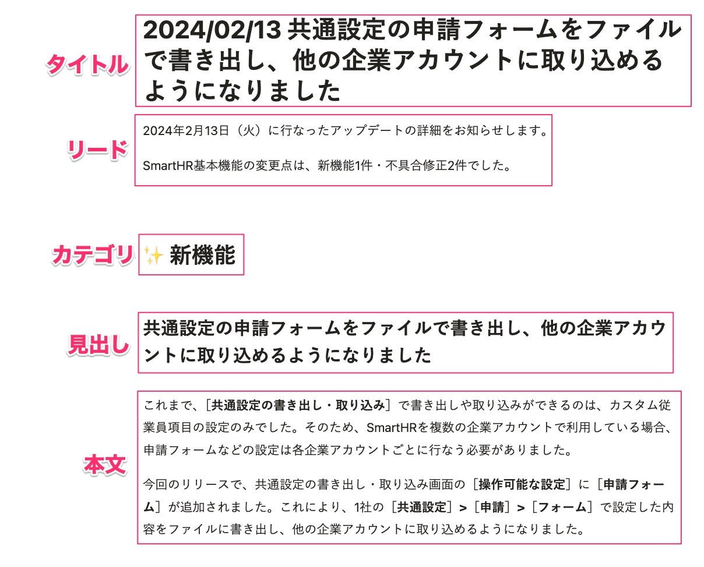
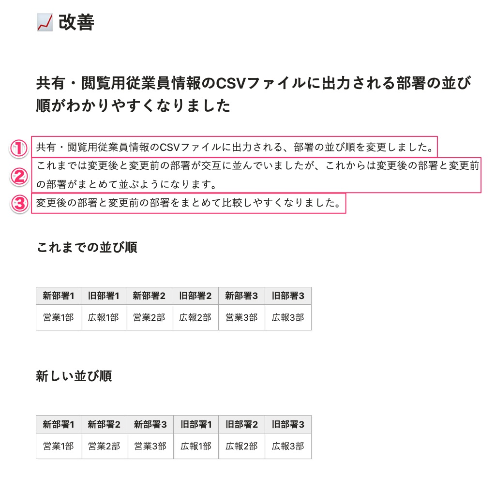

ユーザー向けリリースノートを書くうえでの基本的な考え方とライティングパターンをまとめました。  
このページで記載していない表記ルールは、プロダクトデザインにおける[基本的な考え方](../../writing-style/)、[用字用語](../../idiomatic-usage/)、[UIテキスト](../../ui-text/)に準拠します。

## ユーザーの立場で、できるようになったこと、できなくなったことを伝える

ユーザーがアップデート内容を理解できるよう、「ユーザー目線で書く」ことを念頭におきます。  
ユーザー目線とは、コード追加・修正によって生じるアプリケーションの挙動ではなく、ユーザーが何をできるようになったか／何をできなくなったかです。  
また、アップデートの内容をリリースに至った背景とともに伝えることで、ユーザーが開発者の意図を理解しやすくなるようにします。  
開発者にとっては当たり前でも、ユーザーにとっては不慣れな表現は伝わりません。一般的な言葉で書くことを意識しましょう。

## カテゴリごとの基本的な書き方

### 新機能
新しく追加した機能について記載します。

開発の背景、想定しているユースケースや、これまで抱えていた課題をできるだけ具体的に説明します。  
そのうえで、機能として「できるようになったこと」を説明します。  
また、プレスリリースやお知らせの記事、ヘルプページがある場合は、リンクを設置します。  

### 改善
使い勝手の向上を目的としたアップデートについて記載します。

変更点について、「画面」と「操作」を具体的に明示しながら説明します。  
また、変更内容に加えて、これまで使用時に生じていた不便など、アップデートの背景も説明します。

アップデートに伴って必要な操作がある場合や、アプリケーションの挙動に影響を与える場合には必ず明記します。

SmartHR Design Systemのガイドラインに準拠するための変更の場合は、ガイドラインへのリンクもあるとわかりやすいでしょう。

### アクセシビリティ向上
アクセシビリティ向上につながる対応について記載します。  
どの画面、どのUIで、どのようなアクセシビリティ対応が追加されたかを具体的に書きます。

### 不具合修正
不具合の修正について記載します。  
どの画面、どのUIでどのような不具合が修正されたかを具体的に書きます。ただし、発生条件が複雑な場合かつ影響範囲が小さい場合などは、詳しく書かない判断をしても構いません。
不具合修正が複数ある場合は、箇条書きで記載します。

### 廃止した機能
使えなくなった機能について記載します。  
事前に機能の廃止を告知していた、お知らせの記事へのリンクを設置します。  

### その他の変更
新機能・改善・アクセシビリティ向上・不具合修正・廃止した機能、これらのどのカテゴリにも当てはまらない内容について記載します。  
どの画面、UIで、どのような変更をしたかを具体的に書きます。  

## 要素別の具体的な書き方
リリースノートを構成する要素別の書き方を説明します。  

### タイトル
リリース日と、変更点の概要、その日のリリース件数を伝えます。

変更点が複数ある場合は、ユーザーへの影響が一番大きい見出しをリリースノートのタイトルにします。  
不具合修正の変更しかない場合は、`不具合○件を修正しました`と記載します。

タイトルでは、句点を省略します。[見出しでは句点（。）を省略する](/products/contents/idiomatic-usage/symbol/#h2-1)

例：
{/* textlint-disable */}
2024/02/08 不具合2件を修正しました  
2024/03/12 メールのエラーを一括で解除できるようにしました 他2件
{/* textlint-enable */}

### リード
リリース日と、変更があった機能、カテゴリ別のリリース件数を伝えます。  
リードは定型文です。テンプレートに沿って作成しましょう。

### カテゴリ
その日のリリースに含まれる、アップデート内容のカテゴリを示します。

### 見出し
変更点の概要を伝えます。見出しは、ユーザーが本文を確認すべきかどうかの判断材料になります。

見出しは20文字程度を目安とし、ひと目で読み切れる文字数に収めます。文字数が少なすぎると正確性を損なうため、文字数を減らすよりも、誤解を生まないことを優先します。  
また、句点を省略します。[見出しでは句点（。）を省略する](/products/contents/idiomatic-usage/symbol/#h2-1)

ユーザーが理解しやすいよう、業務や操作時の認知から想起しやすい言葉を使って書きます。  
後述する本文（③ユーザーにとって変わったこと）のサマリーだと考えましょう。

1つのカテゴリに複数のリリース内容が含まれる場合は、ユーザーへの影響が大きいものから順に記載します。

なお、不具合改修のカテゴリでは、見出しは不要です。不具合修正が複数ある場合は、箇条書きで記載してください。  
ユーザーへの影響が大きい場合など、重要度が高い内容を強調して伝えたい場合は、見出しを立てても構いません。

#### よく使う表現
- 〇〇で△△できるようになりました
- 〇〇がわかりやすくなりました
- 〇〇が△△されるようになりました

#### 例
- Before
  - ［アカウント情報を更新］ボタンを依頼一覧画面に追加しました
- After
  - 依頼一覧画面から最新の従業員情報を再取得できるようになりました
- 解説
  - 依頼一覧画面に［アカウント情報を更新］ボタンを追加したことで、ユーザーができるようになったこと、ユーザーが得られる価値を伝えます。
  - 画面上の変更内容を見出しに書こうとすると、見出しが簡潔にならない場合があります。詳しい内容は本文中に書くと良いです。

### 本文
変更点の詳細を伝えます。  
本文に含まれる要素は3つあり、それぞれに役割が異なります。

| 要素 | 役割 |
| --- | --- |
| ①アプリケーション上の変更点 | 結論・ファクト情報を伝える |
| ②リリースの背景説明 | コンテキストを共有する |
| ③ユーザーにとって変わったこと | 情報をユーザー向けに"翻訳"して伝える |

要素ごとの詳しい書き方は以下のとおりです。

#### ①アプリケーション上の変更点
ファクトとして、変更箇所と変更内容をフラットに書きます。
- 変更箇所
  - 画面名、ボタン名、テーブルの列名など、プロダクトを見たユーザーがテキスト情報から変更箇所を特定できるように書きます。
- 変更内容
  - 変更前の状態と変更後の状態を明記します。

##### よく使う表現
- 〜を変更しました。（記載場所、レイアウト、ラベル名など）
- 〜を、SmartHR全体の表記にあわせて変更しました。
- 〜の表示速度を速めました。
- 〜を追加しました。

##### 非推奨の表現
- 「改善しました」
  - 具体的に何が変わったのかが曖昧なため、非推奨です。
  - 「修正しました」、「追加しました」、「変更しました」など、具体的な変更点が伝わるように書き分けましょう。
- 「禁止」
  - 仕様上、制御している操作は、「禁止」ではなく「制御」や「制限」、「できません」と表現しましょう。
  - 「禁止」にはエラーを引き起こす原因となる操作という意味が強く、その操作自体が許可されているかどうかは意図されていません。「できないように制御している状態」とは異なります。

##### 例
- Before
  - 評価シート一覧ページの表示項目を改善しました。
- After
  - 従業員モードで表示する、評価シート一覧の列のラベル名を［進行中タスク］から［進行中タスク（期限）］に変更しました。また、［タスク担当者］の列を追加しました。

#### ②リリースの背景説明
リリースにより解決したかった課題、ユーザーの業務課題を書きます。  
軽微な修正の場合には、「使い勝手がどんな風に悪かったか」や「ガイドラインに合わせるため」など、改善の背景がわかるように書きます。  

##### よく使う表現
- 〇〇の操作をするときに、△△しづらいという課題がありました。
- 〇〇のバックグラウンド処理／表示に時間がかかっていました。
- これまでは、〜できませんでした。

#### ③ユーザーにとって変わったこと
変更点を受けて、ユーザーの視点で「できるようになったこと」を書きます。  
見出しと本文はいずれもユーザーの視点で書きますが、見出しは文字数が限られているため、詳細な内容は本文で伝えます。  
ユーザーの関心事の場合、「できなくなること」や「変更点がないこと」も明記します。  

##### 例
UIのみの変更であり、検索結果や付与する権限については変更ありません。

### 補足：不具合修正は完結かつ具体的に書く
基本姿勢は[不具合修正の基本的な書き方](#h3-3)に記載している「どの画面、どのUIでどのような不具合が修正されたかを具体的に書く」です。
一文で簡潔に書くことが多い不具合修正は、短文ゆえに、書き方によっては影響のないユーザーに不安を与えかねない内容になる場合があります。
どの粒度で書くか、どのように書くか悩ましいときは、以下の例を参考にしてください。

#### 例
##### 基本の書き方
- バックグラウンド処理詳細画面に表示される一部のエラーにおいて、CSVファイルの行数が表示されない不具合を修正しました。
- ◯◯機能でデータを同期するときに基本機能のデータに不整合があってもエラーにならないようにしました。

##### 発生条件が複雑な場合かつ影響範囲が小さい場合
- 源泉徴収票機能の検索が正しく絞り込めないことがある不具合を修正しました。
  - 発生条件や影響範囲を「正しく絞り込めないことがある」と表現しています。

#### 悪い例
- CSVファイル関連の不具合1件を修正しました。
- 不具合1件を修正しました。