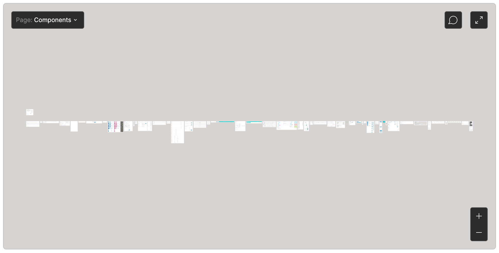

## 概要
SmartHR UIのコンポーネントをデザイナーが追加・更新する場合、デザインツールでUI設計する場合があります。

デザインデータを作成する際に必要な情報と、守って欲しいルールをまとめています。

## ツール
SmartHRのプロダクト開発で利用しているデザインツールは以下の通りです。これらツールを利用開始したい場合は、社内情シスに利用申請してください。

| ツール名 | 用途 |
| :--- | :--- |
| [Figma](https://figma.com/) | UIデザインツール、兼モックアップ作成ツール |
| [Contrast](https://apps.apple.com/jp/app/contrast-color-accessibility/id1254981365?mt=12) | 色のアクセシビリティをチェックするためのユーティリティソフト |

### Figmaライブラリへのアクセス方法
利用申請後、Figmaにログインし「SmartHR UI」プロジェクトにアクセスしてください。

作成したコンポーネントライブラリはFigma Communityにも公開しています。

https://www.figma.com/community/file/978607227374353992

## 設計ルール
### 前提
Figmaを使ったSmartHR UIのコンポーネントのデザインモック作成を前提にした設計ルールですが、SmartHR UIのFigmaライブラリを利用してプロダクトのUI設計をする場合にも流用可能です。

### 実装を意識したコンポーネントの設計
Figmaでの作業は実装と同義です。
コードと設計ロジックも踏まえ、可能な限り実装を意識した表層・コンポーネントの設計を心がけてください。

FigmaのAutoLayoutを活用することで実装（CSS）に近いコンポーネントの設計が可能です。
また、InstanceやVariantsを使用して、単一コンポーネントとして運用をしてください。

### Branchの利用
意図しない更新から保護するために、SmartHR UIのFigmaファイルは **[Branch機能](https://help.figma.com/hc/en-us/articles/360063144053-Create-branches-and-merge-changes)の利用が必須になりました。**（2022年4月より）

Branchの利用によって、誰でも安全に更新できるようになります。

Publishやコミュニティへの公開は管理者メンバーのみ実施できます。  
具体的な使用方法は、[FigmaのSmartHR UI（UIコンポーネントライブラリ）に追加や編集を加えて適用する方法｜DocBase](https://smarthr-inc.docbase.io/posts/2372849)を参照してください。

#### コンポーネントのFrameの整理

`Page: Components`内で、コンポーネント単位にFrameをつくって管理しています。
コンポーネントのFrameは、Page内でアルファベット順に左から並べるようにしてください。

### AutoLayoutとResizing
コンポーネント化する際は、コンポーネントが内部のデータにより可変かどうかを考慮して、適切にAutoLayoutとResizingを設定してください。

### レイヤー順序
実装に合わせたレイヤーの順序や構造を意識してください。

### アイコン
アイコンはFont Awesome（solid）を利用しています。
Figmaファイルには、利用している最低限のアイコンのみインポートされています。

Figmaファイル上に存在しない場合は、[Font Awesome](https://fontawesome.com/icons/home?style=solid)から必要に応じてインポートしてください。
Text Styleでフォントファミリーを`Font Awesome 5 Free`の`Solid`とすることで、テキスト内にも表示できます。

https://help.figma.com/hc/en-us/articles/360040449513-Add-icons-to-text-layers-with-icon-fonts

### コンポーネントの命名規則

| 対象 | 命名規則 | 例 |
| :--- | :--- | :--- |
| コンポーネント | パスカルケース | ***PrimaryButton*** |
| バリエーション | キャメルケース | *PrimaryButton*/***iconRight*** |
| ステート | キャメルケース | *PrimaryButton/iconRight*/***hover*** |
| アイコン | Icon/Fa + アイコン名（パスカルケース）※ | ***Icon/FaInfoCircle*** |
| 上記以外 | キャメルケース | *assets/Dialog*/***titleArea*** |

- <small>※ 名前の先頭にIcon/Faをつける理由は、Font Awesomeアイコンを利用しているReactコンポーネントの命名規則に準拠しているためです。</small>

#### コンポーネント名
コンポーネント単体でユニークな名称にしてください。
基本的に[Reactコンポーネントの名称や構造](https://github.com/kufu/smarthr-ui/tree/master/src/components)と一致させます。

#### バリエーション名、ステート名
コンポーネントの種類や状態を指し、FigmaではVariantsやレイヤー名で表現されます。

- バリエーション名は、`iconRight`、`iconLeft`などのコンポーネントの種類を示します。
- ステート名は、`hover`、`disabled`などコンポーネントの状態を示します。

#### assetsによるグループ化
コンポーネント内で再利用するコンポーネントを作る場合は、`assets`でグルーピングします。

### レイヤーの命名規則
レイヤー名は、命名を検討する時間を省き、作業者によるブレを低減させるために、以下にしたがって機械的に命名します。

役割の名前（ボタンをグルーピングするレイヤーに`buttons`とするなど）は、以下の種類を除いて原則割り当てないようにしてください。

| 対象 | 命名規則 | 例 |
| :--- | :--- | :--- |
| コンポーネント | コンポーネント名 ※1 | *PrimaryButtonあるいはButton* *Heading* |
| レイヤー（複数並ぶ場合） | レイヤー名 + スペース + 番号 （1始まりで加算） | *ComboBoxSelectItem 1* *ComboBoxSelectItem 2* |
| アイコン | Icon ※2 | *Icon* |
| テキスト | text | *text* |
| 線状シェイプ | border | *border* |
| 下地用シェイプ | base | *base* |
| ホバー用シェイプ | hover | *hover* |
| その他のシェイプ | shape | *shape* |
| マスク | mask | *mask* |
| レイヤーグループ ※3 | group | *group* |

- <small>※1 Variantsや、Instanceの変更、Styleの上書きが発生することからバリエーション名やステート名は含まないようにします。</small>
- <small>※2 パスカルケースにしている理由は、Icon自体もコンポーネントであるからです。</small>
- <small>※3 複数のレイヤーをグルーピングするレイヤーを指します。FigmaにおいてはGroupやFrameが該当しますが、これらの概念とは関連していません。</small>

## 作成後のチェック
- 他コンポーネントから流用可能なパーツを新たに作っていないか？
- グループ名、コンポーネント名、バリエーション名、ステート名は命名規則に則っているか？
- レイヤー順序、レイヤー名は設定されているか？
- 塗りやフォントはスタイルを使用しているか？

## Figma Communityへの公開方法
管理者権限を持っているメンバーのみが可能です。

Branchの利用が開始したことにより、Reviewerに管理者メンバーを含めることで、Merge後にCommunityへ公開（Publish）します。  
お急ぎの場合は、社内Slack`#design_system`チャンネルでお知らせください。

- [FigmaのSmartHR UI（UIコンポーネントライブラリ）に追加や編集を加えて適用する方法｜DocBase](https://smarthr-inc.docbase.io/posts/2372849)
