## 概要

FigmaのSmartHR UI（ライブラリ）は組織全体で利用しているライブラリのため、意図しない更新から保護するために編集権限を制限し「ブランチ機能」を使って運用しています。
SmartHR UIにコンポーネントやスタイルを追加・変更したい場合は、本ページを参考にしてください。  
コンポーネントの構造や命名などの考え方は、[デザインデータ（Figma）の作り方](/products/design-data/design-guide/)を参考にしてください。

## ブランチ運用上の注意

SmartHR UIに変更を加える場合は、Figmaの「ブランチ機能」を利用してレビューを依頼する必要があります。
ブランチ作成時やレビュー依頼時は、以下の点に注意して作業してください。

### 守って欲しいルール

- コンポーネントを配置しているフレームの位置の変更を、ブランチ内で行なわないでください。
  - マージ前にフレームを入れ替えたり移動すると、フレームの移動によって関係ないコンポーネントにも差分が生まれるため、変更範囲が把握しづらくなります。
  - 変更が必要な場合は、マージ後に`Editor`権限のあるメンバーが行ないます。
- レビュアーに、必ずSmartHR UI の`Editor`権限があるメンバーをアサインしてください。
  - ブランチの変更をメインファイルへ適用（マージ）できるのは、ファイルに対して`Editor`権限を持っているメンバーだけです。
  - 誰が`Editor`権限を持っているかわからない場合は、`#design_products`チャンネルまでお問い合わせください。
  - レビュアーの人数に指定はありません。必要に応じて適切にアサインしてください。

### 推奨ルール

- ブランチ名や説明は、変更内容・影響範囲がわかるようにしてください。
  - 関心事が異なる変更は1つのブランチでまとめずに、別のブランチに分けてください。
  - Text StyleやColor Styleの変更など、必然的に影響範囲が大きくなる場合はその旨をブランチの説明に明記してください。
  - 変更内容に関わる最低限の変更にとどめ、不必要なオブジェクトやコンポーネントはレビュー前に削除してください。
- ライブラリの更新を適用する場合に、なるべく破壊的変更とならないよう心がけてください。
  - コンポーネントの内部構造やプロパティの追加・変更などをすると、すでに利用されているコンポーネントのインスタンスにライブラリの更新適用をすると、強制的にリセットされる場合があります。
  - これにより、意図せずデザインデータが崩れる可能性があるため、できるだけ破壊的変更とならないよう調整してください。
  - どうしても破壊的変更となる場合は、ブランチ名や説明に破壊的変更が含まれる旨を明記してください。

## ライブラリの更新手順

ブランチを利用したライブラリの更新手順は次のとおりです。  
ステップの4以降は、ライブラリに対して`Editor`または`Admin`権限があるメンバーが行なう操作です。

1. [ブランチを作成してファイルを編集する](#h3-2)
2. [レビューリクエストを作成する](#h3-3)
3. [ブランチの変更箇所をレビューする](#h3-4)
4. [ブランチの変更をライブラリに適用・公開する（`Editor`権限のメンバーのみ）](#h3-5)
5. [Figma Communityへ公開する（`Admin`権限のメンバーのみ）](#h3-6)

### 1. ブランチを作成してファイルを編集する

#### ブランチを作成

更新したいライブラリを開き、タイトル右のドロップダウンリストで表示されるメニューから「Create branch...」を選択します。

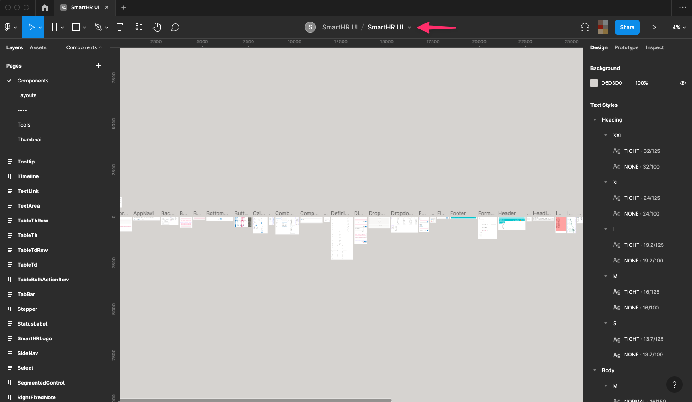

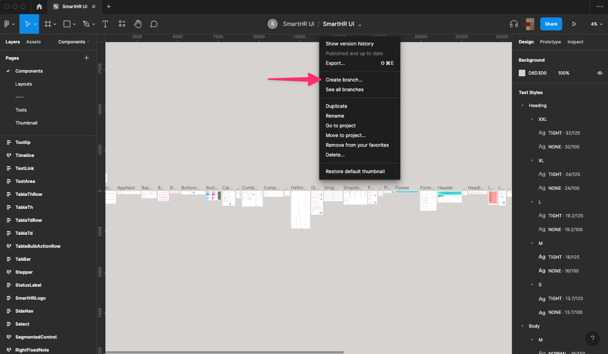

ブランチ名を入力するダイアログが開くので、変更内容・影響範囲がわかりやすいをつけて「Create」押します。

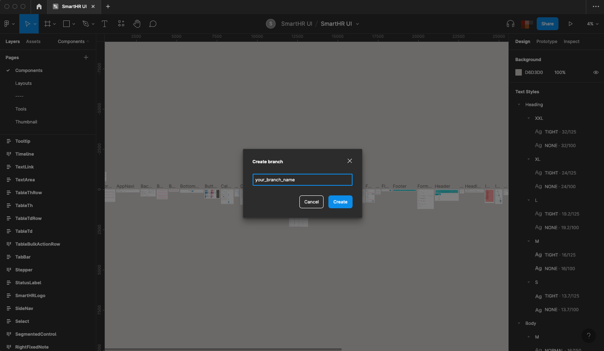

作成されたブランチが開きます。

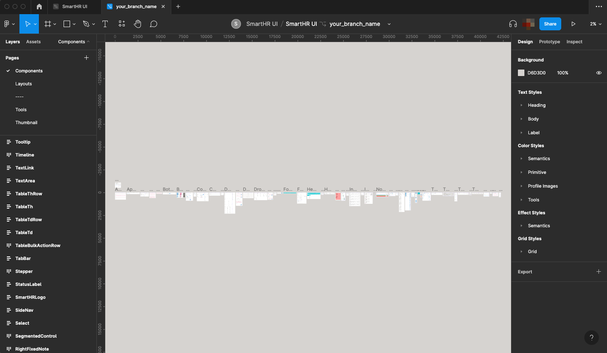

#### ブランチ内でファイルを編集

ブランチ内で変更したいコンポーネントやトークンの追加・編集・削除などを行ないます。

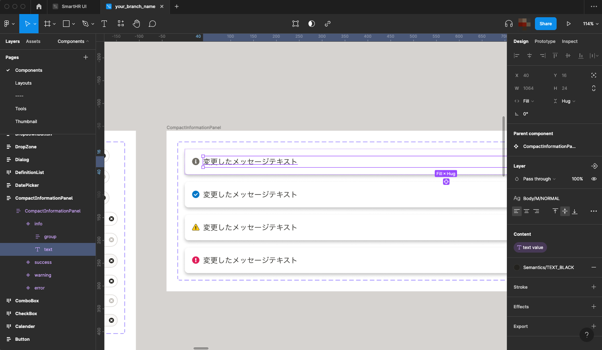

### 2. レビューリクエストを作成する

#### レビューを作成

ブランチのタイトル右のドロップダウンリストで表示されるメニューから「Review and merge changes...」を選択します。
「Description」には具体的な変更内容を書いてください（やりたいこと、やったこと、やらなかったこと etc）。

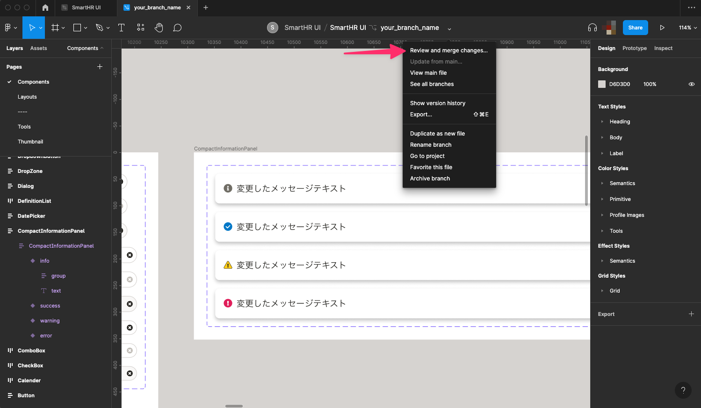

#### レビュアーを設定

ブランチレビューのダイアログの「Reviewers」にレビューしてほしいメンバーを設定します。  
この時、SmartHR UI の`Editor`権限があるメンバーを含むレビュアーを1名以上設定してください。  
レビュアーにアサインした人には、slackなどで別途連絡すると親切です。

`Editor`権限があるメンバーが不明な場合は`#design_products`チャンネルまでお問い合わせください。

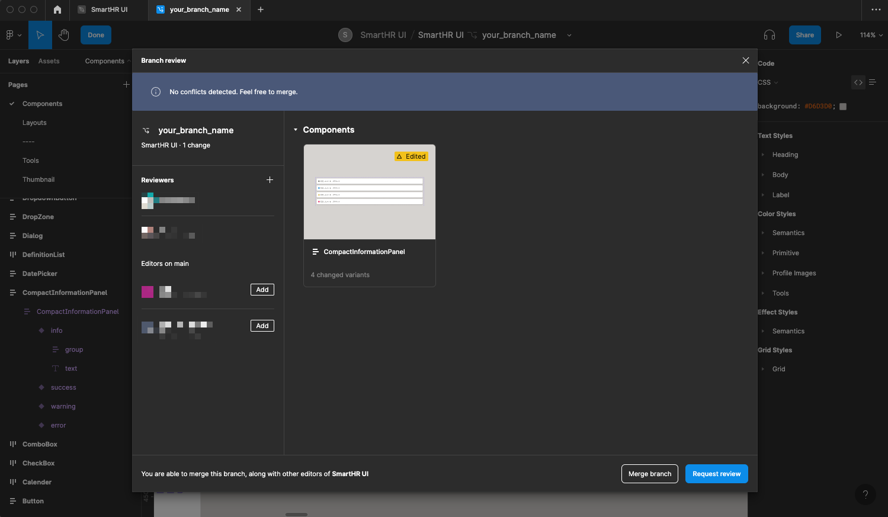

#### レビューリクエストを送信

変更内容を記入して「Request Review」を押すとレビューのタイトルを入力するダイアログが表示されるので、変更内容がわかるように書きます。

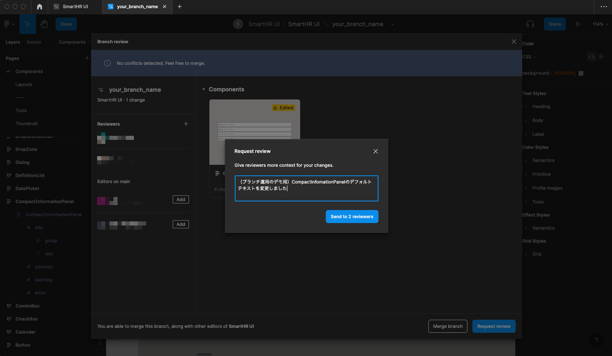

「Send to *n* reviewers」を押すとレビュアーにレビュー依頼が送信されます。  
レビュアーには、Figma内の通知やSlack連携などを通じてレビュー依頼を受信します。

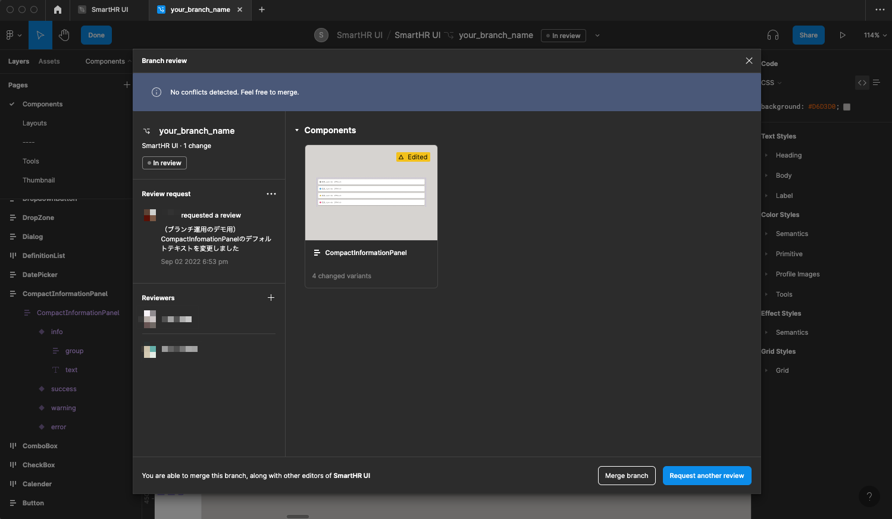

### 3. ブランチの変更箇所をレビューする

#### レビュー依頼の内容を確認して承認

レビュー依頼のあったブランチを開き、タイトル横の「In review」をクリックします。

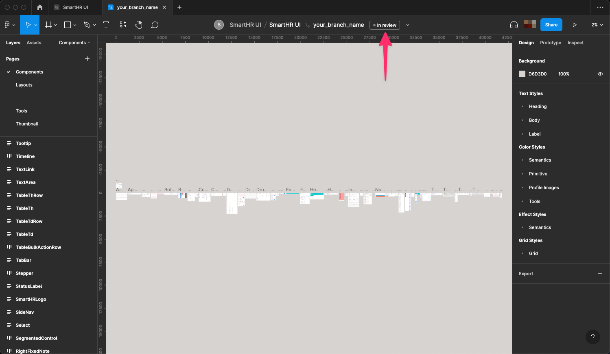

ブランチレビューのダイアログが表示されるので、右側の変更点を確認します。

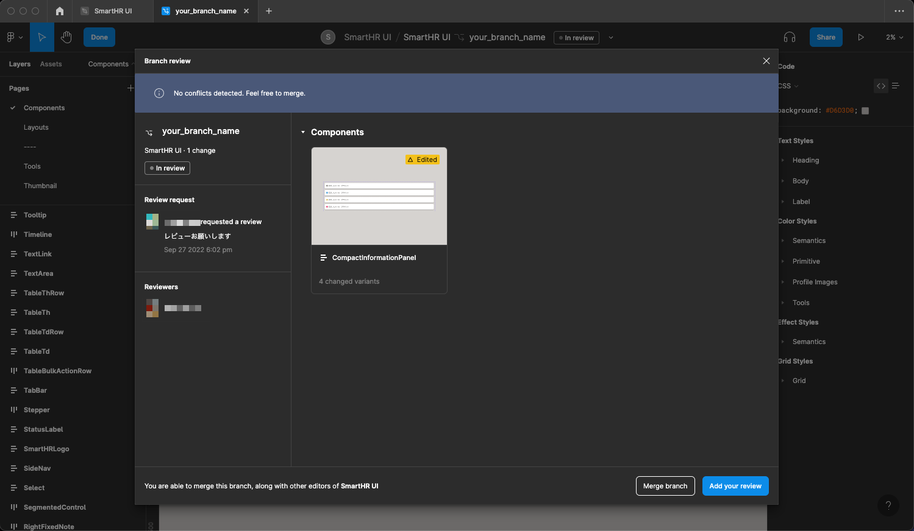

変更点を確認したら「Add your review」を押すと「Finish your review」のダイアログが表示されます。
問題ない場合は「Approve（承認）」を選択し必要に応じてコメントを入力して「Submit」を押すとレビューが完了します。

内容に問題がある場合や変更を提案したい場合は「Approve」ではなく「Suggest changes」を選択してコメントを添えて送信します。
レビュアーが直接ファイルを編集した場合は、コメントにその旨を記入し、レビュー依頼者に知らせましょう。

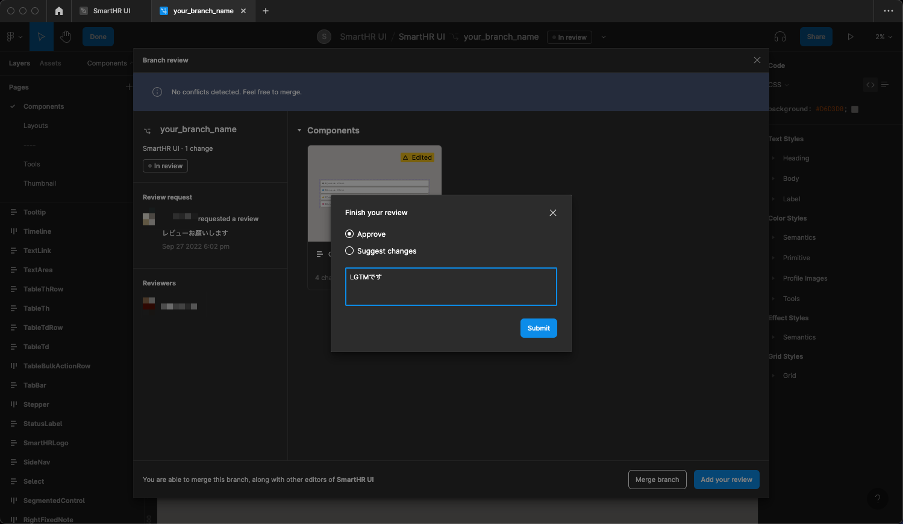

### 4. ブランチの変更をライブラリに適用・公開する（`Editor`権限のメンバーのみ）

#### ブランチをメインに適用（マージ）

レビュアーが「Approve（承認）」したら、「Merge branch」を実行してメインファイルに適用（マージ）します。
これ以降の操作は`Editor`権限があるメンバーしか実行できません。

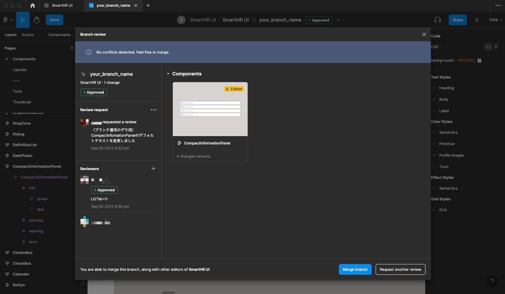

#### 更新されたライブラリを公開

更新が適用されたら、メインファイルに戻って「Assets」のライブラリメニューから「Publish *n* changes...」を押します。

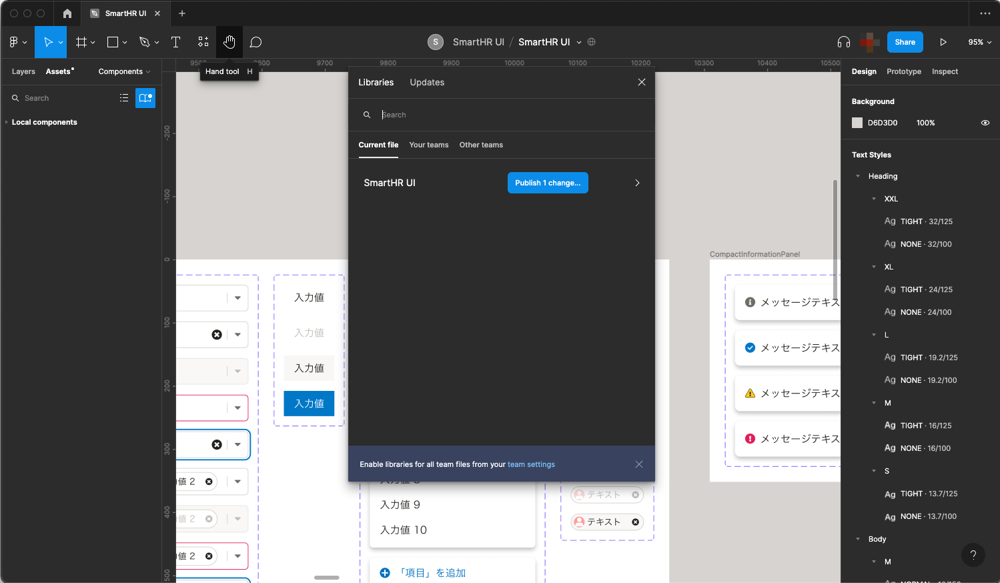

変更内容・影響範囲がわかりやすいコメントをつけて「Publish」を押すと変更内容が公開されます。公開後は、ライブラリを読み込んでいるすべてのファイルに即適用されるわけではなく、ファイルごとに更新を取り込むかどうかの確認があります（更新ごとに取り込む・取り込まないを選択できます）。

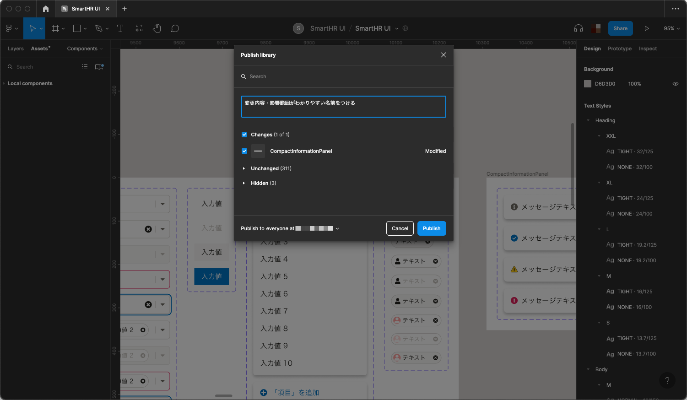

### 5. Figma Communityへ公開する（`Admin`権限のメンバーのみ）

Figma Community（外部）への公開は、`Admin`権限を持っているメンバーが適宜行ないます。
お急ぎの場合は`#design_products`チャンネルまでお問い合わせください。
