import { DoAndDont } from '@Components/DoAndDont'
import { StaticImage } from '@Components/StaticImage'
import { FaExclamationTriangleIcon, Cluster} from 'smarthr-ui'

import imageUrl6Do from './images/access-control-setting-pattern6-do.png'
import imageUrl6Dont from './images/access-control-setting-pattern6-dont.png'
import imageUrl13Do from './images/access-control-setting-pattern13-do.png'
import imageUrl13Dont from './images/access-control-setting-pattern13-dont.png'

SmartHR基本機能の共通設定おける、操作権限を設定する項目のレイアウトパターンをまとめています。

操作権限項目を使用する実際の画面としては、主に共通設定の「権限」「アクセストークン」が該当します。  

## 構成

操作権限項目は、以下の要素で構成されています。

1. タイトルエリア
2. コンテンツエリア

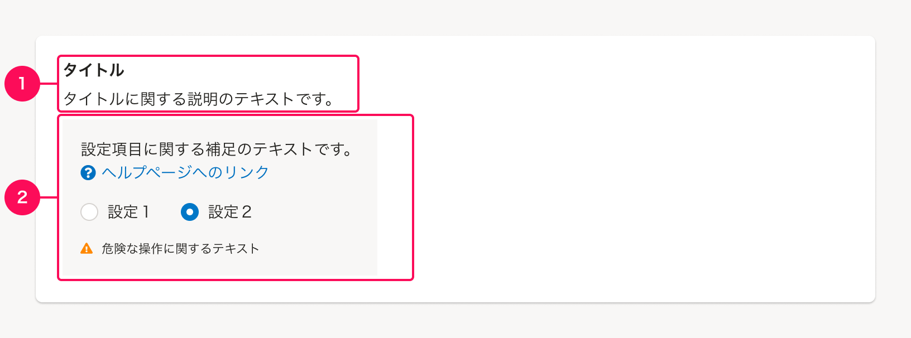

### 1. タイトルエリア

#### タイトル
タイトルは[ブロックタイトル](/products/components/heading/#h3-2)を使用し、操作権限の内容がわかるテキストを表示します。  

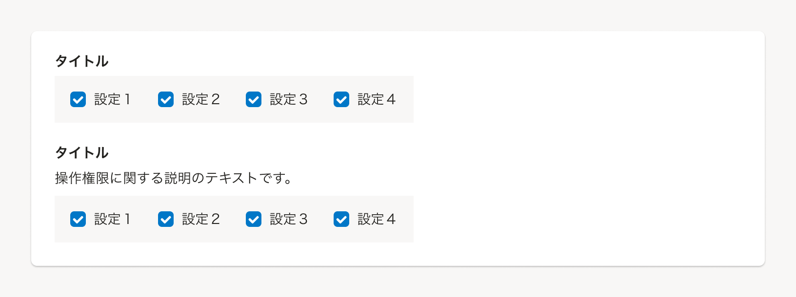

1つの項目に複数の操作権限がある場合、上位のタイトルには[ブロックタイトル](/products/components/heading/#h3-2)、下位のタイトルには[サブ・ブロックタイトル](/products/components/heading/#h3-3)を使用して、抱合関係を示します。

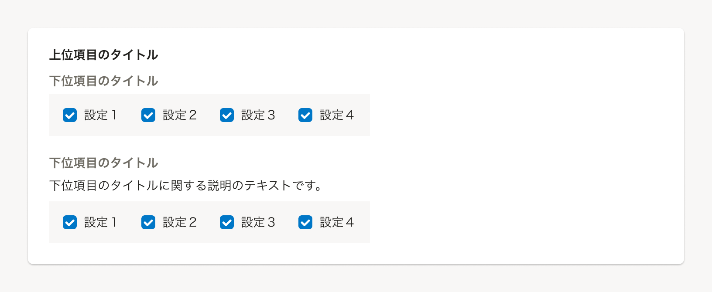

#### 説明テキスト
説明テキストは、操作権限について全体的な説明が必要な場合に、1行程度で簡潔に収まるテキストを挿入します。  
より詳細な説明が必要な場合は、[Iconの使い方](https://smarthr.design/products/components/icon/#h2-4)を参照してヘルプページへのリンクの挿入を検討してください。

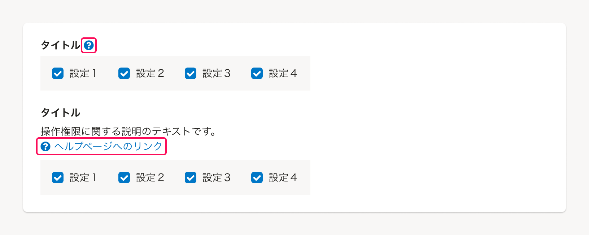

### 2. コンテンツエリア

コンテンツエリアは、背景色に[`COLMUN`](/products/design-tokens/color/#h3-3)を指定して各項目の範囲を明示します。
内容は、以下の要素で構成されています。

- A. [設定項目](#h4-2)
- B. [補足テキスト](#h4-3)

#### A. 設定項目

設定項目は、操作権限に紐づく設定内容を複数の選択肢から選択できるようにした項目です。  
状況に応じて、チェックボックスやラジオボタンを使い分けます。

- 任意の数の設定項目を同時に有効・無効にできる場合は、チェックボックスを使います。
- 複数の選択肢から1つを選択する場合は、ラジオボタンを使います。

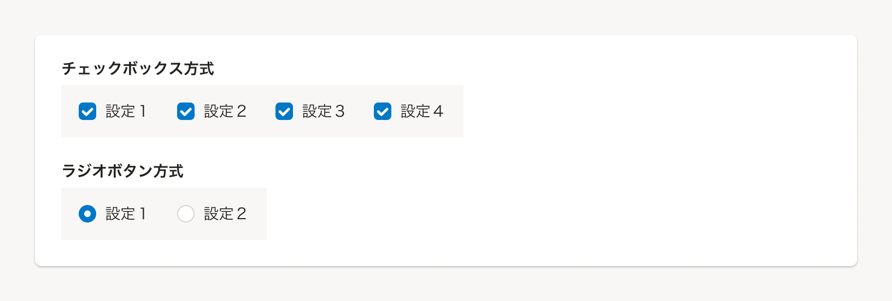

#### B. 補足テキスト

補足テキストは、設定項目について補足する必要がある場合に、[余白の取り方](/products/design-patterns/spacing-layout-pattern/)に従ってエリア内に挿入します。  
より詳細な内容の説明が必要な場合は、[Iconの使い方](https://smarthr.design/products/components/icon/#h2-4)を参照してヘルプページへのリンクの挿入を検討してください。

影響する範囲が複雑な場合など特殊な条件が含まれる設定項目には、<FaExclamationTriangleIcon alt="警告" color="WARNING" /> アイコン（`FaExclamationTriangleIcon`）と補足テキストを設定項目の下部に表示しユーザーに注意を促すことで、意図しない選択状態になることを防ぎます。

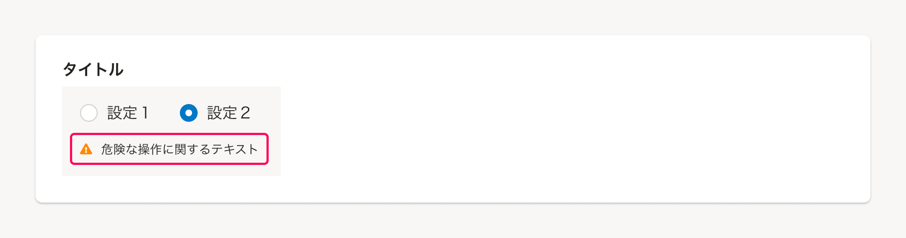

## レイアウト

基本的に[余白の取り方](/products/design-patterns/spacing-layout-pattern/)にしたがって配置します。  
要素感の余白は以下のとおりです。（コンポーネント内の余白は省略）

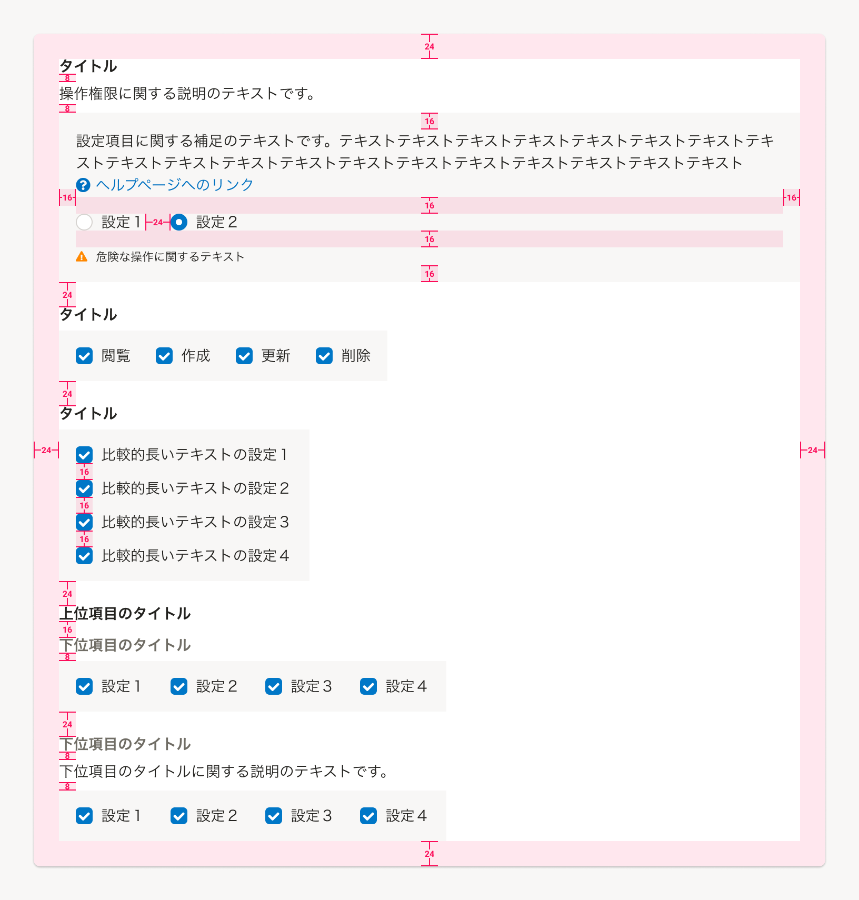

### 設定項目間の余白

設定項目間の余白は、設定項目同士の関係性を認識でき、誤操作とならない範囲で適切な余白を確保します。  
具体的な余白の値は以下の通りです。

- 横並び時の要素間の余白は`24px`
- 縦並び時の要素間の余白は`16px`

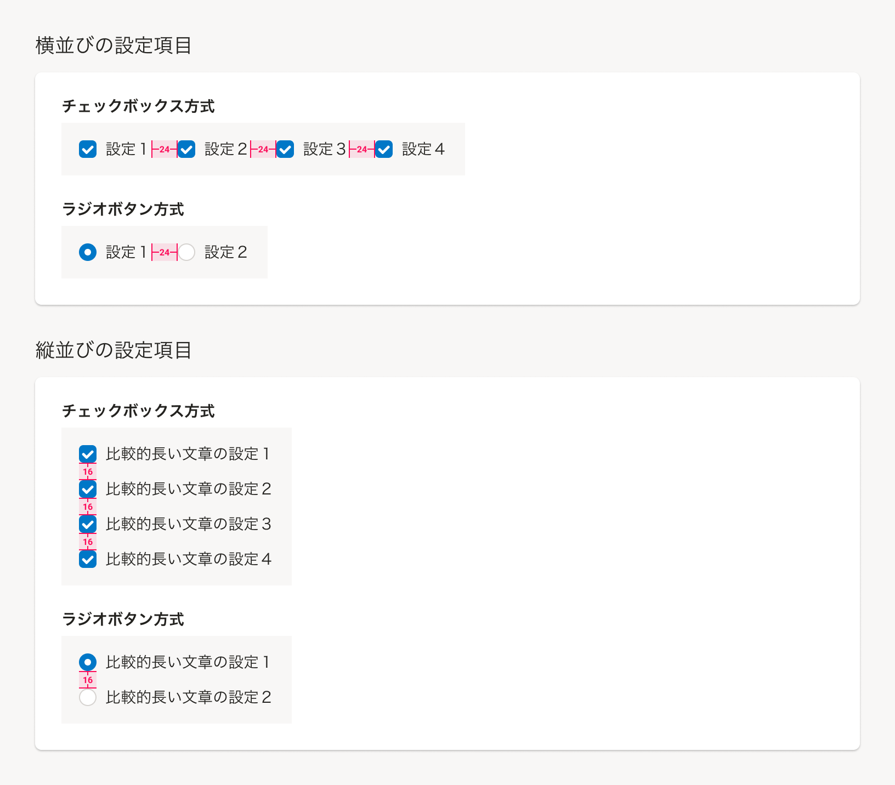

また、操作権限項目の親要素（Baseなど）の幅が狭くなる状況では、設定項目に折り返しが発生します。  
折り返す際の余白も、それぞれ横方向は`24px`、縦方向は`16px`となります。

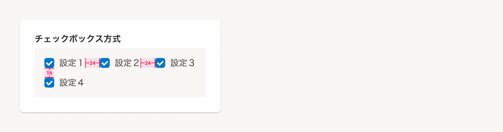

### コンテンツエリアの幅

コンテンツエリアの幅は、基本的に中に含む設定項目などのコンテンツの幅にあわせて調節します。  
コンテンツの量に応じて、操作権限項目の親要素（Baseなど）の幅いっぱいに調整する場合もあります。  
同じ形式の操作権限項目が複数ある場合は、近接する操作権限項目にあわせて幅を揃えることを推奨します。

### 設定項目の並び順

横幅に十分なスペースがある場合は、基本的に横並びにすることで縦幅が長くなりすぎることを防ぎます。

<Cluster gap={{ row: 0, column: 1 }}>
    <DoAndDont
        type="do"
        img={<StaticImage src={imageUrl6Do} alt="スクリーンショット: 設定項目の縦横に配置するレイアウトのDo" />}
        label="横幅に十分なスペースがある場合は、基本的に横並びにします。"
        width="calc(50% - 8px)"
    />
    <DoAndDont
        type="dont"
        img={<StaticImage src={imageUrl6Dont} alt="スクリーンショット: 設定項目の縦横に配置するレイアウトのDon't"/>}
        label="縦並びにすると、親項目の幅に対して要素の配置が偏ってしまい、視認性が低下する恐れがあります。"
        width="calc(50% - 8px)"
    />
</Cluster>

ただし、選択肢の文字が長くなる場合は縦並びを検討します。

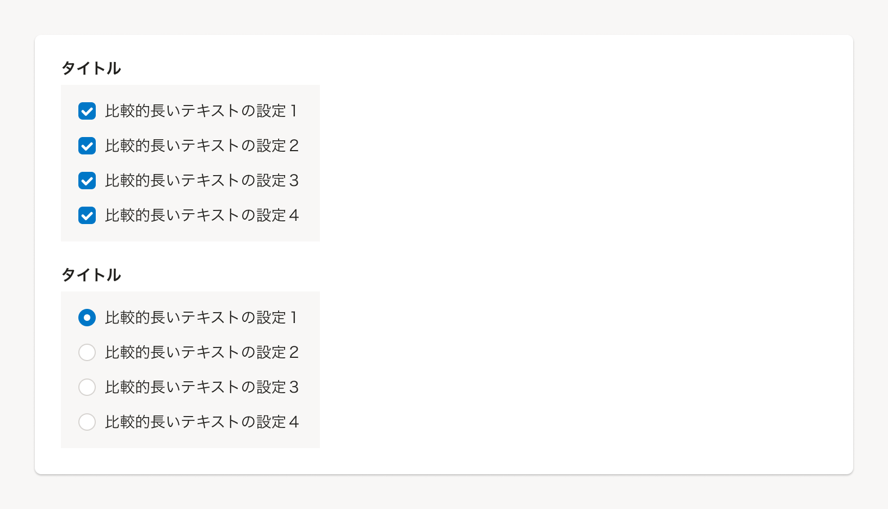

### 組み合わせが決まっている操作権限項目で、一部未対応の設定項目がある場合

CRUDなど、設定項目の組み合わせが決まっている操作権限項目が連続して複数並ぶケースで、一部の設定項目が対応していない場合は該当の設定項目を非表示にします。その際、設定項目が表示されていた箇所はそのまま空白として残します。  
この場合のコンテンツ領域の横幅は、選択肢が存在しているときと同じ横幅になるように固定します。

<Cluster gap={{ row: 0, column: 1 }}>
    <DoAndDont
        type="do"
        img={<StaticImage src={imageUrl13Do} alt="スクリーンショット: 対応しない設定項目を空白として残すレイアウトのDo"/>}
        label="対応していない設定項目が表示されていた箇所は、そのまま空白として残します。"
        width="calc(50% - 8px)"
    />
    <DoAndDont
        type="dont"
        img={<StaticImage src={imageUrl13Dont} alt="スクリーンショット: 対応しない設定項目を空白として残すレイアウトのDon't"/>}
        label="詰めずに配置すると、どの設定項目が対応していないのか把握しづらくなるため、空白が必要です。"
        width="calc(50% - 8px)"
    />
</Cluster>

## 種類

各機能ごとで状況に応じて、操作権限項目のバリエーションを定義します。  
タイトルは共通で、コンテンツエリアの表示パターンがそれぞれで異なります。

### 複数選択パターン

複数選択パターンは、1つの操作権限項目に対して複数の設定項目の有効・無効を個別に指定できる場合に使います。  
代表的なパターンとしては、CRUD（作成、閲覧、更新、削除）操作の権限があります。

#### CRUD操作の例

CRUD操作は、SmartHR基本機能の大部分を占める、もっとも基本的な操作権限です。

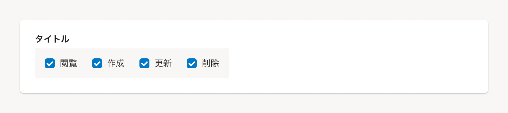

CRUD操作の「作成」「更新」「削除」は、基本的に「閲覧」が許可されていない場合は操作できないため、「閲覧」が不許可の場合は`Disabled`で選択不可にします。

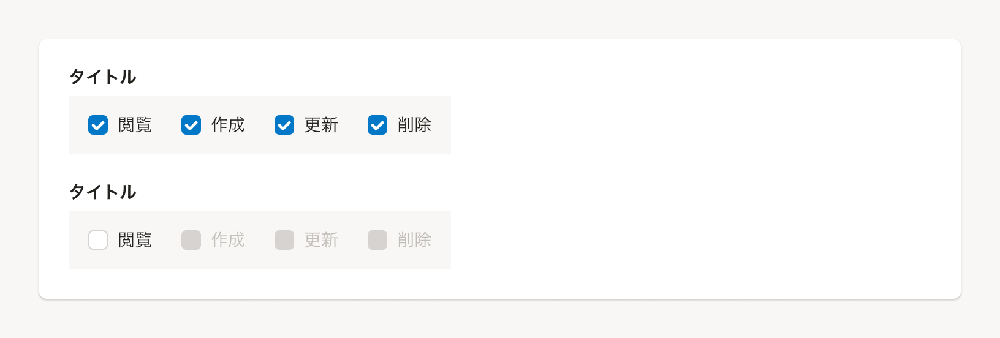

#### その他の複数選択パターンの例

依頼や承認など、ある機能に対して複数の操作権限を持つ場合、複数選択パターンを使います。  
設定項目の内容が異なる以外は、基本的なレイアウトはCRUDと同様です。

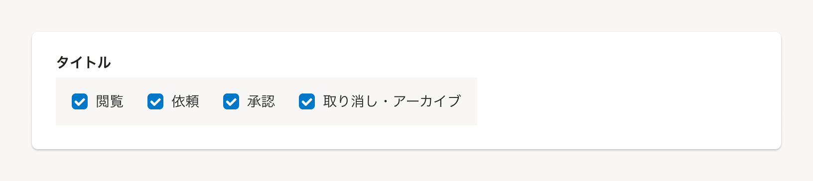

### 単一選択パターン

単一選択パターンは、1つの機能に対して複数の選択肢から1つの操作権限を選ぶ場合に使います。  
代表的なパターンとしては、「できる・できない」といった切り替え形式の権限があります。

#### できる・できないの例

特定の操作権限に対して、「できる」または「できない」の2択で選択するパターンです。

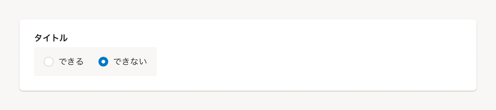

#### 操作権限に条件や範囲指定を含める例

あるオブジェクトに対する操作について、操作権限を条件や範囲で指定したい場合に使います。  
代表的な例としては、本人が作成したオブジェクトのみ操作可能としたい場合などがあります。

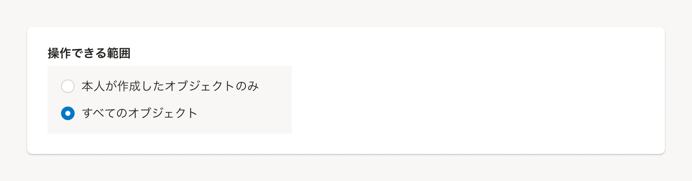

より詳細に条件や範囲を指定したい場合は、[Select](/products/components/select/)や[MultiComboBox](/products/components/combo-box/)などの使用を検討します。

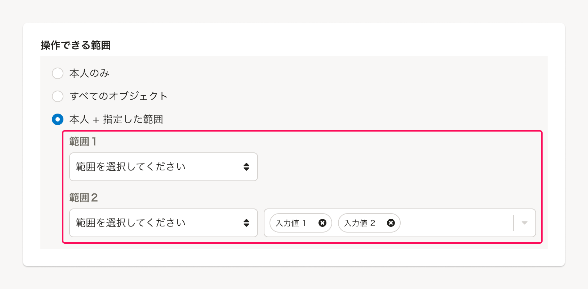

### 複合権限パターン

複合権限パターンは、ある操作権限の設定項目が別の操作権限に影響を及ぼす場合に使います。  
代表的なパターンとしては、CRUD操作の「閲覧」が許可されていない場合に有効化できない権限があります。

#### CRUD操作の「閲覧」権限が他の権限に影響する例

ある操作をする場合、前提としてCRUD操作の「閲覧」が許可されている必要があるケースがあります。

以下の例では、操作権限２を操作できる条件として、操作権限１の「閲覧」権限が必要である場合を示しています。
具体的な挙動は次のとおりです。

- 「閲覧」権限がある場合、操作権限１の「作成」「更新」「削除」および、操作権限２は選択可能の`Enable`となる。
- 「閲覧」権限がない場合、操作権限１の「作成」「更新」「削除」および、操作権限２は選択不可の`Disabled`となる。

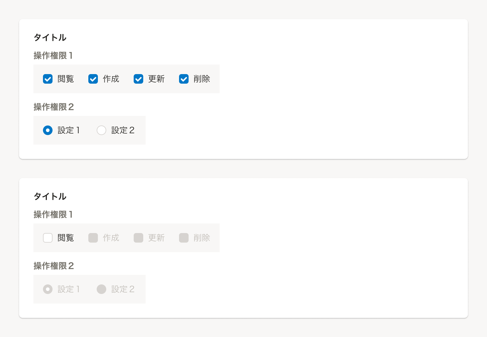
