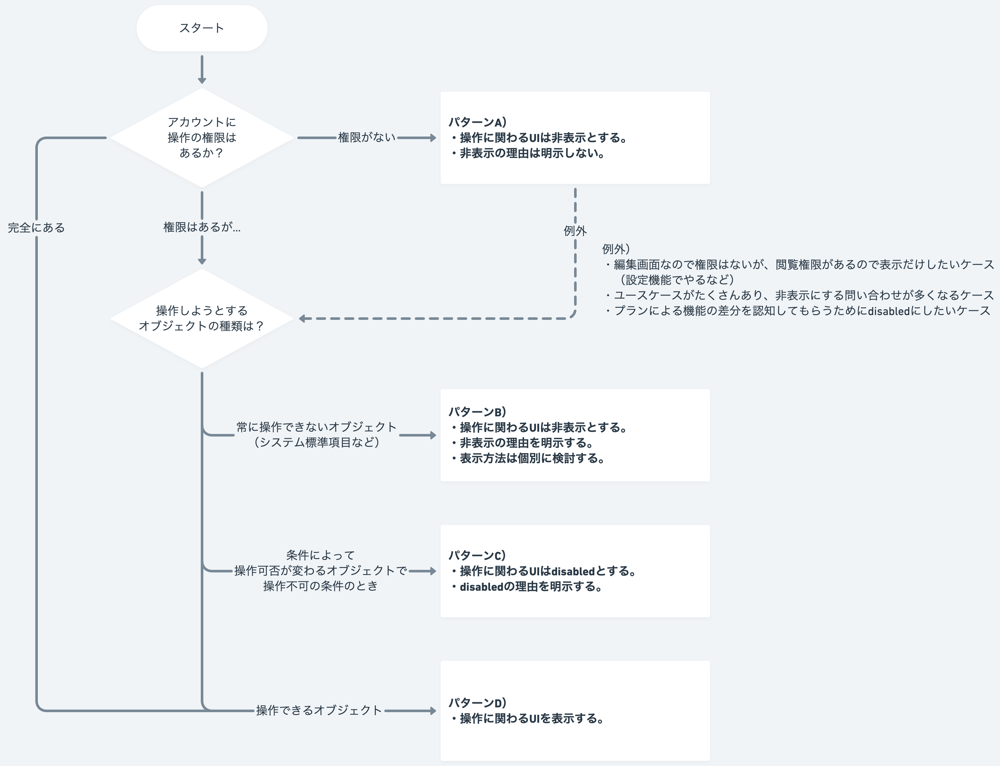

import { FaInfoCircleIcon } from 'smarthr-ui'

権限によるオブジェクトの表示・非表示・disabledの基準を定義します。

## 基本的な考え方
アカウントに付与された操作権限に伴う、UIの基本的な考え方は以下のとおりです。

1. 権限がない場合、操作に関わるUI（アクションボタンやオブジェクトそのもの等）は非表示とする。
2. 権限はあるが、常に操作できないオブジェクトが対象である場合は非表示とし、その理由を明示する。
3. 権限はあるが、使用中など、オブジェクトの操作ができない場合はdisabledとし、その理由を明示する。

## 種類
基本的な考え方を元に、4つの表示パターンを定義します。

| 表示パターン | 説明 | 権限一覧での例 |
| :--- | :--- | :--- |
| A | 操作に関わるUIは非表示とし、理由も明示しない。 | （管理者権限以外は権限設定を操作できないため、この条件には当てはまらない） |
| B | 操作に関わるUIは非表示とし、その理由を明示する。表示方法は個別に検討する。（[理由の表示方法](#h3-1)） | システム標準の権限は削除できないため、非表示にする。 理由は、権限名の横の <FaInfoCircleIcon alt="情報通知" color="TEXT_GREY" /> アイコンと[Tooltip](/products/components/tooltip/)で伝える。 |
| C | 操作に関わるUIはdisabledとし、その理由を明示する。（[理由の表示方法](#h3-1)） | アカウントに紐づいているカスタム権限は削除できないため、disabledにする。 理由は、[disabledにしたボタンの`disabledDetail`](/products/components/button/#h3-8)で伝える。 |
| D | 操作に関わるUIを表示する。 | 上記に当てはまらない場合に編集・複製・削除ボタンを表示する。 |

### 表示パターンの判定フロー

### 理由の表示方法
表示パターンBやCの場合、利用者はなぜ非表示やdisabledになっているかわからないため、理由を明示する必要があります。

- 基本的に、非表示やdisabledにしたオブジェクトの付近に**理由が見えるように表示**します。
- 理由を配置するスペースがない場合、以下のような方法を検討します。
  - ボタンをdisabledにする場合、[Buttonコンポーネントの`disabledDetail`](/products/components/button/#h3-8)を使用する。
  - オブジェクトの付近に <FaInfoCircleIcon alt="情報通知" color="TEXT_GREY" /> アイコン（`FaInfoCircleIcon`）を配置し、[Tooltip](/products/components/tooltip/)と組み合わせて理由を表示する。（参考：[Tooltipのトリガーパターン](/products/components/tooltip/#h3-3)）

## ライティングパターン
### 理由の書き方
「回避可能な場合は、行き止まりだと認識させず、回避方法と知ってもらえる書き方」を基本とします。

| 操作に関わるUIの状態 | トーンの例 |
| :--- | :--- |
| ユーザーの対応によって権限や設定を変更できる場合 メッセージが表示されたユーザーよりも強い権限を持ったユーザーであれば、権限や設定を変更できる場合 | 「〜がないので、〜できません。」 「〜のため、〜できません。」 |
| ユーザーが何をしても変更できない場合 | 「〜できません。」 |

## 関連リンク
- https://smarthr-inc.docbase.io/posts/1483911
