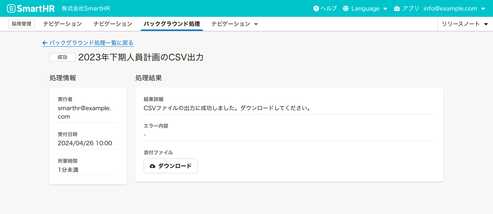

バックグラウンドで実行される処理に必要な状態と画面をまとめています。

## 基本的な考え方

処理に時間がかかり、操作が完了した状態をすぐに表示できない場合、処理を非同期で行ないます。これをバックグラウンド処理と呼びます。

バックグラウンド処理が実行されることがユーザーにも伝わるように、操作直後にはフィードバックとして以下を伝えます。

- バックグラウンド処理が進行していること
- バックグラウンド処理の結果をどの画面で確認すればよいか

### ライティング
バックグラウンド処理が失敗した場合、[バックグラウンド処理のライティングパターン](/products/contents/error-messages/background-process/)に沿ったメッセージを表示してください。エラーが発生してもユーザーが目的を達成できるよう、エラーへの対処を具体的に明記することが重要です。

## 状態

バックグラウンド処理には4つの状態が存在します。

- 処理中
- 成功
- 一部失敗
- 失敗

状態によって、一覧画面と詳細画面の表示パターンが変化します。詳細は、[一覧画面の構成](#h2-3)と[詳細画面の構成](#h2-4)を参照してください。

## 操作直後のフィードバック

ユーザーには、バックグラウンド処理であるかどうかはわからないため、操作後に伝える必要があります。

バックグラウンド処理をリクエストしたときに表示する文言は、`{処理名}を受け付けました`とし、バックグラウンド処理結果の一覧画面へのリンクをフィードバックとして表示します。

使用するコンポーネントは以下を状況によって使い分けます。

- [NofiticationBar](/products/components/notification-bar/)
    - 基本的にはNofiticationBarを使用します。
    - 記載する情報は1行に収めてください。
- [InformationPanel](/products/components/information-panel/)
    - 記載したい情報が2行以上に及ぶ場合は、InformationPanelを使用します。

[フィードバックの基本的な考え方](/products/design-patterns/feedback/#h2-0)もあわせて参照してください。

## バックグラウンド処理結果の一覧画面

バックグラウンド処理として受け付けた処理を一覧で表示する画面です。

### 構成

バックグラウンド処理結果の一覧画面は、以下の情報を含む[よくあるテーブル](/products/design-patterns/smarthr-table/)です。

1. ステータス
2. 処理名
3. 受付日時
4. 結果概要

その他の要素については必要に応じて判断してください。

#### 1. ステータス

処理の状態を[StatusLabel](/products/components/status-label/)で表示します。

|処理の状態|StatusLabel|
|:--|:--|
|処理中|`type="blue"`を使用します。|
|成功|`type="grey"`を使用します。|
|一部失敗|`type="warning"`を使用します。|
|失敗|`type="error"`を使用します。|

#### 2. 処理名

操作したあとに実行された処理の内容が想像できるように、 `｛オブジェクト｝の｛操作｝`で記載します。

例：
- 評価の削除
- 従業員の一括招待
- 従業員情報のダウンロード

#### 3. 受付日時

[日付は`YYYY/MM/DD`、時刻は`hh:mm:ss`](/products/contents/idiomatic-usage/count/#h2-3)という表記で記載します。

#### 4. 結果概要

結果概要では以下のように成功と失敗の件数を伝えます。

`◯件の｛オブジェクト｝の｛操作｝に成功しました。◯件の{オブジェクト}の{操作}に失敗しました。`

処理中の場合は、何も表示しません。

### レイアウト

各情報を以下のように配置します。

## バックグラウンド処理結果の詳細画面

バックグラウンド処理結果の詳細を伝える画面です。

### 構成

バックグラウンド処理結果詳細画面は以下の要素で構成されます。

1. ステータス
2. 処理名
3. 処理情報
    - 実行者
    - 受付日時
    - 所要時間
4. 処理結果
    - 結果詳細
    - エラー内容
    - 添付ファイル

#### 1. ステータス

処理の状態を[StatusLabel](/products/components/status-label/)で表示します。
使用するカラーは一覧画面と同様です。

#### 2. 処理名

一覧画面と同様に、`｛オブジェクト｝の｛操作｝`で記載します。

#### 3. 処理情報

以下のような情報をまとめて「処理情報」と呼びます。

- 実行者
    - 従業員名もしくはメールアドレスで記載します。
- 受付日時
    - [日付は`YYYY/MM/DD`、時刻は`hh:mm:ss`](/products/contents/idiomatic-usage/count/#h2-3)という表記で記載します。
- 所要時間
    - 実際に処理に要した時間を`hoge分`、`hoge時間`といった形式で記載します。

#### 4. 処理結果

以下のような情報をまとめて「処理結果」と呼びます。

- 結果詳細
    - 結果概要と同様の内容もしくは「成功」の場合の次に促したい操作を表示します。
- エラー内容
    - エラー内容にはエラーの原因を表示します。エラー内容の詳しい書き方については[バックグラウンド処理のライティングパターン](/products/contents/error-messages/background-process/)を参照してください。
    - エラーがない場合には `-` と表示します。
- 添付ファイル
    - CSVの書き出し操作やエラーの詳細をファイルで伝える場合は、CSVファイルをダウンロードできるボタンを配置します。
    - 添付ファイルがない場合にはボタンを非表示にします。

### レイアウト

前提となる処理情報を左に配置します。ただし、ユーザーの関心がもっとも高い情報は結果詳細のため、右側に大きく表示します。

どちらの情報もファーストビューに表示されるよう、上下でなく左右に配置しています。

