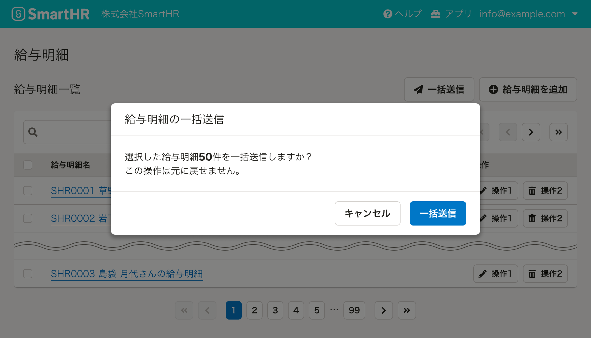
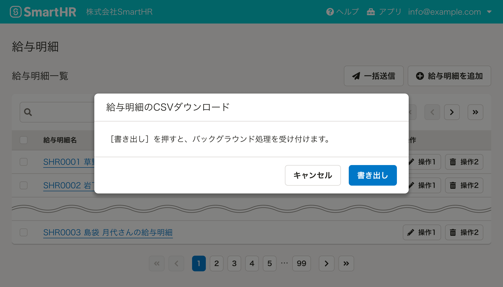
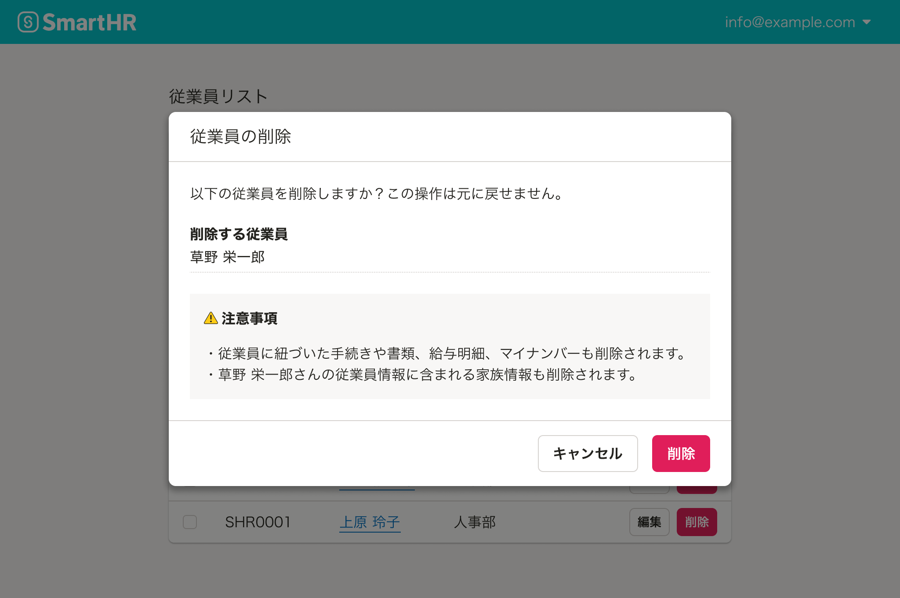
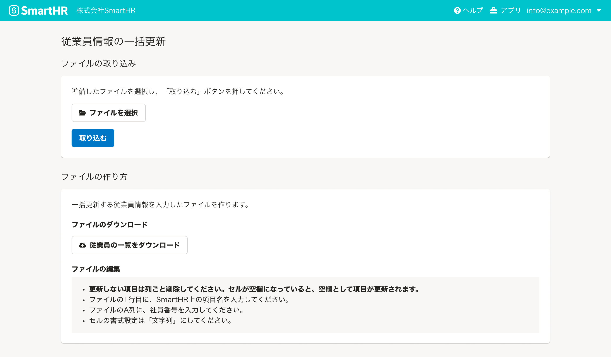
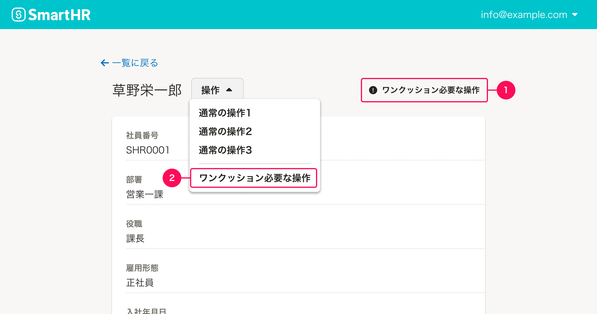
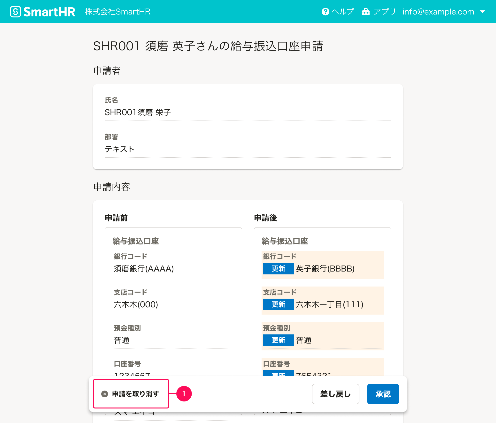

import { Image } from 'astro:assets'
import { Text, BaseColumn, ResponseMessage } from 'smarthr-ui'
import DoAndDont from '@/components/article/DoAndDont.astro'

import imageUrlAccessibilityDont from './images/danger-buttons-in-smarthr-table.png'

<BaseColumn>
  <ResponseMessage type="warning">
    「ワンクッション必要な操作」は「取り返しのつかない操作」に、対象者の多い一括操作の説明を追加し、まとめ直した基準です。
  </ResponseMessage>
</BaseColumn>

ユーザーの操作をシステムが実行する前にワンクッションおく必要がある操作の基準を定義しています。

システムが説明や確認、注意をユーザーに促すプロセスを経て実行される必要がある操作を「ワンクッション必要な操作」としています。

## 基本的な考え方

日常的な操作だとしても、対象項目が多いことによって項目の選択を誤ったり、事前の確認が十分にできないことで誤ったステータス変更やデータ損失が起きるリスクがあります。操作すると何が起こるのかを事前にユーザーが認識できるようにワンクッションをはさんで、これらの自体を防ぎます。

### 検討時の順序

検討時は以下の順序で考えます。

1. 即時実行をするとリスクが高いと想定される操作は、ダイアログやページをはさめるかを検討してください。
2. 対象のレイアウトや装飾で視覚的優先度が下げられないか検討してください。

## 種類

ワンクッション必要な操作のユースケースは以下のとおりです。

- 登録されたデータの削除
- 設定のリセット
- 復元方法がない、または復元に複雑な手順を要するステータスの変更
- 多くのユーザーを対象とした情報の一括更新
- 情報や書類を多くのユーザーを対象とした依頼・配付
- 特定のオブジェクトの公開
- 特定のプロセスの開始
- 情報のダウンロード

## デザインパターン

### 確認ダイアログ
ワンクッション必要な操作をユーザーが実行した際は、その操作によって何が起こるのかを事前に伝えることを検討します。

確認ダイアログでは、対象となる件数や操作の実行で何が起こるかを表示します。

CSVダウンロード実行の確認ダイアログでは、操作の実行により何が起こるかを表示します。

#### 削除ダイアログ
[削除ダイアログ](/products/design-patterns/delete-dialog/)の基準に従い削除する対象や注意事項を表示します。

### 説明をはさむ

多くのユーザーを対象とした情報の一括更新を実行する際には、更新するために必要な手順の説明と何が起こるかを伝える必要があります。伝えるべき情報量を考慮してページを採用する場合もあるでしょう。

### 視覚的表現で目立ちにくくする

#### レイアウトでコントロールする

ワンクッション必要な操作をボタンなどのコンポーネントで提供する際は、ユーザーの誤操作を防ぐために可能な限りその他の操作ボタンから距離を取って置く（1）、または領域を区切って置くこと（2）を検討します。

#### 装飾でコントロールする

メインの操作領域にあるが、ユーザーの誤操作を防ぐためにボタンの装飾（1）を省くことで視覚的優先度を下げます。
[Textボタン](/products/components/button/#h3-4)を使い、サイズ小にして目立ちにくくします。

ただし、装飾だけに頼らず[視線誘導](products/design-patterns/visual-guidance)や[視覚的グルーピング](products/design-patterns/visual-grouping/)などから判断してください。

### 例外：ワンクッションはさめない

「[視覚的表現で目立ちにくくする](#h3-0)」例のようにレイアウトの差をどうしてもつけられず、ダイアログなどでワンクッションはさめない場合は、**例外として**Dangerボタン（1）などのユーザーへ警告を伝えるボタンを設置してください。

<DoAndDont type="dont">
    <Image slot="img" src={imageUrlAccessibilityDont} alt="Dont" />
    <Text slot="label">一覧の操作列などのファーストビューですぐに触れる領域への「ワンクションはさめない操作」の設置や、Dangerボタンを連続して設置することは通常**推奨しません。**</Text>
</DoAndDont>