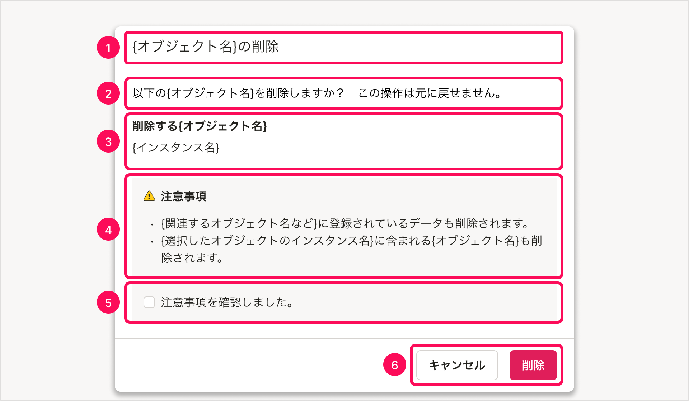
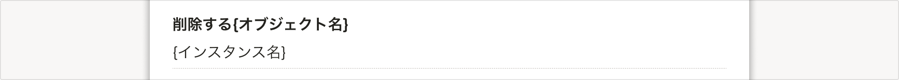

import ComponentPreview from '@/components/ComponentPreview/ComponentPreview'

削除操作をするときのアクションダイアログを定義します。

## 基本的な考え方
削除などの破壊的で不可逆な操作をする際は、アクションダイアログを用いて、ユーザーの確認を経てシステムが処理を実行するようにします。これは、ユーザーが誤ってボタンを押したり、削除したいものとは異なる対象を選択していた場合に、意図に反する処理が実行されてしまうのを防ぐためです。

破壊的な操作であっても、操作後に元に戻せる場合は、処理前の確認は必要ありません。

### ライティング
- 削除の対象となるオブジェクトを提示し、他のオブジェクトと取り違えていた場合に気づけるようにします。
- また、この操作が不可逆である旨を伝えます。
- 削除に伴い、削除されるオブジェクト以外にも影響が生じる場合には、ユーザーがその影響を理解したうえで処理を実行するか判断できるような情報も必ず伝えます。

## 構成

確認メッセージは、[ActionDialog](/products/components/dialog/action-dialog/)を使って表示します。  
ダイアログは以下の要素で構成されています。4、5は任意の要素です。

1. タイトル
2. 本文
3. 削除対象
4. 注意事項（任意）
5. 確認のチェックボックス（任意）
6. アクションボタン

import DynamicActionDialog from './_components/DynamicActionDialog'

<ComponentPreview>
  <DynamicActionDialog client:load />
</ComponentPreview>

### 1. タイトル

[Headingのタイトルのつけ方](/products/components/heading/#h3-5)に従います。  
サブタイトルは使いません。

`{オブジェクト名}の削除`

### 2. 本文

疑問文を使い、確認を促します。また、操作が不可逆である旨を明示します。

`以下の{オブジェクト名}を削除しますか？ この操作は元に戻せません。`

### 3. 削除対象

[DefinitionList](/products/components/definition-list/)を使い、削除対象のオブジェクト名およびインスタンス名を提示します。

なお、DefinitionListのtermは、ダイアログ内の最上位の見出しなので、[ブロックタイトル](/products/components/heading/#h3-2)になります。

#### 削除対象の省略

オブジェクト詳細画面で削除ボタンを押すなど、他のオブジェクトと取り違える可能性が明らかに低い場合、削除対象のインスタンス名を省略しても構いません。この場合、[2. 本文](#h3-2)は、

- `選択した{オブジェクト名}を削除しますか？（後略）`
- `この{オブジェクト名}を削除しますか？（後略）`

のようになります。

### 4. 注意事項（任意）

削除に伴って発生する影響がある場合、その影響の内容を提示します。

たとえば、以下のような例があります。

| 影響の例 | 注意事項の例 |
| :--- | :--- |
| マスターデータやカスタム項目などの削除に伴い、SmartHR内のデータも失われる場合 | `{関連するオブジェクト名など}に登録されているデータも削除されます。` |
| 上位オブジェクトの削除に伴い、下位オブジェクトも失われる場合 | `{選択したオブジェクトのインスタンス名}に含まれる{オブジェクト名}も削除されます。` |

### 5. 確認のチェックボックス（任意）

削除に伴う影響が大きく、削除の操作に特に慎重になる必要がある場合は、[4. 注意事項](#h3-4)に加えて確認のチェックボックスを設けることができます。

チェックボックスを設ける場合は、チェックを入れずにアクションボタンを押すと、エラーを返すようにします。

### 6. アクションボタン

操作を確定するボタンは右に配置し、ラベルは`削除`とします。[Dangerボタン](/products/components/button/#h3-3)を使い、破壊的な操作であることを示します。  
ダイアログを閉じて操作を中断するボタンは左に配置し、ラベルは`キャンセル`とします。

## 類似する種類

### 「取り消し」操作時の確認ダイアログ
操作を取り消す際も、同様の確認ダイアログを表示します。

import DynamicCancelActionDialog from './_components/DynamicCancelActionDialog'

<ComponentPreview>
  <DynamicCancelActionDialog client:load />
</ComponentPreview>
