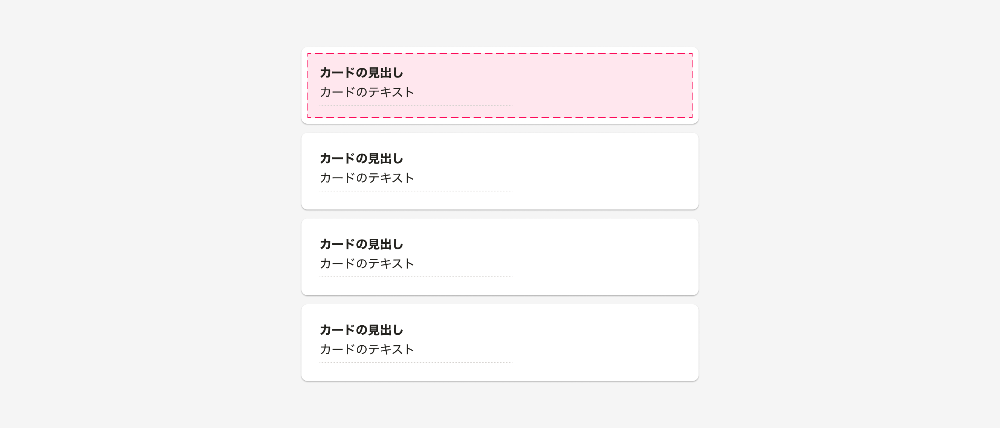

import { Image } from 'astro:assets'
import DoAndDont from '@/components/article/DoAndDont.astro'
import ImgWithDesc from '@/components/article/ImgWithDesc.astro'
import { BaseColumn, Cluster, ResponseMessage, Text, FaGripVerticalIcon, FaGripIcon, FaTriangleExclamationIcon } from 'smarthr-ui'
import doUseHandle from './images/smarthr-draggable-list-handle.png'
import dontUseCard from './images/smarthr-draggable-list-card.png'
import doCancelAction from './images/smarthr-draggable-list-cancellable.png'
import dontCancelAction from './images/smarthr-draggable-list-non-cancellable.png'
import doUseKeyboard from './images/smarthr-draggable-list-keyboard.png'
import dontUseKeyboard from './images/smarthr-draggable-list-no-keyboard.png'

SmartHRに頻出する、ドラッグ&ドロップを使用するUIのパターンをまとめています。

ドラッグ&ドロップが必要なUIには、ユーザーを混乱させないように操作に一貫性をもたせることが重要です。
ただ、それぞれのUIのパターンにおいて、アクセシビリティを確保することも重要です。

この章では、ドラッグ&ドロップを実装する際のベストプラクティスを紹介します。

## ドラッグ&ドロップリスト
<Text weight="bold">ドラッグ&ドロップリスト</Text>は、ユーザーがアイテムをドラッグして順序を変更できるUIのパターンです。

### インタラクティブな領域
インタラクティブな領域とは、<Text weight="bold">ユーザーがアイテムをドラッグできる領域のこと</Text>です。
インタラクティブな領域は、ユーザーがアイテムをドラッグするためのドラッグ操作を開始できる要素を提供する必要があります。

一般的に、ユーザーがカード全体をドラッグできることを期待する場合、インタラクティブな領域はカード全体になります。
<ImgWithDesc description="カード全体がインタラクティブな領域になっている">

</ImgWithDesc>

しかし、インタラクティブな要素を使用しているカードの中に、さらにインタラクティブな要素をネストすると、支援技術で内側のインタラクティブな要素にフォーカスできないなどの問題が起こります。
この場合、カードの内部にインタラクティブな要素が存在するための<Text weight="bold">ハンドル形式</Text>パターンもあります。

#### ハンドル形式
HTMLのインタラクティブ要素をカードの中にインタラクティブな要素を配置したい場合は、カードコンポーネントとは別のドラッグ操作のためのハンドルを提供します。
一般的には、インタラクティブな領域を示す「<FaGripVerticalIcon />」や「<FaGripIcon />」アイコンを使用して、ユーザーがどこをドラッグすればいいのかを明確にします。

<Cluster gap={1}>
  <DoAndDont type="do" width="calc(50% - 8px)">
    <Image slot="img" src={doUseHandle} alt="Do" />
    <Text slot="label">カード全体ではなく、ハンドラーのみがインタラクティブな領域になっている</Text>
  </DoAndDont>

  <DoAndDont type="dont" width="calc(50% - 8px)">
    <Image slot="img" src={dontUseCard} alt="Dont" />
    <Text slot="label">インタラクティブ要素のカードの中にボタン要素が存在するのに、カード全体がインタラクティブな領域になっている</Text>
  </DoAndDont>
</Cluster>

##### 補足
どうしても、デザインがカード全体がインタラクティブな領域になることを要求する場合は、
カード全体をインタラクティブな要素から`div`要素に変更し、正確なARIA属性とHTMLの[drag-and-drop API](https://developer.mozilla.org/en-US/docs/Web/API/HTML_Drag_and_Drop_API)を使用できます。

<Text weight="bold">注意</Text>: この方法はアクセシビリティの支援技術の不具合と繋がる可能性が高いため推奨しません。

#### アクセシビリティの関連情報
アクセシブルなインタラクティブHTML要素の使い方については、下記のWCAGのルールを参照してください。

- [WCAG 4.1.2: 名前 (name)・役割 (role)・値 (value)](https://waic.jp/translations/WCAG22/Understanding/name-role-value.html)

### キーボードの操作
すべてのユーザーがマウスやタッチ入力を使用できるわけではないため、ドラッグ&ドロップの操作をキーボードでも可能にすることが重要です。

これを実現する一般的な方法は、<Text weight="bold">アイテムを上下に移動するためのボタンを提供すること</Text>や、カード用のドロップダウンメニューをオプションとして提供することです。

<Cluster gap={1}>
  <DoAndDont type="do" width="calc(50% - 8px)">
    <Image slot="img" src={doUseKeyboard} alt="Do" />
    <Text slot="label">ドラッグ&ドロップの操作をキーボードでも可能にする</Text>
  </DoAndDont>

  <DoAndDont type="dont" width="calc(50% - 8px)">
    <Image slot="img" src={dontUseKeyboard} alt="Dont" />
    <Text slot="label">ドラッグ&ドロップの操作がマウスやタッチ操作でしかできない</Text>
  </DoAndDont>
</Cluster>

### アクセシビリティの関連情報
アクセシブルなドラッグ&ドロップの実装について迷う方、キーボード操作周りのルールを詳しく知りたい方には、下記のWCAGのルールを参照してください。

- [WCAG 2.1.1: キーボードを理解する](https://waic.jp/translations/WCAG22/Understanding/keyboard)
- [WCAG 2.5.7: ドラッグ動作](https://waic.jp/translations/WCAG22/Understanding/dragging-movements.html)

### アクションのキャンセル操作

ユーザーがアイテムをドラッグしている最中にアクションをキャンセルできるようにする必要があります。一般的には、`Escape`キーを使用してキャンセルする方法が実装されます。

アクションをキャンセルできない場合は、最新のアクションを元に戻す方法を提供する必要があります。これは、`元に戻す`ボタンやメニューのオプションを通じて行なうことができます。

<Cluster gap={1}>
  <DoAndDont type="do" width="calc(50% - 8px)">
    <Image slot="img" src={doCancelAction} alt="Do" />
    <Text slot="label">②と③の位置を変えるアクションのあとで、アクションをキャンセルをできるようにする</Text>
  </DoAndDont>

  <DoAndDont type="dont" width="calc(50% - 8px)">
      <Image slot="img" src={dontCancelAction} alt="Dont" />
    <Text slot="label">②と③の位置を変えるアクションのあとで、アクションをキャンセルする方法がない</Text>
  </DoAndDont>
</Cluster>

#### アクセシビリティの関連情報
アクションのキャンセル操作のアクセシブル条件について迷う方には、下記のWCAGのルールとテクニックを参照してください。

- [WCAG 2.5.2: ポインタのキャンセル](https://waic.jp/translations/WCAG22/Understanding/pointer-cancellation.html)
- [WCAG G212: Using native controls to ensure functionality is triggered on the up-event.](https://waic.jp/translations/WCAG22/Techniques/general/G212)

