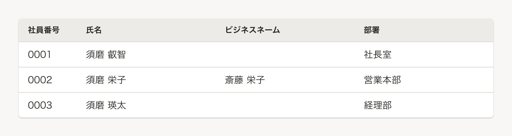
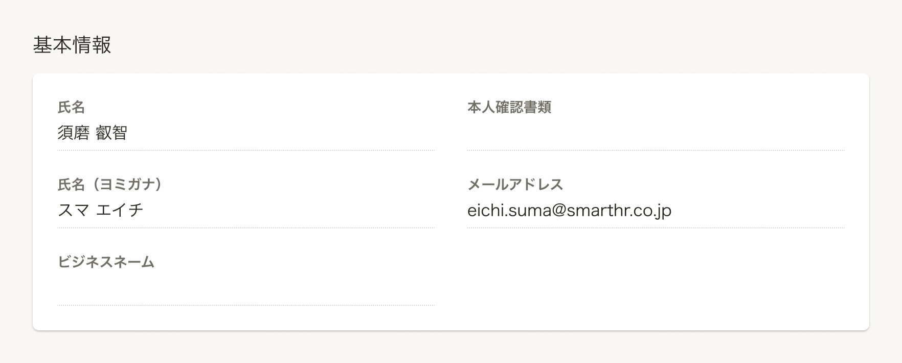
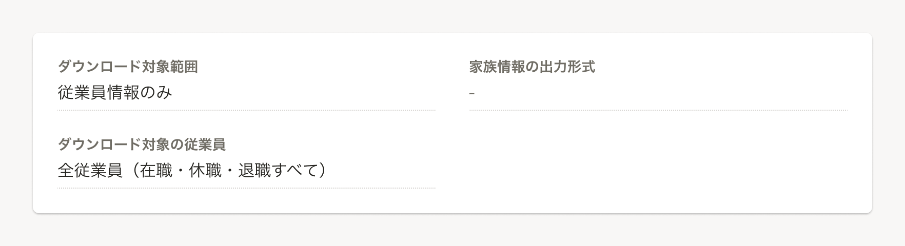

データテーブルや定義リストで値を持たない場合の基準を定義します。

## 基本的な考え方
データテーブルや定義リストにおいて、値がない項目は**空白表示**とします。

### 例外
以下の場合において、値がない項目は（空白表示ではなく）**`-`を表示**し、文字色は[`TEXT_DISABLED`](/products/design-tokens/color/#h2-2)とします。

- データテーブルや定義リスト上に、ユーザーが入力できない項目を表示する場合

## 種類

### データテーブルの表示例

### 定義リストの表示例

### 例外の表示例
「ダウンロード対象範囲」が`従業員情報のみ`の場合は、「家族情報の出力形式」は入力できない（未設定状態になる）ため、`-`を表示します。

