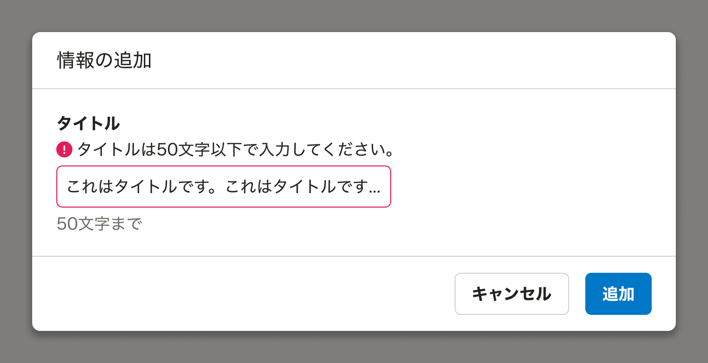
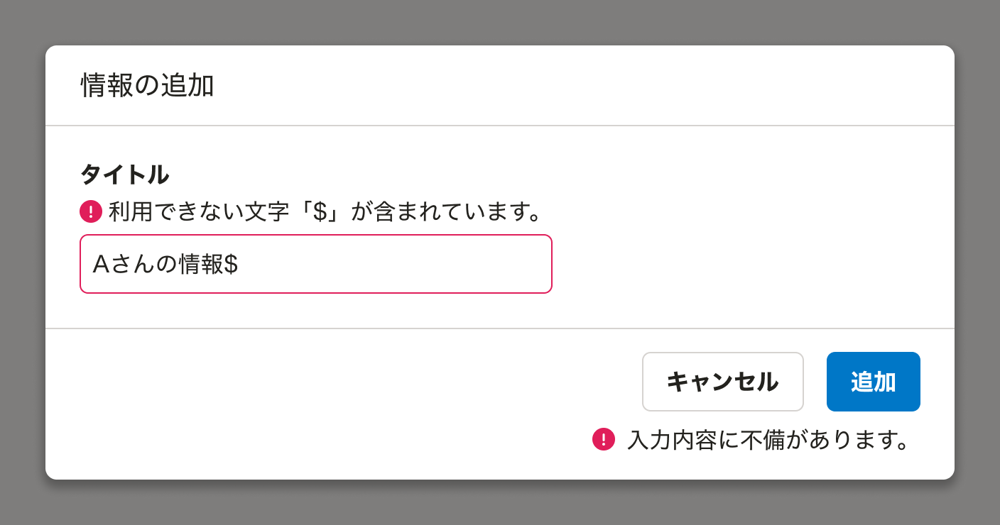
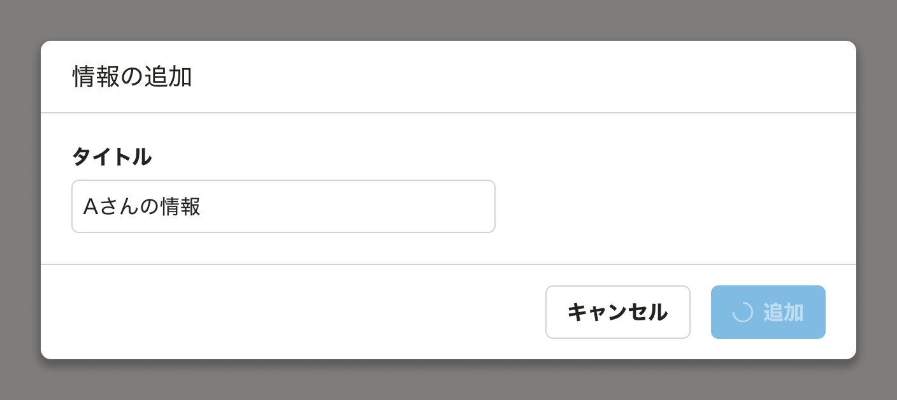
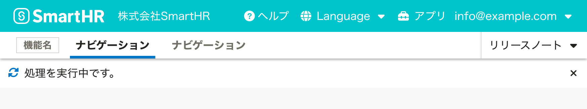
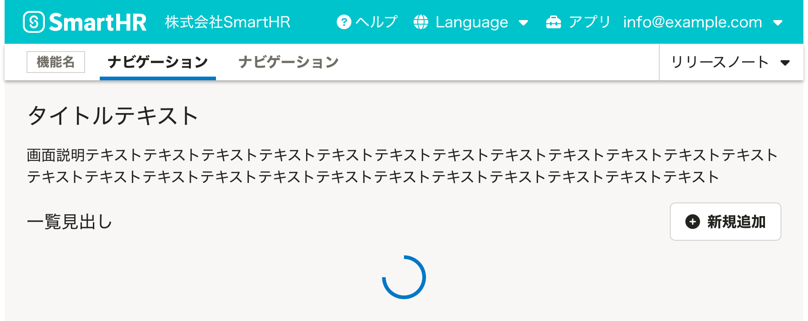
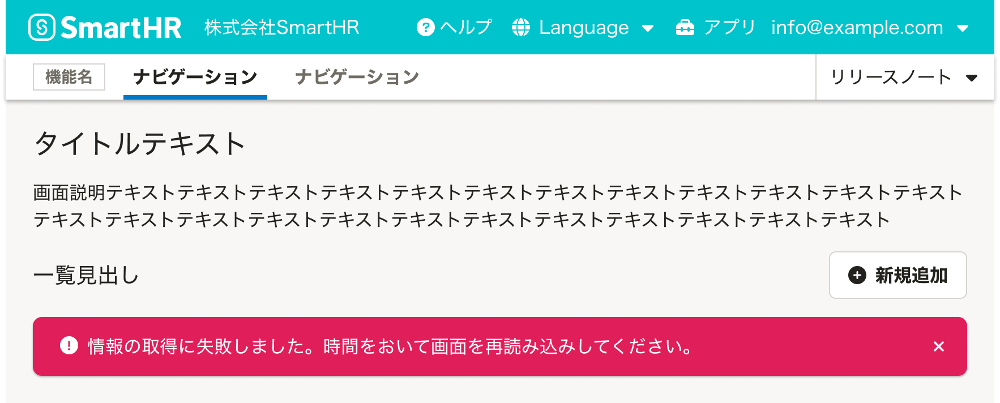

ユーザーに操作の結果を伝えるUIの基準を定義します。

ユーザーが行なった操作へのシステムからの応答をフィードバックと呼びます。メッセージを画面上に表示したり、コンポーネントの意匠を変更するなどの方法が取られます。

## 基本的な考え方
### ユーザーが受動的に結果を認識できるようにする

フィードバックはユーザーが操作の結果を理解し、次の行動を判断するために重要です。ユーザーが何らかの操作をした際はその結果を受動的に認識できるように、素早く画面上にフィードバックのためのUIを表示してください。

#### フィードバックを省略できるケース
以下の例のように画面の変化から操作が成功していることが**明らかに理解できる場合のみ**フィードバックのためのUIは省略します。

- ページの読み込みに成功したタイミング
- 新規追加したオブジェクトの詳細ページが自動で開かれる場合

### 操作部の近くでフィードバックする

ユーザーは画面の全領域の変化に常に気づくとは限りません。可能な限り、直前までユーザーが操作していた要素の近くか、コンポーネント自体の変化で操作の結果をフィードバックします。

特に拡大鏡を利用する弱視・ロービジョンのユーザーは、拡大表示範囲外の変化を認識できません。

関連リンク：[弱視・ロービジョンのユーザーのウェブ利用時の課題と解決案](/accessibility/low-vision/)

### スクリーンリーダーでの読み上げ順序を考慮する

[WIP]

### ライティング
エラー状態をフィードバックする場合、[エラーメッセージの基本的な要素](/products/contents/error-messages/#h2-2)に沿ったメッセージを表示してください。エラー状態はユーザーの目的達成を阻害するため、回復方法が理解できるライティングが重要です。

## 種類
操作の結果をフィードバックする代表的な状況は以下のとおりです。  
なお、非同期処理のフィードバックについては、[バックグラウンド処理](/products/design-patterns/background-jobs-results/)を参照してください。

- フォームを入力・送信するとき
- 同期的な処理を開始したとき
- 同期的な処理が完了したとき
- ページ・要素の読み込みを開始したとき
- ページ・要素の読み込みが完了したとき

### フォームを入力・送信するとき

#### 入力時に値が不正であることを判定する場合

入力要素からフォーカスが外れたタイミングで、入力要素に対してエラーメッセージを表示します。値が修正され、エラーの原因が解消された場合はエラーメッセージの表示を止めます。

入力要素に対するエラーメッセージは、[FormControl](/products/components/form-control/)か[Fieldset](/products/components/fieldset/)の`errorMessages`で表示します。入力要素にも`error`状態を付加して意匠を変化させます。

#### フォームの送信時に値が不正であることを判定する場合

送信ボタンの押下後に、入力要素と送信ボタンに対してエラーメッセージを表示します。エラーの原因が解消された場合はエラーメッセージの表示を止めます。

入力要素に対するエラーメッセージは、[FormControl](/products/components/form-control/)か[Fieldset](/products/components/fieldset/)の`errorMessages`で表示します。入力要素にも`error`状態を付加して意匠を変化させます。

送信ボタンに対するエラーメッセージは、`error`状態の[ResponseMessage](/products/components/response-message/)（[ActionDialog](/products/components/dialog/action-dialog/)の場合は`responseMessage`）を利用して表示します。

### 同期的な処理を開始したとき

実行した[Button](/products/components/button/)を`loading`状態に変化させます（[ActionDialog](/products/components/dialog/action-dialog/)の場合は`responseMessage`を利用）。

処理が完了したら表示を切り替え、[同期的な処理が完了したとき](#h3-5)のフィードバックを表示します。

#### Buttonの状態変化で伝えることが難しい場合

操作後に画面全体の切り替えが発生する場合など、処理を実行したButtonの状態変化で伝えることが難しい場合は、`sync`状態の[NotificationBar](/products/components/notification-bar/)を表示します。

処理が完了したら表示を切り替え、[同期的な処理が完了したとき](#h3-5)のフィードバックを表示します。

### 同期的な処理が完了したとき

ユーザーが直前に操作していたButtonなどの近くに、成功時には`success`状態、失敗時には`error`状態で[ResponseMessage](/products/components/response-message/)を表示します。再度処理を実行するタイミングでメッセージの表示を止めます。

#### Buttonの近くに表示するのが難しい場合

操作後に画面全体の切り替えが発生する場合など、ユーザーが直前に操作していたButtonの近くに表示することが難しい場合は、成功時には`success`状態、失敗時には`error`状態で[NotificationBar[bold]](/products/components/notification-bar/)を表示します。

#### 記載する情報が多い場合

補足情報としてTextLinkやButtonを表示する場合は、成功時には`success`状態、失敗時には`error`状態で[NotificationBar[bold]](/products/components/notification-bar/)を表示します。

複数行のテキストなど多くの情報を表示する場合は、成功時には`success`状態、失敗時には`error`状態で[InformationPanel](/products/components/information-panel/)を表示します。

### ページ・要素の読み込みを開始したとき

読み込みの対象となっている領域に[Loader](/products/components/loader/)を表示します。

処理が完了したら表示を切り替え、[ページ・要素の読み込みが完了したとき](#h3-7)のフィードバックを表示します。

### ページ・要素の読み込みが完了したとき

#### ページ全体の表示に失敗した場合

[ErrorScreen](/products/components/error-screen/)を利用します。

#### 特定の要素の表示に失敗した場合

要素が本来表示される場所に、`error`状態の[NotificationBar[bold]](/products/components/notification-bar/)を表示します。

