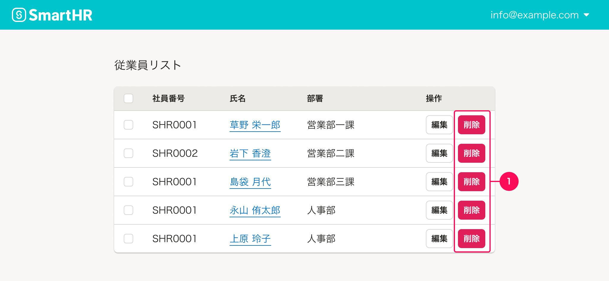
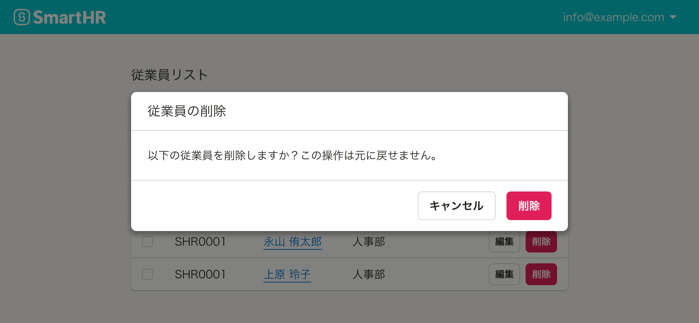

ユーザーにとって取り返しのつかない操作を提供する際の基準を定義しています。

一度実行するとやり直しや巻き戻しが効かない操作のことを「取り返しのつかない操作」としています。 

## 基本的な考え方

サービス内でのデータ損失の原因の多くは人的ミスによるものです。  
ユーザーの誤操作によって「取り返しのつかない操作」が実行されないよう、提供時に十分に配慮しましょう。

## 代表的な取り返しのつかない操作

取り返しのつかない操作の代表的なものとして以下のような操作があります。

- 登録されたデータを削除する操作
- 設定をリセットする操作
- 復元方法がない、または復元に複雑な手順を要するステータスの変更操作

## 取り返しのつかない操作ボタンの提供方法

取り返しのつかない操作をボタンなどのコンポーネントで提供する際は、ユーザーの誤操作を防ぐために可能な限りメイン操作領域の遠くに置く（1）、または領域を変更して置くこと（2）を推奨します。

上記例のようにレイアウトの差をどうしてもつけられない場合は[Dangerボタン](/products/components/button/#h3-3)などのユーザーへ警告を伝えるボタンを設置しましょう。

ただし、一覧の操作セルなど、ファーストビューですぐに触れる領域への「取り返しのつかない操作ボタン」の設置や、Dangerボタンを連続して設置することは通常**推奨しません。**

## 取り返しのつかない操作を実行しようとした際のフィードバック

取り返しのつかない操作をユーザーが実行した際は、その操作によって何が起こるのかをフィードバックで伝えましょう。
フィードバック方法としては、[削除ダイアログ](/products/design-patterns/delete-dialog/)をはじめとした確認ダイアログなどを表示するのが良いでしょう。

