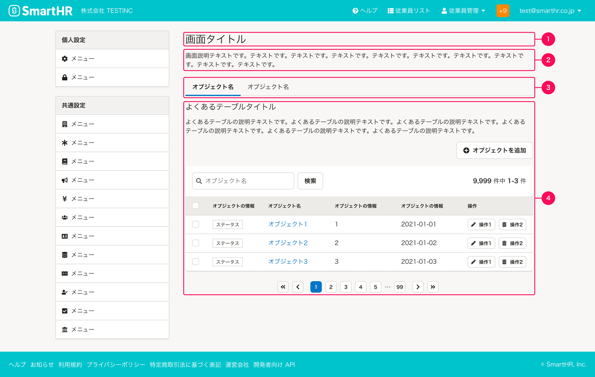
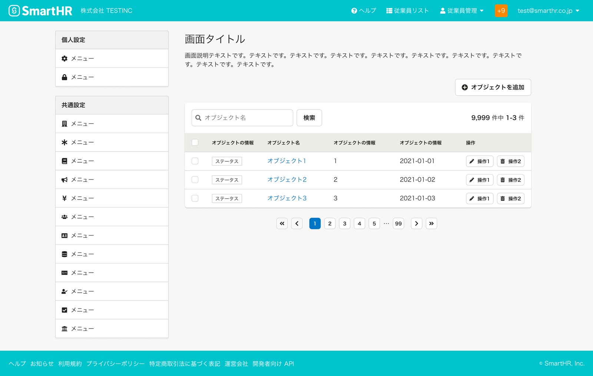
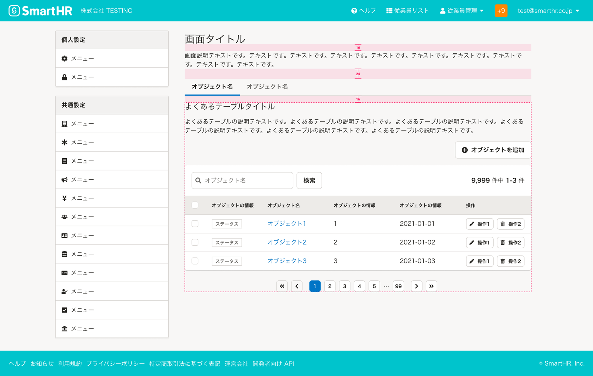
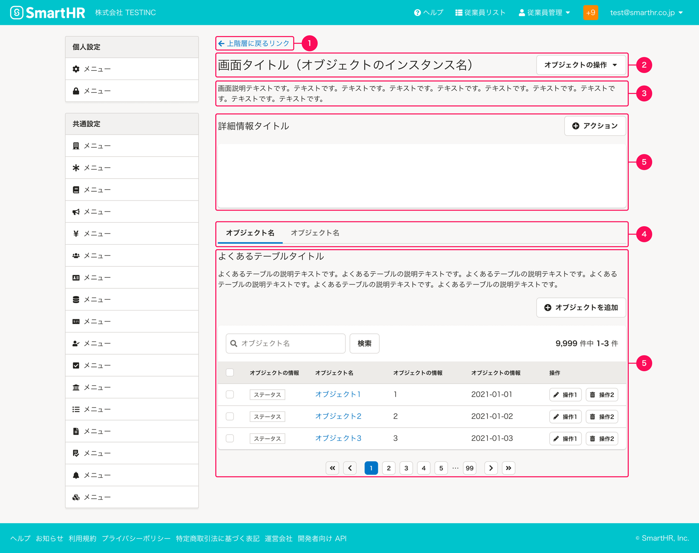
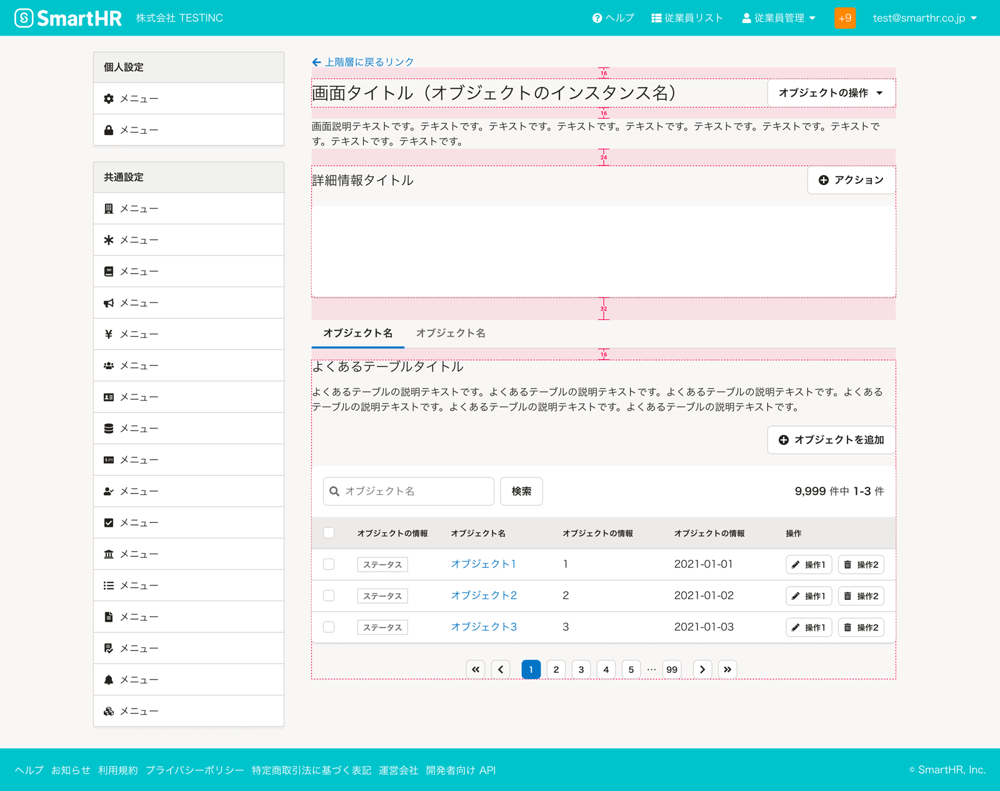
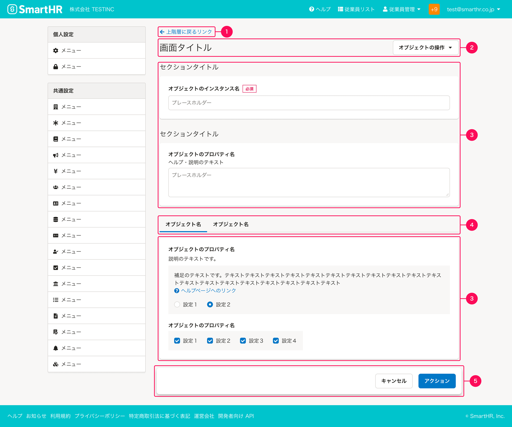
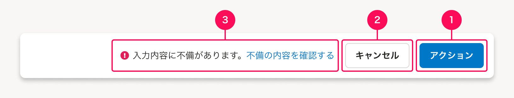
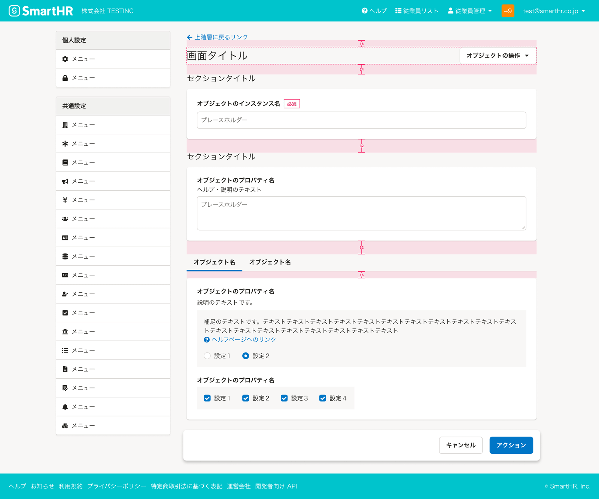
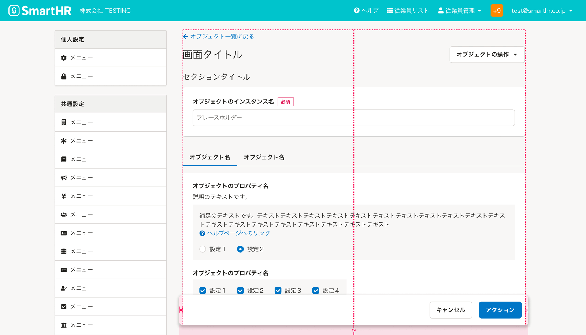

SmartHR基本機能の共通設定のレイアウトパターンをまとめています。

## 種類
共通設定のレイアウトパターンには大きく以下のバリエーションがあります。  
構成やレイアウトはそれぞれの項目を参照してください。

- A. 一覧ビュー
- B. 詳細ビュー
- C. アクションビュー

## A. 一覧ビュー
一覧ビューはオブジェクトを一覧形式で表示します。  
OOUIでは`コレクションのビュー`と呼ばれる画面で、基本的に[よくあるテーブル](/products/design-patterns/smarthr-table/)を含みます。

### 構成
構成要素は次のとおりです。  
構成要素の必須項目以外は任意の要素です。機能によって使用有無を判断してください。  

1. [画面タイトル](#h4-0)（必須）
2. [画面説明テキスト](#h4-1)（必須）
3. [タブ](#h4-2)
4. [よくあるテーブル](#h4-3)

#### A-1. 画面タイトル
一覧ビューの[画面タイトル](/products/components/heading/#h3-0)です。タイトルの付け方は[Headingのライティング](/products/components/heading/#h3-5)を参照してください。

#### A-2. 画面説明テキスト
機能の説明や操作に関する補足テキスト、ヘルプセンターへのリンクなどを配置します。

#### A-3. タブ
直後に続く、独立したコンテンツを並列に表示する場合に[TabBar](/products/components/tab-bar/)を使います。  
絞り込みなど、表示状態を切り替える機能としては使わないでください。

#### A-4. よくあるテーブル
表形式で一覧表示するUIを`よくあるテーブル`と呼びます。次のような要素を持ちます。

- タイトルエリア
- テーブル操作エリア
- 一時操作エリア
- テーブル

詳細は、[よくあるテーブルのレイアウトパターン](/products/design-patterns/smarthr-table/)を参照してください。

##### タイトルエリアの省略
`画面タイトル`と`よくあるテーブルの見出し`が同一で、冗長と判断した場合は[よくあるテーブルのタイトルエリア](/products/design-patterns/smarthr-table/#h3-1)を省略できます。

### レイアウト
要素間の余白は以下のとおりです。詳細は[余白の取り方](/products/design-patterns/spacing-layout-pattern/)を参照してください。

要素内やコンポーネント内の配置や余白は以下を参照してください。

- ［WIP］TabBar
- [よくあるテーブルのレイアウト](/products/design-patterns/smarthr-table/#h2-1)

## B. 詳細ビュー
詳細ビューはオブジェクトの詳細情報を表示します。OOUIでは`シングルビュー`と呼ばれる画面です。  
一覧ビューの[よくあるテーブルの移動リンク](/products/design-patterns/smarthr-table/#h5-0)から移動する画面を想定しています。

### 構成
構成要素は次のとおりです。  
構成要素の（必須）項目以外は任意の要素です。機能によって使用の有無を判断してください。

1. [上に戻るリンク](#h4-4)（必須）
2. ヘッダー
    - [画面タイトル](#h4-5)（必須）
    - [画面アクションエリア](#h4-6)
3. [画面説明テキスト](#h4-7)
4. [タブ](#h4-8)
5. [コンテンツ](#h4-9)

#### B-1. 上に戻るリンク
一階層上のコンテンツに誘導するためのリンクです。詳細は、[UpwardLink](/products/components/text-link/upward-link/)を参照してください。

一覧ビュー（オブジェクトの一覧）に戻ることを想定しています。

#### B-2. ヘッダー - 画面タイトル
詳細ビューの[画面タイトル](/products/components/heading/#h3-0)です。多くの場合`{オブジェクトのインスタンス名}`を表示します。

#### B-2. ヘッダー - 画面アクションエリア
詳細ビュー全体に対するアクションをまとめたエリアです。
このエリアは画面タイトルの右側に配置します。

##### アクションボタンの表示
主要なアクション以外は、基本的に[ドロップダウンメニューボタン](/products/components/dropdown/dropdown-menu-button/)でまとめて配置します。
これは画面タイトルの横幅の領域を十分に確保するためです。

また、アクションが1つだけになった場合（例：オブジェクトの削除のみ）でも、他の詳細ビューとの一貫性を保つために、あえて`ドロップダウンボタン`の中に配置することがあります。

##### アクションボタンの例
ここに配置される典型的なアクションボタンの例は以下のとおりです。  
以下に限らず、扱う機能やユースケースによって、必要なアクションボタンを配置できますが、詳細ビュー全体に対するアクションエリアであることに留意してください。

| 操作名 | ボタンのラベル例 | 役割・動作 |
| :--- | :--- | :--- |
| オブジェクトの削除 | `権限を削除` | オブジェクトを削除するアクションです。「`{オブジェクト名}`を削除」と表記します。 破壊的なアクションであるため、**基本的に一覧ビューではなく詳細ビューの画面アクションエリアに配置します。** 押すと、オブジェクトの[削除ダイアログ](/products/design-patterns/delete-dialog/)を表示します。 |
| オブジェクト名の編集 | `権限名を編集` | オブジェクト名を変更するアクションです。「`{オブジェクト名}`名を編集」と表記します。 押すと、オブジェクト名の編集ダイアログを表示します。 |
| オブジェクトのプロパティの編集 | `対象期間を編集` | オブジェクトのプロパティを変更するアクションです。多くは「`{プロパティ名}`を編集」と表記します。 押すと、プロパティを編集するダイアログなどを表示します。 |

#### B-3. 画面説明テキスト
詳細ビューの説明や操作に関する補足テキスト、ヘルプセンターへのリンクなどを配置します。

#### B-4. タブ
直後に続く、独立したコンテンツを並列に表示する場合に[TabBar](/products/components/tab-bar/)を使います。  
絞り込みなど、表示状態を切り替える機能としては使わないでください。

#### B-5. コンテンツ
詳細ビューのコンテンツです。
[よくあるテーブル](/products/design-patterns/smarthr-table/)や詳細情報などを含みます。

### レイアウト
要素間の余白は以下のとおりです。詳細は[余白の取り方](/products/design-patterns/spacing-layout-pattern/)を参照してください。

要素内やコンポーネント内の配置や余白は以下を参照してください。

- [上に戻るリンクのレイアウト](/products/components/text-link/upward-link/#h4-0)
- ［WIP］TabBar
- [よくあるテーブルのレイアウト](/products/design-patterns/smarthr-table/#h2-1)

## C. アクションビュー
アクションビューは、オブジェクトに対する操作（作成、編集など）を画面全体で表現します。  
OOUIにおける`モーダル`画面の一種で、一覧ビューの[よくあるテーブルの「オブジェクトの操作」ボタン](/products/design-patterns/smarthr-table/#h4-2)から移動することを想定しています。

### 構成

構成要素は次のとおりです。  
構成要素の必須項目以外は任意の要素です。機能によって使用有無を判断してください。

1. [上に戻るリンク](#h4-10)（必須）
2. ヘッダー
    - [画面タイトル](#h4-11)（必須）
    - [画面アクションエリア](#h4-12)
3. フォーム入力エリア
    - [オブジェクトのインスタンス名](#h4-13)（必須）
    - [オブジェクトのプロパティ](#h4-14)（必須）
4. [タブ](#h4-15)
5. [フォーム送信エリア](#h4-16)（必須）

#### C-1. 上に戻るリンク
一階層上のコンテンツに誘導するためのリンクです。キャンセルボタンと同様に、フォームの編集内容を破棄して画面から離脱します。  
詳細は、[UpwardLink](/products/components/text-link/upward-link/)を参照してください。

#### C-2. ヘッダー - 画面タイトル
アクションビューの[画面タイトル](/products/components/heading/#h3-0)です。  

- オブジェクトの作成の場合は「`{オブジェクト名}`の追加」、オブジェクトの編集の場合は「`{オブジェクト名}`の編集」などと表記します。  
- [アクションに関する画面やダイアログのタイトルでは、助詞は「の」を使用する](/products/contents/app-writing/#recjyivasdV2xw6rX-0)

#### C-2. ヘッダー - 画面アクションエリア
フォーム送信エリアとは別に、アクションビュー全体に対するアクションをまとめたエリアです。
このエリアは画面タイトルの右側に配置します。

##### アクションボタンの表示
アクションビューではフォーム送信エリア以外に主要なアクションを持たないため、他にアクションが必要になる場合は[ドロップダウンメニューボタン](/products/components/dropdown/dropdown-menu-button/)でまとめて配置します。
これは画面タイトルの横幅の領域を十分に確保するためです。

また、アクションが1つだけになった場合（例：オブジェクトの削除のみ）でも、他のアクションビューとの一貫性を保つために、あえて`ドロップダウンボタン`の中に配置することがあります。

##### アクションボタンの例
ここに配置される典型的なアクションボタンの例は以下のとおりです。  
以下に限らず、扱う機能やユースケースによって、必要なアクションボタンを配置できますが、アクションビュー全体に対するアクションエリアであることに留意してください。

| 操作名 | ボタンのラベル例 | 役割・動作 |
| :--- | :--- | :--- |
| オブジェクトの削除 | `権限を削除` | オブジェクトを削除するアクションです。「`{オブジェクト名}`を削除」と表記します。 破壊的なアクションであるため、**基本的に一覧ビューではなくアクションビューの画面アクションエリアに配置します。** 押すと、オブジェクトの[削除ダイアログ](/products/design-patterns/delete-dialog/)を表示します。 |

#### C-3. フォーム入力エリア - オブジェクトのインスタンス名
オブジェクトのインスタンス名を設定するフォーム入力要素で、フォーム入力エリアの一番最初の要素として配置します。
ラベルは「`{オブジェクト名}`名」（例：「権限名」）と表記し、プロパティとしては入力必須の要素なので「必須」表記の[StatusLabel](/products/components/status-label/)を併記します。  

必要に応じて、オブジェクトを補足するプロパティ（例：「メモ」など）をあわせて配置することがあります。

#### C-3. フォーム入力エリア - オブジェクトのプロパティ
オブジェクトの持つさまざまなプロパティを設定するフォーム入力要素を配置するエリアです。
代表的なフォーム入力要素としては、[FormControl](/products/components/form-control/)や[Fieldset](/products/components/fieldset/)、[Input](/products/components/input/)を使用したテキスト入力のほか、[共通設定の操作権限項目](/products/design-patterns/access-control-setting-pattern-core-features/)といったチェックボックスやラジオボタンを組み合わせた設定項目などがあります。

#### C-4. タブ
対象オブジェクトのフォームが長大になることが想定される場合、フォームを分割表示し俯瞰性を高めるために[TabBar](/products/components/tab-bar/)の使用を検討します。
このとき送信ボタンは、どのタブが表示されているかに関わらずすべてのフォームの内容に対して適用されることに留意してください。

ラベルは「`{オブジェクト名}`」のほか、オブジェクトのプロパティを分割する単位でまとめた「`{カテゴリ名}`」や「`{グルーピングのタイトル名}`」などを表記します。

#### C-5. フォーム送信エリア
フォーム入力エリアの内容を反映するためのアクションをまとめたエリアで、[FloatArea](/products/components/float-area/)を使用します。  

構成要素は次の通りです。

1. [送信ボタン](#h5-5)
2. [キャンセルボタン](#h5-6)
3. ［WIP］エラーメッセージ

##### C-5-1. 送信ボタン
フォーム入力エリアの内容を送信する`submit`属性のアクションボタンです。  
ラベルは、オブジェクトの作成の場合は「追加」、オブジェクトの編集の場合は「更新」と表記します。

##### C-5-2. キャンセルボタン
フォームの入力内容を反映したくない場合は、キャンセルボタンを押して離脱します。フォームの編集内容を破棄して、離脱後は元の一覧ビューに移動します。  

##### C-5-3. エラーメッセージ
［WIP］

### レイアウト

要素間の余白は以下のとおりです。詳細は[余白の取り方](/products/design-patterns/spacing-layout-pattern/)を参照してください。

要素内やコンポーネント内の配置や余白は以下を参照してください。

- [上に戻るリンクのレイアウト](/products/components/text-link/upward-link/#h4-0)
- [共通設定の操作権限項目（SmartHR共通設定）](/products/design-patterns/access-control-setting-pattern-core-features/)

#### フォーム送信エリアの位置

フォーム送信エリアは、右側のコンテンツエリアに対して縦方向の中心位置に幅を左右に`8px`ずつ広くとり、画面の描画領域の下辺から`24px`上の位置で配置します。
このとき、画面上の他のコンテンツの前面に表示されるよう[レイヤー順序](/products/design-tokens/z-index/)を参考に調節してください。

