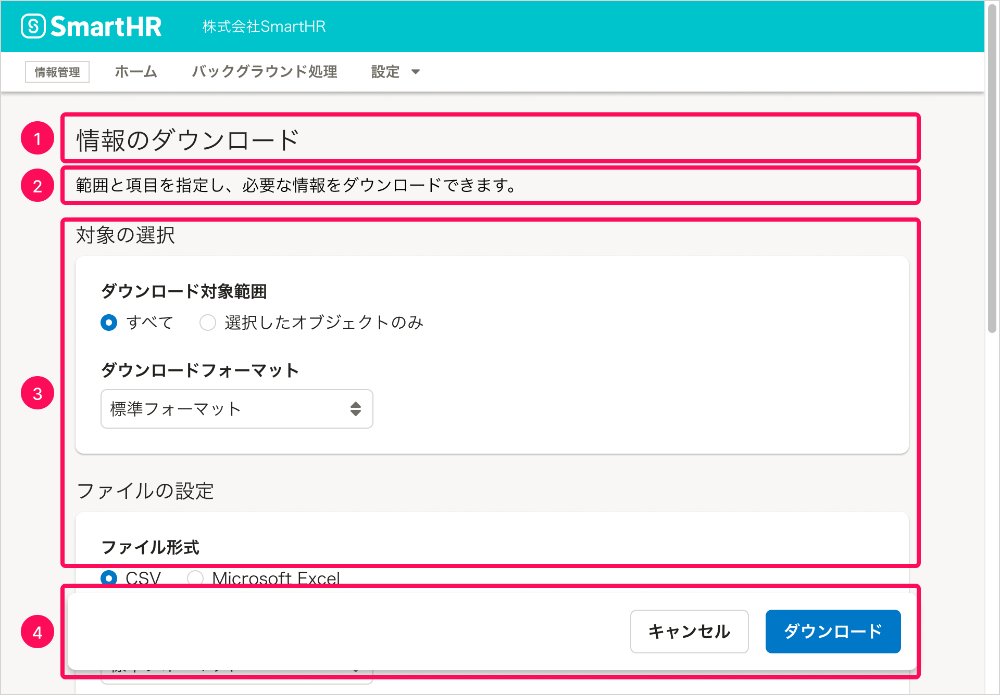

import { Image } from 'astro:assets'
import { Text } from 'smarthr-ui'
import DoAndDont from '@/components/article/DoAndDont.astro'

import imageUrlUpwardDont from './images/modal-ui_upward-navigation.png'
import imageUrlAccessibilityDo from './images/modal-ui_actiondialog_accessibility_error.png'
import imageUrlAccessibilityDont from './images/modal-ui_actiondialog_accessibility_disabled.png'

モード、モーダル、モードレスの概念と、SmartHRプロダクトにおけるモーダルなUIのパターンを定義しています。

## モード、モーダル、モードレスとは

プロダクトが特定のタスクを実行することに特化した状態になっているとき、この状態のことを「**モード（英：mode）**」、タスク完了のために特定のモードを提供するUIを「**モーダル（英：modal）なUI**」と呼びます。モーダルなUIでは、モードの目的であるタスクを完了するか、モードから抜け出す操作をするまで、他のタスクを実行できません。

逆に、特定のモードに切り替えることなくタスクを完了できるUIは「**モードレス（英：modeless）なUI**」と呼びます。

## 基本的な考え方

### モーダルなUIの使いどころ

SmartHRでは、プロダクトの中心的な画面はモードレスであるように設計しつつ、モードの提供が適切である場面ではモーダルなUIを使用しています。

モードの提供を検討する場面として、以下が挙げられます。

- オブジェクトの追加・編集
- オブジェクトの並べ替え
- データの取り込み・書き出し
- 破壊的な処理を実行する前の確認（[削除ダイアログ](/products/design-patterns/delete-dialog/)を参照）
- 長く複雑な一連の操作

一般的に、UIはなるべくモードレスであるように設計することが推奨されています。これは、モーダルなUIでは機能の全体像がわかりにくく、またユーザーが自由な手順で操作できないといった欠点があるためです。

一方で、特にSmartHRのような業務アプリケーションでは、あるデータの変更が広い範囲に影響を及ぼすことがあるため、ユーザーが操作をするたびに処理がモードレスに実行されるのは必ずしも望ましくありません。また、頻度が低いタスクや複雑な操作が必要なタスクの場合、手順を固定するなどして、ユーザーの操作の自由度を下げてでも安全性を高めることを優先することがあります。

## 種類

モーダルなUIの主なパターンとして、以下を挙げます。

- [モーダルダイアログ](#h3-2)
- [ページ全体を使ったモード](#h3-3)
- [ページの一部を使ったモード](#h3-4)
- [ステップを複数に分けたモード](#h3-5)

### モーダルダイアログ

モーダルなUIのうち、最も典型的なものが、ダイアログを使ったモードです。モーダルダイアログと呼びます。

SmartHR UIでは[ActionDialog](/products/components/dialog/action-dialog/)と[MessageDialog](/products/components/dialog/message-dialog/)の2種類があります。ユーザーに操作を求める場合はActionDialogを、メッセージを表示するだけでユーザーに操作を求めない場合はMessageDialogを利用します。

モーダルダイアログの表示中、ダイアログの裏側の領域はスクリム（幕）で隠されています。ダイアログを閉じるか、このモードの目的であるタスクを完了するまで、ダイアログ外の操作はできません。

なお、**モードレスなUI**としてダイアログを提供する場合は、[ModelessDialog](/products/components/dialog/modeless-dialog/)を使用します。

### ページ全体を使ったモード

表示したい情報が多い以下のような場合には、ページ全体を使ったモードを検討します。

- ダイアログのファーストビュー以外にも重要な情報が存在し、気づきづらい場合
- ダイアログにするとスクロール（特に横スクロール）が多く発生する場合

### ページの一部を使ったモード

モードに入る前のレイアウトと似たUIをモードのなかで提供したい場合、ページの一部を使ったモードを検討します。

例えば、[部署マスターの並べ替え機能](https://support.smarthr.jp/ja/help/articles/7e59f1f2-6df7-4c6c-9d84-fc7449a2a6d6/#%E9%83%A8%E7%BD%B2%E3%82%92%E4%B8%A6%E3%81%B9%E6%9B%BF%E3%81%88%E3%82%8B)では、[部署マスターの一覧画面](https://support.smarthr.jp/ja/help/articles/360036111074/)のレイアウトを維持したまま一部をモードにすることで、元々表示されていた部署マスターの一覧と同じ対象を操作しているという認知を促しています。

### ステップを複数に分けたモード
タスクの完了のために複数の操作が必要な場合には、モードのなかでステップを複数に分けることを検討します。

## 構成

[モーダルダイアログ（ActionDialog）](#h3-2)と[ページ全体を使ったモード](#h3-3)を例に、モーダルなUIの構成を示します。

モーダルなUIの多くは、次の要素で構成されます。

1. 現在のモードのタイトル
2. 説明
3. 入力要素
4. モードの操作ボタン

### 1. 現在のモードのタイトル

[見出しの書き方](/products/components/heading/#h3-5)にならって、このモードの目的であるタスクを簡潔に書きます。

サブタイトルは、タイトルだけでは表現できない場合をのぞき、原則として使いません。

### 2. 説明

機能概要や使い方、注意事項などを記載します。タイトルのすぐ後ろに限らず、必要に応じて入力要素の周辺に記載することもあります。

タイトルだけで説明として十分である場合は、別途の説明を省略できます。

### 3.  入力要素

タスクを実行するためにユーザーが操作する必要のある要素です。[FormControl](/products/components/form-control/)や[Fieldset](/products/components/fieldset/)を使用します。

[削除ダイアログ](/products/design-patterns/delete-dialog/)のように「処理実行の前の確認」を目的としたモードの場合、入力要素がないこともあります。

### 4. モードの操作ボタン

次の2つのアクションのためのボタンを配置します。

- タスクを完了してモードを終えるアクション
  - タスクを完了するアクションは[Primaryボタン](/products/components/button/#h3-1)を使います。
  - [削除ダイアログ](/products/design-patterns/delete-dialog/)など、危険なアクションの完了には[Dangerボタン](/products/components/button/#h3-3)を使います。
  - ボタンのラベルは、モードの目的であるタスクを完了するアクションであることがわかる動詞を用います。
- タスクを中断してモードから抜け出すアクション
  - タスクを中断するアクションのボタンラベルは`キャンセル`とします。
  - ユーザーが操作した内容は、モードから抜け出した際に初期化されます（自動保存をしている場合を除く）。

どちらのボタンであっても、ボタンを押すとモードが解除され、元の画面に戻ります。

#### ページ全体を使ったモードの場合

基本的に[BottomFixedArea](/products/components/bottom-fixed-area/)を使用してボタンを配置します。ただし、モードに入らないサイドバーがあるなど、BottomFixedAreaが不適切なときは、[FloatArea](/products/components/float-area/)を使用します（例：[共通設定のアクションビュー](/products/design-patterns-core-features/main-admin/)）。

また、タスクを中断して元のページに戻る操作は［キャンセル］ボタンが担います。そのため、基本的に[UpwardLink](/products/components/text-link/upward-link/)は配置しません。

<DoAndDont type="dont">
  <Image slot="img" src={imageUrlUpwardDont} alt="Dont" />
  <Text slot="label">「上に戻るリンク」と［キャンセル］ボタンが両方配置されている。</Text>
</DoAndDont>

## エラー状態のアクセシビリティ

モーダルなUIにおいては、「必須の入力要素が空欄になっている」などの理由でタスクを完了する条件が満たされていない場合であっても、原則として**完了ボタンは無効化せず、ユーザーに完了ボタンを押させた上で、エラーを返す**ようにします。

これは、完了のためのボタンを無効化すると、以下の理由によりアクセシビリティやユーザビリティが低下する可能性があるためです。

- 無効化されたボタンはキーボード操作でフォーカスを当てられない
- どの入力要素が、どんな理由で完了条件を満たしていないのかが伝わりにくい

<DoAndDont type="do">
  <Image slot="img" src={imageUrlAccessibilityDo} alt="必須項目が空欄のまま完了ボタンを押すとエラーが返り、どの項目にどんな問題があるかが示される。" />
  <Text slot="label">必須項目が空欄のまま完了ボタンを押すとエラーが返り、どの項目にどんな問題があるかが示される。</Text>
</DoAndDont>

<DoAndDont type="dont">
  <Image slot="img" src={imageUrlAccessibilityDont} alt="必須条件を満たさない限り完了ボタンが無効化され押せない。" />
  <Text slot="label">必須条件を満たさない限り完了ボタンが無効化され押せない。</Text>
</DoAndDont>

## 参考文献

- [サブミット (送信) ボタンをデフォルトで無効化しない | Accessible & Usable](https://accessible-usable.net/2021/10/entry_211014.html)
