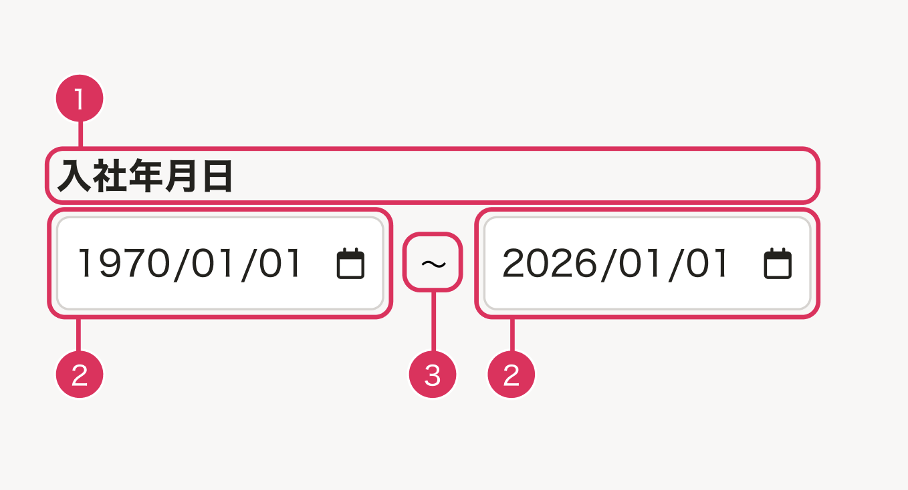
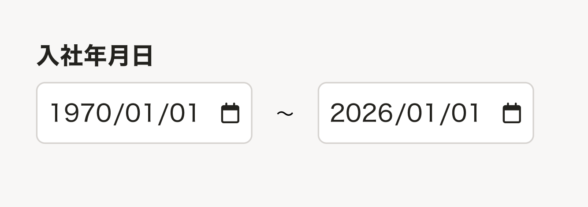
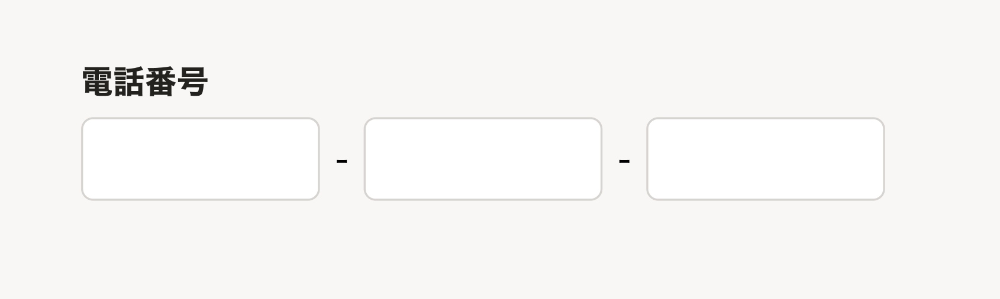

1つのラベルに対して複数の入力要素が並ぶ入力フィールドのルールを定義します。

## 用語定義

| 用語 | 説明 |
| --- | --- |
| 複数入力フィールド | 1つの可視ラベルに対して、複数の入力要素が並んでいるUI。<br/>例: 電話番号（3分割）、日付の期間指定（前〜後）など |
| 可視ラベル | 画面上に表示されているラベルテキスト。<br/>例:「年齢」「電話番号」「面談実施日」など |
| アクセシブルネーム | 支援技術（スクリーンリーダーなど）がUI要素を識別するために使用する名前 |
| 補助テキスト | 各入力要素を区別するためにアクセシブルネームに追加するテキスト。<br/>例:「開始日」「最初の4桁」など |


## 基本的な考え方

複数入力フィールドは、input が分かれているほうが慣例的な場合や、書類のフォーマットに合わせたい場合、または複数の入力項目をセットとして扱いたい場合に採用します。

[WIP]

### アクセシビリティ

入力要素には、要素を特定するための個別のアクセシブルネームが必要です。複数の入力がある場合は、以下の対応で個別の名前を設定します。

- 入力要素のアクセシブルネームを **「可視ラベル + 補助テキスト」** の形式で設定し、支援技術の利用者が入力要素の役割を理解できるようにする
- 視覚的な区切り文字や条件文（「〜」「歳以上」「-」など）は `aria-hidden="true"` で装飾テキストとして扱い、アクセシブルネームには含めない

## 構成

複数入力フィールドは以下の3つの要素で構成されます。

1. ラベル
2. 入力要素
3. 区切り文字や条件文



## 種類

複数入力フィールドのユースケースは以下の2パターンに大別されます。

1. 2つの入力欄で範囲の開始と終了を指定するパターン
2. 入力を桁数で分割するパターン


### 1: 2つの入力欄で範囲の開始と終了を指定するパターン



#### 例

- 日付の期間:`入社年月日 開始日`〜`入社年月日 終了日`
- 年齢の範囲:`年齢 最小`〜`年齢 最大`
- 時刻の範囲:`勤務時間 開始`〜`勤務時間 終了`

#### アクセシビリティ

1. 入力要素のアクセシブルネームは「可視ラベルのテキスト + 補助テキスト」となるようにする
2. 視覚的な条件文（「歳以上」「〜」「から」「まで」など）は `aria-hidden="true"` で装飾テキストとして表示する

補助テキストは以下のルールを参考にしつつ、コンテキストに合わせたテキストを採用します。

| データの種類 | 補助テキスト（開始側） | 補助テキスト（終了側） |
| --- | --- | --- |
| 日付 | 開始日 | 終了日 |
| 時刻 | 開始 | 終了 |
| 年齢 | 最小 | 最大 |
| 数値 | 最小 | 最大 |

### 2: 入力を桁数で分割するパターン



電話番号や被保険者番号など、入力を桁数で分割するパターンです。

#### 例

- 電話番号（3分割）: 03-1234-5678
- 郵便番号（2分割）: 100-0001
- 雇用保険被保険者番号（3分割）: 4桁-6桁-1桁
- 基礎年金番号（2分割）: 4桁-6桁

#### アクセシビリティ

1. 入力要素のアクセシブルネームは **「可視ラベル + 桁の位置を示す補助テキスト」** となるようにする
2. 視覚的な区切り文字（「-」など）は `aria-hidden="true"` で装飾テキストとして扱う

**入力欄が2つの場合:**

| 位置 | 補助テキスト |
| --- | --- |
| 1個目 | 最初のN桁 |
| 2個目 | 残りのM桁 |

**入力欄が3つ以上の場合:**

| 位置 | 補助テキスト |
| --- | --- |
| 1個目 | 最初のA桁 |
| 2〜N-1個目 | A+1からB桁目 |
| N個目 | 最後のC桁 |

**例外: 電話番号**

電話番号は地域によって桁数が異なるため、桁数ではなく意味で区別します。

| 位置 | 補助テキスト |
| --- | --- |
| 1つ目 | 市外局番 |
| 2つ目 | 市内局番 |
| 3つ目 | 個別番号 |


## 実装上の注意

### Fieldset + FormControl コンポーネントを使用する

SmartHR UI コンポーネントには以下の実装をすることで、各入力要素のアクセシブルネームが自動的に「可視ラベル + 補助テキスト」の形式になります。

- 可視ラベル: `Fieldset` コンポーネントの `legend` を使用する
- 補助テキスト: `FormControl` コンポーネントの `label: { text: "補助テキスト", unrecommendedHide: true }` を使用する


```tsx
<Fieldset legend="入社年月日">
  <FormControl label={{
    "text": "開始日",
    "unrecommendedHide": true
  }}>
    <Input type="date" name="start-date"/>
  </FormControl>
  <FormControl label={{
    "text": "終了日",
    "unrecommendedHide": true
  }}>
    <Input type="date" name="end-date"/>
  </FormControl>
</Fieldset>
```


## 参考文献

- [入力する内容や、操作がラベルとして表示されている | ウェブアクセシビリティ簡易チェックリスト | SmartHR Design System](https://smarthr.design/accessibility/check-list/label/)
- [フォームパーツにアクセシブルネームがある | ウェブアクセシビリティ簡易チェックリスト | SmartHR Design System](https://smarthr.design/accessibility/check-list/accessible-name/)
- [ARIA9: Using aria-labelledby to concatenate a label from several text nodes | WAI | W3C](https://www.w3.org/WAI/WCAG21/Techniques/aria/ARIA9)
