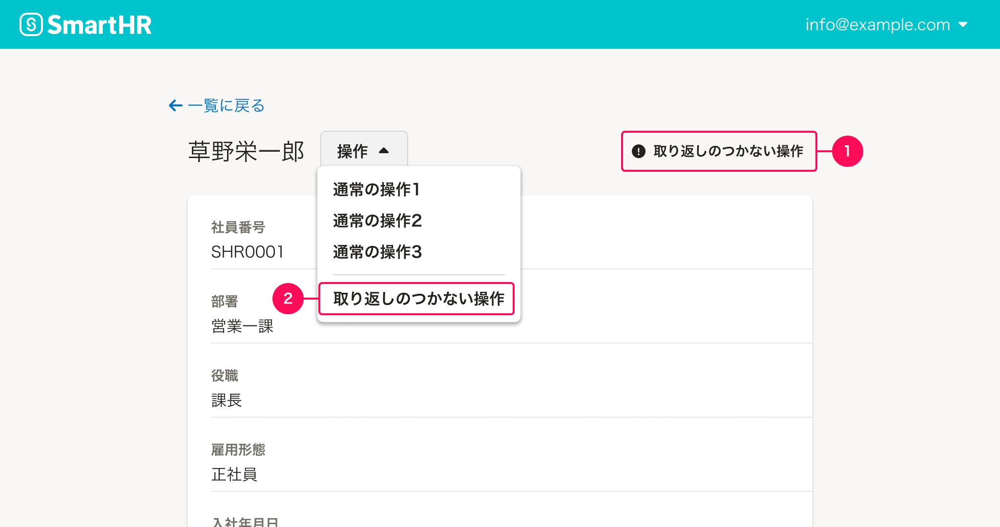
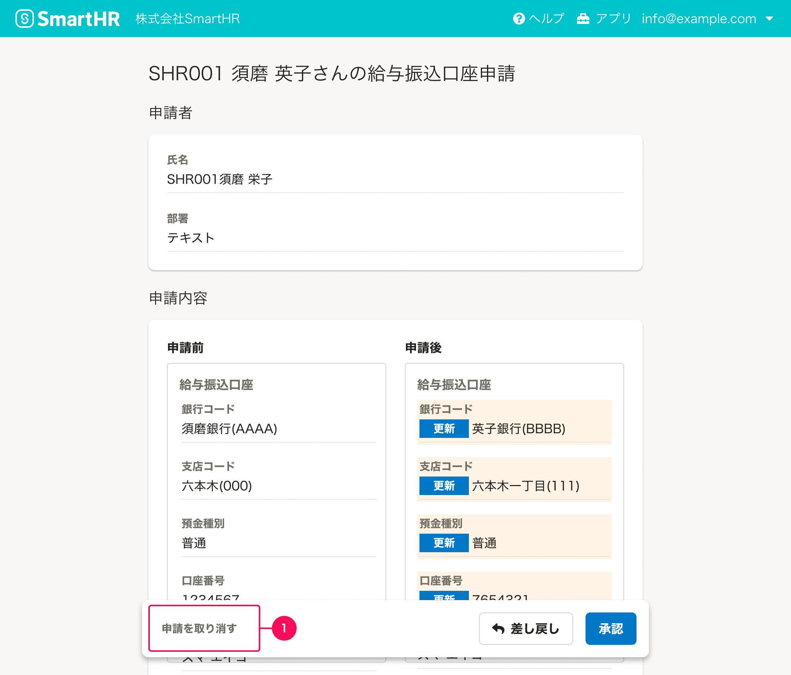

ユーザーの操作をシステムが実行する前にワンクッション必要な操作の基準を定義しています。

システムが事前に確認や注意、説明をユーザーに促すプロセスを経へて、即時実行させない操作のことを「ワンクッション必要な操作」としています。

## 基本的な考え方

ユーザーの誤操作によってデータ損失を招く場合や、日常的な操作でも対象人数が多く対象になっていない人を含めてしまったり、変更するステータスを間違える場合を避けるために、操作の結果何が起こるのかを事前にユーザーが意識できるように、ワンクッションをはさんで十分に配慮しましょう。

実際に検討する場合には以下のような優先度で考えてください。

1. ワンクッション必要な操作に該当する場合は、ダイアログやページをはさめるかを考慮してください。
2. ダイアログやページを挟むだけでなくワンクッション必要な操作ボタンのレイアウトや装飾で視覚的優先度が下げられないか検討してください。

## 種類

以下は、ワンクッション必要な操作のユースケースです。

- 登録されたデータの削除
- 設定のリセット
- 復元方法がない、または復元に複雑な手順を要するステータスの変更
- 多くのユーザーを対象とした情報の一括更新
- 情報や書類を多くのユーザーを対象とした依頼・配付
- 特定のオブジェクトの公開や開始
- 情報のダウンロード

## デザインパターン

### 視覚的表現で目立ちにくくする

#### レイアウトでコントロールする

ワンクッション必要な操作をボタンなどのコンポーネントで提供する際は、ユーザーの誤操作を防ぐために可能な限りメイン操作領域の遠くに置く（1）、または領域を変更して置くこと（2）を推奨します。

#### 装飾でコントロールする

レイアウト上メインの操作領域にあるが、ユーザーの誤操作を防ぐためにボタンの装飾（1）を省くことで視覚的優先度を下げます。
Buttonの[Text](/products/components/button/#h3-4)を使い、サイズ小にして目立ちにくくします。

ただし、装飾だけに頼らず[視線誘導](products/design-patterns/visual-guidance)やレイアウトなどから判断してください。

### モーダルダイアログをはさむ

#### 削除ダイアログ

ワンクッション必要な操作をユーザーが実行した際は、その操作によって何が起こるのかを事前に伝えることを検討します。[削除ダイアログ](/products/design-patterns/delete-dialog/)をはじめとした確認のダイアログなどを表示します。

#### 確認ダイアログ

確認ダイアログでは、対象となる件数や操作の実行で何が起こるかを表示している。

CSVダウンロードの確認ダイアログでは、操作の実行で何が起こるかを表示している。

### 説明をはさむ

多くのユーザーを対象とした情報の一括更新を実行する際には、更新するために必要な手順の説明とそれによって何が起こるかを伝える必要があります。伝えるべき情報量を考慮してページを使用します。

### ダイアログをはさめずワンクッションおけない

「[視覚的表現で目立ちにくくする](#h3-0)」例のようにレイアウトの差をどうしてもつけられない場合はDangerボタンなどのユーザーへ警告を伝えるボタンを設置しましょう。

ただし、一覧の操作セルなど、ファーストビューですぐに触れる領域への「ワンクションおけない操作」の設置や、Dangerボタンを連続して設置することは通常**推奨しません。**

