import DoAndDont from '@/components/article/DoAndDont.astro'
import ImgWithDesc from '@/components/article/ImgWithDesc.astro'
import Grid from '@/components/article/Grid.astro'
import Caption from './_components/Caption.astro'
import { Base, BaseColumn, Button, Cluster, FormControl, Heading, Input, NotificationBar, Stack, Text, ResponseMessage } from 'smarthr-ui'

ビューポート内にどのような要素をどのような順序で配置するかをページレイアウトと呼びます。
SmartHRプロダクトの基本的なページレイアウトのパターンをまとめています。

## 基本的な考え方

SmartHR全体で一貫性のあるページレイアウトを提供することで、ユーザーはレイアウトを都度学習することなく経験に基づいてUIを予測しながらアプリケーションを利用できます。

適切なページレイアウトの設計には、ユーザーの業務とオブジェクトモデルの理解が必要です。
ユーザーの利用目的に沿って、オブジェクトの関係性や重要度を表すように設計してください。

### リード文を適切に設定する

リード文とは、ページの目的や内容を簡潔に伝えるためのテキストのことです。[見出し領域](#h4-5)にリード文を表示することで、ユーザーはページ内のすべての要素を確認することなく、ページの目的や内容を素早く理解できます。

SmartHRで提供するページでは、リード文を見出し領域に表示してください。ただし、次のような画面ではリード文は不要です。

- ユーザーが作成したオブジェクトの詳細画面

### ページ内の要素同士を適切にグルーピングする

[視覚的グルーピング](/products/design-patterns/visual-grouping/)を参照して、ページ内の要素を適切にグルーピングしてください。

### ページが過度に長くなることを避ける

多くの情報を1ページに表示するとページが縦方向に長くなってしまいます。縦方向に長いページでは、全体像の把握が難しく、目的の情報への到達が困難になります。特にモバイルでは画面の横幅が狭いため、この傾向が顕著です。

ページが縦方向に長くなってしまう場合には次のような対処を検討してください。

#### コンテンツを省略表示する

すべてのコンテンツを最初から表示せず、一部を省略して表示します。あわせて、[Disclosure](/products/components/disclosure/)を使うことでユーザーが必要に応じてコンテンツをすべて表示できるようにします。

<Grid>
  <ImgWithDesc description="テキストを省略した場合の初期表示">
    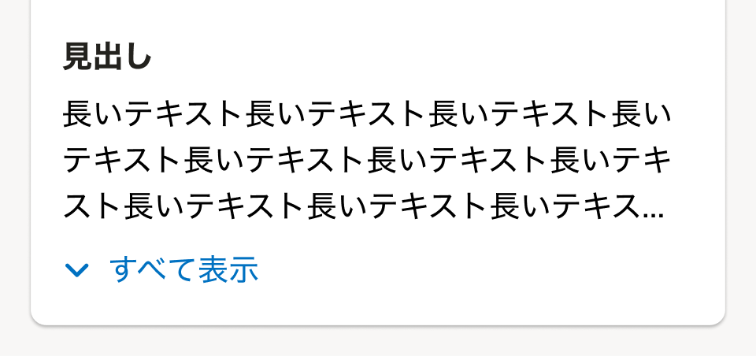
  </ImgWithDesc>

  <ImgWithDesc description="省略されたテキストを展開した場合の表示">
    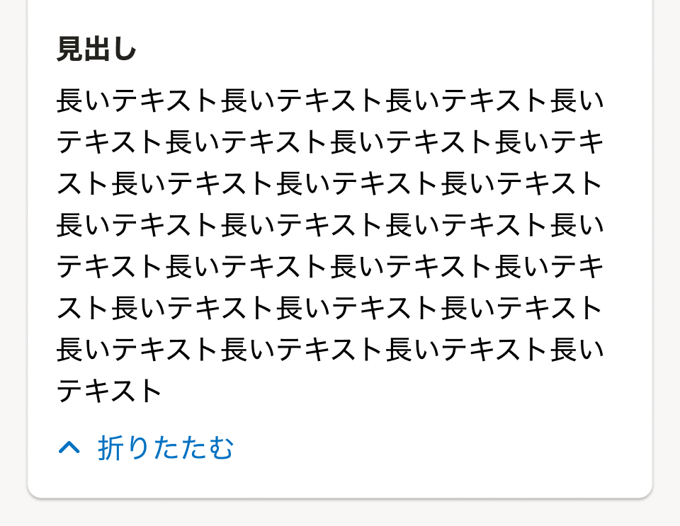
  </ImgWithDesc>
</Grid>

#### ページをナビゲーションで分割する

[TabBar](/products/components/tab-bar/)、[SideNav](/products/components/side-nav/)、[SideMenu](/products/components/side-menu/)といった[ナビゲーション](#h4-4)を使ってページを分割します。

TabBarやSideNavを使った例は、[視覚的グルーピング](/products/design-patterns/visual-grouping/#h3-7)を参照してください。

### モバイル

#### 複数カラムのレイアウトを避ける

画面の幅によってコンテンツの可読性を保てなくなるため、モバイルでは複数カラムのレイアウトを避けましょう。代わりに垂直方向に積み上げるか、複数の画面に分けるなど、1度に表示する情報量を減らしてください。

垂直方向に積み上げて解決ができない場合は、アダプティブなレイアウトを検討してください。

<Cluster>
  <DoAndDont type="dont" width="320px">
    <Text slot="label">コンテンツが読みにくく、構造を把握しにくい。</Text>
    <div slot="img">
```tsx editable hideCode background=BACKGROUND
<Sidebar>
  <Base padding={1} style={{ width: '1rem' }}>
    <Stack gap={0.5}>
      <Heading type="blockTitle">複数カラムのレイアウトを避ける</Heading>
      <p>折り返しの多すぎるコンテンツの理解は難しいです。</p>
    </Stack>
  </Base>
  <Base padding={1} style={{ flexGrow: 1 }}>
    <Stack>
      <p>構造関係の理解も難しくなります。</p>
      <p>DOMはそのままに、適切な幅で折り返し垂直方向に積み上げるなど代替レイアウトを検討してください。</p>
    </Stack>
  </Base>
</Sidebar>
```
    </div>
  </DoAndDont>

  <DoAndDont type="do" width="320px">
    <Text slot="label">垂直方向に積み上げると最低限の可読性を保てます。</Text>
    <div slot="img">
```tsx editable hideCode background=BACKGROUND
<Stack>
  <Base padding={1}>
    <Stack gap={0.5}>
      <Heading type="blockTitle">複数カラムのレイアウトを避ける</Heading>
      <p>折り返しの多すぎるコンテンツの理解は難しいです。</p>
    </Stack>
  </Base>
  <Base padding={1}>
    <Stack>
      <p>構造関係の理解も難しくなります。</p>
      <p>DOMはそのままに、適切な幅で折り返し垂直方向に積み上げるなど代替レイアウトを検討してください。</p>
    </Stack>
  </Base>
</Stack>
```
    </div>
  </DoAndDont>
</Cluster>

#### 水平方向のスクロールや2次元（垂直・水平方向）スクロールを避ける

水平方向のスクロールや2次元（垂直・水平方向）スクロールは、コンテンツの理解を妨げます。画面幅からコンテンツがあふれる場合は、折り返してください。

ただし、画像や動画・地図など2次元であることが情報を伝える上で重要な場合は、その限りではありません。

## 構成

エラー画面を除き、SmartHRのページは以下の要素と領域によって構成されます。

- ヘッダー（[AppHeader](/products/components/app-header/)）
- コンテナ領域（[Container](/products/components/layout/container/)）
    - ナビゲーション（任意）
    - 見出し領域
    - コンテンツ領域

### ヘッダー

[AppHeader](/products/components/app-header/)を画面の最上部に配置します。

### コンテナ領域

[Container](/products/components/layout/container/)コンポーネントを使います。コンテナ領域の横幅はサイズ（`size`props）で指定します。サイズの選び方は[Container/コンテナの大きさ](/products/components/layout/container/#h3-0)を参照してください。

コンテナ領域内のレイアウトのパターンは、[種類](#h2-3)を参照してください。

#### ナビゲーション

必要に応じて、ページ内で複数のビューを切り替えるナビゲーションを表示できます。[TabBar](/products/components/tab-bar/)や[SideNav](/products/components/side-nav/)、[SideMenu](/products/components/side-menu/)を使います。

ナビゲーションを表示する場合のレイアウトは、[サイドナビゲーションとコンテンツの2カラム](#h3-12)や、[コレクションとシングルの2カラム](#h3-13)、また、[視覚的グルーピング](/products/design-patterns/visual-grouping/#h3-7)を参照してください。

#### 見出し領域

見出し領域には画面タイトル（[PageHeading](/products/components/heading/page-heading/)）とリード文、それに関連する情報や操作を表示します。

基本的な考え方「[リード文を適切に設定する](#h3-0)」も参照してください。

#### コンテンツ領域

コンテンツ領域には、ページの内容となる伝えたい情報や操作を表示します。主に[セクション](/products/design-patterns/visual-grouping/#h3-5)を表示します。

## レイアウト

### 余白の取り方

[余白の取り方](/products/design-patterns/spacing-layout-pattern/)に従います。

## 種類

代表的なページレイアウトの種類は以下のとおりです。
モーダルなページについては[モーダルなUI](/products/design-patterns/modal-ui/)を、エラー画面については[ErrorScreen](/products/components/error-screen/)を参照してください。

- コレクション（テーブル）
- コレクション（リスト）
- シングル（1カラム）
- シングル（2カラム）
- シングル（ベースのある見出し領域）
- サイドナビゲーションとコンテンツの2カラム
- コレクションとシングルの2カラム

### コレクション（テーブル）

[よくあるテーブル](/products/design-patterns/smarthr-table/)を用いてオブジェクトを一覧表示するパターンです。

オブジェクトを一覧表示するページで利用します。オブジェクト同士を属性情報で比較するユースケースがある場合に有効です。

見出し領域とよくあるテーブルで構成されます。

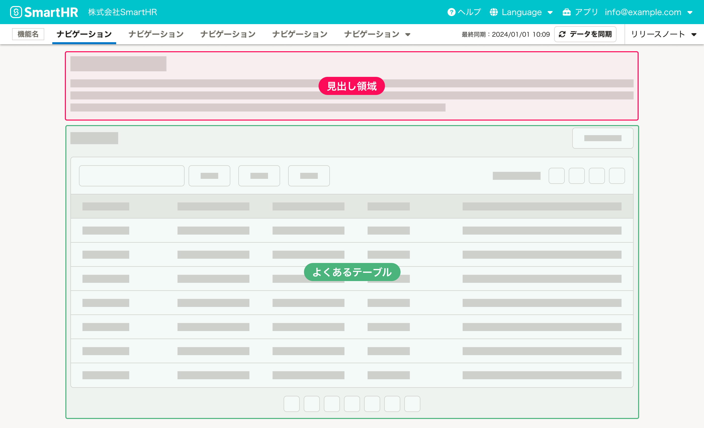

実装例：

```tsx editable hideCode background=DOT canvas=1400 withStyled
const CollectionTableLayout = () => {
  const pagination = {
    currentPage: 1,
    limitValue: 25,
    totalCount: 100,
    totalPages: 4,
  }
  const sampleObjects = [...Array(10).fill(0)].map((_, i) => ({
    id: `${i}`,
    href: '#',
    empCode: `SHR${`${i}`.padStart(3, '0')}`,
    name: `須磨 英子`,
    status: 'ステータス',
  }))

  const { totalPages, currentPage, totalCount, limitValue } = pagination
  const isInitialState = totalCount === 0
  const hasNoSearchResult = totalCount === 0

  return (
    <div className="shr-bg-background" style={{ minHeight: '100svh', width: '100%' }}>
      <div className="shr-z-1 shr-relative">
        <AppHeader
          appName="すごいプロダクト"
          userInfo={{ empCode : "001", firstName : "須磨", lastName : "栄子", }}
          navigations={[
            { children: "ダッシュボード", href: "#", current: true },
            { children: "設定", childNavigations: [
              { children: "マスター設定", href: "#" },
            ]},
          ]}
        />
      </div>
      <NotificationBar type="success" bold onClose={() => {}} className="shr-sticky shr-top-0 shr-z-1">
        オブジェクトの作成に成功しました。
      </NotificationBar>
      <Container>
        <Stack gap={2}>
          <Stack gap={1.5}>
            <Stack>
              <Cluster align="center" gap={1}>
                <PageHeading>ページタイトル</PageHeading>
                <DropdownMenuButton trigger="操作">
                  <Button>オブジェクトの削除</Button>
                </DropdownMenuButton>
              </Cluster>
              <p>ページの説明。詳しくは<HelpLink href="/" target="_blank">ヘルプページ</HelpLink>を参照してください。</p>
            </Stack>
            <InformationPanel heading="オブジェクトの処理中です" type="sync">
              オブジェクトをバックグラウンド処理で処理中です。
            </InformationPanel>
          </Stack>
          <Section>
            <Stack gap={1}>
              <Cluster align="center" justify="space-between" gap={0.5}>
                <Heading>オブジェクト一覧</Heading>
                <Button prefix={<FaCirclePlusIcon />}>オブジェクトを追加</Button>
              </Cluster>

              <Stack gap={1.5}>
                <Base>
                  {!isInitialState && (
                    <Cluster justify="space-between" align="center" className="shr-p-1">
                      <form onSubmit={(e) => e.preventDefault()}>
                        <Cluster align="center" gap={1}>
                          <Cluster gap={0.5}>
                            <SearchInput tooltipMessage="オブジェクト名で検索できます。" name="search" />
                            <Button type="submit">検索</Button>
                          </Cluster>
                          <FilterDropdown onApply={() => null}>絞り込みの中身</FilterDropdown>
                          <Button type="submit" prefix={<FaCloudArrowDownIcon />}>
                            ダウンロード
                          </Button>
                        </Cluster>
                      </form>
                      {totalCount > 0 && (
                        <Cluster gap={1} align="center">
                          <PageCounter start={1 + (currentPage - 1) * limitValue} end={currentPage * limitValue} total={totalCount} />
                          <Pagination current={currentPage} total={totalPages} withoutNumbers onClick={() => null} />
                        </Cluster>
                      )}
                    </Cluster>
                  )}

                  <Table reel rounded="bottom">
                    <thead>
                      <tr>
                        <ThCheckbox name="allRowCheckbox" disabled={isInitialState || hasNoSearchResult} />
                        <Th>ステータス</Th>
                        <Th>社員番号</Th>
                        <Th>氏名</Th>
                        <Th>操作</Th>
                      </tr>
                    </thead>
                    {isInitialState ? (
                      <EmptyTableBody>
                        <Stack align="center">
                          <span>オブジェクトはまだ登録されていません。</span>
                          <div>
                            <Button size="S" prefix={<FaCirclePlusIcon />}>
                              項目を追加
                            </Button>
                          </div>
                        </Stack>
                      </EmptyTableBody>
                    ) : hasNoSearchResult ? (
                      <EmptyTableBody>
                        <p>
                          <span>お探しの条件に該当するオブジェクトはありません。</span>
                          <br />
                          <span>別の条件をお試しください。</span>
                        </p>
                      </EmptyTableBody>
                    ) : (
                      <tbody>
                        {sampleObjects.map(({ id, status, href, empCode, name }) => {
                          const ariaLabelledBy = `name-${id}`
                          return (
                            <tr key={id}>
                              <TdCheckbox name="tableCheckbox" aria-labelledby={ariaLabelledBy} />
                              <Td contentWidth="1px">
                                <StatusLabel>{status}</StatusLabel>
                              </Td>
                              <Td>{empCode}</Td>
                              <Td id={ariaLabelledBy}><TextLink href={href}>{name}</TextLink></Td>
                              <Td contentWidth="1px">
                                <Cluster inline className="shr-min-w-max">
                                  <Button size="S" prefix={<FaPenIcon />}>
                                    操作1
                                  </Button>
                                  <Button size="S" prefix={<FaCopyIcon />}>
                                    操作2
                                  </Button>
                                  <Button size="S" prefix={<FaTrashCanIcon/>}>
                                    操作3
                                  </Button>
                                </Cluster>
                              </Td>
                            </tr>
                        )})}
                      </tbody>
                  )}
                  </Table>
                </Base>
                {totalPages > 1 && !isInitialState && !hasNoSearchResult && (
                  <Center>
                    <Pagination current={currentPage} total={totalPages} onClick={() => null} />
                  </Center>
                )}
              </Stack>
            </Stack>
          </Section>

        </Stack>
      </Container>
    </div>
  )
}

render(<CollectionTableLayout />)
```

#### モバイル

コレクション（テーブル）は広い横幅を必要とするため、画面の横幅が狭いモバイルには適していません。代わりに、[コレクション（リスト）](#h3-8)を検討してください。

### コレクション（リスト）

[よくあるリスト](/products/design-patterns/smarthr-list/)を用いてオブジェクトを一覧表示するパターンです。

オブジェクトを一覧表示するページで利用します。狭い領域（主にモバイル）でオブジェクトを一覧表示する場合に有効です。

見出し領域とよくあるリストで構成されます。

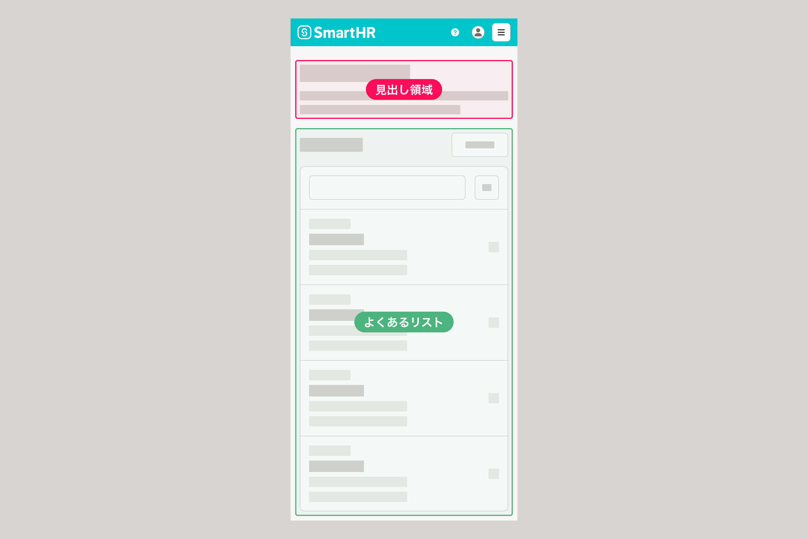

#### 利用例

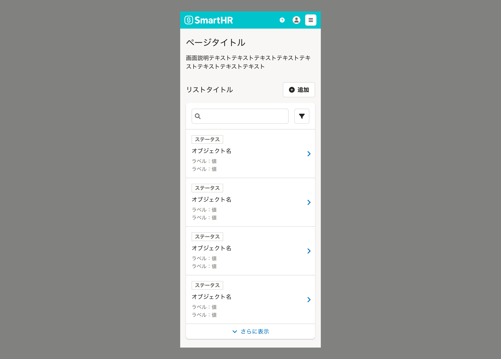

### シングル（1カラム）

オブジェクトの情報を「任意のまとまり（セクション）」に分類し、1カラムで表示するパターンです。

オブジェクトを詳細表示するページで利用します。オブジェクトの情報がすべて並列な関係にある場合に利用してください。

見出し領域と複数のセクションで構成されます。

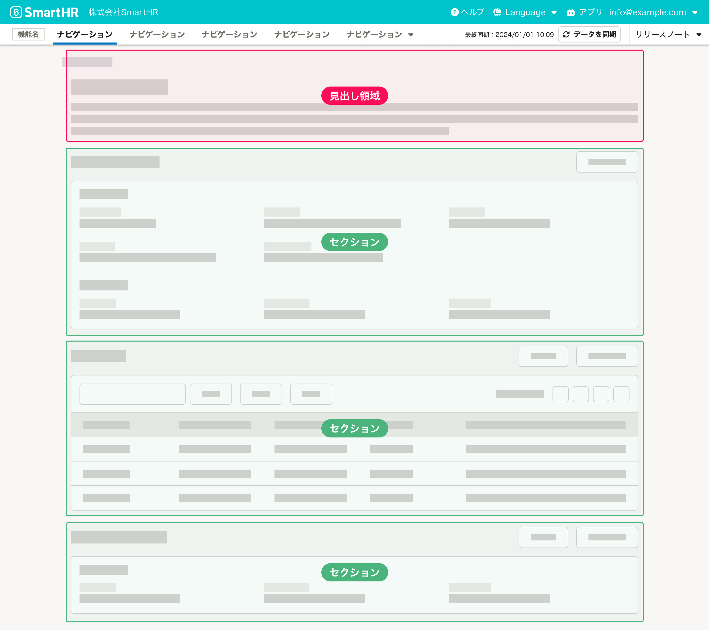

#### 実装例

```tsx editable hideCode background=DOT canvas=1400 withStyled
const SingleOneColumnLayout = () => {
  const pagination = {
    currentPage: 1,
    limitValue: 10,
    totalCount: 100,
    totalPages: 10,
  }
  const sampleObjects = [...Array(10).fill(0)].map((_, i) => ({
    id: `${i}`,
    href: '#',
    empCode: `SHR${`${i}`.padStart(3, '0')}`,
    name: `須磨 英子`,
    status: 'ステータス',
    department: `営業部`,
    position: `部長`,
    employmentType:`正社員`,
    hireDate: `2012/12/12`,
  }))

  const { totalPages, currentPage, totalCount, limitValue } = pagination
  const isInitialState = totalCount === 0
  const hasNoSearchResult = totalCount === 0
  return (
    <div className="shr-bg-background" style={{ minHeight: '100svh', width: '100%' }}>
      <div className="shr-z-1 shr-relative">
        <AppHeader
          appName="機能名"
          tenants={[{ id: 'smarthr', name: '株式会社SmartHR' }]}
          currentTenantId="smarthr"
          helpPageUrl="#"
          locale={{ onSelectLocale: () => null }}
          features={[
            { id: 'app', name: 'アプリ', url: '#', favorite: true },
          ]}
          userInfo={{ empCode: '001', email: 'info@example.com', firstName: '須磨', lastName: '栄子' }}
          navigations={[
            { children: 'ナビゲーション', href: '#', current: true },
            { children: 'ナビゲーション', href: '#' },
            { children: 'ナビゲーション', href: '#' },
            { children: 'ナビゲーション', href: '#' },
            {
              children: 'ナビゲーション',
              childNavigations: [
                { children: 'マスター設定', href: '#' },
              ],
            },
          ]}
          desktopNavigationAdditionalContent={
            <>
              <span>最終同期：2024/01/01 10:09</span>
              <Button size="S" prefix={<FaArrowsRotateIcon />}>
                データを同期
              </Button>
            </>
          }
          releaseNote={{
            indexUrl: '#',
            links: [{ title: 'リリースノート', url: '#' }],
          }}
        />
      </div>
      <Container>
        <Stack gap={2}>
          <Stack gap={1.5}>
            <UpwardLink href="#">一覧に戻る</UpwardLink>
            <Stack gap={1}>
              <Cluster align="center" justify="space-between">
                <div className="shr-inline-black">
                  <StatusLabel style={{ verticalAlign: 'text-bottom', marginInlineEnd: '0.5rem' }}>ステータス</StatusLabel>
                  <PageHeading className="shr-inline">ページタイトル</PageHeading>
                </div>
                <Cluster>
                  <Button>ボタン</Button>
                  <Button>ボタン</Button>
                  <Button>ボタン</Button>
                </Cluster>
              </Cluster>
              <p>ページの説明。詳しくは<HelpLink href="/" target="_blank">ヘルプページ</HelpLink>を参照してください。</p>
            </Stack>
          </Stack>
          <Stack gap={1}>
            <Cluster align="center" justify="space-between" gap={0.5}>
              <Heading>セクションタイトル</Heading>
              <Button>ボタン</Button>
            </Cluster>
            <Base padding={1.5}>
              <Stack gap={1.5}>
                <Stack gap={1}>
                  <Heading type="blockTitle">ブロックタイトル</Heading>
                  <DefinitionList>
                    <DefinitionListItem maxColumns={3} term="項目">内容</DefinitionListItem>
                    <DefinitionListItem maxColumns={3} term="項目">内容</DefinitionListItem>
                    <DefinitionListItem maxColumns={3} term="項目">内容</DefinitionListItem>
                    <DefinitionListItem maxColumns={3} term="項目">内容</DefinitionListItem>
                    <DefinitionListItem maxColumns={3} term="項目">内容</DefinitionListItem>
                    <DefinitionListItem maxColumns={3} term="項目">内容</DefinitionListItem>
                  </DefinitionList>
                </Stack>
                <Stack gap={1}>
                  <Heading type="blockTitle">ブロックタイトル</Heading>
                  <DefinitionList>
                    <DefinitionListItem maxColumns={3} term="項目">内容</DefinitionListItem>
                    <DefinitionListItem maxColumns={3} term="項目">内容</DefinitionListItem>
                    <DefinitionListItem maxColumns={3} term="項目">内容</DefinitionListItem>
                  </DefinitionList>
                </Stack>
              </Stack>
            </Base>
          </Stack>
          <Stack gap={1}>
            <Cluster align="center" justify="space-between" gap={0.5}>
              <Heading>セクションタイトル</Heading>
              <Button prefix={<FaCirclePlusIcon />}>追加</Button>
            </Cluster>
            
            <Stack gap={1.5}>
              <Base>
                {!isInitialState && (
                  <Cluster justify="space-between" align="center" className="shr-p-1">
                    <form onSubmit={(e) => e.preventDefault()}>
                      <Cluster align="center" gap={1}>
                        <Cluster gap={0.5}>
                          <SearchInput tooltipMessage="社員番号、氏名で検索できます。" name="search" />
                          <Button type="submit">検索</Button>
                        </Cluster>
                        <FilterDropdown onApply={() => null}>絞り込みの中身</FilterDropdown>
                        <Button type="submit" prefix={<FaCloudArrowDownIcon />}>ダウンロード</Button>
                      </Cluster>
                    </form>
                    {totalCount > 0 && (
                      <Cluster gap={1} align="center">
                        <PageCounter start={1 + (currentPage - 1) * limitValue} end={currentPage * limitValue} total={totalCount} />
                        <Pagination current={currentPage} total={totalPages} withoutNumbers onClick={() => null} />
                      </Cluster>
                    )}
                  </Cluster>
                )}

                <Table reel rounded="bottom">
                  <thead>
                    <tr>
                      <ThCheckbox name="allRowCheckbox" disabled={isInitialState || hasNoSearchResult} />
                      <Th>ステータス</Th>
                      <Th>社員番号</Th>
                      <Th>氏名</Th>
                      <Th>部署</Th>
                      <Th>役職</Th>
                      <Th>雇用形態</Th>
                      <Th>入社日</Th>
                    </tr>
                  </thead>
                  {isInitialState ? (
                    <EmptyTableBody>
                      <Stack align="center">
                        <span>社員はまだ登録されていません。</span>
                        <Button size="S" prefix={<FaCirclePlusIcon />}>項目を追加</Button>
                      </Stack>
                    </EmptyTableBody>
                  ) : hasNoSearchResult ? (
                    <EmptyTableBody>
                      <p>
                        <span>条件に該当する従業員はいません。</span>
                        <br />
                        <span>別の条件をお探し下さい。</span>
                      </p>
                    </EmptyTableBody>
                  ) : (
                    <tbody>
                      {sampleObjects.map(({ id, status, href, empCode, name, department, position, employmentType, hireDate }) => {
                        const ariaLabelledBy = `name-${id}`
                        return (
                          <tr key={id}>
                            <TdCheckbox name="tableCheckbox" aria-labelledby={ariaLabelledBy} />
                            <Td contentWidth="1px">
                              <StatusLabel>{status}</StatusLabel>
                            </Td>
                            <Td>{empCode}</Td>
                            <Td id={ariaLabelledBy}><TextLink href={href}>{name}</TextLink></Td>
                            <Td>{department}</Td>
                            <Td>{position}</Td>
                            <Td>{employmentType}</Td>
                            <Td>{hireDate}</Td>
                          </tr>
                        )})}
                    </tbody>
                  )}
                </Table>
              </Base>
              {totalPages > 1 && !isInitialState && !hasNoSearchResult && (
                <Center>
                  <Pagination current={currentPage} total={totalPages} onClick={() => null} />
                </Center>
              )}
            </Stack>
          </Stack>
        </Stack>
      </Container>
    </div>
  )
}

render(<SingleOneColumnLayout />)

```

#### モバイル

##### セクションが1つの場合のレイアウト

セクションが1つの場合、コンテンツ領域にBaseを使わずレイアウトできます。Baseの代わりに、コンテンツ領域の背景色が`WHITE`になるよう領域を区切ります。Baseに関連する余白がなくなるため、横幅を広く使いたいケースで特に有効です。

このレイアウトにおける余白の取り方は、[余白の取り方](/products/design-patterns/spacing-layout-pattern/#h3-6)を参照してください。

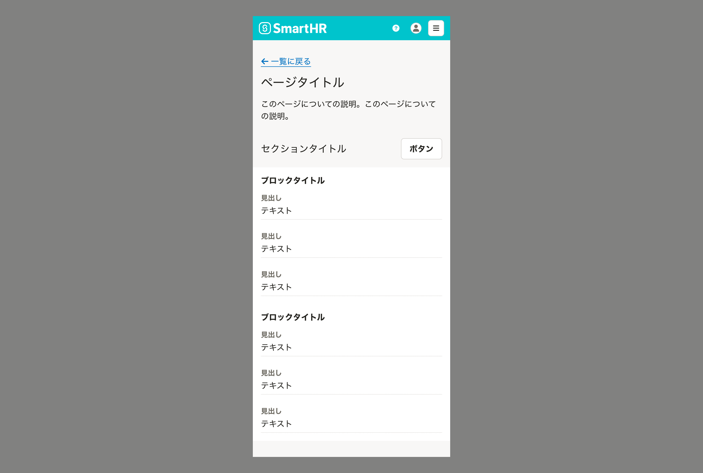

#### 利用例

  <ImgWithDesc description="モバイル">
      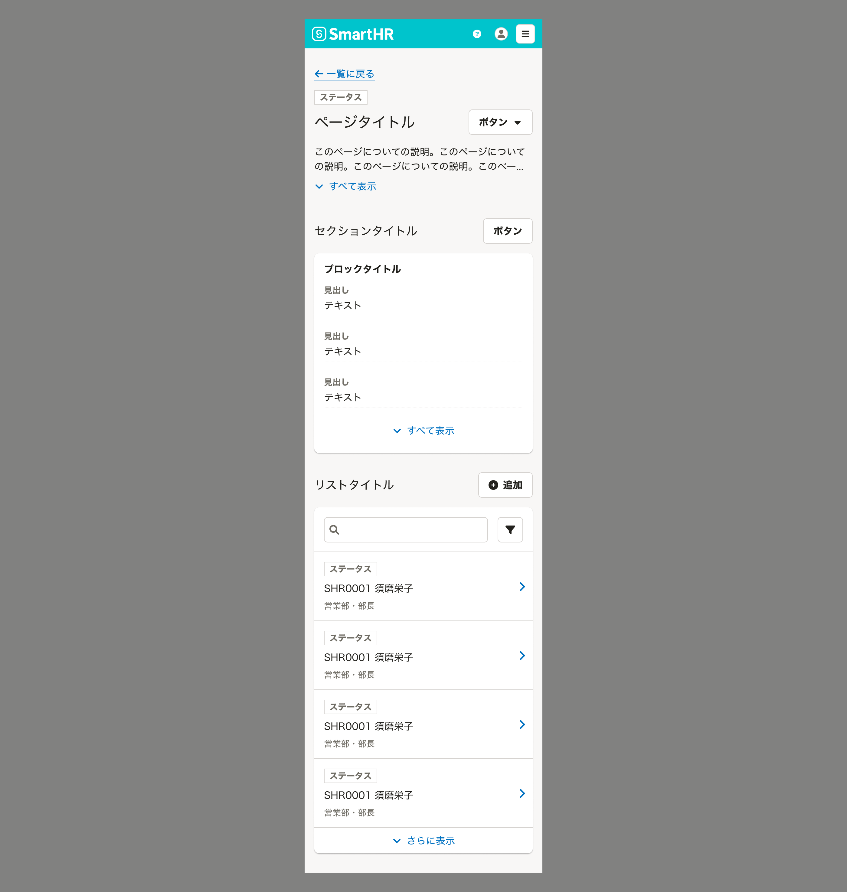
  </ImgWithDesc>

### シングル（2カラム）

オブジェクトの情報を重要度やユースケースによって「主情報」と「副情報」に分類し、2カラムで表示するパターンです。

オブジェクトを詳細表示するページで利用します。主情報と副情報の情報量・重要度に大きく差がある場合に有効です。例えば次のような場合です。

- ID・更新日時・登録者を確認しながら、書類を閲覧・操作したい
- 従業員の基本的な情報（名前や部署など）を閲覧しながら、蓄積された過去の情報（経歴やスキル情報など）を閲覧したい

見出し領域と副情報のセクション、主情報のセクションで構成されます。**主情報を表示する領域の横幅は副情報を表示する領域の横幅の2倍以上の幅としてください。**

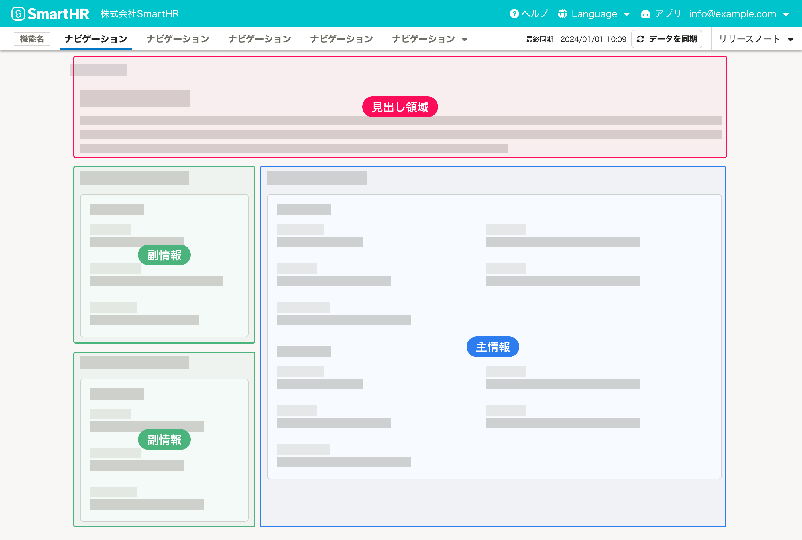

実装例：

```tsx editable hideCode background=DOT canvas=1400
<div className="shr-bg-background" style={{ minHeight: '100svh', width: '100%' }}>
  <div className="shr-z-1 shr-relative">
    <AppHeader
      appName="すごいプロダクト"
      userInfo={{ empCode : "001", firstName : "須磨", lastName : "栄子", }}
      navigations={[
        { children: "ダッシュボード", href: "#", current: true },
        { children: "設定", childNavigations: [
          { children: "マスター設定", href: "#" },
        ]},
      ]}
    />
  </div>
  <NotificationBar type="success" bold onClose={() => {}} className="shr-sticky shr-top-0 shr-z-1">
    オブジェクトの作成に成功しました。
  </NotificationBar>
  <Container>
    <Stack gap={2}>
      <Stack gap={1.5}>
        <UpwardLink href="#">一覧に戻る</UpwardLink>
        <Stack>
          <Sidebar align="center" right>
            <div className="shr-inline-block">
              <StatusLabel style={{ verticalAlign: 'text-bottom', marginInlineEnd: '0.5rem' }}>ステータス</StatusLabel>
              <PageHeading className="shr-inline">ページタイトル</PageHeading>
            </div>
            <Cluster>
              <Button>操作</Button>
              <Button>操作</Button>
              <Button>操作</Button>
            </Cluster>
          </Sidebar>
          <p>ページの説明。詳しくは<HelpLink href="/" target="_blank">ヘルプページ</HelpLink>を参照してください。</p>
        </Stack>
        <InformationPanel heading="オブジェクトの処理中です" type="sync">
          オブジェクトをバックグラウンド処理で処理中です。
        </InformationPanel>
      </Stack>
      <Sidebar gap={2}>
        <Stack gap={2} style={{ flexBasis: '1em' }}>
          <Section>
            <Stack>
              <Heading>セクションタイトル</Heading>
              <Base padding={1.5}>
                <Stack gap={2}>
                  <Stack gap={1.5}>
                    <Heading type="blockTitle">見出し</Heading>
                    <DefinitionList>
                      <DefinitionListItem term="項目">内容</DefinitionListItem>
                      <DefinitionListItem term="項目">内容</DefinitionListItem>
                    </DefinitionList>
                  </Stack>
                  <Stack gap={1.5}>
                    <Heading type="blockTitle">見出し</Heading>
                    <DefinitionList>
                      <DefinitionListItem term="項目">内容</DefinitionListItem>
                    </DefinitionList>
                  </Stack>
                </Stack>
              </Base>
            </Stack>
          </Section>
          <Section>
            <Stack>
              <Heading>セクションタイトル</Heading>
              <Base padding={1.5}>
                <Stack gap={2}>
                  <Stack gap={1.5}>
                    <Heading type="blockTitle">見出し</Heading>
                    <DefinitionList>
                      <DefinitionListItem term="項目">内容</DefinitionListItem>
                    </DefinitionList>
                  </Stack>
                  <Stack gap={1.5}>
                    <Heading type="blockTitle">見出し</Heading>
                    <DefinitionList>
                      <DefinitionListItem term="項目">内容</DefinitionListItem>
                    </DefinitionList>
                  </Stack>
                </Stack>
              </Base>
            </Stack>
          </Section>
        </Stack>
        <Section>
          <Stack>
            <Heading>セクションタイトル</Heading>
            <Base padding={1.5}>
              <Stack gap={2}>
                <Stack gap={1.5}>
                  <Heading type="blockTitle">見出し</Heading>
                  <DefinitionList>
                    <DefinitionListItem maxColumns={3} term="項目">内容</DefinitionListItem>
                    <DefinitionListItem maxColumns={3} term="項目">内容</DefinitionListItem>
                    <DefinitionListItem maxColumns={3} term="項目">内容</DefinitionListItem>
                    <DefinitionListItem maxColumns={3} term="項目">内容</DefinitionListItem>
                    <DefinitionListItem maxColumns={3} term="項目">内容</DefinitionListItem>
                    <DefinitionListItem maxColumns={3} term="項目">内容</DefinitionListItem>
                  </DefinitionList>
                </Stack>
                <Stack gap={1.5}>
                  <Heading type="blockTitle">見出し</Heading>
                  <DefinitionList>
                    <DefinitionListItem maxColumns={3} term="項目">内容</DefinitionListItem>
                    <DefinitionListItem maxColumns={3} term="項目">内容</DefinitionListItem>
                    <DefinitionListItem maxColumns={3} term="項目">内容</DefinitionListItem>
                    <DefinitionListItem maxColumns={3} term="項目">内容</DefinitionListItem>
                    <DefinitionListItem maxColumns={3} term="項目">内容</DefinitionListItem>
                    <DefinitionListItem maxColumns={3} term="項目">内容</DefinitionListItem>
                  </DefinitionList>
                </Stack>
              </Stack>
            </Base>
          </Stack>
        </Section>
      </Sidebar>
    </Stack>
  </Container>
</div>
```

#### モバイル

シングル（2カラム）は広い横幅を必要とするため、画面の横幅が狭いモバイルには適していません。代わりに、[シングル（1カラム）](#h3-9)として表示してください。副情報と主情報のうち、ユーザーが先に確認する必要のある情報から順番にセクションを表示します。

### シングル（ベースのある見出し領域）

ベースのある見出し領域でコンテンツ領域との境界を明確に示すパターンです。

オブジェクトを詳細表示するページで利用します。見出し領域とコンテンツ領域で、領域の幅が異なる場合に有効です。例えば次のような場合です。

- 二次元スクロールを伴う独自のビューを表示する場合
    - ツリー図
    - マトリクス表
    - グラフ

見出し領域とコンテンツ領域で構成されます。

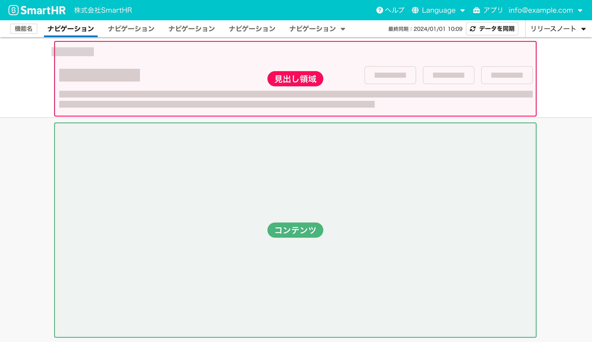

#### モバイル

デスクトップに比べてモバイルでは二次元スクロールを伴う領域の操作がしづらい傾向にあります。シングル（ベースのある見出し領域）のコンテンツが二次元スクロールを伴う場合、モバイルでも同様のレイアウトが適しているか、モバイルに適した他のレイアウトはないか検討してください。  
例えば、リストのような垂直方向のスクロールで操作できるレイアウトを使うと、モバイルでの操作性を高めることができます。

関連：[モバイルレイアウト/水平方向のスクロールや2次元（垂直・水平方向）スクロールを避ける](https://smarthr.design/products/design-patterns/mobile-friendly-layout/#h3-3)

#### 利用例

<Grid>
    <ImgWithDesc description="デスクトップ">
    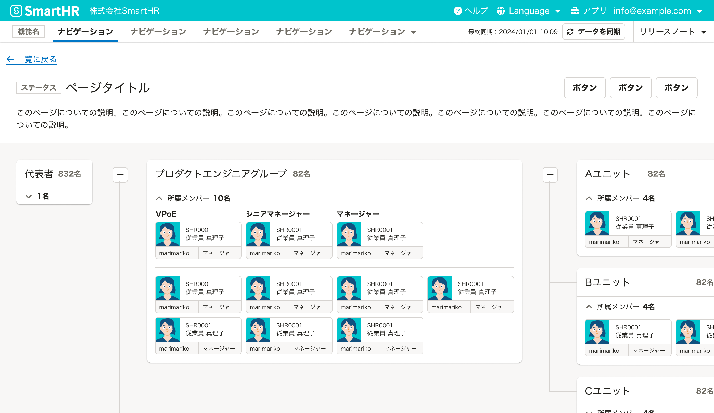
    </ImgWithDesc>

    <ImgWithDesc description="モバイル（どうしても二次元スクロールを伴うレイアウトが必要な場合）">
    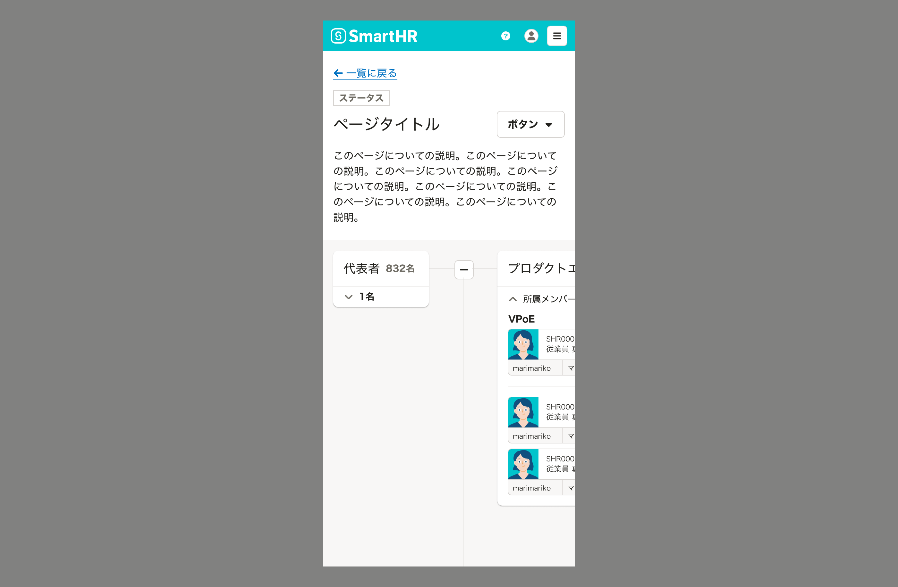
    </ImgWithDesc>
</Grid>

### サイドナビゲーションとコンテンツの2カラム

「サイドナビゲーション」と「選択されたコンテンツ」を2カラムで表示するパターンです。

設定画面など、[AppNavi](/products/components/app-navi/)のドロップダウンではサイドナビゲーション項目を十分に表示できない場合に利用します。例えば次のような場合です。

- ナビゲーションがAppNaviのドロップダウンでは収まらない場合
- ナビゲーション同士を頻繁に行き来する場合
- ナビゲーションが階層構造になっている場合

サイドナビゲーション領域とコンテンツ領域で構成されます。サイドナビゲーションには[SideMenu](/products/components/side-menu/)を使います。コンテンツ領域はコレクションかシングルのレイアウトをとります。

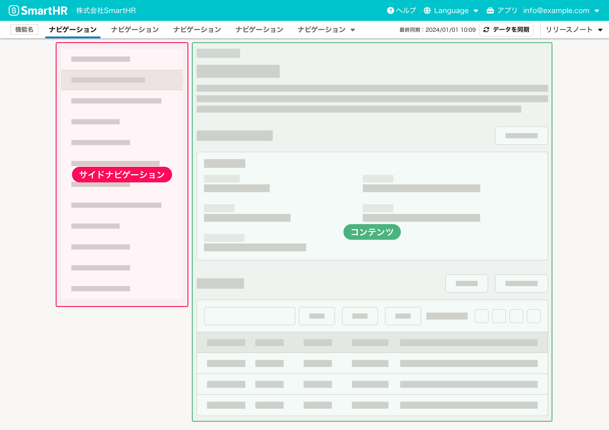

実装例：

```tsx editable hideCode background=DOT canvas=1400
<div className="shr-bg-background" style={{ minHeight: '100svh', width: '100%' }}>
  <div className="shr-z-1 shr-relative">
    <AppHeader
      appName="すごいプロダクト"
      userInfo={{ empCode : "001", firstName : "須磨", lastName : "栄子", }}
      navigations={[
        { children: "ダッシュボード", href: "#", current: true },
        { children: "設定", childNavigations: [
          { children: "マスター設定", href: "#" },
        ]},
      ]}
    />
  </div>
  <Container>
    <Sidebar gap={2}>
      <div style={{ flexBasis: '15em' }}>
        <SideMenu>
          <SideMenuGroup heading="グループ1">
            <SideMenuItem current>項目1</SideMenuItem>
            <SideMenuItem>項目2</SideMenuItem>
            <SideMenuItem>項目3</SideMenuItem>
            <SideMenuItem>項目4</SideMenuItem>
            <SideMenuItem>項目5</SideMenuItem>
          </SideMenuGroup>
          <SideMenuGroup heading="グループ2">
            <SideMenuItem>項目6</SideMenuItem>
            <SideMenuItem>項目7</SideMenuItem>
            <SideMenuItem>項目8</SideMenuItem>
            <SideMenuItem>項目9</SideMenuItem>
            <SideMenuItem>項目10</SideMenuItem>
          </SideMenuGroup>
        </SideMenu>
      </div>

      <Stack gap={2}>
        <Stack>
          <PageHeading>ページタイトル</PageHeading>
          <p>ページの説明。詳しくは<HelpLink href="/" target="_blank">ヘルプページ</HelpLink>を参照してください。</p>
        </Stack>
        <Section>
          <Stack>
            <Heading>見出し</Heading>
            <Base padding={1.5}>
              <DefinitionList>
                <DefinitionListItem maxColumns={3} term="項目">内容</DefinitionListItem>
                <DefinitionListItem maxColumns={3} term="項目">内容</DefinitionListItem>
                <DefinitionListItem maxColumns={3} term="項目">内容</DefinitionListItem>
                <DefinitionListItem maxColumns={3} term="項目">内容</DefinitionListItem>
                <DefinitionListItem maxColumns={3} term="項目">内容</DefinitionListItem>
                <DefinitionListItem maxColumns={3} term="項目">内容</DefinitionListItem>
              </DefinitionList>
            </Base>
          </Stack>
        </Section>
        <Section>
          <Stack>
            <Heading>見出し</Heading>
            <Base padding={1.5}>
              <DefinitionList>
                <DefinitionListItem maxColumns={3} term="項目">内容</DefinitionListItem>
                <DefinitionListItem maxColumns={3} term="項目">内容</DefinitionListItem>
                <DefinitionListItem maxColumns={3} term="項目">内容</DefinitionListItem>
                <DefinitionListItem maxColumns={3} term="項目">内容</DefinitionListItem>
                <DefinitionListItem maxColumns={3} term="項目">内容</DefinitionListItem>
                <DefinitionListItem maxColumns={3} term="項目">内容</DefinitionListItem>
              </DefinitionList>
            </Base>
          </Stack>
        </Section>
      </Stack>
    </Sidebar>
  </Container>
</div>
```

#### モバイル

サイドナビゲーションとコンテンツの2カラムは広い横幅を必要とするため、画面の横幅が狭いモバイルには適していません。サイドナビゲーションの操作を、[AppNavi](/products/components/app-navi/)に含めることを検討してください。モバイルではAppNaviが画面全体に表示されるため、デスクトップではAppNaviに操作が収まらない場合でも、モバイルではAppNaviに収まることがあります。

サイドナビゲーションがなくなるため、ページレイアウトは[コレクション（リスト）](#h3-8)、[シングル（1カラム）](#h3-9)のいずれかの形を取ります。

### コレクションとシングルの2カラム

「オブジェクトの一覧」と「オブジェクトの詳細」を2カラムで表示するパターンです。

一覧と詳細が別画面であると不都合がある場合に利用します。例えば次のような場合です。

- オブジェクトを頻繁に切り替える場合

オブジェクトの見出し領域とコレクション領域、シングル領域で構成されます。コレクション領域には[SideNav](/products/components/side-nav/)を使います。シングル領域はシングルのレイアウトを取ります。

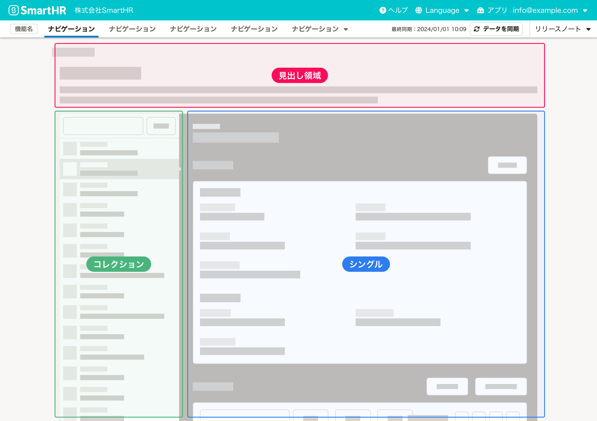

実装例：

```tsx editable hideCode background=DOT canvas=1400
<div className="shr-bg-background" style={{ minHeight: '100svh', width: '100%' }}>
  <div className="shr-z-1 shr-relative">
    <AppHeader
      appName="すごいプロダクト"
      userInfo={{ empCode : "001", firstName : "須磨", lastName : "栄子", }}
      navigations={[
        { children: "ダッシュボード", href: "#", current: true },
        { children: "設定", childNavigations: [
          { children: "マスター設定", href: "#" },
        ]},
      ]}
    />
  </div>
  <Container>
    <Stack gap={2}>
      <Stack gap={1.5}>
        <UpwardLink href="#">一覧に戻る</UpwardLink>
        <Stack>
          <Sidebar align="center" right>
            <div className="shr-inline-block">
              <StatusLabel style={{ verticalAlign: 'text-bottom', marginInlineEnd: '0.5rem' }}>ステータス</StatusLabel>
              <PageHeading size="XXL" className="shr-inline">ページタイトル</PageHeading>
            </div>
            <Cluster>
              <Button>操作</Button>
              <Button>操作</Button>
              <Button>操作</Button>
            </Cluster>
          </Sidebar>
          <p>ページの説明。詳しくは<HelpLink href="/" target="_blank">ヘルプページ</HelpLink>を参照してください。</p>
        </Stack>
      </Stack>
      <Base>
        <BaseColumn rounded bgColor="OVER_BACKGROUND" padding={0}>
          <Sidebar gap={0}>
            <BaseColumn style={{ flexBasis: '15em' }} padding={{ block: 0.5, inline: 0 }} rounded="left" className="shr-shadow-layer-1" bgColor="WHITE">
              <SideNav className="shr-bg-white">
                <SideNavItemButton id="nav-1" current onClick={() => {}}>項目1</SideNavItemButton>
                <SideNavItemButton id="nav-2" onClick={() => {}}>項目2</SideNavItemButton>
                <SideNavItemButton id="nav-3" onClick={() => {}}>項目3</SideNavItemButton>
                <SideNavItemButton id="nav-4" onClick={() => {}}>項目4</SideNavItemButton>
                <SideNavItemButton id="nav-5" onClick={() => {}}>項目5</SideNavItemButton>
                <SideNavItemButton id="nav-6" onClick={() => {}}>項目6</SideNavItemButton>
                <SideNavItemButton id="nav-7" onClick={() => {}}>項目7</SideNavItemButton>
                <SideNavItemButton id="nav-8" onClick={() => {}}>項目8</SideNavItemButton>
                <SideNavItemButton id="nav-9" onClick={() => {}}>項目9</SideNavItemButton>
                <SideNavItemButton id="nav-10" onClick={() => {}}>項目10</SideNavItemButton>
              </SideNav>
            </BaseColumn>
            <Section className="shr-p-1.5">
              <Stack gap={2}>
                <Heading size="XL">見出し</Heading>
                <Section>
                  <Stack>
                    <Sidebar right align="center">
                      <Heading>見出し</Heading>
                      <Button>操作</Button>
                    </Sidebar>
                    <Base padding={1.5}>
                      <Stack gap={1.5}>
                        <p>説明テキスト。</p>
                        <Stack gap={0.5}>
                          <Heading type="blockTitle">タイトル</Heading>
                          <BaseColumn>
                            <Stack>
                              <p>説明テキスト。</p>
                              <DefinitionList>
                                <DefinitionListItem maxColumns={3} term="項目">内容</DefinitionListItem>
                                <DefinitionListItem maxColumns={3} term="項目">内容</DefinitionListItem>
                              </DefinitionList>
                            </Stack>
                          </BaseColumn>
                        </Stack>
                      </Stack>
                    </Base>
                  </Stack>
                </Section>
                <Section>
                  <Stack>
                    <Sidebar right align="center">
                      <Heading>見出し</Heading>
                      <Button>操作</Button>
                    </Sidebar>
                    <Base padding={1.5}>
                      <Stack gap={1.5}>
                        <p>説明テキスト。</p>
                        <Stack gap={0.5}>
                          <Heading type="blockTitle">タイトル</Heading>
                          <BaseColumn>
                            <Stack>
                              <p>説明テキスト。</p>
                              <DefinitionList>
                                <DefinitionListItem maxColumns={3} term="項目">内容</DefinitionListItem>
                                <DefinitionListItem maxColumns={3} term="項目">内容</DefinitionListItem>
                              </DefinitionList>
                            </Stack>
                          </BaseColumn>
                        </Stack>
                      </Stack>
                    </Base>
                  </Stack>
                </Section>

              </Stack>
            </Section>
          </Sidebar>
        </BaseColumn>
      </Base>
    </Stack>
  </Container>
</div>
```

#### モバイル

コレクションとシングルの2カラムは広い横幅を必要とするため、画面の横幅が狭いモバイルには適していません。次のいずれかの方法で対処してください。

##### コレクションとシングルの2ページに分割する

コレクションとシングルの2カラムを、[コレクション（リスト）](#h3-8)と[シングル（1カラム）](#h3-9)の2つのページに分割します。ページレイアウトはそれぞれ[コレクション（リスト）](#h3-8)と[シングル（1カラム）](#h3-9)の形を取ります。

<Grid>
    <ImgWithDesc description="コレクション（リスト）">
    
    </ImgWithDesc>

    <ImgWithDesc description="シングル（1カラム）">
    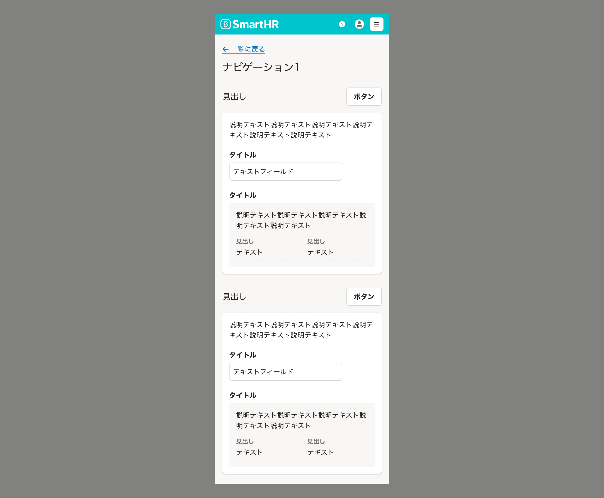
    </ImgWithDesc>
</Grid>

##### [WIP] SideNavをドロワーで表示する

<BaseColumn className="shr-mt-1">
    <ResponseMessage status="info">SideNavをドロワーで表示できるよう、smarthr-uiでの対応を検討中です。</ResponseMessage>
</BaseColumn>

[SideNav](/products/components/side-nav/)を使ったコレクションをドロワーで表示します。コレクションがなくなるため、ページレイアウトは[シングル（1カラム）](#h3-9)の形を取ります。ドロワーは該当のセクション内で開閉できます。ドロワーを開くボタンをセクション内に表示してください。


<Grid>
    <ImgWithDesc description="ドロワーが閉じている初期状態">
    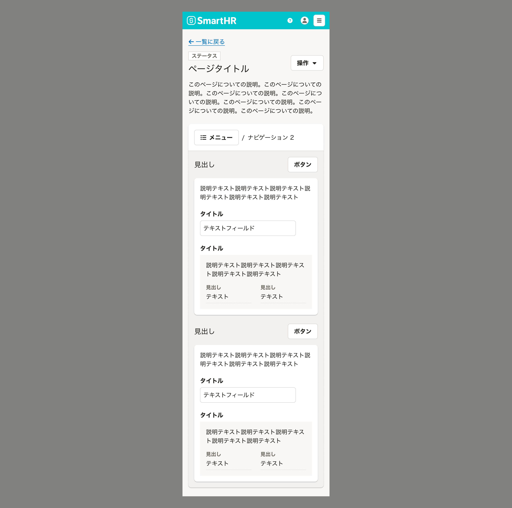
    </ImgWithDesc>

    <ImgWithDesc description="ドロワーが開いた状態">
    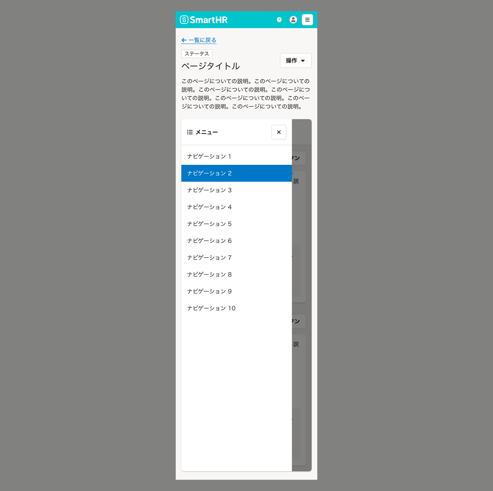
    </ImgWithDesc>
</Grid>
