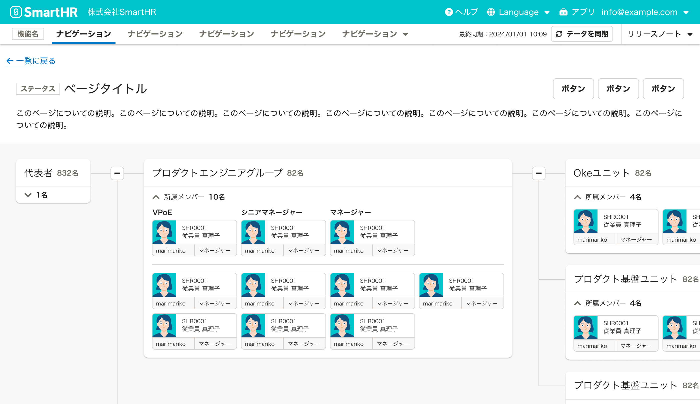

ビューポート内にどのような要素をどのような順序で配置するかをページレイアウトと呼びます。
SmartHRプロダクトの基本的なページレイアウトのパターンをまとめています。

## 基本的な考え方

SmartHR全体で一貫性のあるページレイアウトを提供することで、ユーザーはレイアウトを都度学習することなく経験に基づいてUIを予測しながらアプリケーションを利用できます。

適切なページレイアウトの設計には、ユーザーの業務とオブジェクトモデルの理解が必要です。
ユーザーの利用目的に沿って、オブジェクトの関係性や重要度を表すように設計してください。

### 構成要素

エラー画面を除き、SmartHRが提供する画面では[AppHeader](/products/components/app-header/)をビューポート最上部に配置します。

それぞれの要素同士をどのようにグルーピングするかについては、[視覚的グルーピング](/products/design-patterns/visual-grouping/)を参照してください。

### コンテナ領域の幅

[AppHeader](/products/components/app-header/)を除いたコンテナ領域は[Container](/products/components/layout/container/)コンポーネントを使用し、コンテナ領域の横幅はサイズ（`size`props）で指定します。

次のような場合には、より広い横幅の選択を検討します。

- 大量のデータ項目を表示する場合
- [サイドナビゲーションとコンテンツの2カラム](#3-6)や[コレクションとシングルの2カラム](#3-7)など、1つのカラムに1ページ相当の情報量を表示する場合

ただし、モバイルではContainerの`size`propsの指定に関わらず常に画面幅いっぱいに表示されます。

### 余白の取り方

[余白の取り方](/products/design-patterns/spacing-layout-pattern/)に従います。

## 種類

代表的なページレイアウトの種類は以下のとおりです。
モーダルなページについては[モーダルなUI](/products/design-patterns/modal-ui/)を、エラー画面については[ErrorScreen](/products/components/error-screen/)を参照してください。

- コレクション（テーブル）
- コレクション（リスト）
- シングル（1カラム）
- シングル（2カラム）
- シングル（ベースのある見出し領域）
- サイドナビゲーションとコンテンツの2カラム
- コレクションとシングルの2カラム

### コレクション（テーブル）

[よくあるテーブル](/products/design-patterns/smarthr-table/)を用いてオブジェクトを一覧表示するパターンです。

オブジェクトを一覧表示するページで利用します。オブジェクト同士を属性情報で比較するユースケースがある場合に有効です。

見出し領域とよくあるテーブルで構成されます。

#### 利用例

#### モバイル

コレクション（テーブル）は広い横幅を必要とするため、画面の横幅が狭いモバイルには適していません。代わりに、[コレクション（リスト）](#h3-4)を検討してください。

### コレクション（リスト）

[よくあるリスト](/products/design-patterns/smarthr-list/)を用いてオブジェクトを一覧表示するパターンです。

オブジェクトを一覧表示するページで利用します。狭い領域（主にモバイル）でオブジェクトを一覧表示する場合に有効です。

見出し領域とよくあるリストで構成されます。

#### 利用例

[WIP]

### シングル（1カラム）

オブジェクトの情報を「任意のまとまり（セクション）」に分類し、1カラムで表示するパターンです。

オブジェクトを詳細表示するページで利用します。オブジェクトの情報がすべて並列な関係にある場合に利用してください。

見出し領域と複数のセクションで構成されます。

#### 利用例

#### モバイル

##### セクションが1つの場合のレイアウト

セクションが1つのみの場合、コンテンツ領域にBaseを使わないレイアウトもできます。コンテンツ領域の背景色をWHITEに変更します。Baseに関連する余白がなくなるため、横幅を広く使いたいケースで特に有効です。

### シングル（2カラム）

オブジェクトの情報を重要度やユースケースによって「主情報」と「副情報」に分類し、2カラムで表示するパターンです。

オブジェクトを詳細表示するページで利用します。主情報と副情報の情報量・重要度に大きく差がある場合に有効です。例えば次のような場合です。

- ID・更新日時・登録者を確認しながら、書類を閲覧・操作したい
- 従業員の基本的な情報（名前や部署など）を閲覧しながら、蓄積された過去の情報（経歴やスキル情報など）を閲覧したい

見出し領域と副情報のセクション、主情報のセクションで構成されます。**主情報を表示する領域の横幅は副情報を表示する領域の横幅の2倍以上の幅としてください。**

#### 利用例

#### モバイル

シングル（2カラム）は広い横幅を必要とするため、画面の横幅が狭いモバイルには適していません。  
代わりに、シングル（1カラム）として表示してください。副情報→主情報の順番で垂直方向にセクションを積み上げます。

ただし、主情報の表示に到達しやすいよう必要に応じて[ページが長大になる場合の対処]()に従い、副情報を省略表示してください。

### シングル（ベースのある見出し領域）

ベースのある見出し領域でコンテンツ領域との境界を明確に示すパターンです。

オブジェクトを詳細表示するページで利用します。見出し領域とコンテンツ領域で、領域の幅が異なる場合に有効です。例えば次のような場合です。

- 二次元スクロールを伴う独自のビューを表示する場合
    - ツリー図
    - マトリクス表
    - グラフ

見出し領域とコンテンツ領域で構成されます。

#### 利用例

#### モバイル

デスクトップに比べてモバイルでは二次元スクロールを伴う領域の操作がしづらい傾向にあります。シングル（ベースのある見出し領域）のコンテンツが二次元スクロールを伴う場合、モバイルでも同様のレイアウトで操作する必要があるか検討してください。リストのような垂直方向のスクロールで操作できるレイアウトを使うと、モバイルでの操作性を高めることができます。

### サイドナビゲーションとコンテンツの2カラム

「サイドナビゲーション」と「選択されたコンテンツ」を2カラムで表示するパターンです。

設定画面など、[AppNavi](/products/components/app-navi/)のドロップダウンではサイドナビゲーション項目を十分に表示できない場合に利用します。例えば次のような場合です。

- ナビゲーションがAppNaviのドロップダウンでは収まらない場合
- ナビゲーション同士を頻繁に行き来する場合
- ナビゲーションが階層構造になっている場合

サイドナビゲーション領域とコンテンツ領域で構成されます。コンテンツ領域はコレクションかシングルのレイアウトをとります。

#### 利用例

[WIP]

#### モバイル

サイドナビゲーションとコンテンツの2カラムは広い横幅を必要とするため、画面の横幅が狭いモバイルには適していません。次のいずれかの方法で対処してください。

##### AppNaviのドロップダウンを使う

サイドナビゲーションに相当する操作を、AppNaviのドロップダウンで表示します。サイドナビゲーションがなくなるため、ページレイアウトは[コレクション（テーブル）](#h3-1)、[コレクション（リスト）](#h3-2)、[シングル（1カラム）](#h3-3)の形を取ります。

##### ドロワーメニュー（smarthr-uiへの追加を検討中）を使う

サイドナビゲーションに相当する操作をドロワーメニューで表示します。サイドナビゲーションがなくなるため、ページレイアウトは[コレクション（テーブル）](#h3-1)、[コレクション（リスト）](#h3-2)、[シングル（1カラム）](#h3-3)の形を取ります。ドロワーメニューを開くボタンを見出し領域に表示してください。

### コレクションとシングルの2カラム

「オブジェクトの一覧」と「オブジェクトの詳細」を2カラムで表示するパターンです。

一覧と詳細が別画面であると不都合がある場合に利用します。例えば次のような場合です。

- オブジェクトを頻繁に切り替える場合

オブジェクトの見出し領域とコレクション領域、シングル領域で構成されます。シングル領域はシングルのレイアウトを取ります。

#### 利用例

[WIP]

#### モバイル

コレクションとシングルの2カラムは広い横幅を必要とするため、画面の横幅が狭いモバイルには適していません。次のいずれかの方法で対処してください。

##### コレクションとシングルの2画面に分割する

コレクションとシングルの2カラムを、[コレクション（リスト）]()と[シングル（1カラム）]()の2つの画面に分割します。

##### ドロワーメニュー（smarthr-uiへの追加を検討中）を使う

コレクションに相当する操作をドロワーメニューで表示します。コレクションがなくなるため、ページレイアウトは[シングル（1カラム）](#h3-3)の形を取ります。ドロワーメニューを開くボタンを見出し領域に表示してください。

## モバイル

### ページが長大になる場合の対処

モバイルは画面の横幅が狭いため、多くの情報を1ページに表示しようとするとページが縦方向に長くなってしまいます。縦方向に長いページでは、ページに何が表示されているのかの把握や、目的の情報への到達が困難になります。  
ページが縦方向に長くなってしまう場合には次のような対処を検討してください。

#### コンテンツを省略表示する

コンテンツを初めからすべては表示せず、一部を省略して表示します。あわせて、[Disclosure](/products/components/disclosure/)を使うことでユーザーが必要に応じてコンテンツをすべて表示できるようにします。

#### ページをナビゲーションで分割する

[TabBar](/products/components/tab-bar/)、[SideNav](/products/components/side-nav/)、[SideMenu](/products/components/side-menu/)といったナビゲーションを使ってページを分割します。