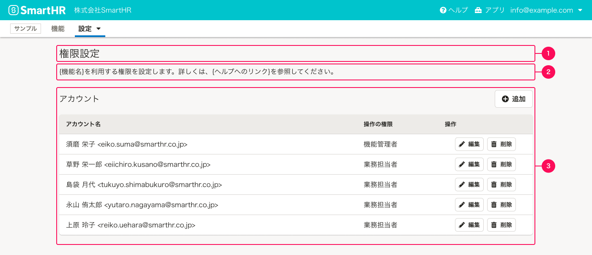
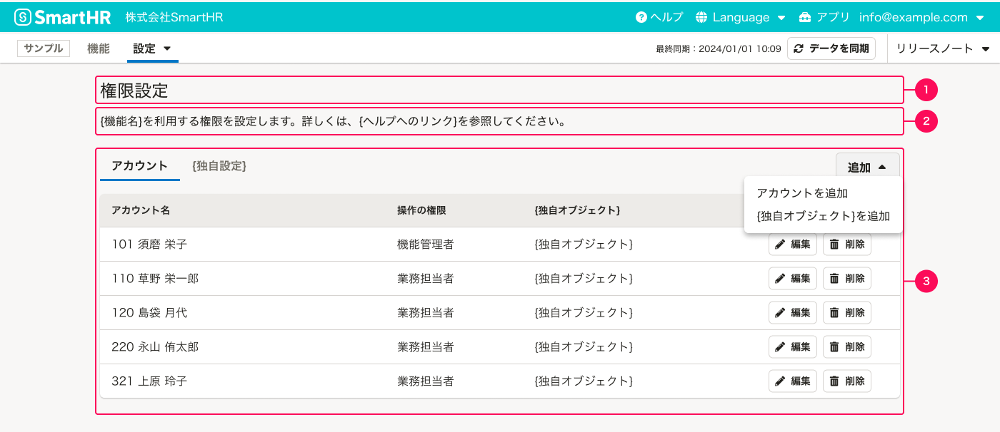
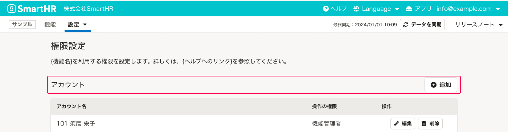
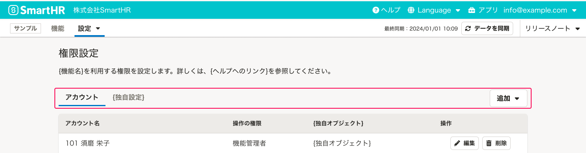
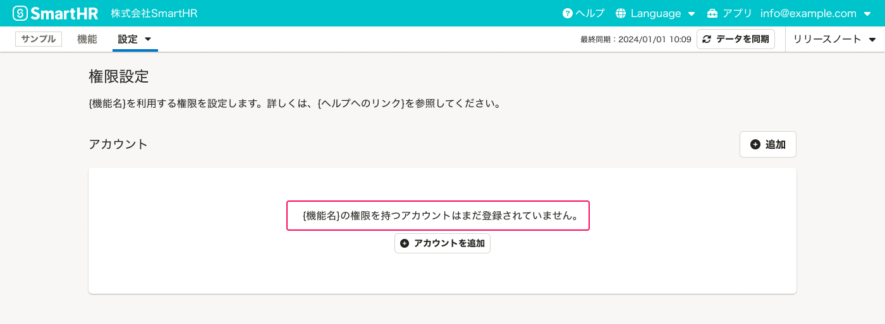
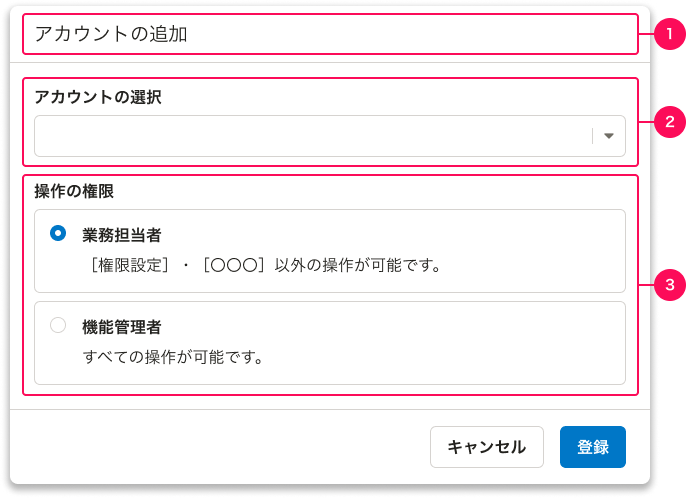
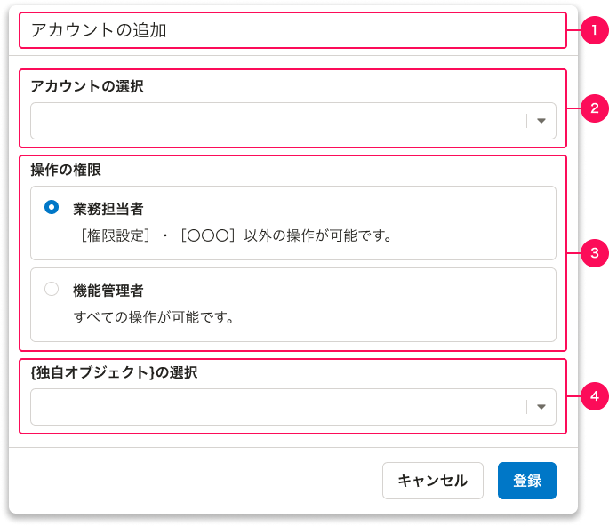
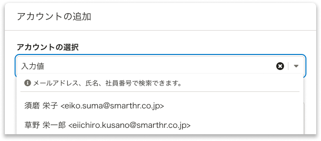

SmartHRにおける「権限設定」のパターンをまとめています。

## 基本的な考え方

プロダクトごとにアカウントの権限を管理するための画面です。画面パターンは以下のとおりです。
基本機能についてはこの限りではありません。

- [一覧](#h2-2)
- [アカウントの詳細](#h2-3)

## 権限の分類

権限の設計方式は一般に、ユーザーに割り当てた役割（ロール）に基づいて操作の許可を制御するRBAC（Role-Based Access Control）と、ユーザーやリソースが持つ属性（部署、雇用形態、操作範囲など）に基づいて操作の許可を制御するABAC（Attribute-Based Access Control）に大別されます。

SmartHRにおける権限は、現状すべてRBACです。将来的にABAC構造を持つプロダクトの開発も想定していますが、現時点でABACを採用しているプロダクトはありません。
新しくプロダクトを作る場合は、どの分類になるかを理解したうえで設計を進めてください。

- [RBAC](#h3-0)
- [ABAC](#h3-1)

### RBAC

権限を共通設定から継承するか、プロダクト独自に管理するかで、さらに2つのパターンに分けられます。分類によって、権限オブジェクトの考え方や画面設計が異なります。

#### 独自権限パターン

共通設定の権限とは切り離し、プロダクト独自にアカウントと権限（役割）を紐づけて管理するパターンです。ユーザーに役割（例：業務担当者、機能管理者）を割り当て、その役割に応じた特定の行動許可を設定します。

例えば、SmartHRにおいて対象となるプロダクトは以下のとおりです。

- [配置シミュレーション](https://smarthr.jp/function/simulation/)
- [スキル・資格・研修](https://smarthr.jp/function/skill/)
- [組織図](https://smarthr.jp/function/organization/)
- [人事評価](https://smarthr.jp/function/evaluation/)

#### 共通設定権限継承パターン

共通設定で定義された権限（役割）をそのまま継承し、特定の行動（例：依頼と確認、書類のダウンロード）の許可を設定するパターンです。

例えば、SmartHRにおいて対象となるプロダクトは以下のとおりです。

- [文書配付](https://smarthr.jp/function/distribution/)
- [年末調整](https://smarthr.jp/function/nc/)

### ABAC

現時点でABACを採用しているプロダクトはありません。対象の属性（操作範囲など）に基づいて行動の許可を制御するプロダクトが登場した際に、このセクションへパターンを追記します。

## 一覧

一覧ではアカウントを、[よくあるテーブル](/products/design-patterns/smarthr-table/)のパターンで表示します。

### 独自権限パターン

構成は[よくあるテーブル](/products/design-patterns/smarthr-table/)のパターンに従います。
[よくあるテーブル](/products/design-patterns/smarthr-table/)の詳細はレイアウトパターンを参照してください。

**一覧（アカウントのみ）**

**一覧（アカウントと独自の権限設定を扱う場合）**

#### 1. 画面タイトル

画面タイトルは「権限設定」とします。

#### 2. 画面説明テキスト

機能の説明や操作に関する補足テキスト、ヘルプセンターへのリンクなどを書きます。特別な補足がない場合は、以下のメッセージを使ってください。

`{機能名}を利用する権限を設定します。詳しくは、{ヘルプへのリンク}を参照してください。`

#### 3. テーブル

表には以下の情報を必ず表示します。必要に応じて、列を追加しても問題ありません。

- **アカウント名**
  - [アカウントの表記方法ガイドライン](/products/contents/ui-text/crew-account/#account-display-format)を参照してください。
- **操作の権限**
  - 権限名を表示します。
- **操作**
  - アカウントを操作するボタンを置きます。必要に応じて、[編集]と[削除]以外のボタンを置いても問題ありません。
  - コンポーネントは[Secondaryボタン](/products/components/button/)のサイズ小を使います。

##### アカウントのみの場合

アカウントのみを扱う場合のセクションタイトルは`アカウント`、オブジェクトの追加ボタンラベルは`追加`としてください。

##### 独自の権限設定がある場合

アカウントに紐づけが必要な独自の権限設定がある場合は、[TabBar](/products/components/tab-bar/)を使って並列に表示します。

TabBarのタイトルは左から`アカウント`、`{独自オブジェクト}`とします。

それぞれのオブジェクトを追加する[DropdownMenuButton](/products/components/dropdown/dropdown-menu-button/)のラベルは`追加`とします。ドロップダウンパネル内のボタンラベルはそれぞれ、`アカウントを追加`、`{独自オブジェクト}を追加`とします。

##### 初期表示

基本は[よくあるテーブルの初期表示](/products/design-patterns/smarthr-table/#h3-7)のパターンに従いますが、メッセージ部分は、`{機能名}の権限を持つアカウントはまだ登録されていません。`とします。

### 共通設定権限継承パターン

［WIP］

## アカウントの詳細

一覧の[（アカウントを）追加]、または[（アカウントを）編集]ボタンを押したときに[ActionDialog](/products/components/dialog/action-dialog/)で表示します。
例はすべて追加時のスクリーンショットです。必要に応じて編集に読み替えてください。

### 独自権限パターン

構成要素は次のとおりです。

- [1. ダイアログタイトル](#h4-5)
- [2. アカウントの選択](#h4-6)
- [3. 操作の権限](#h4-7)
- [4. 独自のオブジェクト設定](#h4-8)

**詳細ダイアログ（アカウントのみ）**

**詳細ダイアログ（独自の権限設定がある場合）**

#### 1. ダイアログタイトル

追加の場合は、「アカウントの追加」とします。編集の場合は、「アカウントの編集」とします。

#### 2. アカウントの選択

SmartHRのアカウントを選択します。単一選択の場合は[SingleCombobox](/products/components/combo-box/)を使ってください。複数まとめて追加する場合は[MultiCombobox](/products/components/combo-box/)を使ってください。

Comboboxのパネル内の説明には`{検索対象名1}、{検索対象名2}で検索できます。`と、検索できる項目を明記します。

#### 3. 操作の権限

アカウントに対して操作の権限（役割）を設定します。以下に代表的な役割として **「機能管理者」「業務担当者」** の2つを定義します。必要に応じて見直してください。

- 機能管理者：すべての操作の権限を持つ
- 業務担当者：業務に必要な操作の権限のみを持つ

操作の権限の指定には、[RadioButtonPanel](/products/components/radio-button-panel/)を使用してください。

**「カスタム権限」** として、操作の権限をユーザーが増やせるプロダクトもあります。この場合は[SingleCombobox](/products/components/combo-box/)や[Select](/products/components/select/)を使ってください。

#### 4. 独自の権限設定

独自の権限設定がある場合に表示します。用途によって設定が異なるため、基準やパターンは定めません。

### 共通設定権限継承パターン

［WIP］

## 関連リンク

- [アプリケーションにおける権限設計の課題 - kenfdev’s blog](https://kenfdev.hateblo.jp/entry/2020/01/13/115032)
