import Grid from '@/components/article/Grid.astro'
import ImgWithDesc from '@/components/article/ImgWithDesc.astro'

一覧画面から「アカウントの追加」「アカウントの編集」を行うダイアログの構成と、型の使い分け方針をまとめています。
対象は[権限設定](/products/design-patterns/permissions-settings/)ページのRBACパターンのうち、ガイドライン化対象であるA・B・Cパターンです。

- [ダイアログの構成要素](#h2-0)
- [ダイアログの型](#h2-1)

## ダイアログの構成要素

[一覧](/products/design-patterns/permissions-settings/list/)の[（アカウントを）追加]、または[（アカウントを）編集]ボタンを押したときに[ActionDialog](/products/components/dialog/action-dialog/)で表示します。
例はすべて追加時のスクリーンショットです。必要に応じて編集に読み替えてください。

構成要素は次のとおりです。

- [1. ダイアログタイトル](#h3-0)
- [2. アカウントの選択](#h3-1)
- [3. 操作の権限](#h3-2)
- [4. 独自の権限設定](#h3-3)

**詳細ダイアログ（アカウントのみ）**
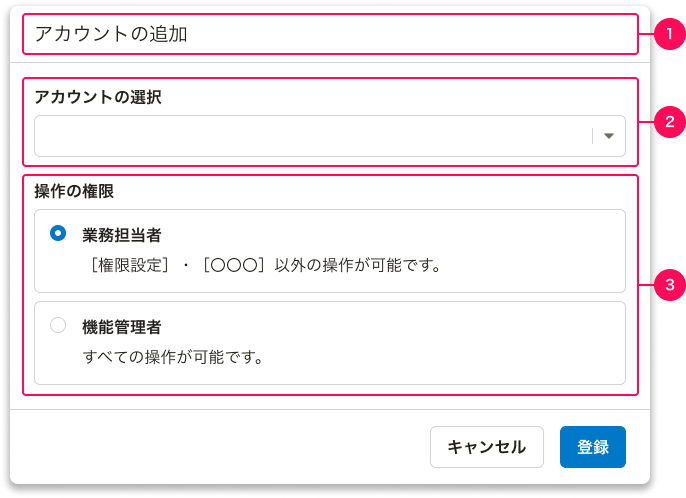

**詳細ダイアログ（独自の権限設定がある場合）**
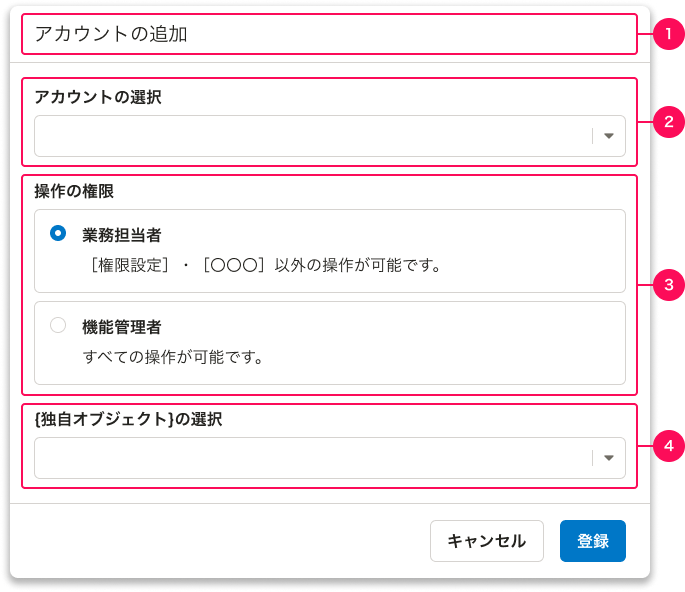

### 1. ダイアログタイトル

追加の場合は、「アカウントの追加」とします。編集の場合は、「アカウントの編集」とします。

### 2. アカウントの選択

SmartHRのアカウントを選択します。単一選択の場合は[SingleCombobox](/products/components/combobox/single-combobox/)を使ってください。複数まとめて追加する場合は[MultiCombobox](/products/components/combobox/multi-combobox/)を使ってください。

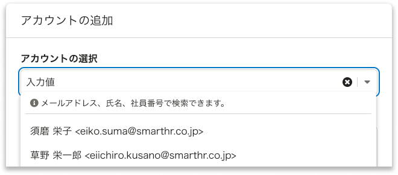

Comboboxのパネル内の説明には`{検索対象名1}、{検索対象名2}で検索できます。`と、検索できる項目を明記します。

### 3. 操作の権限

アカウントに対して操作の権限（役割）を設定します。以下に代表的な役割として **「機能管理者」「業務担当者」** の2つを定義します。必要に応じて見直してください。

- 機能管理者：すべての操作の権限を持つ
- 業務担当者：業務に必要な操作の権限のみを持つ

操作の権限の指定には、[RadioButtonPanel](/products/components/radio-button-panel/)を使用してください。

**「カスタム権限」** として、操作の権限をユーザーが増やせるプロダクトもあります。この場合は[SingleCombobox](/products/components/combobox/single-combobox/)や[Select](/products/components/select/)を使ってください。

### 4. 独自の権限設定

独自の権限設定がある場合に表示します。用途によって設定が異なるため、基準やパターンは定めません。

## ダイアログの型

構成要素の並べ方には、大きく2つの型があります。権限を付与したいアカウント数や、独自オブジェクト権限の数などによって、どちらを採用するかを判断します。

- [ワンダイアログ式](#h2-2)：1つのダイアログにすべての入力欄を並べる
- [ステップダイアログ式](#h2-3)：プロパティごとにステップを分ける

## ワンダイアログ式

A, B, Cで、アカウント選択のUIがシンプルでよい場合のデザインです。[ActionDialog](/products/components/dialog/action-dialog/)コンポーネントを使用し、ダイアログコンテンツに基本パターンの3プロパティの入力欄を設けます。

### 採用基準

主に次のような場合に採用します。

- 限られたユーザーしか機能を使わないなど、権限を付与したいアカウントが少数かつ自明なとき
- 初期リリースで実装工数を圧縮したいとき

### 制約

Cの場合にワンダイアログ式で表示できる独自オブジェクトは1つまでとし、2つ以降はステップダイアログ式にします。

### 画面例

ロール名を選ぶと、そのロールで閲覧できる従業員の範囲がロール名の下に展開されます。表示される情報量はロールの設定内容によって変わります。

<Grid size="300px">

  <ImgWithDesc description="ダイアログの初期値">

  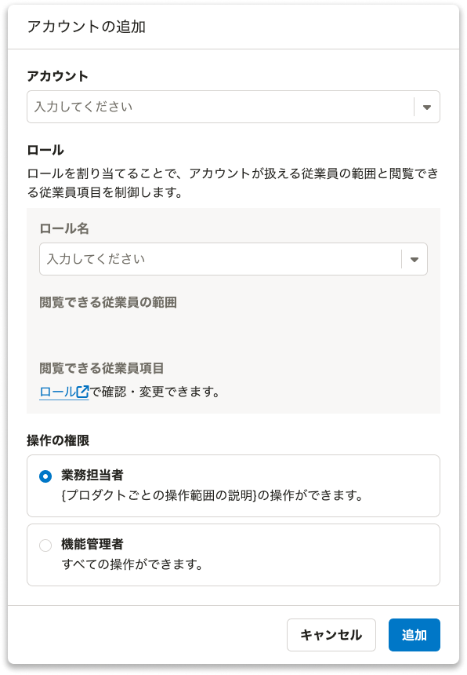

  </ImgWithDesc>

  <ImgWithDesc description="閲覧できる従業員の範囲が単純な場合">

  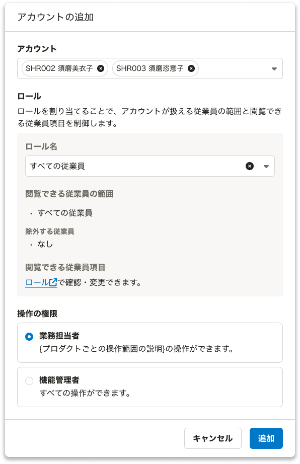

  </ImgWithDesc>

  <ImgWithDesc description="閲覧できる従業員の範囲が細かく指定されている場合">

  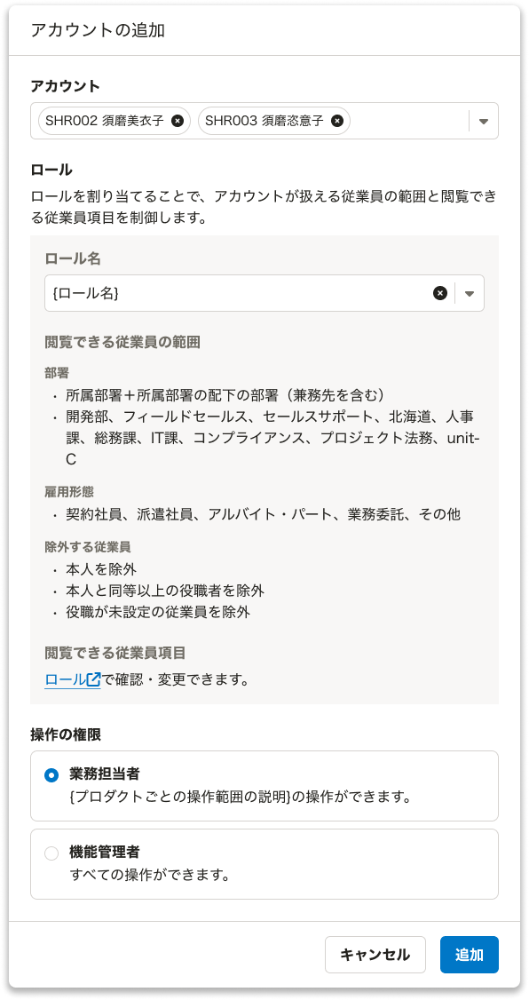

  </ImgWithDesc>

</Grid>

BとCでは、操作の権限や独自オブジェクトの入力欄が加わります。Bでは操作の権限をユーザーが増やせるため、[RadioButtonPanel](/products/components/radio-button-panel/)ではなく[SingleCombobox](/products/components/combobox/single-combobox/)を使います。Cでは操作の権限の下に、独自オブジェクトの入力欄を追加します。

<Grid size="300px">

  <ImgWithDesc description="B（基本+カスタム操作権限パターン）の場合">

  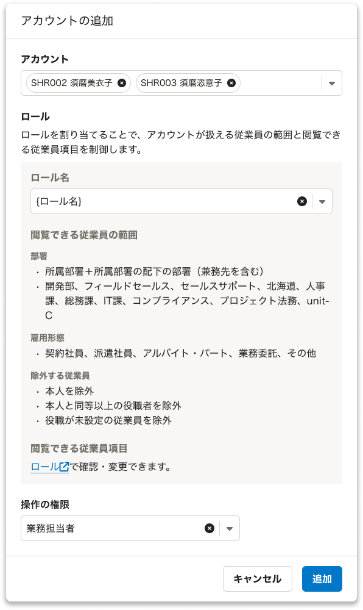

  </ImgWithDesc>

  <ImgWithDesc description="C（基本+独自オブジェクト権限パターン）の場合。表示できる独自オブジェクトは1つまで">

  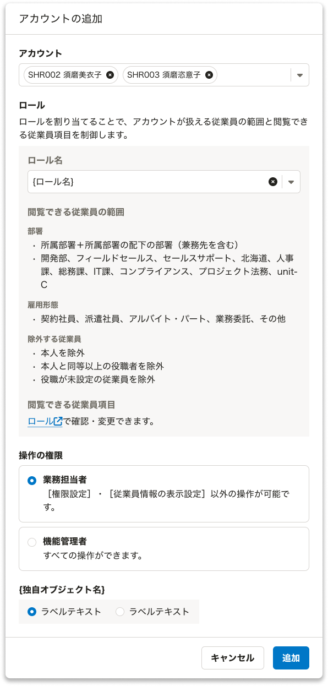

  </ImgWithDesc>

</Grid>

## ステップダイアログ式

A, B, Cで、アカウント選択時にアカウント名以外の情報も確認しながら操作した場合のデザインです。[StepFormDialog](/products/components/dialog/step-form-dialog/)コンポーネントを使用し、3ステップに分けて各プロパティの入力欄を設けます。

### 採用基準

主に次のような場合に採用します。

- 多くのアカウントに権限を付与するとき
- 権限の追加や削除を頻繁に行うプロダクトであるとき
- 独自オブジェクト権限の数が2つ以上あるとき

特にアカウント選択は、権限付与のミスを防ぐため所属部署や役職などの従業員情報も確認できるように[Table](/products/components/table/)コンポーネントを使って表示します。

### ステップダイアログ式の基本形

基本パターンの3つのプロパティをそれぞれステップに表示します。A, Bパターンで使用します。

<Grid size="300px">

  <ImgWithDesc description="ステップ1：アカウント選択。所属部署や役職なども確認しながら選択できるようにする">

  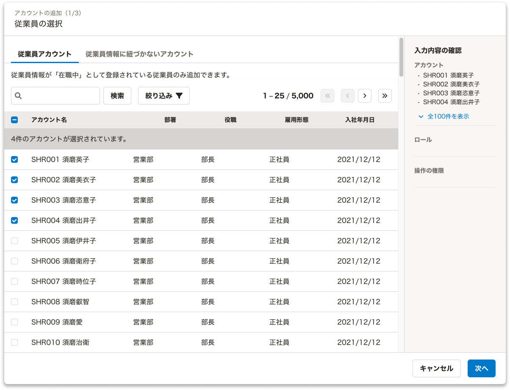

  </ImgWithDesc>

  <ImgWithDesc description="ステップ2：ロール選択">

  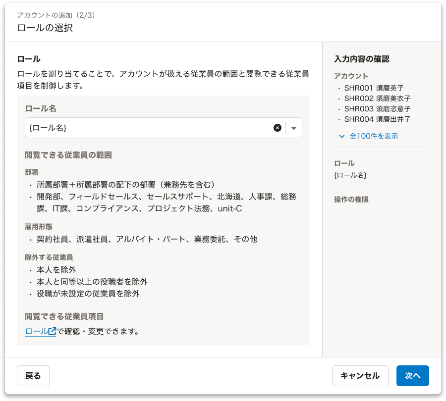

  </ImgWithDesc>

  <ImgWithDesc description="ステップ3：操作の権限選択">

  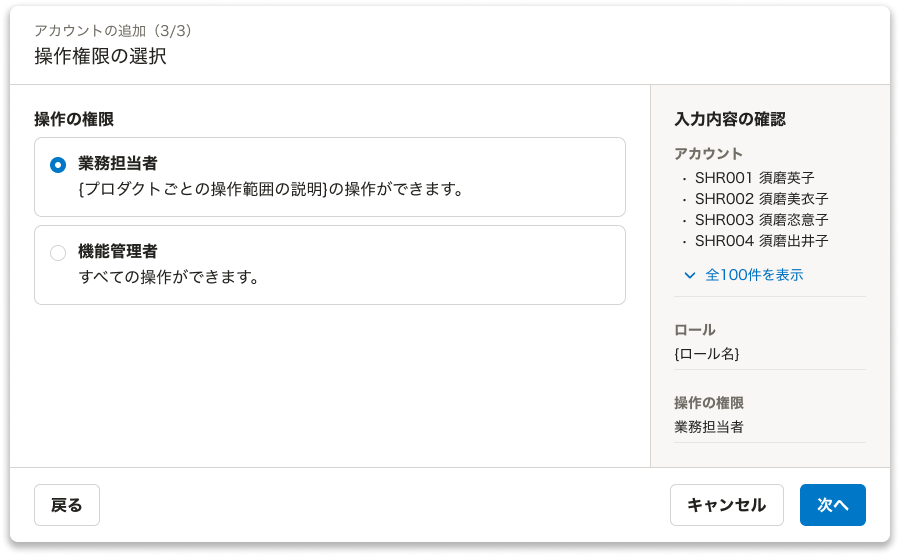

  </ImgWithDesc>

  <ImgWithDesc description="ステップ3：カスタム操作権限を持つ場合はSingleComboboxが望ましい">

  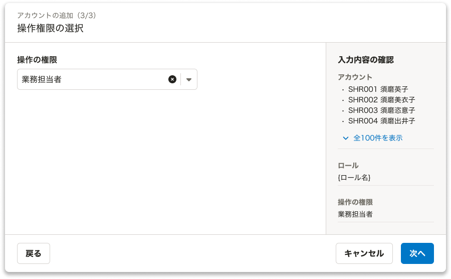

  </ImgWithDesc>

</Grid>

### ステップダイアログ式の派生系

独自オブジェクト権限を持っているCパターンでは、ステップ3で操作の権限と一緒に入力欄を設けます。コンテキストや数を考慮し、必要があれば4ステップ目に切り出します。

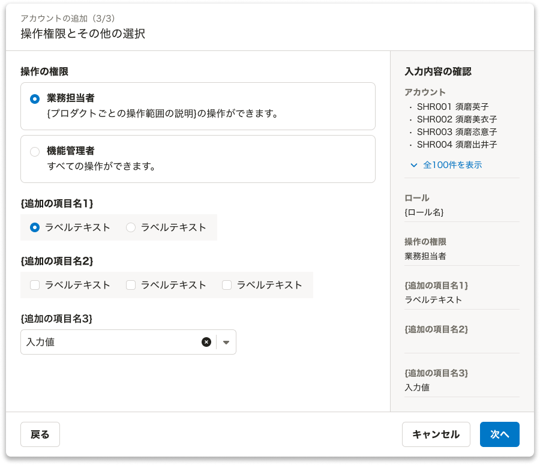

#### 権限項目のコンテキストに合わせてステップごとの入力欄を調整する

例えばキャリア台帳では、ロールに強く関連する項目をステップ2にまとめています。また、全体的に設定できる項目数が多いが無理にステップを増やさず、ヘルプメッセージで適切な補足をつけています。

<Grid size="300px">

  <ImgWithDesc description="ステップ1：アカウント選択">

  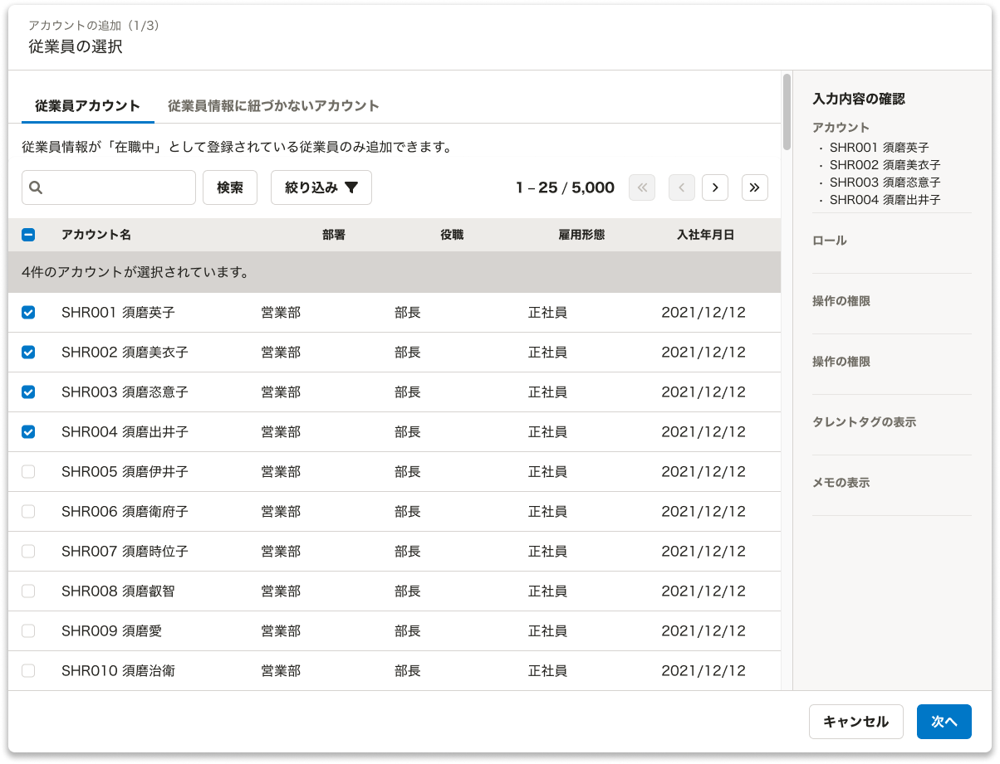

  </ImgWithDesc>

  <ImgWithDesc description="ステップ2：ロールに強く関連する「従業員情報の表示設定」を同じステップにまとめている">

  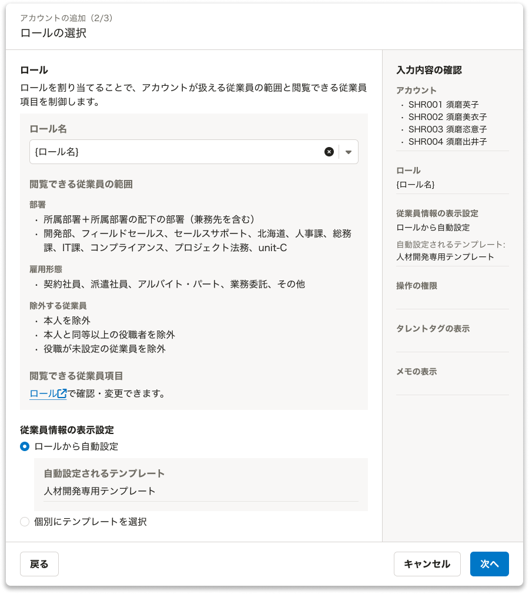

  </ImgWithDesc>

  <ImgWithDesc description="ステップ3：項目数が多いため、ヘルプメッセージで補足している">

  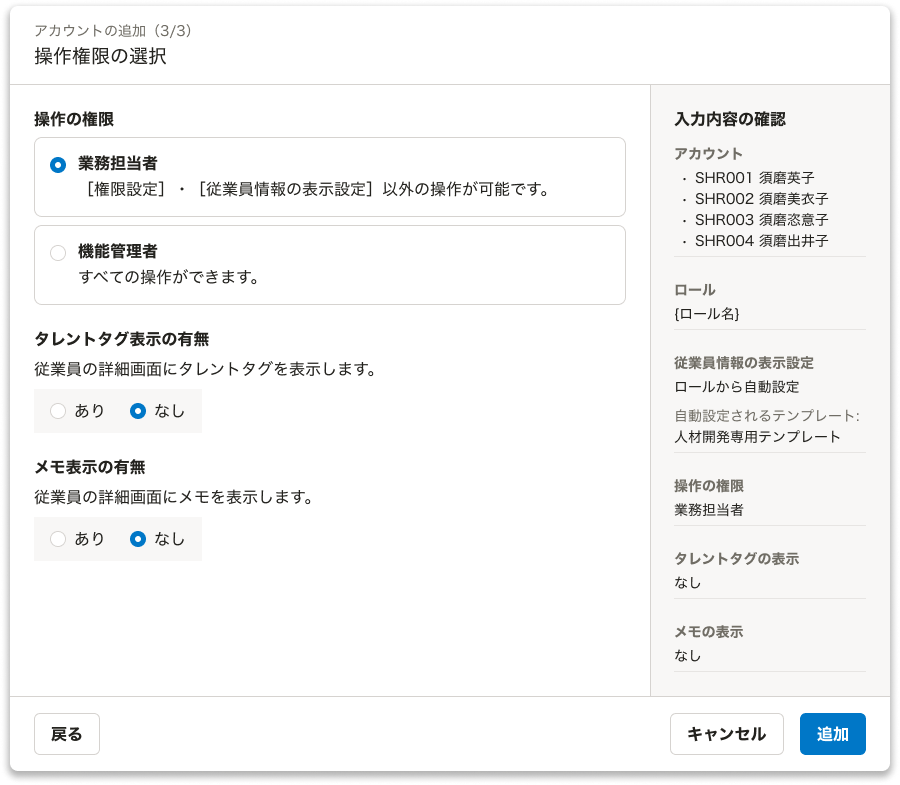

  </ImgWithDesc>

</Grid>

## アカウント編集ダイアログ

一覧画面の編集ボタンから呼び出すダイアログです。ここでは対象のアカウントは一意に定まっているので、多少長くなってもワンダイアログ式のデザインを採用します。

対象アカウントは[FormControl](/products/components/form-control/)ではなく、[DefinitionList](/products/components/definition-list/)を使用してアカウント名を表示します。

<Grid size="300px">

  <ImgWithDesc description="基本パターン（A）の場合">

  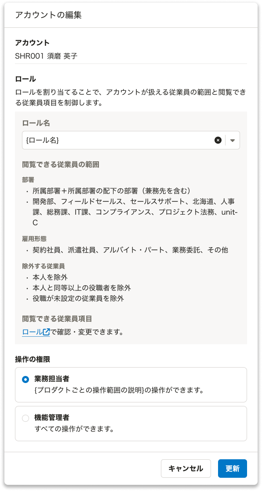

  </ImgWithDesc>

  <ImgWithDesc description="独自オブジェクト権限がある（C）場合">

  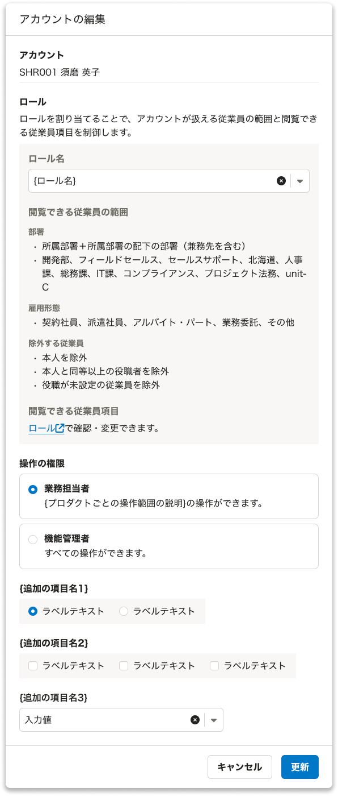

  </ImgWithDesc>

  <ImgWithDesc description="カスタム操作権限と独自オブジェクト権限がある場合">

  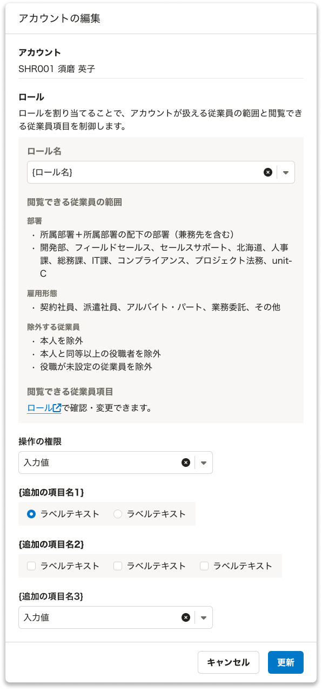

  </ImgWithDesc>

</Grid>

## 構成（ABAC）

［WIP］

## 関連リンク

- [権限設定](/products/design-patterns/permissions-settings/)（親ページ）
- [一覧画面のパターン](/products/design-patterns/permissions-settings/list/)
