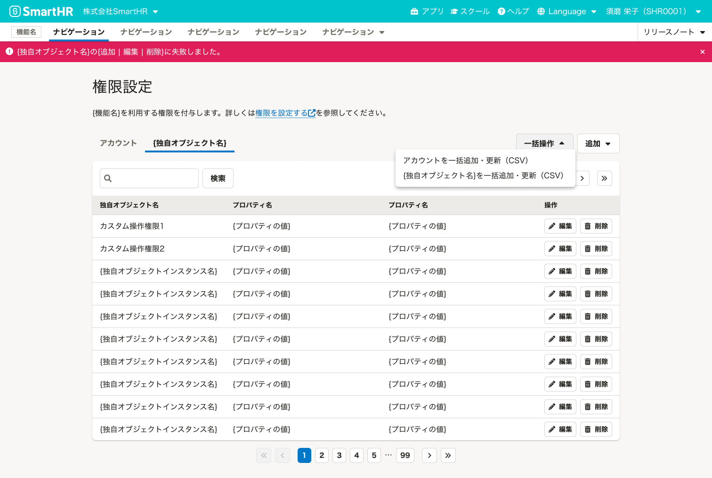

import Grid from '@/components/article/Grid.astro'
import ImgWithDesc from '@/components/article/ImgWithDesc.astro'

権限を持つアカウントを一覧表示する画面の構成をまとめています。
一覧ではアカウントを、[よくあるテーブル](/products/design-patterns/smarthr-table/)のパターンで表示します。

対象は[権限設定](/products/design-patterns/permissions-settings/)ページのRBACパターンのうち、ガイドライン化対象であるA・B・Cパターンです。

- [構成（パターンA）](#h2-0)
- [構成（パターンB・C）](#h2-1)

## 構成（パターンA）

A（基本パターン）では、権限一覧でアカウント一覧のコレクションを表示します。テーブルにはインスタンスの「アカウント名」「ロール」「操作の権限」を表示し、操作列を設けます。

構成は[よくあるテーブル](/products/design-patterns/smarthr-table/)のパターンに従います。[よくあるテーブル](/products/design-patterns/smarthr-table/)の詳細はレイアウトパターンを参照してください。

構成要素は次のとおりです。

- [1. 画面タイトル](#h3-0)
- [2. 画面説明テキスト](#h3-1)
- [3. テーブル](#h3-2)

**一覧（アカウントのみ）**

ロールを持つプロダクトでは、テーブルに「ロール」列を追加します。検索、ページネーション、一括操作なども[よくあるテーブル](/products/design-patterns/smarthr-table/)のパターンに従います。

**一覧（ロールを含む場合）**
![スクリーンショット:パターンAの権限設定画面。テーブルにアカウント名、ロール、操作の権限、操作の4つの列が表示されている。テーブルの上部には検索欄とページネーション、[一括操作]と[アカウントを追加]のボタンが並んでいる。](./images/permissions-settings1-role.png)

### 1. 画面タイトル

画面タイトルは「権限設定」とします。

### 2. 画面説明テキスト

機能の説明や操作に関する補足テキスト、ヘルプセンターへのリンクなどを書きます。特別な補足がない場合は、以下のメッセージを使ってください。

`{機能名}を利用する権限を設定します。詳しくは、{ヘルプへのリンク}を参照してください。`

### 3. テーブル

表には以下の情報を必ず表示します。必要に応じて、列を追加しても問題ありません。

- **アカウント名**
  - [アカウントの表記方法ガイドライン](/products/contents/ui-text/crew-account/#account-display-format)を参照してください。
- **ロール**
  - ロール名を表示します。
- **操作の権限**
  - 権限名を表示します。
- **操作**
  - アカウントを操作するボタンを置きます。必要に応じて、[編集]と[削除]以外のボタンを置いても問題ありません。
  - コンポーネントは[Secondaryボタン](/products/components/button/)のサイズ小を使います。

#### アカウントのみの場合

アカウントのみを扱う場合のセクションタイトルは`アカウント`、オブジェクトの追加ボタンラベルは`追加`としてください。

#### 初期表示

基本は[よくあるテーブルの初期表示](/products/design-patterns/smarthr-table/#h3-7)のパターンに従いますが、メッセージ部分は、`{機能名}の権限を持つアカウントはまだ登録されていません。`とします。

## 構成（パターンB・C）

B（基本+カスタム操作権限パターン）とC（基本+独自オブジェクト権限パターン）では、[TabBar](/products/components/tab-bar/)コンポーネントを使用して「アカウント」と「カスタム操作権限 or 独自オブジェクト権限」の一覧を分けます。

**一覧（アカウントと独自の権限設定を扱う場合）**

アカウントに紐づけが必要な独自の権限設定がある場合は、[TabBar](/products/components/tab-bar/)を使って並列に表示します。TabBarのタイトルは左から`アカウント`、`{独自オブジェクト}`とします。

「追加」アクションは[DropdownMenuButton](/products/components/dropdown/dropdown-menu-button/)コンポーネントを使い、「アカウント」と「カスタム操作権限 or 独自オブジェクト」を分けます。それぞれのオブジェクトを追加するDropdownMenuButtonのラベルは`追加`とします。ドロップダウンパネル内のボタンラベルはそれぞれ、`アカウントを追加`、`{独自オブジェクト}を追加`とします。

ロールを持つプロダクトでは、アカウントのタブに「ロール」列を追加します。独自オブジェクトのタブでは、独自オブジェクトのインスタンス一覧を表示します。表示する列は独自オブジェクトの性質に合わせて決めてください。

<Grid size="300px">

  <ImgWithDesc description="アカウントのタブ">

  ![スクリーンショット:パターンB・Cの権限設定画面のアカウントのタブ。テーブルにアカウント名、ロール、操作の権限、独自オブジェクト名、操作の5つの列が表示されている。[追加]のドロップダウンパネルが開いている。](./images/permissions-settings2-role.png)

  </ImgWithDesc>

  <ImgWithDesc description="独自オブジェクトのタブ">

  

  </ImgWithDesc>

</Grid>

## 構成（ABAC）

［WIP］

## 関連リンク

- [権限設定](/products/design-patterns/permissions-settings/)（親ページ）
- [アカウント追加・編集ダイアログのパターン](/products/design-patterns/permissions-settings/account-dialog/)
- [よくあるテーブル](/products/design-patterns/smarthr-table/)
