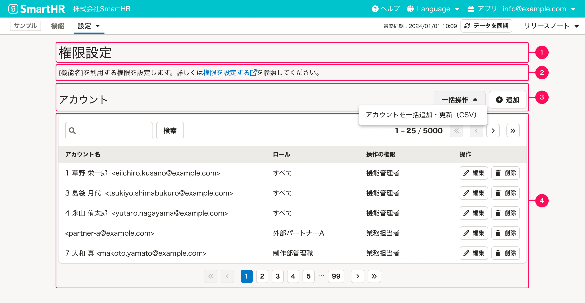
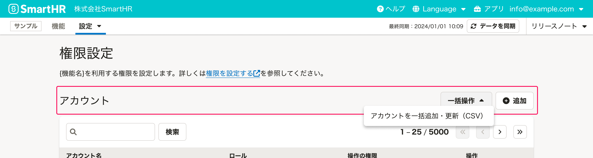
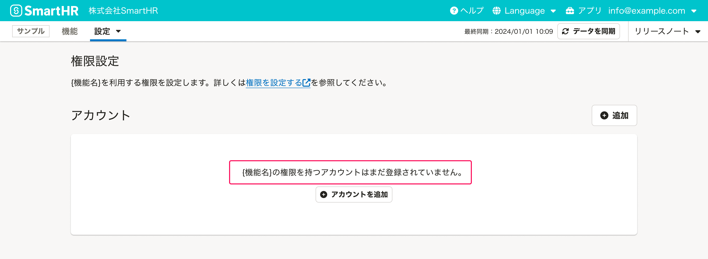
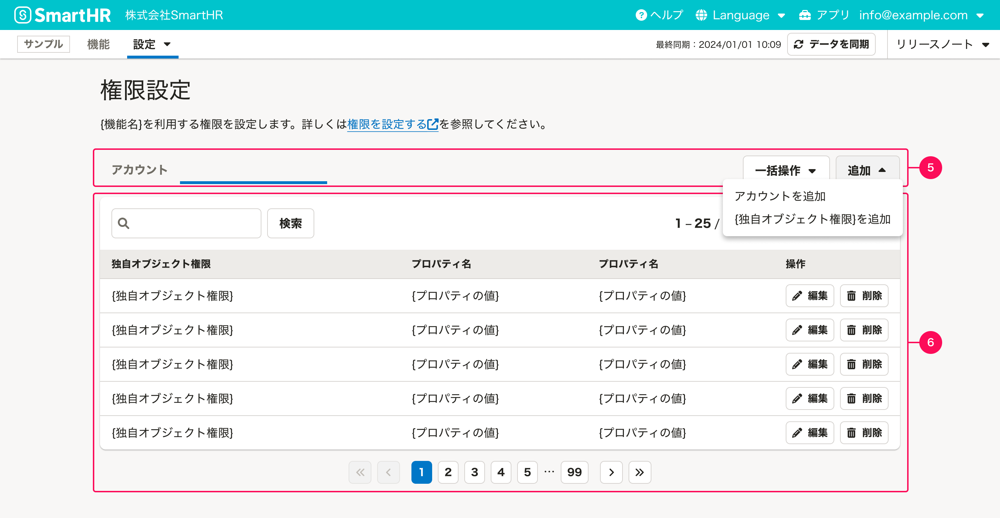
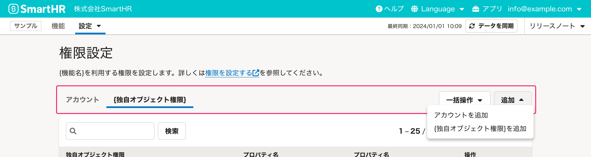
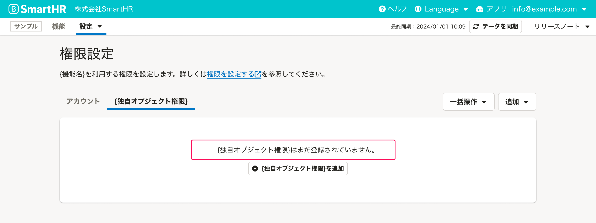

import Grid from '@/components/article/Grid.astro'
import ImgWithDesc from '@/components/article/ImgWithDesc.astro'

RBACの独自権限パターンにおける一覧画面の設計をまとめています。権限の構成パターンによって画面の構成が異なります。

アカウント追加や編集画面については[RBAC独自権限の詳細画面](/products/design-patterns/permissions-settings/rbac-standalone/single/)を参照してください。

## 構成パターンA

構成パターンAは、「アカウント」「ロール」「操作の権限」の3つのプロパティを持ちます。

構成パターンAの一覧画面では、アカウントのコレクションをテーブルで表示します。テーブルにはインスタンスの「アカウント名」「ロール」「操作の権限」を表示し、操作列を設けます。

画面の構成要素は次のとおりです。

- [1. 画面タイトル](#h3-0)
- [2. 画面説明テキスト](#h3-1)
- [3. テーブルタイトルとアクション](#h3-2)
- [4. テーブル](#h3-3)

### 1. 画面タイトル

画面タイトルは「権限設定」とします。

### 2. 画面説明テキスト

機能の説明や操作に関する補足テキスト、ヘルプセンターへのリンクなどを書きます。特別な補足がない場合は、以下のメッセージを使ってください。

`{機能名}を利用する権限を設定します。詳しくは、{ヘルプへのリンク}を参照してください。`

### 3. テーブルタイトルとアクション

テーブルのタイトルは`アカウント`とします。アクションにはオブジェクトの追加ボタンを配置し、ラベルは`追加`としてください。

CSVを用いた一括操作がある場合は追加の[DropdownMenuButton](/products/components/dropdown/dropdown-menu-button/)を配置しても構いません。

### 4. テーブル

基本的なレイアウトは[よくあるテーブル](/products/design-patterns/smarthr-table/)に従います。テーブルには以下の情報を必ず表示し、必要に応じて列を追加してください。

|列の項目|表示する内容|
|:---|:---|
| アカウント名 | 権限を付与するアカウントです。形式は[アカウントの表記方法ガイドライン](/products/contents/ui-text/crew-account/#account-display-format)を参照してください。 |
| ロール | ロール名を表示します。 |
| 操作の権限 | 操作の権限名を表示します。 |
| 操作 | アカウントの権限を操作するボタンを置きます。必要に応じて、[編集]と[削除]以外のボタンを置いても問題ありません。コンポーネントは[Secondaryボタン](/products/components/button/)のサイズ小を使います。 |

#### 初期表示

[よくあるテーブルの初期表示](/products/design-patterns/smarthr-table/#h3-7)のパターンに従いますが、メッセージ部分は、`{機能名}の権限を持つアカウントはまだ登録されていません。`とします。

## 構成パターンB, C

**構成パターンB**  
「アカウント」「ロール」「カスタム操作権限」の3つのプロパティを持ちます。

**構成パターンC**  
「アカウント」「ロール」「操作の権限」の3つのプロパティと、1つ以上の「独自オブジェクト権限」を持ちます。

構成パターンB, Cでは、アカウントの一覧に加えてカスタム操作権限または独自オブジェクト権限の一覧をタブで表示します。

画面の構成要素は次のとおりです。

- 1. 画面タイトル
- 2. 画面説明テキスト
- [5. タブとアクション](#h3-4)
- [6. テーブル](#h3-5)

「1. 画面タイトル」と「2. 画面説明テキスト」は構成パターンAと同様です。

### 5. タブとアクション

構成パターンB, Cでは、[TabBar](/products/components/tab-bar/)コンポーネントを使用して「アカウント」と「カスタム操作権限」または「独自オブジェクト権限」の一覧を分けます。

TabBarのタイトルは左から`アカウント`、`操作の権限`または`{独自オブジェクト権限}`とします。

それぞれのオブジェクトを追加するにはDropdownMenuButtonを使い、ラベルは`追加`とします。ドロップダウンパネル内のボタンラベルはそれぞれ、`アカウントを追加`、`操作の権限を追加`、`{独自オブジェクト権限}を追加`とします。

CSVを用いた一括操作がある場合は追加のDropdownMenuButtonを配置しても構いません。

独自オブジェクト権限の管理は、権限管理画面のなかに配置しなくても構いません。独自オブジェクトの性質に合わせて適宜判断してください。

### 6. テーブル

「アカウント」タブの表示要件は[構成パターンAのテーブル](#h3-3)と同様です。

「カスタム操作権限」または「独自オブジェクト権限」タブの内容も、アカウントと同様によくあるテーブルで表示しますが、プロダクトの仕様に応じた項目を表示してください。

#### 初期表示

**構成パターンB**  
カスタム操作権限はユーザーが自由に追加できますが、システムプリセットの権限（「業務担当者」と「機能管理者」など）があるため、初期表示はそれらの権限を表示します。

**構成パターンC**  
アカウントと同様、よくあるテーブルの初期表示のパターンに従いますが、メッセージ部分は、`{独自オブジェクト権限}はまだ登録されていません。`とします。

## 関連リンク

- [独自権限パターン](/products/design-patterns/permissions-settings/rbac-standalone/)
- [RBAC独自権限の詳細画面](/products/design-patterns/permissions-settings/rbac-standalone/single/)
