import Grid from '@/components/article/Grid.astro'
import ImgWithDesc from '@/components/article/ImgWithDesc.astro'

RBACの独自権限パターンにおける詳細画面の設計をまとめています。アカウントの追加と編集で画面の構成が異なります。

アカウント一覧については[RBAC独自権限の一覧画面](/products/design-patterns/permissions-settings/rbac-standalone/collection/)を参照してください。

## アカウントの追加

アカウントの追加は、[一覧](/products/design-patterns/permissions-settings/rbac-standalone/collection/)の[（アカウントを）追加]ボタンを押したときに、[モーダルダイアログ](/products/design-patterns/modal-ui/#h3-1)で表示します。

さらに、権限を付与したいアカウントや、独自オブジェクト権限の数などに応じて、2つのダイアログを使い分けます。

- [ActionDialogパターン](#h3-0)：1つのダイアログにすべての入力欄を並べる
- [StepFormDialogパターン](#h3-1)：プロパティごとにステップを分ける

### ActionDialogパターン

権限の構成パターンA, B, Cで、**アカウント選択のUIがシンプルでよい場合**のパターンです。[ActionDialog](/products/components/dialog/action-dialog/)コンポーネントを使用し、ダイアログコンテンツに入力欄を設けます。

ActionDialogパターンは主に次のような場合に採用します。

- 限られたユーザーしか機能を使わないなど、権限を付与したいアカウントが少数かつ自明なとき
- 初期リリースの開発で実装工数を圧縮したいとき

また、構成パターンC（基本権限と独自オブジェクト権限）の場合は含められる独自オブジェクト権限の入力欄は**1つまで**とし、2つ以上ある場合は[StepFormDialogパターン](#h3-1)を採用します。

#### 画面構成

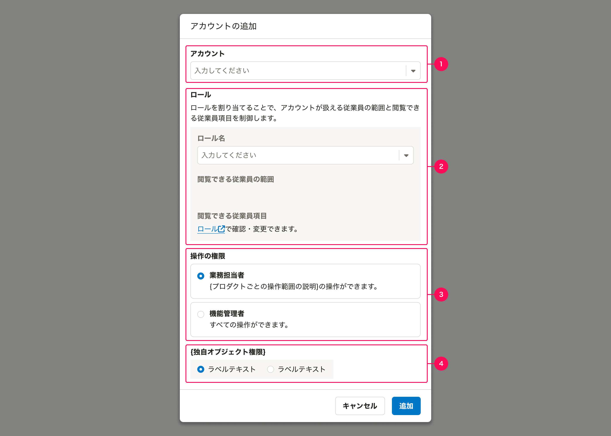

|構成要素|説明|
|:---|:---|
| 1. アカウント | 複数のアカウントを一括で追加できるよう、[MultiCombobox](/products/components/combobox/multi-combobox/)を使います。アカウントの検索対象は、プロダクトの仕様に応じて明記してください。 |
| 2. ロール | [SingleCombobox](/products/components/combobox/single-combobox/)を使い、ロール名を選択します。ロール名を選ぶと、そのロールで閲覧できる従業員の範囲が展開されます。表示される情報量はロールの設定内容によって変わります。 |
| 3. 操作の権限 | [RadioButtonPanel](/products/components/radio-button-panel/)を使い、操作の権限を選択します。プロダクトの仕様に応じて、必要な操作の権限を定義してください。カスタム操作権限を持つプロダクトでは、SingleComboboxを使ってください。 |
| 4. 独自オブジェクト権限 | 独自オブジェクト権限の性質や項目数に応じて、[Combobox](/products/components/combobox/)、[RadioButton](/products/components/radio-button/)、RadioButtonPanelなどのコンポーネントを使い分けてください。 |

#### 構成パターンA

構成パターンAは、「アカウント」「ロール」「操作の権限」の3つのプロパティの入力欄をダイアログの中に縦に並べます。

<Grid size="calc((100% - 24px * 1) / 2)">
  <ImgWithDesc description="アカウント追加ダイアログの初期表示。ロールが未選択のとき、閲覧できる従業員の範囲は空にする">
  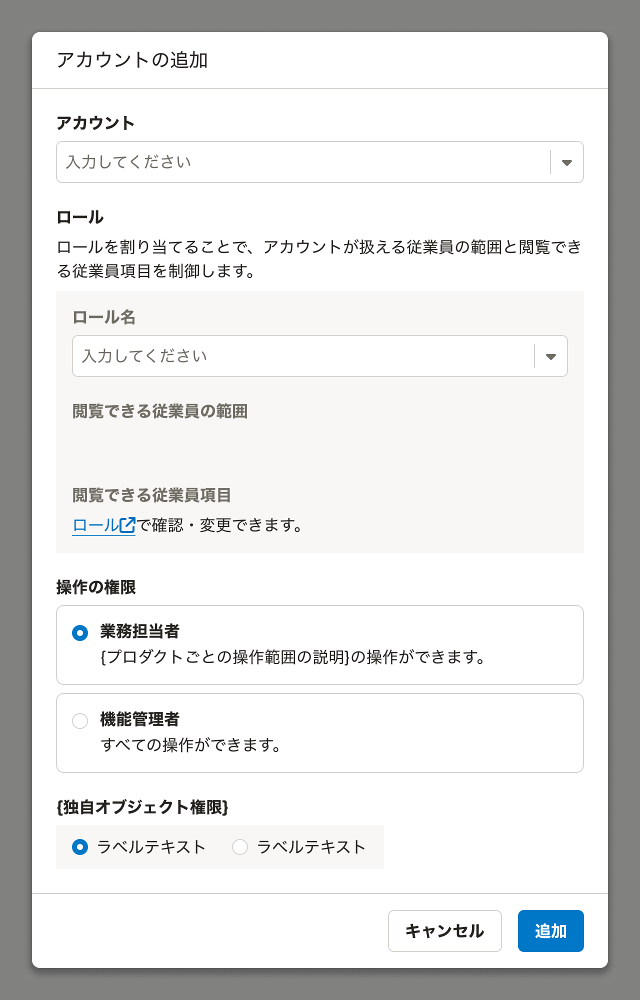
  </ImgWithDesc>
  <ImgWithDesc description="ロールが選択されたら、設定内容に応じた閲覧範囲を表示する">
  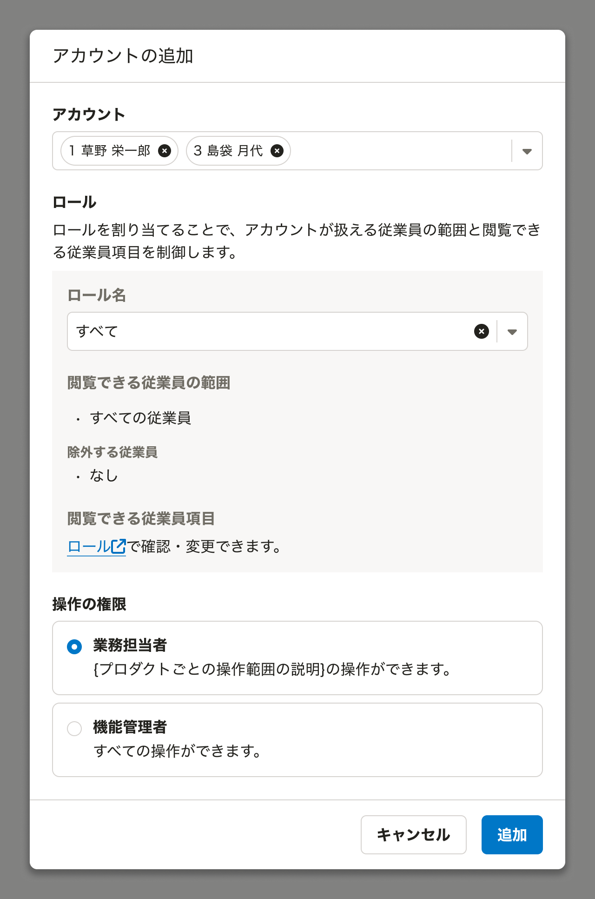
  </ImgWithDesc>
</Grid>

#### 構成パターンB, C

**構成パターンB**  
「アカウント」「ロール」「カスタム操作権限」の3つのプロパティの入力欄をダイアログの中に縦に並べます。カスタム操作権限をユーザーが自由に追加できるため、RadioButtonPanelではなくSingleComboboxを使います。

**構成パターンC**  
「アカウント」「ロール」「操作の権限」「独自オブジェクト権限」の4つのプロパティの入力欄をダイアログの中に縦に並べます。独自オブジェクト権限の性質や項目数に応じて、Combobox、RadioButton、RadioButtonPanelなどのコンポーネントを使い分けてください。

ただし、独自オブジェクト権限の入力欄は**1つまで**とし、2つ以上ある場合は[StepFormDialogパターン](#h3-1)を採用します。

<Grid size="calc((100% - 24px * 1) / 2)">
  <ImgWithDesc description="構成パターンBでは、操作の権限はSingleComboboxで表示する">
  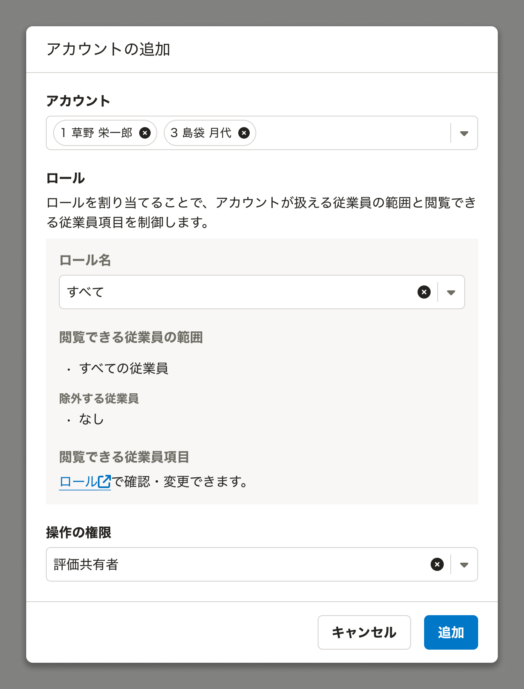
  </ImgWithDesc>
  <ImgWithDesc description="構成パターンCでは、操作の権限の下に独自オブジェクト権限の入力欄を表示する">
  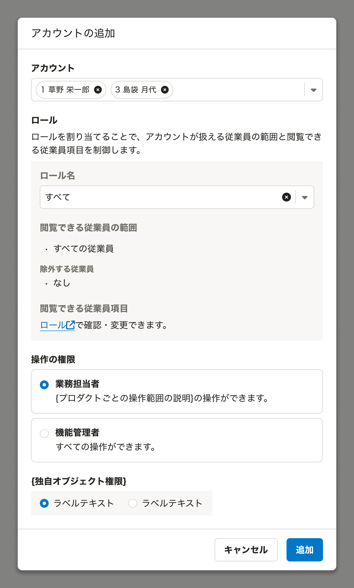
  </ImgWithDesc>
</Grid>

### StepFormDialogパターン

権限の構成パターンA, B, Cで、**アカウント選択時に部署や役職などの情報も確認しながら操作したい場合**のパターンです。[StepFormDialog](/products/components/dialog/step-form-dialog/)コンポーネントを使用し、2ステップ以上に分けて各プロパティの入力欄を設けます。

StepFormDialogパターンは主に次のような場合に採用します。

- 多くのアカウントに権限を付与するとき
- 独自オブジェクト権限の数が2つ以上あるとき

特にアカウント選択は、権限付与のミスを防ぐため所属部署や役職などの従業員情報も確認できるように[Table](/products/components/table/)コンポーネントを使って表示します。

#### 画面構成

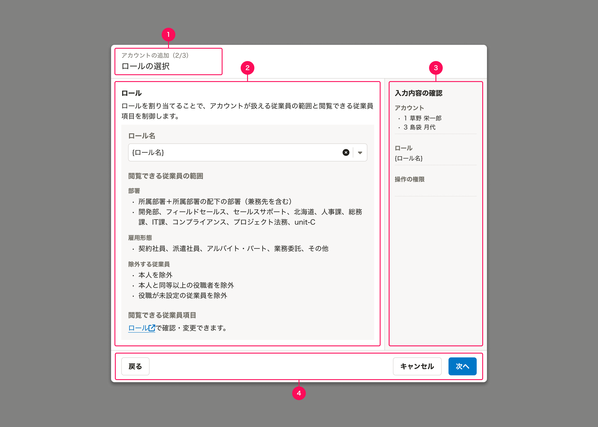

|要素|説明|
|:---|:---|
| 1. タイトル | ステップのタイトルを表示します。「アカウントの追加」とステップ数は、サブヘディングで表示します。 |
| 2. 入力エリア | ステップごとの項目を表示します。 |
| 3. 確認エリア | 各ステップで入力した内容を確認できるエリアです。表示は即座に反映させます。各項目は[DefinitionList](/products/components/definition-list/)で表示します。[確認エリアのアカウントの表示](#h5-0)も参照してください。 |
| 4. フッター | 2ステップ目以降は[戻る]ボタンを表示し、最後のステップの[Primaryボタン](/products/components/button/#h3-1)のラベルは「追加」とします。 |

##### 確認エリアのアカウントの表示

アカウントの表示は膨大になる可能性があるため、6件以上のアカウントを選択している場合はトグルボタンで表示を切り替えられるようにします。デフォルトは省略表示としますが、選択したアカウントが5件以内の場合はトグルボタンは表示しません。

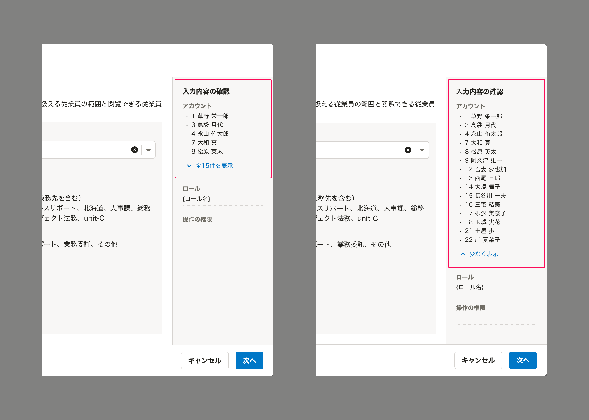

**省略表示**  
先頭の5件を表示し、`FaAngleDownIcon`を`アイコン付き（左）`（プレフィックス）に設定した[Tertiaryボタン](/products/components/button/#h3-3)で`全{n}件を表示`と表示します。`n`は選択したアカウントの合計件数です。

**全件表示**  
すべてのアカウントを表示し、`FaAngleUpIcon`を`アイコン付き（左）`（プレフィックス）に設定したTertiaryボタンで`少なく表示`と表示します。

#### 構成パターンA, B

3つのプロパティをそれぞれステップに表示します。

- ステップ1：アカウントの選択
- ステップ2：ロールの選択
- ステップ3：操作の権限の選択

<ImgWithDesc description="ステップ1：アカウント選択。所属部署や役職なども確認しながら選択できるようにする">
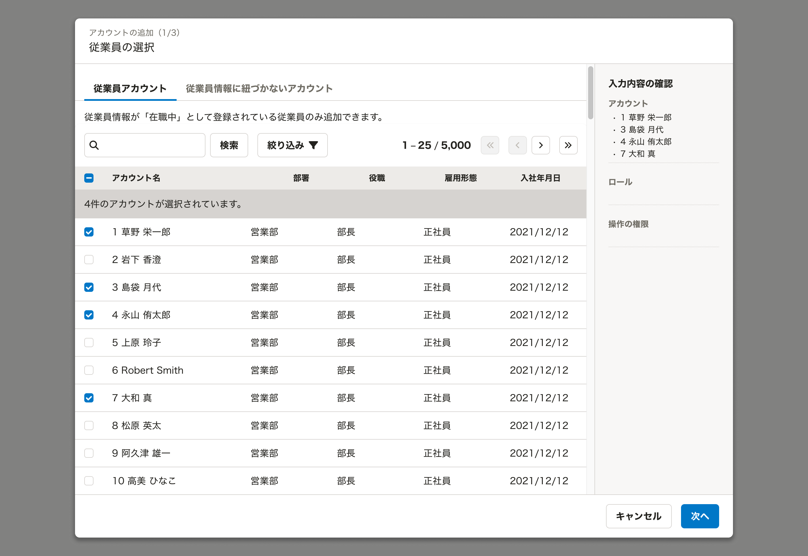
</ImgWithDesc>

<ImgWithDesc description="ステップ2：ロールの選択">
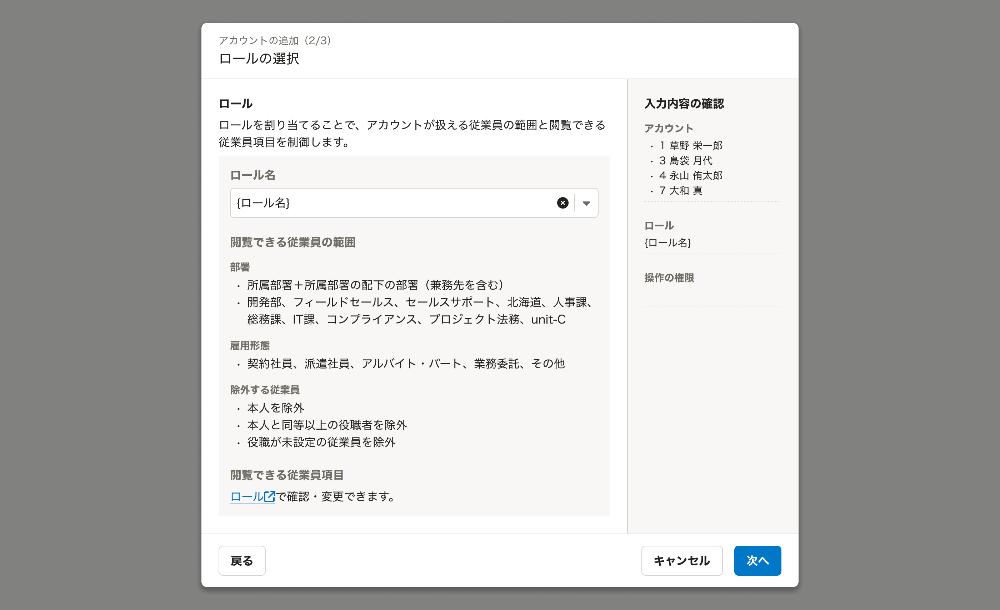
</ImgWithDesc>

<ImgWithDesc description="ステップ3：操作の権限選択">
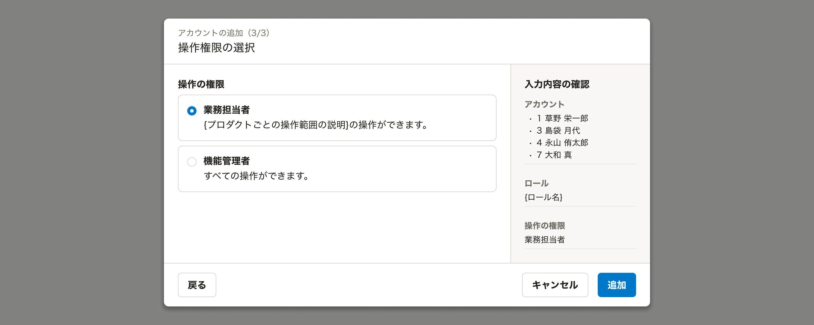
</ImgWithDesc>

<ImgWithDesc description="ステップ3：カスタム操作権限を持つ場合はSingleComboboxが望ましい">
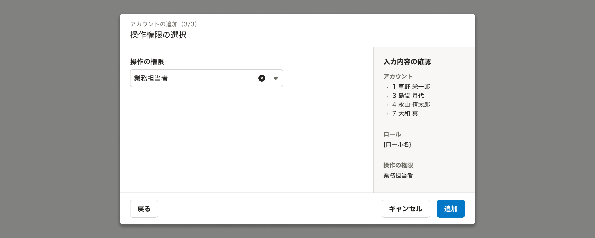
</ImgWithDesc>

#### 構成パターンC

構成パターンCでは、3ステップ目の操作の権限の下に独自オブジェクト権限の入力欄を設けます。コンテキストや数を考慮して4ステップ目に分けることも検討してください。

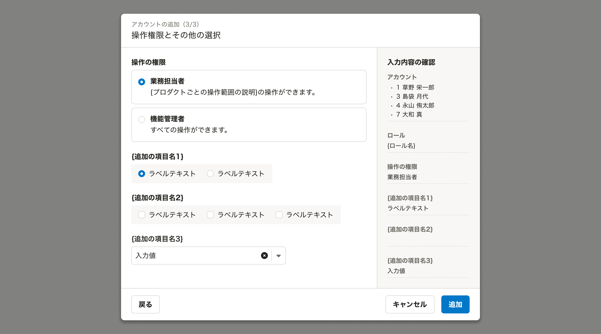

#### 構成パターンCの派生形

独自オブジェクト権限を必ずステップ3にまとめる必要はありません。独自オブジェクト権限の性質に応じて、適切なステップに配置してください。

例えば、キャリア台帳では「従業員情報の表示設定」がロールに強く関連しているため、ステップ2でロールと一緒に入力できるようにします。

<ImgWithDesc description="ステップ1：アカウント選択">
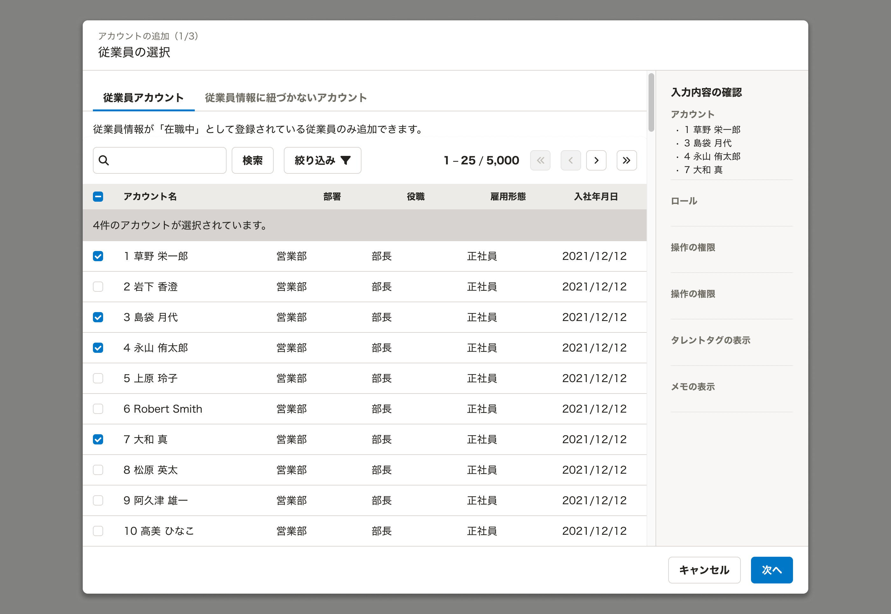
</ImgWithDesc>

<ImgWithDesc description="ステップ2：ロールに強く関連する「従業員情報の表示設定」を同じステップ2にまとめ、確認エリアの意匠も調整されている">
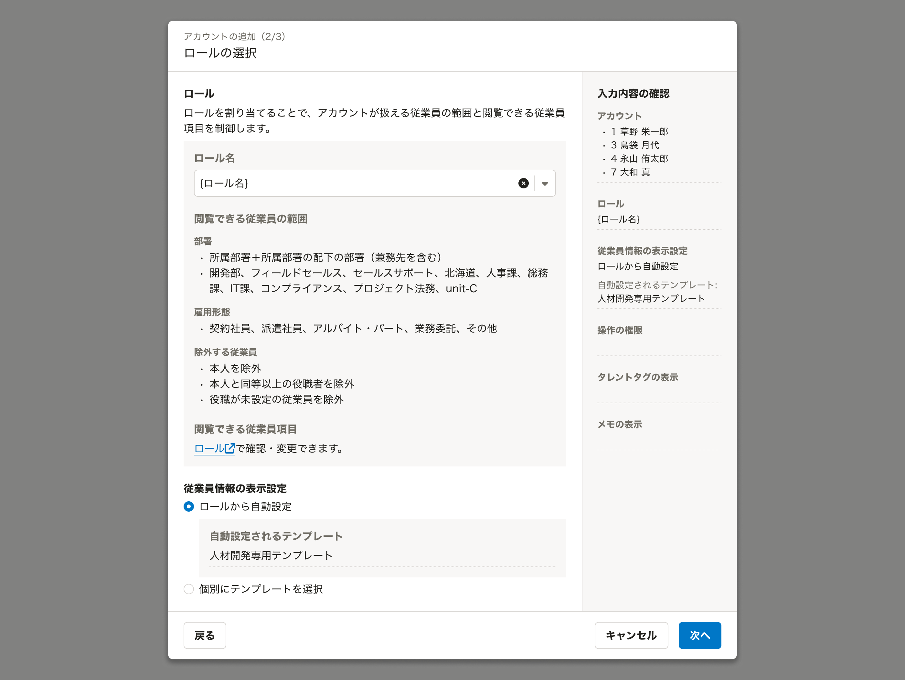
</ImgWithDesc>

<ImgWithDesc description="ステップ3：項目数が多いため、ヘルプメッセージで補足している">
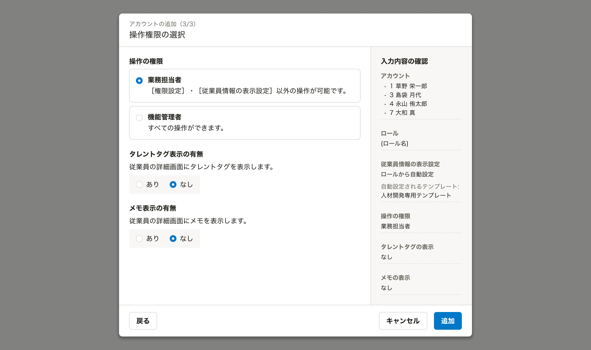
</ImgWithDesc>

## アカウントの編集

[一覧](/products/design-patterns/permissions-settings/rbac-standalone/collection/)の[（アカウントを）編集]ボタンから呼び出すダイアログです。ここでは対象のアカウントは一意に定まっているので、ActionDialogコンポーネントを採用して1画面にまとめます。

ダイアログタイトルは`アカウントの編集` 、Primaryボタンのラベルは`更新` とします。

### 画面構成

<Grid size="calc((100% - 24px * 1) / 2)">
  <ImgWithDesc description="構成パターンAの場合">
  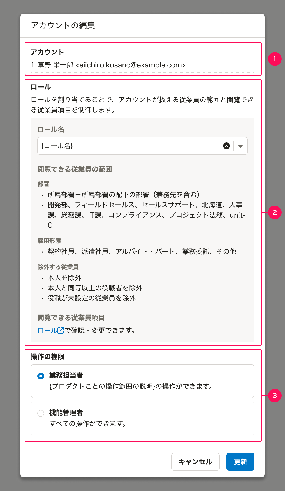
  </ImgWithDesc>
  <ImgWithDesc description="構成パターンCの場合。操作の権限の下に独自オブジェクト権限を列挙する">
  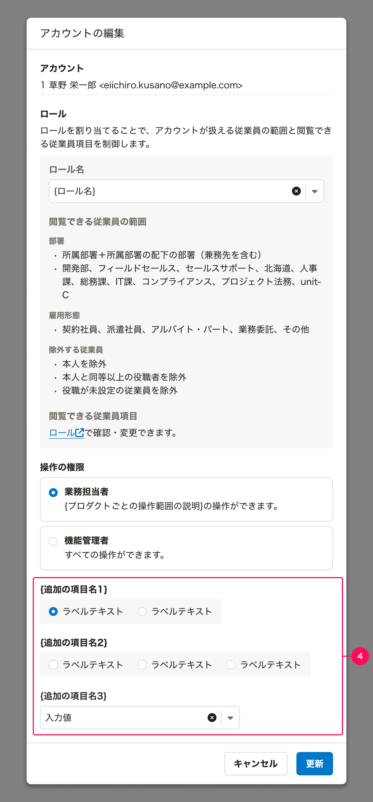
  </ImgWithDesc>
</Grid>

|要素|説明|
|:---|:---|
| 1. アカウント | 一意に定まり、かつ変更できないため、[DefinitionList](/products/components/definition-list/)を使ってアカウントを表示します。 |
| 2. ロール | SingleComboboxを使い、ロール名を選択します。ロール名の下には、そのロールで閲覧できる従業員の範囲が展開されます。ロール名を選ぶと、そのロールで閲覧できる従業員の範囲がロール名の下に展開されます。表示される情報量はロールの設定内容によって変わります。 |
| 3. 操作の権限 | RadioButtonPanelを使い、操作の権限を選択します。プロダクトの仕様に応じて、必要な操作の権限を定義してください。カスタム操作権限を持つプロダクトでは、[構成パターンB, C](#h4-2)にならってSingleComboboxを使ってください。 |
| 4. 独自オブジェクト権限 | 独自オブジェクト権限の性質や項目数に応じて、Combobox、RadioButton、RadioButtonPanelなどのコンポーネントを使い分けてください。 |

## アカウントの削除

[一覧](/products/design-patterns/permissions-settings/rbac-standalone/collection/)の[（アカウントを）削除]ボタンから呼び出すダイアログです。アカウントの編集と同様に対象のアカウントは一意に定まっているので、ActionDialogコンポーネントを採用します。

基本的な考え方は[削除ダイアログ](/products/design-patterns/delete-dialog/)を参照してください。

ダイアログタイトルは`アカウントの削除`とします。Submitには[Dangerボタン](/products/components/button/#h3-4)を使用してラベルは`削除`とします。

### 画面構成

削除ダイアログのライティングに従い、削除の対象となるオブジェクトをDefinitionListで提示します。

## 関連リンク

- [独自権限パターン](/products/design-patterns/permissions-settings/rbac-standalone/)
- [RBAC独自権限の一覧画面](/products/design-patterns/permissions-settings/rbac-standalone/collection/)
