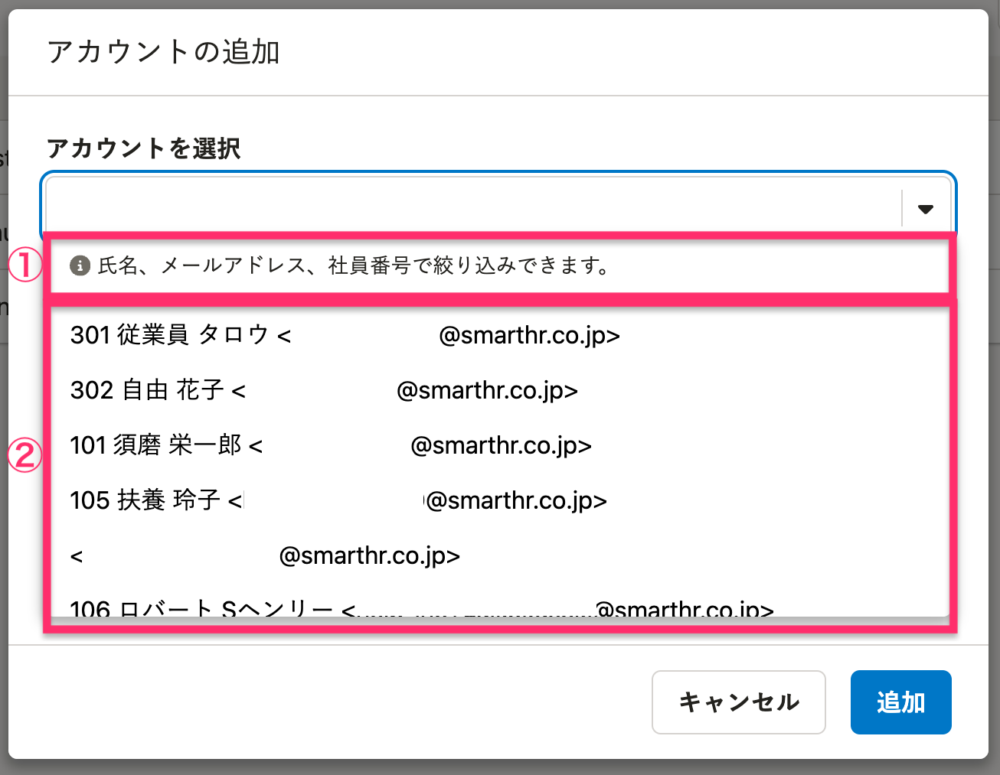
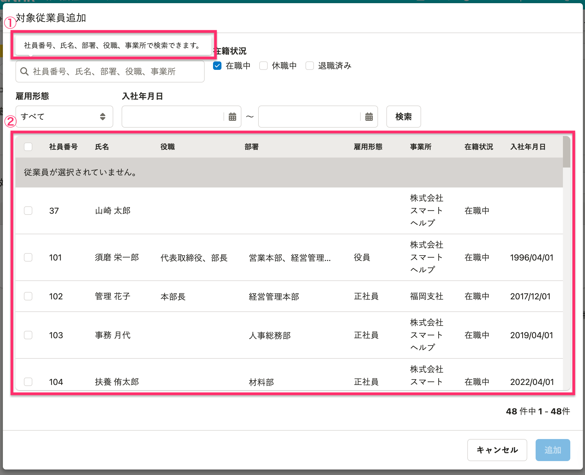

SmartHRにおける、アカウントや従業員を選択する画面のパターンをまとめています。

## 基本的な考え方

アカウントや従業員を選択するUIでは、表示されている項目が適切でないと、ユーザーがアカウントや従業員を誤って選択してしまうことがあります。  
氏名だけでなく社員番号・メールアドレス・部署・役職など、一意に特定するための情報を併記します。同姓同名のアカウントや従業員がいても判別できるようにし、誤選択を防ぐためです。  
また、ビジネスネームを設定している従業員の場合、ビジネスネームと戸籍名のどちらを表示するかをユースケースにあわせて検討し、使い分けます。

## 画面パターン

### ComboBoxを使用する画面

[ComboBox](/products/components/combo-box/)を使用してアカウントや従業員を選択する画面パターンです。  
権限を付与するアカウントを選択する場合などで利用します。

### 1. 検索できる項目の表示

[ComboBox](/products/components/combo-box/)のガイドラインに従い、検索可能な項目を明記します。  
たとえば、`{社員番号}、{氏名}、{メールアドレス}で検索できます。`と表示します。  
必要に応じて、検索できる項目を追加しても問題ありません。

#### 参考

[アカウントや従業員氏名の表記](/products/contents/ui-text/crew-account/)

### 2. 選択候補の表示

次の項目を表示します。

- 社員番号
- アカウント名
  - 氏名
  - メールアドレス

アカウント名は、`{姓} {名}<{メールアドレス}>`と表示します。  
メールアドレスの登録がない場合は`{姓} {名}`、従業員情報と紐づいていないアカウントの場合は`<{メールアドレス}>`とします。

#### 例

社員番号、アカウント名、メールアドレスが登録されている場合：  
`102 管理 花子<hanako.kanri@example.com >`

社員番号が登録されていない場合：  
`管理 花子<hanako.kanri@example.com >`

メールアドレスが登録されていない場合：  
`管理 花子`

従業員情報と紐づいていない場合：  
`<hanako.kanri@example.com >`

### テーブルを使用する画面

テーブルを使用して、一覧の中からアカウントや従業員を選択させる画面パターンです。  
グループに追加する従業員をまとめて選択する画面などで利用します。

### 1. 検索できる項目の表示

検索可能な項目を明記します。  
たとえば、`{社員番号}、{氏名}で検索できます。`と表示します。

必要に応じて、検索できる項目を追加しても問題ありません。  
検索できる項目を追加した場合は、`{社員番号}、{氏名}、{事業所}で検索できます。`など、説明内にも項目を追記します。

#### 参考

[アカウントや従業員氏名の表記](/products/contents/ui-text/crew-account/)

### 2. 選択候補の表示

アカウントや従業員を選択する画面のため、氏名は必ず表示します。  
氏名のほかに、同姓同名のアカウントや従業員がいる場合に判別できる情報を、複数組み合わせて表示します。  
同姓同名を判別するために表示する情報として、社員番号を推奨しています。

従業員情報に紐づかないアカウントも表示対象に含む場合は、メールアドレスを表示します。

必要に応じて、次のような列を追加しても問題ありません。
- 部署
- 役職
- 雇用形態
- 事業所
- 在籍状況
- 入社年月日

テーブルの表示領域が狭い場合は、社員番号やメールアドレスの列を設けず、氏名の前後に併記しても構いません。
- `{社員番号} {氏名}`
- `{氏名} <{メールアドレス}>`
