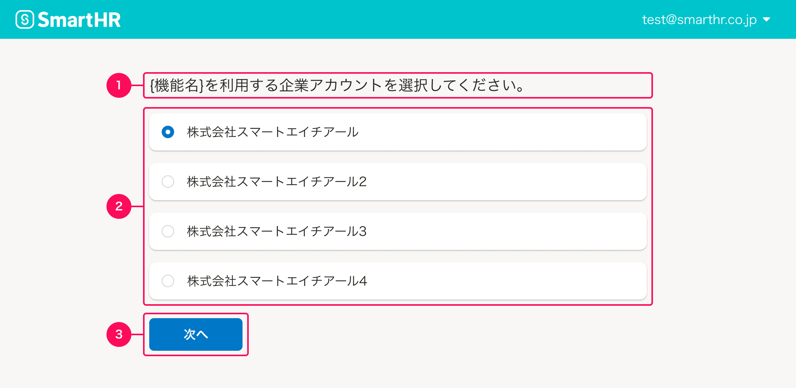

import DesignPatternCodeBlock from '@/components/article/DesignPatternCodeBlock.astro'

SmartHR基本機能からオプション機能に移動する際に、企業アカウントを選択する画面を定義します。

## 基本的な考え方

ユーザーが企業アカウントを選択する操作と、次の画面に移動する動作は、それぞれ意図が異なるためアクションを分けて配置します。  
企業アカウントの選択と同時に画面が移動すると、企業アカウントを誤って選択した場合に意図しない選択状態で移動してしまうことになるため、この誤操作を防ぐ狙いがあります。

## 構成

企業アカウント選択画面の構成は次の通りです。

1. 見出し
2. 企業アカウントの選択リスト
3. 「次へ」ボタン

### 1. 見出し
[セクションタイトル](/products/components/heading/#h3-1)を使用し、`{機能名}を利用する企業アカウントを選択してください。`と表記します。  
`{機能名}`には、移動先のオプション機能の機能名を挿入します。

### 2. 企業アカウントの選択リスト
オプション機能にログインしたい企業アカウントを1つ選択するリストです。  
リストの選択には[RadioButton](/products/components/radio-button/)を使用し、[Base](/products/components/base/)で囲むことでオブジェクトを選択していることを強調します。

### 3. 「次へ」ボタン
次の画面へ移動します。[Primaryボタン](/products/components/button/#h3-0)を使います。

## レイアウト

企業アカウント選択画面のレイアウトは次の通りです。

<DesignPatternCodeBlock componentName="SelectCompanyAccount" componentTitle="企業アカウント選択" />
