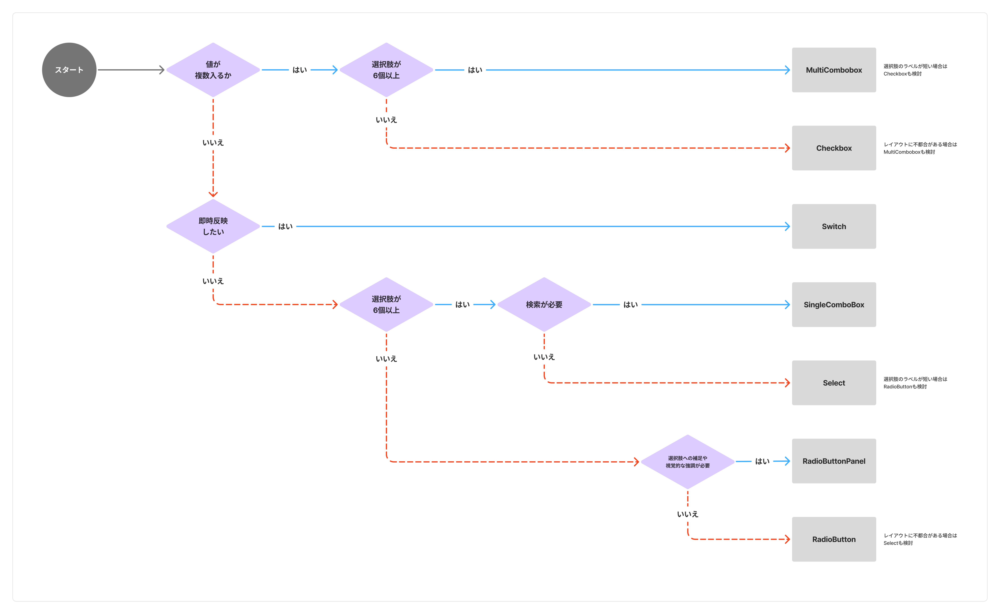

import { BaseColumn, ResponseMessage } from 'smarthr-ui'

選択操作に関わるコンポーネント（[MultiCombobox](/products/components/combo-box/multi-combo-box/)、[SingleCombobox](/products/components/combo-box/single-combo-box/)、[Select](/products/components/select/)、[RadioButton](/products/components/radio-button/)、[RadioButtonPanel](/products/components/radio-button-panel/)、[Checkbox](/products/components/check-box/)、[Switch](/products/components/switch/)）の使い分けの基準を定義します。

## 基本的な考え方

適切な選択コンポーネントは、以下の観点で使い分けます。

- 値を複数選択できるか
- 選択を即時反映したいか
- 選択肢の数
- 検索機能が必要か
- 選択肢への補足や視覚的な強調が必要か

### 選択コンポーネントの種類

| コンポーネント | 値を複数選択できるか | 反映タイミング | 選択肢の数 | 検索機能 | 補足 |
| :--- | :--- | :--- | :--- | :--- | :--- |
| [MultiCombobox](/products/components/combo-box/multi-combo-box/) | **複数** | 送信時 | **6個以上** | **あり** |  |
| [Checkbox](/products/components/check-box/) | **複数** | 送信時 | 5個以下 | なし | 例外として[チェックボックスを二択の切り替え入力に使用できる場合](/products/components/check-box/#h4-4)があります。 |
| [Switch](/products/components/switch/) | 単一 | **即時** | 2個 | なし |  |
| [SingleCombobox](/products/components/combo-box/single-combo-box/) | 単一 | 送信時 | **6個以上** | **あり** |  |
| [Select](/products/components/select/) | 単一 | 送信時 | **6個以上** | なし |  |
| [RadioButton](/products/components/radio-button/) | 単一 | 送信時 | 5個以下 | なし |  |
| [RadioButtonPanel](/products/components/radio-button-panel/) | 単一 | 送信時 | 5個以下 | なし | 視覚的な強調や操作領域の確保のため、[RadioButton](/products/components/radio-button/) の代替として利用できます。 |

### フローチャート
フローチャートに沿って、ユースケースに適したコンポーネントを選択してください。

## 各観点の詳細
### 値を複数選択できるか
項目ごとに、選択できる値が単一か複数かによってコンポーネントを絞り込めます。

* 値が複数：[MultiCombobox](/products/components/combo-box/multi-combo-box/)、[Checkbox](/products/components/check-box/) が使用できます。
* 値が単一：[Select](/products/components/select/)、[SingleCombobox](/products/components/combo-box/single-combo-box/)、[RadioButton](/products/components/radio-button/)、[RadioButtonPanel](/products/components/radio-button-panel/)、[Switch](/products/components/switch/) などの単一選択コンポーネントを使用します。

### 選択を即時反映したいか
ユーザーの操作をシステムに反映させるタイミングで判断します。

* 即時反映：表示切り替えや機能の有効/無効の切り替えなど、操作の結果を送信操作を伴わずすぐに反映させたい場合は [Switch](/products/components/switch/) を使用します。
* 送信時に反映：入力フォームなど、ユーザーが内容を確認してから「保存」や「送信」などのアクションを経て反映させたい場合は、それ以外のコンポーネントを使用します。

### 選択肢の数
一般的に人が短期的に記憶できる情報のまとまりが4±1個であることから、原則「6個」を判断基準としてコンポーネントを使い分けます。

* 5個以下：選択肢を常に一覧表示できるコンポーネントを使用します。
    * [Checkbox](/products/components/check-box/)、[RadioButton](/products/components/radio-button/)、[RadioButtonPanel](/products/components/radio-button-panel/)
* 6個以上：選択肢をドロップダウンで表示するコンポーネントを使用します。
    * [SingleCombobox](/products/components/combo-box/single-combo-box/)、[MultiCombobox](/products/components/combo-box/multi-combo-box/)、[Select](/products/components/select/)

以下のような場合には、代替となるコンポーネントを利用できます。
* 選択肢は5個以下だが、選択肢を格納して画面全体のレイアウトの都合を優先したい場合
    * [Checkbox](/products/components/check-box/) → [MultiCombobox](/products/components/combo-box/multi-combo-box/)
    * [RadioButton](/products/components/radio-button/) → [Select](/products/components/select/)
* 選択肢は6個以上だが、すべて選択肢を一覧表示してドロップダウンを開く手間を省きたい場合
    * [Select](/products/components/select/) → [RadioButton](/products/components/radio-button/)
    * [SingleCombobox](/products/components/combo-box/single-combo-box/) → [RadioButton](/products/components/radio-button/)
    * [MultiCombobox](/products/components/combo-box/multi-combo-box/) → [Checkbox](/products/components/check-box/)

### 検索機能が必要か
検索機能が必要かどうかは、**ユーザーが選択肢の全体像や目的の項目の位置を容易に予測できるか**で判断してください。原則として以下の条件が揃う場合は、検索機能が必要な可能性が高いです。
* 選択肢の数が多い
* 選択肢の更新頻度が高い

検索機能が必要な場合は、[SingleCombobox](/products/components/combo-box/single-combo-box/)（単一選択）または [MultiCombobox](/products/components/combo-box/multi-combo-box/)（複数選択）が使えます。

<BaseColumn className="shr-mt-2">
  <ResponseMessage>
    モバイルに適したComboboxを提供予定です。検索機能よりモバイルでの操作性を優先する場合は、代替として[Select](/products/components/select/)を使用してください。
  </ResponseMessage>
</BaseColumn>

### 選択肢への補足や視覚的な強調が必要か
以下のような場合には [RadioButtonPanel](/products/components/radio-button-panel/) を使用します。
* 選択肢を説明のテキストやステータスなど、他の要素で補足したい場合
* 選択肢の視覚的な強さを意図的に強調したい場合（例：選択肢ごとのラベルの長さが極端に違う、画面内の他の要素に埋もれるなど）

選択肢が同程度の長さで簡潔なラベルテキストのみの場合は、 [RadioButton](/products/components/radio-button/) を使用してください。

## 関連リンク

- [Select](/products/components/select/)
- [SingleCombobox](/products/components/combo-box/single-combo-box/)
- [MultiCombobox](/products/components/combo-box/multi-combo-box/)
- [RadioButton](/products/components/radio-button/)
- [RadioButtonPanel](/products/components/radio-button-panel/)
- [Checkbox](/products/components/check-box/)
- [Switch](/products/components/switch/)
