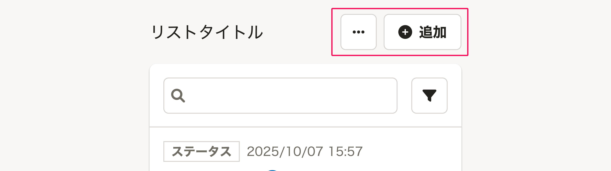
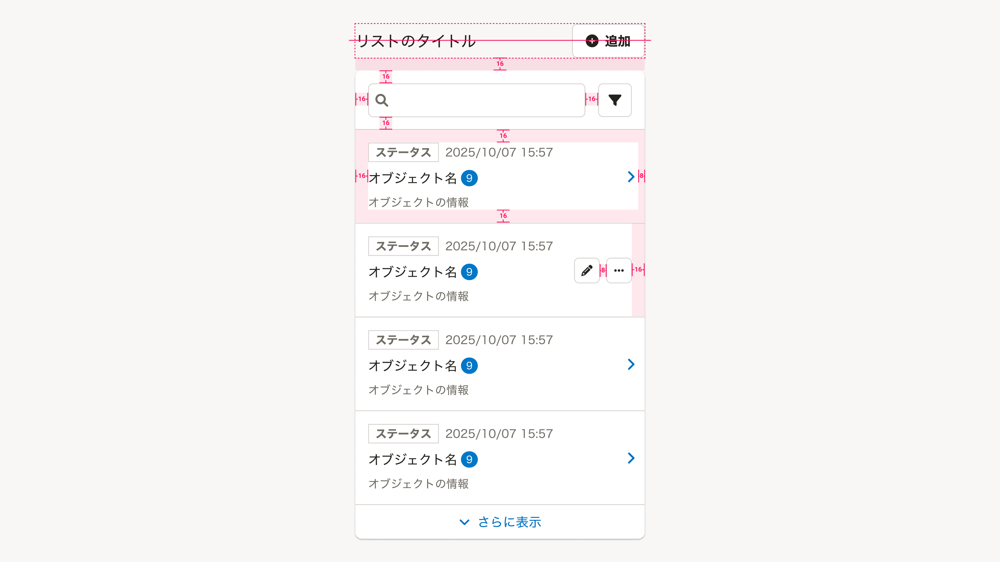

import { Image } from 'astro:assets'
import DoAndDont from '@/components/article/DoAndDont.astro'
import { Cluster, Text } from 'smarthr-ui'

import doOmitHeading from './images/smarthr-list-do-omit-heading.png'
import dontOmitHeading from './images/smarthr-list-dont-omit-heading.png'

リスト形式でオブジェクトを一覧表示するUIのパターンをまとめています。

SmartHRでは、リスト形式でオブジェクトを一覧表示するUIを「よくあるリスト」と呼びます。OOUIにおける「コレクション」と、コレクションに関連するアクションやフォームをまとめた総称を指します。

主に、デスクトップで[よくあるテーブル](/products/design-patterns/smarthr-table/)を使って表示される情報を、モバイルで表示するために使います。

## 構成
`よくあるリスト`は、次の要素で構成されています。必須項目以外は任意の表示項目です。

1. [見出し](#h3-0)
2. [リスト操作エリア](#h3-1)
3. [一時操作エリア](#h3-2)
4. [リスト](#h3-3)
    - [オブジェクト名](#h4-1)（必須）
    - [オブジェクトの情報](#h4-2)
    - [オブジェクトの操作](#h4-3)
5. [「さらに表示」ボタン](#h3-3)

### 1. 見出し
`よくあるリスト`の見出しです。

- [Heading](/products/components/heading/)を使ってください。
- 多くの場合、`{オブジェクト名}`という表記を採用します。
    - [よくあるテーブルの見出しに「一覧」はつけない](/products/contents/ui-text/app-writing/#h2-5)

[画面タイトル](/products/components/heading/#h3-0)が`よくあるリスト`の見出しを兼ねる場合は、見出しを省略できます。

ただし、後述の[リスト操作エリア](#h3-1)が生じる場合はリストの左上に不要な余白が生まれるため、見出しを省略できません。

<Cluster gap={1}>
  <DoAndDont type="do" width="calc(50% - 8px)">
    <Image slot="img" src={doOmitHeading} alt="Do" />
    <Text slot="label">画面タイトルとリストとの間に余白ができない場合は省略できる</Text>
  </DoAndDont>

  <DoAndDont type="dont" width="calc(50% - 8px)">
    <Image slot="img" src={dontOmitHeading} alt="Dont" />
    <Text slot="label">画面タイトルとリストの間にリスト操作エリアがあり、リストの左上に不要な余白ができる</Text>
  </DoAndDont>
</Cluster>

### 2. リスト操作エリア
リストにオブジェクトを追加したり、オブジェクト全体を一括で変更するなどの、**データの追加・一括変更などに関わる操作をまとめたエリア**です。

このエリアは、リストを含む[Base](/products/components/base/)外の右上（見出しの右側）に配置します。

- [Button](/products/components/button/)や、[DropdownMenuButton](/products/components/dropdown/dropdown-menu-button/)を配置できます。
- `よくあるリスト`が主に想定しているモバイル環境では画面の幅が狭いことから、 ボタンは**最大2つを上限とします**。

### 3. 一時操作エリア

**リストのデータには影響しない一時的な操作のためのボタンやフォームをまとめたエリア**です。リストの検索と絞り込みに使います。

リストを含む[Base](/products/components/base/)内の上部に配置します。

#### 検索フォーム

[SearchInput](/products/components/input/#h3-4)を使います。
キーボードのリターンキーが押されたら、検索処理を実行します。

#### 絞り込みボタン

[FilterDropdown](/products/components/dropdown/filter-dropdown/)を使います。
クリックすると、リストのオブジェクトを絞り込むオプションを表示します。

### 4. リスト

#### オブジェクト名

オブジェクト個別の名前です。オブジェクトを識別するために必須要素として表示します。

#### オブジェクトの情報

オブジェクトに付随する情報です。OOUIにおけるプロパティを指します。

リストにはオブジェクトの持つすべての情報を表示する必要はありません。ユーザーが、それぞれのオブジェクトを識別し、次の操作を判断するために必要な情報を表示します。`よくあるリスト`が主に想定しているモバイル環境では表示領域が狭いことから、表示する情報は最低限に留めてください。

一覧でオブジェクトの情報を元にオブジェクト同士を比較したい場合はリストは不適切です。[よくあるテーブル](/products/design-patterns/smarthr-table/)を使ってください。

#### オブジェクトの操作

##### オブジェクトが詳細ビューを持つ場合

リストの各項目に詳細ビューへ移動するリンクを設定します。

オブジェクト名やオブジェクトの情報を含む各項目の領域すべてがリンクであるため、リンク以外の操作は表示できません。詳細ビューに操作を表示してください。

##### オブジェクトが詳細ビューを持たない場合

リストの各項目に対する操作がある場合は、各項目の操作として[Button](/products/components/button/)や、[DropdownMenuButton](/products/components/dropdown/dropdown-menu-button/)を表示します。

`よくあるリスト`が主に想定しているモバイル環境では画面の幅が狭いことから、 ボタンは**最大2つを上限とします**。

### 5. 「さらに表示」ボタン

さらに多くのオブジェクトを追加で読み込んで、表示するボタンです。表示している以上のオブジェクトがない場合には表示しません。

ボタンが押されたら、リストの末尾に追加で読み込まれたオブジェクトを表示します。

## レイアウト

### デスクトップ

[WIP]

### モバイル

基本的に[余白の取り方/モバイル](/products/design-patterns/spacing-layout-pattern/)に従って配置します。

ただし、オブジェクトが詳細ビューを持つ場合のリスト項目の右側のPaddingは`0.5（8px）`とします。

要素間の余白は以下のとおりです。（コンポーネント内の余白は省略）

## 種類

### 初期表示

オブジェクトの数が0件である初期状態の表示パターンは以下のとおりです。

1. 見出し
    - 表示の制約はありません。
2. リスト操作エリア
    - 表示の制約はありません。
3. 一時操作エリア
    - **一時操作エリアは表示しません。**
4. リスト
    - **リストは表示しません。**
    - 代わりにBase内部に、`{オブジェクト名}はありません。`というメッセージと、オブジェクト追加を促すボタンを上下左右中央に表示します。
5. 「さらに表示」ボタン
    - **「さらに表示」ボタンは表示しません。**

### 検索結果なし

オブジェクトの検索結果や絞り込み結果が0件であった場合の表示パターンです。 検索結果のオブジェクト数は0件ですが、オブジェクト自体はリストに存在しています。

1. 見出し
    - 表示の制約はありません。
2. リスト操作エリア
    - 表示の制約はありません。
3. 一時操作エリア
    - 表示の制約はありません。
4. リスト
    - **リストは表示しません。**
    - 代わりにBase内部に、`該当する{オブジェクト名}はありません。 別の条件を試してください。`というメッセージを上下左右中央に表示します。

