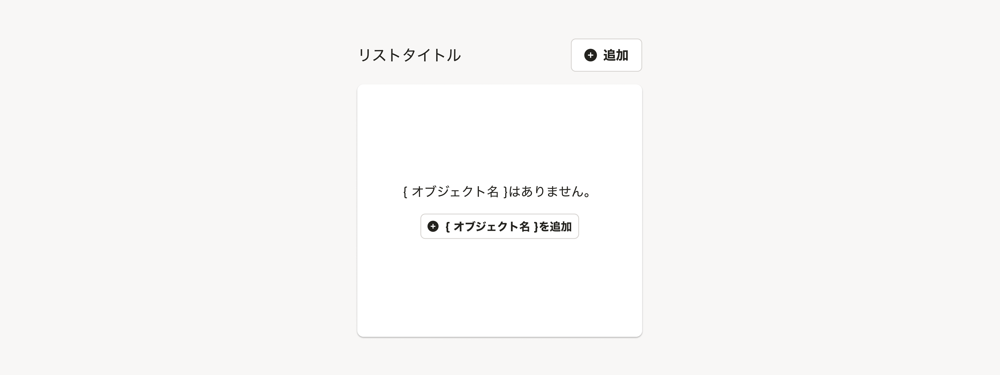
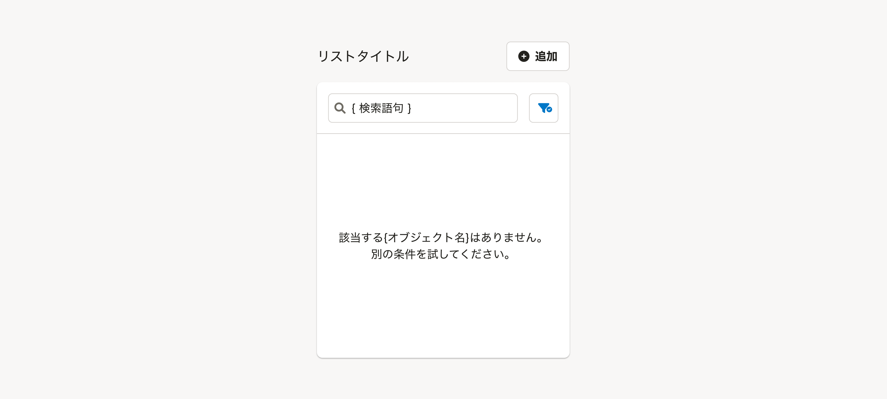

import { Image } from 'astro:assets'
import DoAndDont from '@/components/article/DoAndDont.astro'
import ImgWithDesc from '@/components/article/ImgWithDesc.astro'
import Grid from '@/components/article/Grid.astro'
import { BaseColumn, Cluster, FaInfoCircleIcon, Text } from 'smarthr-ui'

import doOmitHeading from './images/smarthr-list-do-omit-heading.png'
import dontOmitHeading from './images/smarthr-list-dont-omit-heading.png'

<BaseColumn>
  <FaInfoCircleIcon color="TEXT_GREY" text="よくあるリストを実現しやすくするための、Listコンポーネントをsmarthr-uiで実装予定です。"/>
</BaseColumn>

リスト形式でオブジェクトを一覧表示するUIのパターンをまとめています。

SmartHRでは、リスト形式でオブジェクトを一覧表示するUIを「よくあるリスト」と呼びます。OOUIにおける「コレクション」と、コレクションに関連するアクションやフォームをまとめた総称を指します。

主に、デスクトップで[よくあるテーブル](/products/design-patterns/smarthr-table/)を使って表示される情報を、モバイルで表示するために使います。

## 構成
`よくあるリスト`は、次の要素で構成されています。必須項目以外は任意の表示項目です。

1. [見出し](#h3-0)
2. [リスト操作エリア](#h3-1)
3. [一時操作エリア](#h3-2)
4. [リスト](#h3-3)
    - [オブジェクト名](#h4-2)（必須）
    - [オブジェクトの情報](#h4-3)
    - [オブジェクトの操作](#h4-4)
5. [「さらに表示」ボタン](#h3-4)


### 1. 見出し
`よくあるリスト`の見出しです。

- [Heading](/products/components/heading/)を使ってください。
- 多くの場合、`{オブジェクト名}`という表記を採用します。
    - [よくあるテーブルの見出しに「一覧」はつけない](/products/contents/ui-text/app-writing/#h2-5)


[画面タイトル](/products/components/heading/#h3-0)が`よくあるリスト`の見出しを兼ねる場合は、見出しを省略できます。

ただし、後述の[リスト操作エリア](#h3-1)が生じる場合はリストの左上に不要な余白が生まれるため、見出しを省略できません。

<Cluster gap={1}>
  <DoAndDont type="do" width="calc(50% - 8px)">
    <Image slot="img" src={doOmitHeading} alt="Do" />
    <Text slot="label">画面タイトルとリストとの間に余白ができない場合は省略できる</Text>
  </DoAndDont>

  <DoAndDont type="dont" width="calc(50% - 8px)">
    <Image slot="img" src={dontOmitHeading} alt="Dont" />
    <Text slot="label">画面タイトルとリストの間にリスト操作エリアがあり、リストの左上に不要な余白ができる</Text>
  </DoAndDont>
</Cluster>

### 2. リスト操作エリア
リストにオブジェクトを追加したり、オブジェクト全体を一括で変更するなどの、**データの追加・一括変更などに関わる操作をまとめたエリア**です。

このエリアは、リストを含む[Base](/products/components/base/)外の右上（見出しの右側）に配置します。

- [Button](/products/components/button/)や、[DropdownMenuButton](/products/components/dropdown/dropdown-menu-button/)を配置できます。
- `よくあるリスト`が主に想定しているモバイル環境では画面の幅が狭いことから、 ボタンは**最大2つまでとします**。
- ラベルが長いボタンまたは、3つ以上の操作を表示したい場合は、[DropdownMenuButton](/products/components/dropdown/dropdown-menu-button/)を使います。
    - ButtonとDropdownMenuButtonの両方を表示する場合は、Button→DropdownMenuButtonの順に配置します。


### 3. 一時操作エリア

**リストのデータには影響しない一時的な操作のためのボタンやフォームをまとめたエリア**です。リストの検索と絞り込みに使います。

リストを含む[Base](/products/components/base/)内の上部に配置します。


#### 検索フォーム

[SearchInput](/products/components/input/#h3-4)を使います。
キーボードのリターンキーが押されたら、検索処理を実行します。

#### 絞り込みボタン

[FilterDropdown](/products/components/dropdown/filter-dropdown/)を使います。
クリックすると、リストのオブジェクトを絞り込むオプションを表示します。

### 4. リスト

<BaseColumn>
  <FaInfoCircleIcon color="TEXT_GREY" text="Listコンポーネントをsmarthr-uiで実装予定です。"/>
</BaseColumn>

オブジェクトをリスト形式で垂直方向に積み重ねて表示します。

ページ内で`よくあるリスト`のあとに表示されるコンテンツがある場合は、**5件程度**の項目を表示します。ページ内で`よくあるリスト`のあとに表示されるコンテンツがない場合は、**20件程度**の項目を表示します。

#### オブジェクト名

オブジェクト個別の名前です。オブジェクトを識別するために必須要素として表示します。

#### オブジェクトの情報

オブジェクトに付随する情報です。OOUIにおけるプロパティを指します。  
一覧でオブジェクトの情報を元にオブジェクト同士を比較したい場合、リストは不適切です。[よくあるテーブル](/products/design-patterns/smarthr-table/)を使ってください。

- `よくあるリスト`が主に想定しているモバイル環境では表示領域が狭いことから、**ステータスに加え、2行分の情報のみ表示できます**。（2行に収まる範囲で、3つ以上の情報の表示も可能です。）
- オブジェクトの情報にラベルが必要な場合は、`{ラベル}：{値}`という形式で表示します。（例:「作成日：2025/01/01」）
- 表示するオブジェクトの情報の種類と数は、リスト内で統一してください。


#### オブジェクトの操作

オブジェクトの操作の構成には次の2つのパターンがあります。どちらを採用するかはリスト内で統一してください。

##### オブジェクトが詳細ビューを持つ場合

リストの各項目に詳細ビューへ移動するリンクを設定します。

オブジェクト名やオブジェクトの情報を含む各項目の領域すべてがリンクであるため、リンク以外の操作は表示できません。詳細ビューに操作を表示してください。


##### オブジェクトが詳細ビューを持たない場合

リストの各項目に対する操作がある場合は、各項目の操作として[Button](/products/components/button/)や、[DropdownMenuButton](/products/components/dropdown/dropdown-menu-button/)を表示します。

`よくあるリスト`が主に想定しているモバイル環境では画面の幅が狭いことから、 表示できるボタンは**defaultサイズのアイコンボタン1つです**。アイコンだけでは意味が伝わりづらい操作や、複数の操作を表示したい場合は、[DropdownMenuButton](/products/components/dropdown/dropdown-menu-button/)を使います。

<Grid>
    <ImgWithDesc description="Button">
    
    </ImgWithDesc>

    <ImgWithDesc description="DropdownMenuButton">
    
    </ImgWithDesc>
</Grid>

### 5. 「さらに表示」ボタン

さらに多くのオブジェクトを追加で読み込んで、表示するボタンです。表示している以上のオブジェクトがない場合には表示しません。  
`FaAngleDownIcon`を`アイコン付き（左）`（プレフィックス）に設定した[Tertiaryボタン](/products/components/button/#h3-3)を幅いっぱいに広げて使います。

ボタンが押されたら、最初に表示されていた件数と同じ件数を読み込み、リストの末尾に追加します。


## レイアウト

### デスクトップ

[WIP]

### モバイル

<BaseColumn>
  <FaInfoCircleIcon color="TEXT_GREY" text="よくあるリストを実現しやすくするための、Listコンポーネントをsmarthr-uiで実装予定です。"/>
</BaseColumn>

#### 要素間の余白

要素間の余白は以下のとおりです。（コンポーネント内の余白は省略）

基本的に[余白の取り方/モバイル](/products/design-patterns/spacing-layout-pattern/)に従って配置しますが、オブジェクトが詳細ビューを持つ場合のリスト項目の右側のPaddingは`0.5（8px）`とします。


#### 見出しとリスト操作エリアのレイアウト

多様な画面幅で見やすいレイアウトとなるよう、[見出し](#h3-0)と[リスト操作エリア](#h3-1)は、[Sidebar](/products/components/layout/sidebar/)を使って配置します。

```tsx editable
<div style={{ width: '100%' }}>
<Sidebar gap={0.5} align="center" right>
    <Heading>とても長いリストタイトルとても長いリストタイトル</Heading>
    <Cluster>
        <Button prefix={<FaCirclePlusIcon />}>追加</Button>
        <DropdownMenuButton onlyIconTrigger>
            <Button>並べ替え</Button>
        </DropdownMenuButton>
    </Cluster>
</Sidebar>
</div>
```

#### リストの各項目をBaseでグルーピングするパターン

次のような場合、リストの各項目をBaseでグルーピングして表示できます。[構成](#h2-0)や[種類](#h2-2)に変更はありません。

- リストに表示する各項目の連続性が低く、表示の独立性を高めたい場合
    - 例：ユーザー投稿の一覧

要素間の余白は以下のとおりです。記載のない余白は通常表示と同じです。（コンポーネント内の余白は省略）


## 種類

### 初期表示

オブジェクトの数が0件である初期状態の表示パターンは以下のとおりです。

1. 見出し
    - 表示の制約はありません。
2. リスト操作エリア
    - 表示の制約はありません。
3. 一時操作エリア
    - **一時操作エリアは表示しません。**
4. リスト
    - **リストは表示しません。**
    - 代わりにBase内部に、`{オブジェクト名}はありません。`というメッセージと、オブジェクト追加を促すボタンを上下左右中央に表示します。
        - オブジェクト追加を促すボタンは、基本的に[Secondaryボタンのサイズ小](/products/components/button/#h3-1)を使います。
        - オブジェクト名が人を指す名詞などで「`ありません`」がそぐわない場合は、オブジェクト名を明記しない「`表示するデータはありません。`」というメッセージを表示します。
5. 「さらに表示」ボタン
    - **「さらに表示」ボタンは表示しません。**



### 検索結果なし

オブジェクトの検索結果や絞り込み結果が0件であった場合の表示パターンです。 検索結果のオブジェクト数は0件ですが、オブジェクト自体はリストに存在しています。

1. 見出し
    - 表示の制約はありません。
2. リスト操作エリア
    - 表示の制約はありません。
3. 一時操作エリア
    - 表示の制約はありません。
4. リスト
    - **リストは表示しません。**
    - 代わりにBase内部に、`該当する{オブジェクト名}はありません。<br />別の条件を試してください。`というメッセージを上下左右中央に表示します。
5. 「さらに表示」ボタン
    - **「さらに表示」ボタンは表示しません。**

