import ComponentPropsTable from '@/components/article/ComponentPropsTable.astro'
import ComponentStoryfrom from '@/components/article/ComponentStory.astro'
import DoAndDont from '@/components/article/DoAndDont.astro'
import ImgWithDesc from '@/components/article/ImgWithDesc.astro'
import Grid from '@/components/article/Grid.astro'
import { Text, FaCloudArrowDownIcon } from 'smarthr-ui'

SmartHRに頻出する、表形式で一覧表示するUIのパターンをまとめています。

SmartHRでは、表形式で一覧表示するUIを「よくあるテーブル」と呼びます。  
OOUIにおける「コレクション」と、コレクションに関連するアクションやフォームをまとめた総称を指します。


## 構成
`よくあるテーブル`は、次の要素で構成されています。必須項目以外は任意の表示項目です。

1. テーブル
    - [オブジェクト名](#h4-0)（必須）
    - [オブジェクトの情報](#h4-1)
    - [オブジェクトの操作](#h4-2)
2. 見出し
3. テーブル操作エリア
4. 一時操作エリア

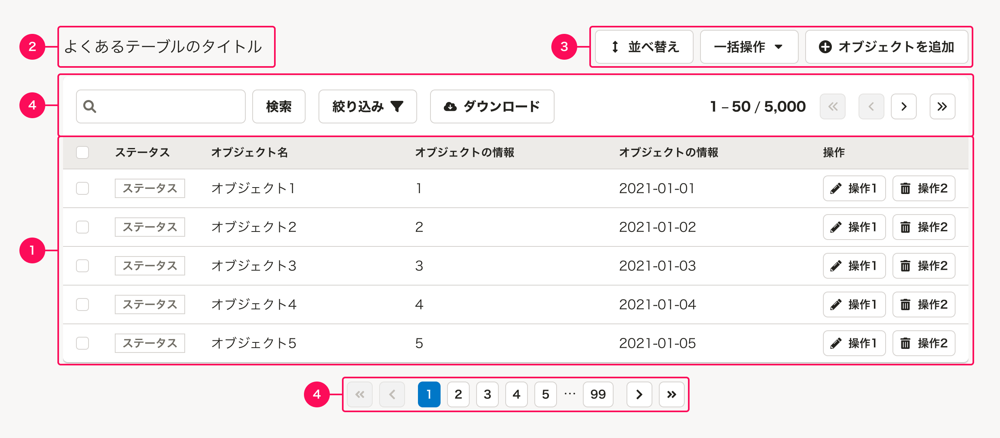

### 1. テーブル
`よくあるテーブル`は、多くの場合「1項目1行の1次元リスト」のテーブルを含みます。

#### オブジェクト名
オブジェクトの名前を指します。行を識別するために必須要素として設定します。

##### 移動リンクのスタイル
オブジェクトの[詳細ビュー](/products/design-patterns/main-admin-core-features/#h2-2)へ移動する場合、オブジェクト名にリンクを設定します。
テキストリンクによる移動は「オブジェクトの操作」にはあたらないため、アクションボタンは使いません。

```tsx editable hideCode background=BACKGROUND
<Base className="shr-w-full">
  <Table rounded>
    <thead>
      <tr>
        <Th>オブジェクト名</Th>
      </tr>
    </thead>
    <tbody>
      <tr>
        <Td>
          <TextLink href="#">オブジェクト1</TextLink>
        </Td>
      </tr>
      <tr>
        <Td>
          <TextLink href="#">オブジェクト2</TextLink>
        </Td>
      </tr>
      <tr>
        <Td>
          <TextLink href="#">オブジェクト3</TextLink>
        </Td>
      </tr>
    </tbody>
  </Table>
</Base>
```

#### オブジェクトの情報
オブジェクトごとに表示する情報を指します。  
テーブルにはオブジェクトの持つすべての情報を表示する必要はありません。
ユーザーが、それぞれのオブジェクトを識別・比較できる情報を検討して表示します。

```tsx editable hideCode background=BACKGROUND
<Base className="shr-w-full">
  <Table rounded>
    <thead>
      <tr>
        <Th>ステータス</Th>
        <Th>オブジェクト名</Th>
        <Th>オブジェクトの情報</Th>
        <Th>オブジェクトの情報</Th>
      </tr>
    </thead>
    <tbody>
      <tr>
        <Td contentWidth="1px">
          <StatusLabel>ステータス</StatusLabel>
        </Td>
        <Td>
          <TextLink href="#">オブジェクト1</TextLink>
        </Td>
        <Td>1</Td>
        <Td>2021-01-01</Td>
      </tr>
      <tr>
        <Td contentWidth="1px">
          <StatusLabel>ステータス</StatusLabel>
        </Td>
        <Td>
          <TextLink href="#">オブジェクト2</TextLink>
        </Td>
        <Td>2</Td>
        <Td>2021-01-02</Td>
      </tr>
      <tr>
        <Td contentWidth="1px">
          <StatusLabel>ステータス</StatusLabel>
        </Td>
        <Td>
          <TextLink href="#">オブジェクト3</TextLink>
        </Td>
        <Td>3</Td>
        <Td>2021-01-03</Td>
      </tr>
    </tbody>
  </Table>
</Base>
```

##### オブジェクトの情報量および表示領域の幅
各機能のユースケースや仕様によって異なるため、オブジェクトの情報量（列数）および表示領域の幅には制限を設けません。

ただし、情報量が多いと表示領域を圧迫し、ユーザーの認知負荷を高めることになります。表示する情報量（列数）を十分に検討し、情報量に応じて表示領域の幅を適切に設定してください。

##### 横スクロール
Tableは表示する情報が多くなるとデフォルトで横スクロールになります（`reel` propsを`false`にすると解除できます）が、横スクロールは情報の一覧性を下げてしまいます。そのため、基本的には表示する情報を精査し、横スクロールが発生しないように設計してください。
表示する情報が多く、どうしても省略できない場合には、コレクションエリア内を横スクロールすることを許容します。

やむを得ず横スクロールが生じる場合、後述の[列の固定](#h3-6)により主要な操作を見つけやすくしたり、[フルスクリーンレイアウト](#h3-5)を使用して表示幅を広げたりできます。

##### 情報の省略
情報を指定幅以上に表示したい、またはセル内で情報を複数行で表示させたくない場合、[LineClamp](/products/components/line-clamp/)などを使ってセル上の情報に三点リーダーをつけて省略します。
省略した情報は、マウスオーバーした際に[Tooltip](/products/components/tooltip/)を表示し、すべての情報を示してください。

```tsx editable hideCode background=BACKGROUND canvas=800
<Base className="shr-w-full">
  <Table rounded>
    <thead>
      <tr>
        <Th>ステータス</Th>
        <Th>オブジェクト名</Th>
        <Th>オブジェクトの情報</Th>
        <Th>オブジェクトの情報</Th>
      </tr>
    </thead>
    <tbody>
      <tr>
        <Td contentWidth="1px">
          <StatusLabel>ステータス</StatusLabel>
        </Td>
        <Td>
          {/* 指定した幅を超える情報は、LineClampで三点リーダーをつけて省略する。省略した場合はマウスオーバーでTooltipが表示される。 */}
          <div style={{ width: '12em' }}>
            <LineClamp maxLines={1}>
              <TextLink href="#">オブジェクト1</TextLink>
            </LineClamp>
          </div>
        </Td>
        <Td>1</Td>
        <Td>2021-01-01</Td>
      </tr>
      <tr>
        <Td contentWidth="1px">
          <StatusLabel>ステータス</StatusLabel>
        </Td>
        <Td>
          <div style={{ width: '12em' }}>
            <LineClamp maxLines={1}>
              <TextLink href="#">長そうでそんなに長くないオブジェクト2</TextLink>
            </LineClamp>
          </div>
        </Td>
        <Td>2</Td>
        <Td>2021-01-02</Td>
      </tr>
      <tr>
        <Td contentWidth="1px">
          <StatusLabel>ステータス</StatusLabel>
        </Td>
        <Td>
          <div style={{ width: '12em' }}>
            <LineClamp maxLines={1}>
              <TextLink href="#">オブジェクト3</TextLink>
            </LineClamp>
          </div>
        </Td>
        <Td>3</Td>
        <Td>2021-01-03</Td>
      </tr>
    </tbody>
  </Table>
</Base>
```

##### ステータス

ステータスは、テーブル上でオブジェクトの状態を伝えやすくする目的で使用します。    
たとえば、タスクを完了するために複数のアクション（例：依頼、提出、承認）が必要な場合、ステータスを表示すると、現在どの段階にあるのかが伝えやすくなります。

テーブルのヘッダー部分は`ステータス`と表記します。   
例外として、同じテーブル上に表示されるオブジェクトが複数のステータスを持ち、明確に呼び分ける必要がある場合は`〇〇状況`と表記します。（例：依頼状況、確認状況、送信状況）  
`状況`や`状態`と表記すると、何の状況や状態を指すのかが曖昧なため避けましょう。  

ステータスラベルの使い方は、[StatusLabel](/products/components/status-label/)を参照してください。  

#### オブジェクトの操作
オブジェクトに対して「編集」「削除」などの操作をする場合、アクションボタンを設定します。  
ユーザーの視線導線に合わせ、基本的に右端のカラムに設置します。カラム数が多く操作部が隠れる場合は、後述の[列の固定](#h3-6)を用いて操作列を固定してください。

##### 単一のオブジェクト操作
単一のオブジェクトに操作をしたい場合、アクションボタンをオブジェクト（行）それぞれに設置します。

ボタンは1つのオブジェクトに対して、**最大3つを上限とします**。それ以上設置する必要がある場合は、[ドロップダウンメニューボタン](/products/components/dropdown/dropdown-menu-button/)にアクションを格納することを検討しましょう。

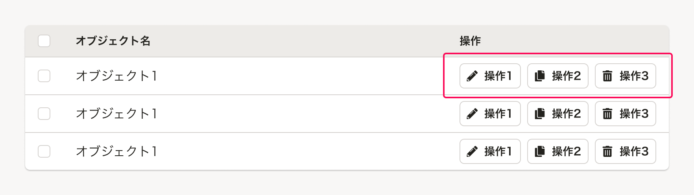

##### 複数のオブジェクト操作
複数のオブジェクトに対して、一括で同時に操作する場合は、[テーブル内の一括操作](/products/design-patterns/table-bulk-action/)を参照してください。

### 2. 見出し
`よくあるテーブル`の見出しです。

- [Heading](/products/components/heading/)を使用し、適切な見出しレベルを設定してください。
- 多くの場合、`{オブジェクト名}`という表記を採用しています。
    - [よくあるテーブルの見出しに「一覧」はつけない](/products/contents/ui-text/app-writing/#h2-5)

[画面タイトル](/products/components/heading/page-heading/)が`よくあるテーブル`の見出しを兼ねる場合は、タイトルエリアを省略できます。  
ただし、後述の[テーブル操作エリア](#h3-2)が生じる場合はテーブルの左上に不要な余白が生まれるため、見出しを省略できません。

<DoAndDont type="do">
  <Text slot="label">画面タイトルとテーブルの間に余白ができない場合は省略できる</Text>
  <div slot="img">
```tsx editable hideCode background=BACKGROUND canvas=800
<Stack gap={1.5} className="shr-w-full">
  <Stack>
    {/* デザインシステムではサイト側のタイトルを書き換えないようにするため、autoPageTitleをfalseにしている。 */}
    <PageHeading autoPageTitle={false}>画面タイトル</PageHeading>
    <p>ページの説明。</p>
  </Stack>
  {/* 画面タイトルがよくあるテーブルの見出しを兼ねるため、見出しを省略している */}
  <Base>
    <Table rounded>
      <thead>
        <tr>
          <Th>オブジェクト名</Th>
        </tr>
      </thead>
      <tbody>
        <tr>
          <Td>
            <TextLink href="#">オブジェクト1</TextLink>
          </Td>
        </tr>
        <tr>
          <Td>
            <TextLink href="#">オブジェクト2</TextLink>
          </Td>
        </tr>
        <tr>
          <Td>
            <TextLink href="#">オブジェクト3</TextLink>
          </Td>
        </tr>
      </tbody>
    </Table>
  </Base>
  <Center>
    <Pagination current={1} total={100} onClick={() => null} />
  </Center>
</Stack>
```
  </div>
</DoAndDont>

<DoAndDont type="dont">
  <Text slot="label">画面タイトルとテーブルの間にテーブル操作エリアがあり、テーブルの左上に不要な余白ができる</Text>
  <div slot="img">
```tsx editable hideCode background=BACKGROUND canvas=800
<Stack gap={1.5} className="shr-w-full">
  <Stack>
    {/* デザインシステムではサイト側のタイトルを書き換えないようにするため、autoPageTitleをfalseにしている。 */}
    <PageHeading autoPageTitle={false}>画面タイトル</PageHeading>
    <p>ページの説明。</p>
  </Stack>
  <Stack>
    {/* テーブル操作エリアがあるのに見出しを省略すると、テーブルの左上に不要な余白ができる */}
    <Cluster justify="flex-end">
      <Button prefix={<FaUpDownIcon />}>並べ替え</Button>
      <DropdownMenuButton trigger="一括操作">
        <Button>一括追加（CSV）</Button>
        <Button>一括更新（CSV）</Button>
      </DropdownMenuButton>
      <Button prefix={<FaCirclePlusIcon />}>オブジェクトを追加</Button>
    </Cluster>
    <Base>
      <Table rounded>
        <thead>
          <tr>
            <Th>オブジェクト名</Th>
          </tr>
        </thead>
        <tbody>
          <tr>
            <Td>
              <TextLink href="#">オブジェクト1</TextLink>
            </Td>
          </tr>
          <tr>
            <Td>
              <TextLink href="#">オブジェクト2</TextLink>
            </Td>
          </tr>
          <tr>
            <Td>
              <TextLink href="#">オブジェクト3</TextLink>
            </Td>
          </tr>
        </tbody>
      </Table>
    </Base>
  </Stack>
  <Center>
    <Pagination current={1} total={100} onClick={() => null} />
  </Center>
</Stack>
```
  </div>
</DoAndDont>

### 3. テーブル操作エリア
テーブルにオブジェクト（行）を追加したり、オブジェクト全体を一括で変更するなどの、**データの追加・一括変更などに関わる操作をまとめたエリア**です。

このエリアは、テーブルを含む[Base](/products/components/base/)外の右上（見出しの右側）に配置します。

- アクションボタンとして、[Secondaryボタン](/products/components/button/#h3-2)や、類似する操作をまとめた[ドロップダウンメニューボタン](/products/components/dropdown/dropdown-menu-button/)を配置できます。
- ユーザーが操作に迷わないように、ボタンは**最大3つを上限とします**。

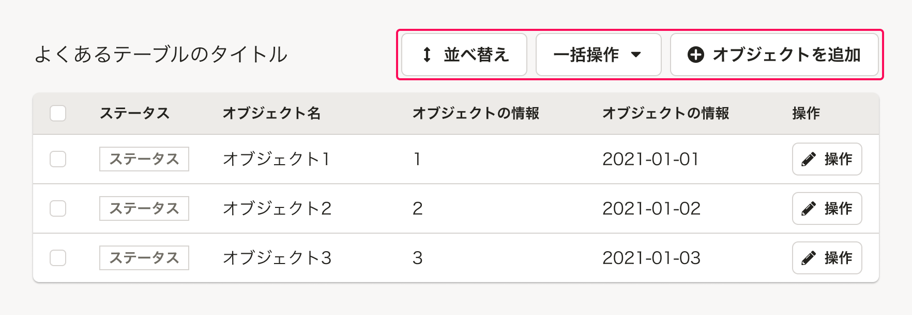

#### アクションボタンの例
ここに配置される典型的なアクションボタンの例は以下のとおりです。  
以下に限らず、扱う機能やユースケースによって、データの追加・一括変更などに関わるアクションボタンを配置できます。

| 操作名 | ボタンのラベル例 | 役割・動作 |
| :--- | :--- | :--- |
| オブジェクトの追加 | `項目を追加` | オブジェクトを追加するためのボタンです。「`{オブジェクト名}`を追加」と表記します。<br />クリックすると、多くの場合、オブジェクトの追加ダイアログを表示します。 |
| オブジェクトの並べ替え | `並べ替え` | オブジェクト（行）の並べ替えをするためのボタンです。<br />クリックすると、`よくあるテーブル`が`並べ替え状態`に切り替わります。 |
| オブジェクトの一括操作 | `一括追加（CSV）`, `一括更新（CSV）` | CSVファイル等によるオブジェクトの追加・更新を一括で行う操作をするためのボタンです。<br />クリックすると、CSVファイルを追加する一括操作ダイアログを表示するほか、複数の一括操作を`ドロップダウンメニューボタン`の[「同一の操作」パターン](/products/components/dropdown/dropdown-menu-button/#h3-4)でまとめた`一括操作`ボタンとすることもあります。 |


### 4. 一時操作エリア

テーブルの検索やフィルタリングなど、**テーブルのデータには影響しない一時的な操作をするためのボタンやフォームをまとめたエリア**です。

このエリアは、テーブルを含む[Base](/products/components/base/)内の上部、および[Base](/products/components/base/)外の下部に配置します。

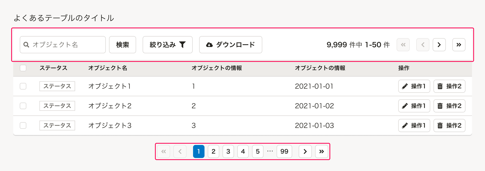

#### Base内の上部に配置する操作の例
このエリアに配置される典型的な操作の例は以下のとおりです。  
以下に限らず、扱う機能やユースケースによって、一時的な操作に関するボタンやフォームを配置できます。

| 操作名 | ボタンのラベル例 | 役割・動作 |
| :--- | :--- | :--- |
| オブジェクトの検索 | `検索` | 入力ボックス（[SearchInput](/products/components/input/search-input/)）と検索ボタンがセットになった検索フォームです。 |
| オブジェクトの絞り込み | `絞り込み` | [FilterDropdown](/products/components/dropdown/filter-dropdown/)を配置します。<br />クリックすると、テーブルのオブジェクトを絞り込むオプションをドロップダウンで表示します。 |
| オブジェクト（一覧）のダウンロード | `ダウンロード`, `全件ダウンロード` | [Secondaryボタンのアイコン付き（左）](/products/components/button/#h3-1)を配置します。（<FaCloudArrowDownIcon alt="ダウンロード" /> アイコン（`FaCloudArrowDownIcon`）を使用）<br />オブジェクトの絞り込み状態に依存せず、オブジェクトの全件が常にダウンロードされる場合は、ラベルを`全件ダウンロード`とします。 |
| ページ番号、テーブルのページ数 | `1-50 / 5,000` | [PageCounter](/products/components/page-counter/)を配置します。<br />多くの場合、「`{表示している順番の範囲}` / `{総件数}` 」のように、現在表示しているテーブル内容の現在位置を示します。<br />1ページあたり20件〜50件とすることが多いですが、ユースケースや表示速度を考慮して適切な件数を設定します。<br />コンテンツの横幅に応じて、表示する内容の量を検討してください。 |
| テーブルのページ送り | - | テーブルのオブジェクトの量（行数）が多くなる場合に、複数のページに分けて[Pagination](/products/components/pagination/)（`withoutNumbers = true`）を配置します。<br />コンテンツの横幅が狭い場合は省略することがあります。（[省略した例](#h3-9)） |

#### Base外の下部に配置する操作の例

| 操作名 | ボタンのラベル例 | 役割・動作 |
| :--- | :--- | :--- |
| テーブルのページ送り | - | テーブルのオブジェクトの量（行数）が多くなる場合に、複数のページに分けて[Pagination](/products/components/pagination/)を配置します。<br />コンテンツの横幅に応じて、表示する内容の量を検討してください。 |

#### Base内の上部にテーブルのページ送りを単体で配置しない
一時操作エリアに置く機能が`テーブルのページ送り`のみの場合、Base外の下部にのみ配置します。このとき、テーブルの左上に不要な余白が生まれるため、Base内の上部のエリアは表示しないでください。

<DoAndDont type="do">
  <Text slot="label">Base内の上部のエリアごと非表示にする。</Text>
  <div slot="img">
```tsx editable hideCode background=BACKGROUND canvas=800
<Section className="shr-w-full">
  <Stack gap={1.5}>
    <Stack>
      <Cluster align="center" justify="space-between">
        <Heading>よくあるテーブルのタイトル</Heading>
        <Cluster>
          <DropdownMenuButton trigger="一括操作">
            <Button>一括追加（CSV）</Button>
            <Button>一括更新（CSV）</Button>
          </DropdownMenuButton>
          <Button prefix={<FaCirclePlusIcon />}>項目を追加</Button>
        </Cluster>
      </Cluster>
      {/* 一時操作エリアに置く操作がページ送りのみのため、Base内の上部のエリアは表示しない */}
      <Base>
        <Table rounded>
          <thead>
            <tr>
              <Th>オブジェクト名</Th>
            </tr>
          </thead>
          <tbody>
            <tr>
              <Td>
                <TextLink href="#">オブジェクト1</TextLink>
              </Td>
            </tr>
            <tr>
              <Td>
                <TextLink href="#">オブジェクト2</TextLink>
              </Td>
            </tr>
            <tr>
              <Td>
                <TextLink href="#">オブジェクト3</TextLink>
              </Td>
            </tr>
          </tbody>
        </Table>
      </Base>
    </Stack>
    <Center>
      <Pagination current={1} total={100} onClick={() => null} />
    </Center>
  </Stack>
</Section>
```
  </div>
</DoAndDont>

<DoAndDont type="dont">
  <Text slot="label">テーブルのページ送りのみ配置すると、左に不要な余白ができるため、視線誘導として不適切。</Text>
  <div slot="img">
```tsx editable hideCode background=BACKGROUND canvas=800
<Section className="shr-w-full">
  <Stack gap={1.5}>
    <Stack>
      <Cluster align="center" justify="space-between">
        <Heading>よくあるテーブルのタイトル</Heading>
        <Cluster>
          <DropdownMenuButton trigger="一括操作">
            <Button>一括追加（CSV）</Button>
            <Button>一括更新（CSV）</Button>
          </DropdownMenuButton>
          <Button prefix={<FaCirclePlusIcon />}>項目を追加</Button>
        </Cluster>
      </Cluster>
      <Base>
        {/* ページ送りだけをBase内の上部に配置すると、左に不要な余白ができる */}
        <Cluster align="center" justify="flex-end" gap={1} className="shr-p-1">
          <PageCounter start={1} end={50} total={5000} />
          <Pagination current={1} total={100} withoutNumbers onClick={() => null} />
        </Cluster>
        <Table rounded="bottom">
          <thead>
            <tr>
              <Th>オブジェクト名</Th>
            </tr>
          </thead>
          <tbody>
            <tr>
              <Td>
                <TextLink href="#">オブジェクト1</TextLink>
              </Td>
            </tr>
            <tr>
              <Td>
                <TextLink href="#">オブジェクト2</TextLink>
              </Td>
            </tr>
            <tr>
              <Td>
                <TextLink href="#">オブジェクト3</TextLink>
              </Td>
            </tr>
          </tbody>
        </Table>
      </Base>
    </Stack>
    <Center>
      <Pagination current={1} total={100} onClick={() => null} />
    </Center>
  </Stack>
</Section>
```
  </div>
</DoAndDont>

## レイアウト

`よくあるテーブル`のレイアウトは2パターンあります。  

| パターン | 説明 | 用途 |
| :--- | :--- | :--- |
| デフォルトのレイアウト | `Base` 内にテーブルを配置します。| 基本のレイアウトです。特に理由がない場合はこちらを使用します。<br />1つの画面内で、他の要素や複数のテーブルを同時に使用したい場合にも使用します。 |
| フルスクリーンレイアウト | ブラウザの幅いっぱいにテーブルを配置します。 | カラムが多く、デフォルトのレイアウトでは横スクロールが生じてしまう場合に使用します。|

### デフォルトのレイアウト
基本的に[余白の取り方](/products/design-patterns/spacing-layout-pattern/)に従って配置します。  
要素間の余白は以下のとおりです。（コンポーネント内の余白は省略）

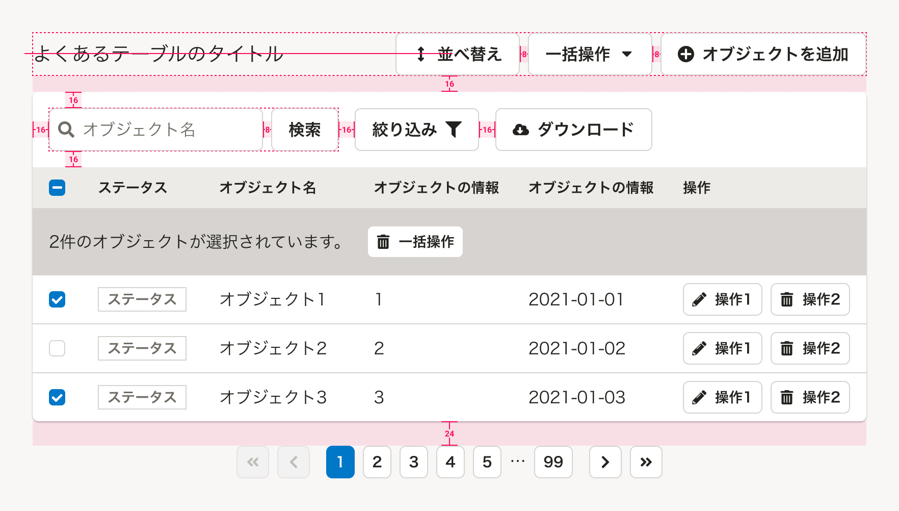

| 要素 | 余白 |
| :--- | :--- |
| 見出し・テーブル操作エリアと、テーブルを含むBaseの間 | `1（16px）` |
| テーブル操作エリアのボタン同士の間 | `0.5（8px）` |
| Base内の上部の一時操作エリアのパディング | `1（16px）` |
| 検索フォームの入力ボックスと検索ボタンの間 | `0.5（8px）` |
| Base内の上部の一時操作エリアの操作同士の間 | `1（16px）` |
| テーブルを含むBaseと、Base外の下部の一時操作エリアの間 | `1.5（24px）` |

実装例：

```tsx editable hideCode background=DOT canvas=1400
<div className="shr-bg-background" style={{ width: '100%' }}>
  <div className="shr-relative shr-z-1">
    <AppHeader
      appName="すごいプロダクト"
      userInfo={{ empCode: '001', firstName: '須磨', lastName: '栄子' }}
      navigations={[
        { children: 'ダッシュボード', href: '#', current: true },
        { children: '設定', childNavigations: [{ children: 'マスター設定', href: '#' }] },
      ]}
    />
  </div>
  <Container>
    <Stack gap={2}>
      <Stack>
        {/* デザインシステムではサイト側のタイトルを書き換えないようにするため、autoPageTitleをfalseにしている。 */}
        <PageHeading autoPageTitle={false}>画面タイトル</PageHeading>
        <p>ページの説明。詳しくは<HelpLink href="/" target="_blank">ヘルプページ</HelpLink>を参照してください。</p>
      </Stack>
      <Section>
        <Stack gap={1.5}>
          <Stack>
            <Cluster align="center" justify="space-between">
              <Heading>よくあるテーブルのタイトル</Heading>
              <Cluster>
                <Button prefix={<FaUpDownIcon />}>並べ替え</Button>
                <DropdownMenuButton trigger="一括操作">
                  <Button>一括追加（CSV）</Button>
                  <Button>一括更新（CSV）</Button>
                </DropdownMenuButton>
                <Button prefix={<FaCirclePlusIcon />}>オブジェクトを追加</Button>
              </Cluster>
            </Cluster>
            <Base>
              <Cluster align="center" justify="space-between" className="shr-p-1">
                <Cluster align="center" gap={1}>
                  <Cluster>
                    <SearchInput name="search" tooltipMessage="オブジェクト名で検索できます。" />
                    <Button>検索</Button>
                  </Cluster>
                  <FilterDropdown onApply={() => null}>絞り込みの中身</FilterDropdown>
                  <Button prefix={<FaCloudArrowDownIcon />}>ダウンロード</Button>
                </Cluster>
                <Cluster align="center" gap={1}>
                  <PageCounter start={1} end={50} total={5000} />
                  <Pagination current={1} total={100} withoutNumbers onClick={() => null} />
                </Cluster>
              </Cluster>
              <Table rounded="bottom">
                <thead>
                  <tr>
                    <ThCheckbox name="allRowCheckbox" />
                    <Th>ステータス</Th>
                    <Th>オブジェクト名</Th>
                    <Th>オブジェクトの情報</Th>
                    <Th>オブジェクトの情報</Th>
                    <Th>操作</Th>
                  </tr>
                </thead>
                <tbody>
                  <tr>
                    <TdCheckbox name="rowCheckbox" aria-labelledby="object-1" />
                    <Td contentWidth="1px">
                      <StatusLabel>ステータス</StatusLabel>
                    </Td>
                    <Td id="object-1">オブジェクト1</Td>
                    <Td>1</Td>
                    <Td>2021-01-01</Td>
                    <Td contentWidth="1px">
                      <Cluster inline className="shr-min-w-max">
                        <Button size="S" prefix={<FaPenIcon />}>操作1</Button>
                        <Button size="S" prefix={<FaTrashCanIcon />}>操作2</Button>
                      </Cluster>
                    </Td>
                  </tr>
                  <tr>
                    <TdCheckbox name="rowCheckbox" aria-labelledby="object-2" />
                    <Td contentWidth="1px">
                      <StatusLabel>ステータス</StatusLabel>
                    </Td>
                    <Td id="object-2">オブジェクト2</Td>
                    <Td>2</Td>
                    <Td>2021-01-02</Td>
                    <Td contentWidth="1px">
                      <Cluster inline className="shr-min-w-max">
                        <Button size="S" prefix={<FaPenIcon />}>操作1</Button>
                        <Button size="S" prefix={<FaTrashCanIcon />}>操作2</Button>
                      </Cluster>
                    </Td>
                  </tr>
                  <tr>
                    <TdCheckbox name="rowCheckbox" aria-labelledby="object-3" />
                    <Td contentWidth="1px">
                      <StatusLabel>ステータス</StatusLabel>
                    </Td>
                    <Td id="object-3">オブジェクト3</Td>
                    <Td>3</Td>
                    <Td>2021-01-03</Td>
                    <Td contentWidth="1px">
                      <Cluster inline className="shr-min-w-max">
                        <Button size="S" prefix={<FaPenIcon />}>操作1</Button>
                        <Button size="S" prefix={<FaTrashCanIcon />}>操作2</Button>
                      </Cluster>
                    </Td>
                  </tr>
                </tbody>
              </Table>
            </Base>
          </Stack>
          <Center>
            <Pagination current={1} total={100} onClick={() => null} />
          </Center>
        </Stack>
      </Section>
    </Stack>
  </Container>
</div>
```

### フルスクリーンレイアウト
画面幅いっぱいにテーブル、一時操作エリアを配置するレイアウトです。  
表示項目が多く、テーブルを閲覧・操作することが主たる業務となりうるときに使用します。

フルスクリーンレイアウトを使用する場合、1つの画面内で複数のテーブルは使用できません。

要素間の余白は以下のとおりです。（コンポーネント内の余白は省略）

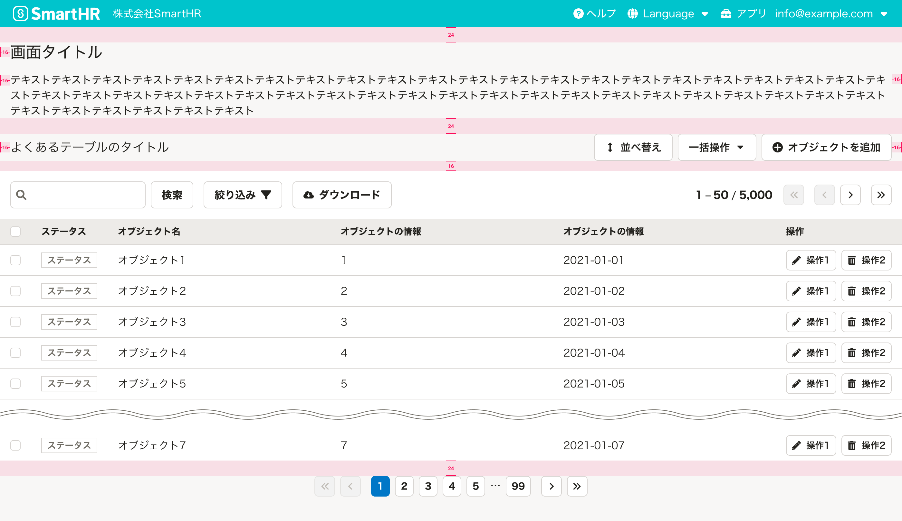

| 要素 | 余白 |
| :--- | :--- |
| ヘッダーと画面タイトルの間 | `1.5（24px）` |
| 画面タイトル・リード文と、画面の左右の端の間 | `1（16px）` |
| リード文と、見出し・テーブル操作エリアの間 | `1.5（24px）` |
| 見出し・テーブル操作エリアと、画面の左右の端の間 | `1（16px）` |
| 見出し・テーブル操作エリアと、一時操作エリアの間 | `1（16px）` |
| テーブルと、テーブル下部の一時操作エリアの間 | `1.5（24px）` |

実装例：

```tsx editable hideCode background=DOT canvas=1400
<div className="shr-bg-background" style={{ width: '100%' }}>
  <div className="shr-relative shr-z-1">
    <AppHeader
      appName="すごいプロダクト"
      userInfo={{ empCode: '001', firstName: '須磨', lastName: '栄子' }}
      navigations={[
        { children: 'ダッシュボード', href: '#', current: true },
        { children: '設定', childNavigations: [{ children: 'マスター設定', href: '#' }] },
      ]}
    />
  </div>
  <Stack gap={1.5} className="shr-py-1.5">
    <Stack className="shr-px-1">
      {/* デザインシステムではサイト側のタイトルを書き換えないようにするため、autoPageTitleをfalseにしている。 */}
      <PageHeading autoPageTitle={false}>画面タイトル</PageHeading>
      <p>ページの説明。詳しくは<HelpLink href="/" target="_blank">ヘルプページ</HelpLink>を参照してください。</p>
    </Stack>
    <Section>
      <Stack gap={1.5}>
        <Stack>
          <Cluster align="center" justify="space-between" className="shr-px-1">
            <Heading>よくあるテーブルのタイトル</Heading>
            <Cluster>
              <Button prefix={<FaUpDownIcon />}>並べ替え</Button>
              <DropdownMenuButton trigger="一括操作">
                <Button>一括追加（CSV）</Button>
                <Button>一括更新（CSV）</Button>
              </DropdownMenuButton>
              <Button prefix={<FaCirclePlusIcon />}>オブジェクトを追加</Button>
            </Cluster>
          </Cluster>
          {/* 一時操作エリアとテーブルを画面の左右いっぱいに配置するため、Baseの角丸をなくしている */}
          <Base className="shr-rounded-none">
            <Cluster align="center" justify="space-between" className="shr-p-1">
              <Cluster align="center" gap={1}>
                <Cluster>
                  <SearchInput name="search" tooltipMessage="オブジェクト名で検索できます。" />
                  <Button>検索</Button>
                </Cluster>
                <FilterDropdown onApply={() => null}>絞り込みの中身</FilterDropdown>
                <Button prefix={<FaCloudArrowDownIcon />}>ダウンロード</Button>
              </Cluster>
              <Cluster align="center" gap={1}>
                <PageCounter start={1} end={50} total={5000} />
                <Pagination current={1} total={100} withoutNumbers onClick={() => null} />
              </Cluster>
            </Cluster>
            <Table>
              <thead>
                <tr>
                  <ThCheckbox name="allRowCheckbox" />
                  <Th>ステータス</Th>
                  <Th>オブジェクト名</Th>
                  <Th>オブジェクトの情報</Th>
                  <Th>オブジェクトの情報</Th>
                  <Th>操作</Th>
                </tr>
              </thead>
              <tbody>
                <tr>
                  <TdCheckbox name="rowCheckbox" aria-labelledby="object-1" />
                  <Td contentWidth="1px">
                    <StatusLabel>ステータス</StatusLabel>
                  </Td>
                  <Td id="object-1">オブジェクト1</Td>
                  <Td>1</Td>
                  <Td>2021-01-01</Td>
                  <Td contentWidth="1px">
                    <Cluster inline className="shr-min-w-max">
                      <Button size="S" prefix={<FaPenIcon />}>操作1</Button>
                      <Button size="S" prefix={<FaTrashCanIcon />}>操作2</Button>
                    </Cluster>
                  </Td>
                </tr>
                <tr>
                  <TdCheckbox name="rowCheckbox" aria-labelledby="object-2" />
                  <Td contentWidth="1px">
                    <StatusLabel>ステータス</StatusLabel>
                  </Td>
                  <Td id="object-2">オブジェクト2</Td>
                  <Td>2</Td>
                  <Td>2021-01-02</Td>
                  <Td contentWidth="1px">
                    <Cluster inline className="shr-min-w-max">
                      <Button size="S" prefix={<FaPenIcon />}>操作1</Button>
                      <Button size="S" prefix={<FaTrashCanIcon />}>操作2</Button>
                    </Cluster>
                  </Td>
                </tr>
                <tr>
                  <TdCheckbox name="rowCheckbox" aria-labelledby="object-3" />
                  <Td contentWidth="1px">
                    <StatusLabel>ステータス</StatusLabel>
                  </Td>
                  <Td id="object-3">オブジェクト3</Td>
                  <Td>3</Td>
                  <Td>2021-01-03</Td>
                  <Td contentWidth="1px">
                    <Cluster inline className="shr-min-w-max">
                      <Button size="S" prefix={<FaPenIcon />}>操作1</Button>
                      <Button size="S" prefix={<FaTrashCanIcon />}>操作2</Button>
                    </Cluster>
                  </Td>
                </tr>
              </tbody>
            </Table>
          </Base>
        </Stack>
        <Center>
          <Pagination current={1} total={100} onClick={() => null} />
        </Center>
      </Stack>
    </Section>
  </Stack>
</div>
```

#### スクロールの挙動
テーブルを包む要素内で部分的にスクロールさせるのではなく、ブラウザのスクロールによってテーブルもスクロールできるようにします。  
また、縦にスクロールしたときは、[fixedHead](/products/components/table/#props-Table) propsを用いてテーブルヘッダー（`thead`）を画面上部に固定します。

```tsx editable hideCode background=DOT canvas=1400 withStyled
// Tableは内部にスクロール領域（Scroller）を持つため、fixedHeadで固定したtheadはそのスクロール領域を基準に固定される。
// ブラウザのスクロールに合わせてtheadを画面上部に固定するため、Table内部のスクロール領域のoverflowを解除している。
const TableWrapper = styled.div`
  > .smarthr-ui-Scroller {
    overflow: visible;
  }
`

// デザインシステム上でブラウザのスクロールを再現するため、高さを指定した外側のdivをブラウザの表示領域に見立てている。
render(
  <div style={{ width: '100%', height: '600px', overflow: 'auto' }}>
    <div className="shr-bg-background" style={{ width: '100%' }}>
      <div className="shr-relative shr-z-1">
        <AppHeader
          appName="すごいプロダクト"
          userInfo={{ empCode: '001', firstName: '須磨', lastName: '栄子' }}
          navigations={[
            { children: 'ダッシュボード', href: '#', current: true },
            { children: '設定', childNavigations: [{ children: 'マスター設定', href: '#' }] },
          ]}
        />
      </div>
      <Stack gap={1.5} className="shr-py-1.5">
        <Stack className="shr-px-1">
          {/* デザインシステムではサイト側のタイトルを書き換えないようにするため、autoPageTitleをfalseにしている。 */}
          <PageHeading autoPageTitle={false}>画面タイトル</PageHeading>
          <p>ページの説明。詳しくは<HelpLink href="/" target="_blank">ヘルプページ</HelpLink>を参照してください。</p>
        </Stack>
        <Section>
          <Stack gap={1.5}>
            <Stack>
              <Cluster align="center" justify="space-between" className="shr-px-1">
                <Heading>よくあるテーブルのタイトル</Heading>
                <Cluster>
                  <Button prefix={<FaUpDownIcon />}>並べ替え</Button>
                  <DropdownMenuButton trigger="一括操作">
                    <Button>一括追加（CSV）</Button>
                    <Button>一括更新（CSV）</Button>
                  </DropdownMenuButton>
                  <Button prefix={<FaCirclePlusIcon />}>オブジェクトを追加</Button>
                </Cluster>
              </Cluster>
              {/* 一時操作エリアとテーブルを画面の左右いっぱいに配置するため、Baseの角丸をなくしている */}
              <Base className="shr-rounded-none">
                <Cluster align="center" justify="space-between" className="shr-p-1">
                  <Cluster align="center" gap={1}>
                    <Cluster>
                      <SearchInput name="search" tooltipMessage="オブジェクト名で検索できます。" />
                      <Button>検索</Button>
                    </Cluster>
                    <FilterDropdown onApply={() => null}>絞り込みの中身</FilterDropdown>
                    <Button prefix={<FaCloudArrowDownIcon />}>ダウンロード</Button>
                  </Cluster>
                  <Cluster align="center" gap={1}>
                    <PageCounter start={1} end={50} total={5000} />
                    <Pagination current={1} total={100} withoutNumbers onClick={() => null} />
                  </Cluster>
                </Cluster>
                {/* Table内部のスクロール領域を解除したTableWrapperで包み、ブラウザのスクロールでtheadを画面上部に固定する */}
                <TableWrapper>
                  <Table fixedHead>
                    <thead>
                      <tr>
                        <ThCheckbox name="allRowCheckbox" />
                        <Th>ステータス</Th>
                        <Th>オブジェクト名</Th>
                        <Th>オブジェクトの情報</Th>
                        <Th>オブジェクトの情報</Th>
                        <Th>操作</Th>
                      </tr>
                    </thead>
                    <tbody>
                      <tr>
                        <TdCheckbox name="rowCheckbox" aria-labelledby="object-1" />
                        <Td contentWidth="1px">
                          <StatusLabel>ステータス</StatusLabel>
                        </Td>
                        <Td id="object-1">オブジェクト1</Td>
                        <Td>1</Td>
                        <Td>2021-01-01</Td>
                        <Td contentWidth="1px">
                          <Cluster inline className="shr-min-w-max">
                            <Button size="S" prefix={<FaPenIcon />}>操作1</Button>
                            <Button size="S" prefix={<FaTrashCanIcon />}>操作2</Button>
                          </Cluster>
                        </Td>
                      </tr>
                      <tr>
                        <TdCheckbox name="rowCheckbox" aria-labelledby="object-2" />
                        <Td contentWidth="1px">
                          <StatusLabel>ステータス</StatusLabel>
                        </Td>
                        <Td id="object-2">オブジェクト2</Td>
                        <Td>2</Td>
                        <Td>2021-01-02</Td>
                        <Td contentWidth="1px">
                          <Cluster inline className="shr-min-w-max">
                            <Button size="S" prefix={<FaPenIcon />}>操作1</Button>
                            <Button size="S" prefix={<FaTrashCanIcon />}>操作2</Button>
                          </Cluster>
                        </Td>
                      </tr>
                      <tr>
                        <TdCheckbox name="rowCheckbox" aria-labelledby="object-3" />
                        <Td contentWidth="1px">
                          <StatusLabel>ステータス</StatusLabel>
                        </Td>
                        <Td id="object-3">オブジェクト3</Td>
                        <Td>3</Td>
                        <Td>2021-01-03</Td>
                        <Td contentWidth="1px">
                          <Cluster inline className="shr-min-w-max">
                            <Button size="S" prefix={<FaPenIcon />}>操作1</Button>
                            <Button size="S" prefix={<FaTrashCanIcon />}>操作2</Button>
                          </Cluster>
                        </Td>
                      </tr>
                      <tr>
                        <TdCheckbox name="rowCheckbox" aria-labelledby="object-4" />
                        <Td contentWidth="1px">
                          <StatusLabel>ステータス</StatusLabel>
                        </Td>
                        <Td id="object-4">オブジェクト4</Td>
                        <Td>4</Td>
                        <Td>2021-01-04</Td>
                        <Td contentWidth="1px">
                          <Cluster inline className="shr-min-w-max">
                            <Button size="S" prefix={<FaPenIcon />}>操作1</Button>
                            <Button size="S" prefix={<FaTrashCanIcon />}>操作2</Button>
                          </Cluster>
                        </Td>
                      </tr>
                      <tr>
                        <TdCheckbox name="rowCheckbox" aria-labelledby="object-5" />
                        <Td contentWidth="1px">
                          <StatusLabel>ステータス</StatusLabel>
                        </Td>
                        <Td id="object-5">オブジェクト5</Td>
                        <Td>5</Td>
                        <Td>2021-01-05</Td>
                        <Td contentWidth="1px">
                          <Cluster inline className="shr-min-w-max">
                            <Button size="S" prefix={<FaPenIcon />}>操作1</Button>
                            <Button size="S" prefix={<FaTrashCanIcon />}>操作2</Button>
                          </Cluster>
                        </Td>
                      </tr>
                      <tr>
                        <TdCheckbox name="rowCheckbox" aria-labelledby="object-6" />
                        <Td contentWidth="1px">
                          <StatusLabel>ステータス</StatusLabel>
                        </Td>
                        <Td id="object-6">オブジェクト6</Td>
                        <Td>6</Td>
                        <Td>2021-01-06</Td>
                        <Td contentWidth="1px">
                          <Cluster inline className="shr-min-w-max">
                            <Button size="S" prefix={<FaPenIcon />}>操作1</Button>
                            <Button size="S" prefix={<FaTrashCanIcon />}>操作2</Button>
                          </Cluster>
                        </Td>
                      </tr>
                      <tr>
                        <TdCheckbox name="rowCheckbox" aria-labelledby="object-7" />
                        <Td contentWidth="1px">
                          <StatusLabel>ステータス</StatusLabel>
                        </Td>
                        <Td id="object-7">オブジェクト7</Td>
                        <Td>7</Td>
                        <Td>2021-01-07</Td>
                        <Td contentWidth="1px">
                          <Cluster inline className="shr-min-w-max">
                            <Button size="S" prefix={<FaPenIcon />}>操作1</Button>
                            <Button size="S" prefix={<FaTrashCanIcon />}>操作2</Button>
                          </Cluster>
                        </Td>
                      </tr>
                      <tr>
                        <TdCheckbox name="rowCheckbox" aria-labelledby="object-8" />
                        <Td contentWidth="1px">
                          <StatusLabel>ステータス</StatusLabel>
                        </Td>
                        <Td id="object-8">オブジェクト8</Td>
                        <Td>8</Td>
                        <Td>2021-01-08</Td>
                        <Td contentWidth="1px">
                          <Cluster inline className="shr-min-w-max">
                            <Button size="S" prefix={<FaPenIcon />}>操作1</Button>
                            <Button size="S" prefix={<FaTrashCanIcon />}>操作2</Button>
                          </Cluster>
                        </Td>
                      </tr>
                      <tr>
                        <TdCheckbox name="rowCheckbox" aria-labelledby="object-9" />
                        <Td contentWidth="1px">
                          <StatusLabel>ステータス</StatusLabel>
                        </Td>
                        <Td id="object-9">オブジェクト9</Td>
                        <Td>9</Td>
                        <Td>2021-01-09</Td>
                        <Td contentWidth="1px">
                          <Cluster inline className="shr-min-w-max">
                            <Button size="S" prefix={<FaPenIcon />}>操作1</Button>
                            <Button size="S" prefix={<FaTrashCanIcon />}>操作2</Button>
                          </Cluster>
                        </Td>
                      </tr>
                      <tr>
                        <TdCheckbox name="rowCheckbox" aria-labelledby="object-10" />
                        <Td contentWidth="1px">
                          <StatusLabel>ステータス</StatusLabel>
                        </Td>
                        <Td id="object-10">オブジェクト10</Td>
                        <Td>10</Td>
                        <Td>2021-01-10</Td>
                        <Td contentWidth="1px">
                          <Cluster inline className="shr-min-w-max">
                            <Button size="S" prefix={<FaPenIcon />}>操作1</Button>
                            <Button size="S" prefix={<FaTrashCanIcon />}>操作2</Button>
                          </Cluster>
                        </Td>
                      </tr>
                      <tr>
                        <TdCheckbox name="rowCheckbox" aria-labelledby="object-11" />
                        <Td contentWidth="1px">
                          <StatusLabel>ステータス</StatusLabel>
                        </Td>
                        <Td id="object-11">オブジェクト11</Td>
                        <Td>11</Td>
                        <Td>2021-01-11</Td>
                        <Td contentWidth="1px">
                          <Cluster inline className="shr-min-w-max">
                            <Button size="S" prefix={<FaPenIcon />}>操作1</Button>
                            <Button size="S" prefix={<FaTrashCanIcon />}>操作2</Button>
                          </Cluster>
                        </Td>
                      </tr>
                      <tr>
                        <TdCheckbox name="rowCheckbox" aria-labelledby="object-12" />
                        <Td contentWidth="1px">
                          <StatusLabel>ステータス</StatusLabel>
                        </Td>
                        <Td id="object-12">オブジェクト12</Td>
                        <Td>12</Td>
                        <Td>2021-01-12</Td>
                        <Td contentWidth="1px">
                          <Cluster inline className="shr-min-w-max">
                            <Button size="S" prefix={<FaPenIcon />}>操作1</Button>
                            <Button size="S" prefix={<FaTrashCanIcon />}>操作2</Button>
                          </Cluster>
                        </Td>
                      </tr>
                      <tr>
                        <TdCheckbox name="rowCheckbox" aria-labelledby="object-13" />
                        <Td contentWidth="1px">
                          <StatusLabel>ステータス</StatusLabel>
                        </Td>
                        <Td id="object-13">オブジェクト13</Td>
                        <Td>13</Td>
                        <Td>2021-01-13</Td>
                        <Td contentWidth="1px">
                          <Cluster inline className="shr-min-w-max">
                            <Button size="S" prefix={<FaPenIcon />}>操作1</Button>
                            <Button size="S" prefix={<FaTrashCanIcon />}>操作2</Button>
                          </Cluster>
                        </Td>
                      </tr>
                      <tr>
                        <TdCheckbox name="rowCheckbox" aria-labelledby="object-14" />
                        <Td contentWidth="1px">
                          <StatusLabel>ステータス</StatusLabel>
                        </Td>
                        <Td id="object-14">オブジェクト14</Td>
                        <Td>14</Td>
                        <Td>2021-01-14</Td>
                        <Td contentWidth="1px">
                          <Cluster inline className="shr-min-w-max">
                            <Button size="S" prefix={<FaPenIcon />}>操作1</Button>
                            <Button size="S" prefix={<FaTrashCanIcon />}>操作2</Button>
                          </Cluster>
                        </Td>
                      </tr>
                      <tr>
                        <TdCheckbox name="rowCheckbox" aria-labelledby="object-15" />
                        <Td contentWidth="1px">
                          <StatusLabel>ステータス</StatusLabel>
                        </Td>
                        <Td id="object-15">オブジェクト15</Td>
                        <Td>15</Td>
                        <Td>2021-01-15</Td>
                        <Td contentWidth="1px">
                          <Cluster inline className="shr-min-w-max">
                            <Button size="S" prefix={<FaPenIcon />}>操作1</Button>
                            <Button size="S" prefix={<FaTrashCanIcon />}>操作2</Button>
                          </Cluster>
                        </Td>
                      </tr>
                    </tbody>
                  </Table>
                </TableWrapper>
              </Base>
            </Stack>
            <Center>
              <Pagination current={1} total={100} onClick={() => null} />
            </Center>
          </Stack>
        </Section>
      </Stack>
    </div>
  </div>
)
```

### 列の固定
[Table](/products/components/table/)は、デフォルトで横スクロールします（`reel` propsを`false`にすることで解除できます）。
横スクロールが生じるとき、重要な情報が隠れてしまうことを防ぐため、列を固定できます。
列を固定することにより、画面の表示幅の変更等により意図せぬ横スクロールが発生した場合にも操作性が担保できます。
[Th](/products/components/table/#props-Th)と[Td](/products/components/table/#props-Td)の`fixed`propsで`left`または`right`を指定することで、左右どちらでも固定できます。

```tsx editable hideCode

<div style={{ width: '100%' }}>
    <Table>
        <thead>
        <tr>
            <Th fixed="left">
            cell
            </Th>
            <Th>cell</Th>
            <Th>cell</Th>
            <Th>cell</Th>
            <Th>cell</Th>
            <Th>cell</Th>
            <Th>cell</Th>
            <Th>cell</Th>
            <Th>cell</Th>
            <Th>
            multi
            <br />
            line
            </Th>
            <Th fixed="right">
            操作
            </Th>
        </tr>
        </thead>
        <tbody>
        <tr>
            <Td fixed="left">
            株式会社SmartHR
            </Td>
            <Td>プロダクトエンジニアグループ/XXXXXXユニット</Td>
            <Td>cell</Td>
            <Td>cell</Td>
            <Td>cell</Td>
            <Td>cell</Td>
            <Td>cell</Td>
            <Td>cell</Td>
            <Td>cell</Td>
            <Td>
            multi
            <br />
            line
            </Td>
            <Td fixed="right">
            <Button size="S">操作</Button>
            </Td>
        </tr>
        <tr>
            <Td fixed="left">
            株式会社SmartHR
            </Td>
            <Td>プロダクトエンジニアグループ/XXXXXXユニット</Td>
            <Td>cell</Td>
            <Td>cell</Td>
            <Td>cell</Td>
            <Td>cell</Td>
            <Td>cell</Td>
            <Td>cell</Td>
            <Td>cell</Td>
            <Td>
            multi
            <br />
            line
            </Td>
            <Td fixed="right">
            <Button size="S">操作</Button>
            </Td>
        </tr>
        <tr>
            <Td fixed="left">
            株式会社SmartHR
            </Td>
            <Td>プロダクトエンジニアグループ/XXXXXXユニット</Td>
            <Td>cell</Td>
            <Td>cell</Td>
            <Td>cell</Td>
            <Td>cell</Td>
            <Td>cell</Td>
            <Td>cell</Td>
            <Td>cell</Td>
            <Td>
            multi
            <br />
            line
            </Td>
            <Td fixed="right">
            <Button size="S">操作</Button>
            </Td>
        </tr>
        </tbody>
    </Table>
</div>
```

## 種類
テーブルに表示するオブジェクトの数（行数）に応じて、`よくあるテーブル`のバリエーションを定義します。  
それぞれで各要素（テーブル、タイトル、テーブル操作エリア、一時操作エリア）の表示パターンが異なります。


### 初期表示
オブジェクトの数が0件である初期状態の表示パターンは以下のとおりです。

1. テーブル
    - テーブルは表示しません。
    - 代わりに`Base`内部に、`{オブジェクト名}はありません。`というメッセージと、オブジェクト追加を促すボタンを上下左右中央に表示します。
        - オブジェクト追加を促すボタンは、基本的に[Secondaryボタンのサイズ小](/products/components/button/#h3-1)を使います。
        - オブジェクト名が人を指す名詞などで「`ありません`」がそぐわない場合は、オブジェクト名を明記しない「`表示するデータはありません。`」というメッセージを表示します。
2. 見出し
    - 表示の制約はありません。
3. テーブル操作エリア
    - オブジェクトがないと成立しないアクションボタン（`並べ替え`, `一括更新（CSV）`）は**非表示**とします。
4. 一時操作エリア
    - 操作対象のオブジェクトが存在しないため、一時操作エリアは**非表示**とします。
    - テーブルのページ送りも**非表示**とします。

```tsx editable hideCode background=BACKGROUND canvas=800
<Section className="shr-w-full">
  <Stack>
    <Cluster align="center" justify="space-between">
      <Heading>カスタムマスター項目</Heading>
      {/* オブジェクトがないと成立しない操作（並べ替え、一括更新（CSV））は表示しない */}
      <Cluster>
        <DropdownMenuButton trigger="一括操作">
          <Button>一括追加（CSV）</Button>
        </DropdownMenuButton>
        <Button prefix={<FaCirclePlusIcon />}>項目を追加</Button>
      </Cluster>
    </Cluster>
    {/* テーブルと一時操作エリアは表示せず、Base内にメッセージとオブジェクト追加を促すボタンを表示する */}
    <Base>
      <Stack align="center" className="shr-px-4 shr-py-4">
        <p>カスタムマスター項目はありません。</p>
        <Button size="S" prefix={<FaCirclePlusIcon />}>項目を追加</Button>
      </Stack>
    </Base>
  </Stack>
</Section>
```

### 検索結果なし
オブジェクトの検索結果や絞り込み結果が0件であった場合の表示パターンです。
検索結果のオブジェクト数は0件ですが、オブジェクト自体はテーブルに存在しています。

1. テーブル
    - テーブルヘッダー（`thead`）は表示したままとします。
    - オブジェクトのエリアには、`該当する{オブジェクト名}はありません。<br />別の条件を試してください。`というメッセージを上下左右中央に表示します。
2. タイトル
    - 表示の制約はありません。
3. テーブル操作エリア
    - 表示の制約はありません。
4. 一時操作エリア
    - 一時操作エリアは表示したままとします。
    - テーブルのページ送りは**非表示**とします。

```tsx editable hideCode background=BACKGROUND canvas=800
<Section className="shr-w-full">
  <Stack>
    <Cluster align="center" justify="space-between">
      <Heading>カスタムマスター項目</Heading>
      <Cluster>
        <Button prefix={<FaUpDownIcon />}>並べ替え</Button>
        <DropdownMenuButton trigger="一括操作">
          <Button>一括追加（CSV）</Button>
          <Button>一括更新（CSV）</Button>
        </DropdownMenuButton>
        <Button prefix={<FaCirclePlusIcon />}>項目を追加</Button>
      </Cluster>
    </Cluster>
    <Base>
      {/* 一時操作エリアは表示したまま、テーブルのページ送りは表示しない */}
      <Cluster align="center" gap={1} className="shr-p-1">
        <Cluster>
          <SearchInput name="search" tooltipMessage="項目名、項目コードで検索できます。" />
          <Button>検索</Button>
        </Cluster>
        <FilterDropdown onApply={() => null}>絞り込みの中身</FilterDropdown>
        <Button prefix={<FaCloudArrowDownIcon />}>ダウンロード</Button>
      </Cluster>
      <Table rounded="bottom">
        <thead>
          <tr>
            <Th>項目名</Th>
            <Th>項目コード</Th>
            <Th>操作</Th>
          </tr>
        </thead>
        {/* テーブルヘッダーは表示したまま、メッセージを上下左右中央に表示する */}
        <EmptyTableBody>
          <p>
            該当するカスタムマスター項目はありません。
            <br />
            別の条件を試してください。
          </p>
        </EmptyTableBody>
      </Table>
    </Base>
  </Stack>
</Section>
```


### 1ページ以内
オブジェクトの数が1ページに収まる（[Pagination](/products/components/pagination/)がない）場合の表示パターンは以下のとおりです。

1. テーブル
    - 表示の制約はありません。
2. タイトル
    - 表示の制約はありません。
3. テーブル操作エリア
    - 表示の制約はありません。
4. 一時操作エリア
    - テーブルのページ送りは**非表示**とします。

```tsx editable hideCode background=BACKGROUND canvas=800
<Section className="shr-w-full">
  <Stack>
    <Cluster align="center" justify="space-between">
      <Heading>カスタムマスター項目</Heading>
      <Cluster>
        <Button prefix={<FaUpDownIcon />}>並べ替え</Button>
        <DropdownMenuButton trigger="一括操作">
          <Button>一括追加（CSV）</Button>
          <Button>一括更新（CSV）</Button>
        </DropdownMenuButton>
        <Button prefix={<FaCirclePlusIcon />}>項目を追加</Button>
      </Cluster>
    </Cluster>
    <Base>
      <Cluster align="center" justify="space-between" className="shr-p-1">
        <Cluster align="center" gap={1}>
          <Cluster>
            <SearchInput name="search" tooltipMessage="項目名、項目コードで検索できます。" />
            <Button>検索</Button>
          </Cluster>
          <FilterDropdown onApply={() => null}>絞り込みの中身</FilterDropdown>
          <Button prefix={<FaCloudArrowDownIcon />}>ダウンロード</Button>
        </Cluster>
        {/* オブジェクトが1ページに収まるため、テーブルのページ送りは表示しない */}
        <PageCounter start={1} end={3} total={3} />
      </Cluster>
      <Table rounded="bottom">
        <thead>
          <tr>
            <Th>項目名</Th>
            <Th>項目コード</Th>
            <Th>操作</Th>
          </tr>
        </thead>
        <tbody>
          <tr>
            <Td>項目1</Td>
            <Td>0001</Td>
            <Td contentWidth="1px">
              <Cluster inline className="shr-min-w-max">
                <Button size="S" prefix={<FaPenIcon />}>編集</Button>
                <Button size="S" prefix={<FaTrashCanIcon />}>削除</Button>
              </Cluster>
            </Td>
          </tr>
          <tr>
            <Td>項目2</Td>
            <Td>0002</Td>
            <Td contentWidth="1px">
              <Cluster inline className="shr-min-w-max">
                <Button size="S" prefix={<FaPenIcon />}>編集</Button>
                <Button size="S" prefix={<FaTrashCanIcon />}>削除</Button>
              </Cluster>
            </Td>
          </tr>
          <tr>
            <Td>項目3</Td>
            <Td>0003</Td>
            <Td contentWidth="1px">
              <Cluster inline className="shr-min-w-max">
                <Button size="S" prefix={<FaPenIcon />}>編集</Button>
                <Button size="S" prefix={<FaTrashCanIcon />}>削除</Button>
              </Cluster>
            </Td>
          </tr>
        </tbody>
      </Table>
    </Base>
  </Stack>
</Section>
```

## モバイル

表示に広い幅を必要とする`よくあるテーブル`は画面の幅が狭いモバイル環境に適していません。  
モバイル環境でオブジェクトを一覧表示する場合は、[よくあるリスト](/products/design-patterns/smarthr-list/)を使用してください。

ただし、以下のような場合では**閲覧のしやすさに十分注意して**、モバイル環境でも`よくあるテーブル`を検討します。

- オブジェクトの情報を行と列の二次元構造で比較する使い方がモバイル環境でも多いと想定される場合

### よくあるテーブルとよくあるリストの主な構成の違い

`よくあるテーブル`と`よくあるリスト`の主な構成の違いを次に示します。デスクトップで表示している`よくあるテーブル`を、モバイル向けに`よくあるリスト`へ変換する際に参照してください。


<Grid>
    <ImgWithDesc description="よくあるテーブル">
```tsx editable hideCode background=BACKGROUND canvas=1000
<Section className="shr-w-full">
  <Stack gap={1.5}>
    <Stack>
      <Cluster align="center" justify="space-between">
        <Heading>対象従業員</Heading>
        <Cluster>
          <Button prefix={<FaUpDownIcon />}>並べ替え</Button>
          <DropdownMenuButton trigger="一括操作">
            <Button>一括登録</Button>
            <Button>一括更新</Button>
          </DropdownMenuButton>
          <Button prefix={<FaCirclePlusIcon />}>対象従業員を追加</Button>
        </Cluster>
      </Cluster>
      <Base>
        <Cluster align="center" justify="space-between" className="shr-p-1">
          <Cluster align="center" gap={1}>
            <Cluster>
              <SearchInput name="search" tooltipMessage="社員番号、氏名で検索できます。" />
              <Button>検索</Button>
            </Cluster>
            <FilterDropdown onApply={() => null}>絞り込みの中身</FilterDropdown>
            <Button prefix={<FaCloudArrowDownIcon />}>ダウンロード</Button>
          </Cluster>
          <Cluster align="center" gap={1}>
            <PageCounter start={1} end={50} total={5000} />
            <Pagination current={1} total={100} withoutNumbers onClick={() => null} />
          </Cluster>
        </Cluster>
        <Table rounded="bottom">
          <thead>
            <tr>
              <ThCheckbox name="allRowCheckbox" />
              <Th>ステータス</Th>
              <Th>対象従業員名</Th>
              <Th>部署</Th>
              <Th>役職</Th>
              <Th>雇用形態</Th>
              <Th>入社日</Th>
              <Th>操作</Th>
            </tr>
          </thead>
          <tbody>
            <tr>
              <TdCheckbox name="rowCheckbox" aria-labelledby="object-1" />
              <Td contentWidth="1px">
                <StatusLabel>進行中</StatusLabel>
              </Td>
              <Td id="object-1">SHR0001 須磨 栄子</Td>
              <Td>営業部</Td>
              <Td>部長</Td>
              <Td>正社員</Td>
              <Td>2025-11-17</Td>
              <Td contentWidth="1px">
                <Cluster inline className="shr-min-w-max">
                  <Button size="S" prefix={<FaPenIcon />}>編集</Button>
                  <Button size="S" prefix={<FaTrashCanIcon />}>削除</Button>
                </Cluster>
              </Td>
            </tr>
            <tr>
              <TdCheckbox name="rowCheckbox" aria-labelledby="object-2" />
              <Td contentWidth="1px">
                <StatusLabel>進行中</StatusLabel>
              </Td>
              <Td id="object-2">SHR0001 須磨 栄子</Td>
              <Td>営業部</Td>
              <Td>部長</Td>
              <Td>正社員</Td>
              <Td>2025-11-17</Td>
              <Td contentWidth="1px">
                <Cluster inline className="shr-min-w-max">
                  <Button size="S" prefix={<FaPenIcon />}>編集</Button>
                  <Button size="S" prefix={<FaTrashCanIcon />}>削除</Button>
                </Cluster>
              </Td>
            </tr>
            <tr>
              <TdCheckbox name="rowCheckbox" aria-labelledby="object-3" />
              <Td contentWidth="1px">
                <StatusLabel>進行中</StatusLabel>
              </Td>
              <Td id="object-3">SHR0001 須磨 栄子</Td>
              <Td>営業部</Td>
              <Td>部長</Td>
              <Td>正社員</Td>
              <Td>2025-11-17</Td>
              <Td contentWidth="1px">
                <Cluster inline className="shr-min-w-max">
                  <Button size="S" prefix={<FaPenIcon />}>編集</Button>
                  <Button size="S" prefix={<FaTrashCanIcon />}>削除</Button>
                </Cluster>
              </Td>
            </tr>
          </tbody>
        </Table>
      </Base>
    </Stack>
    <Center>
      <Pagination current={1} total={100} onClick={() => null} />
    </Center>
  </Stack>
</Section>
```
    </ImgWithDesc>
    <ImgWithDesc description="よくあるリスト">
    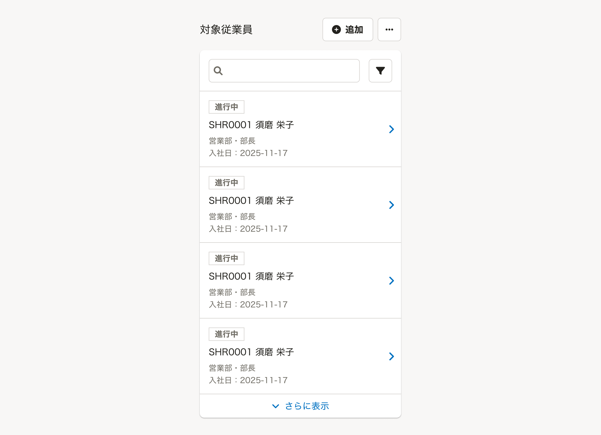
    </ImgWithDesc>
</Grid>

#### テーブル操作エリア

`よくあるリスト`における[リスト操作エリア](/products/design-patterns/smarthr-list/#h3-1)に相当します。

| 構成要素 | よくあるテーブル | よくあるリスト | 変換時の注意 |
| :--- | :--- | :--- | :--- |
| ボタン | 最大3つ | 最大2つ | 3つ以上の操作は、[DropdownMenuButton](/products/components/dropdown/dropdown-menu-button/)を使ってまとめます。その場合、Button→DropdownMenuButtonの順に配置します。よくあるテーブルの表示順とは異なる点に注意してください。 |

<Grid>
    <ImgWithDesc description="よくあるテーブルのテーブル操作エリア">
    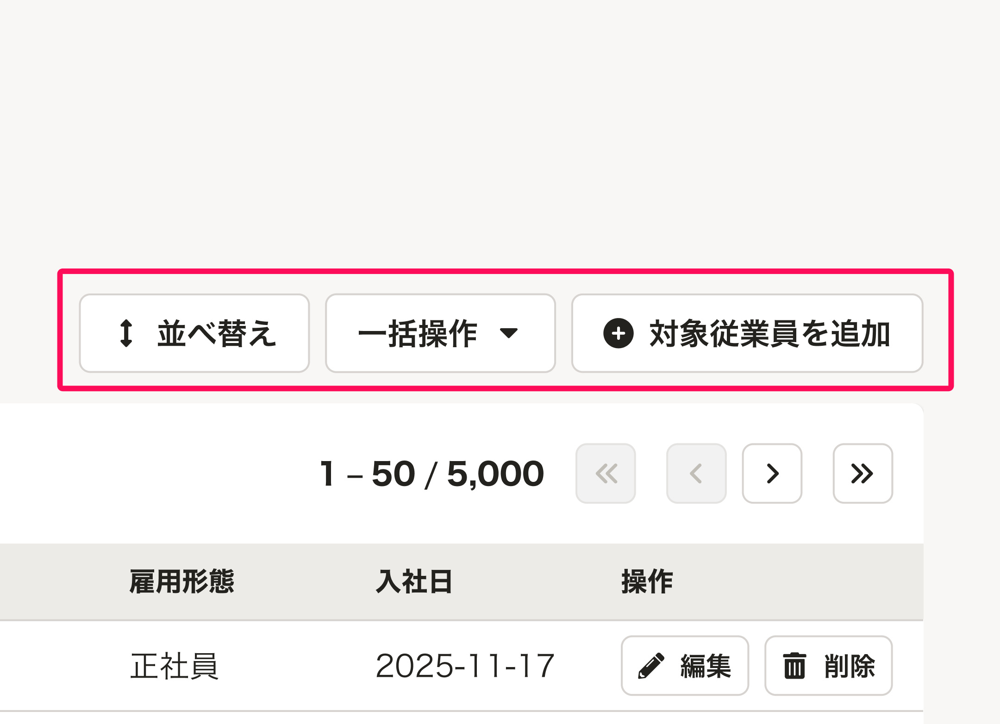
    </ImgWithDesc>
    <ImgWithDesc description="よくあるリストのリスト操作エリア">
    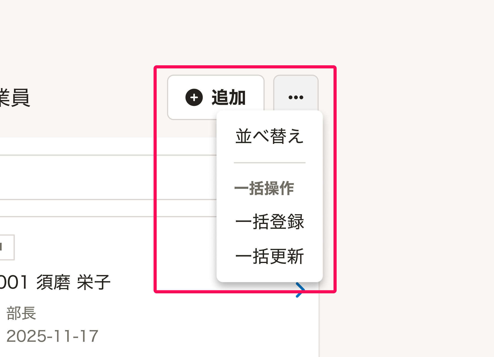
    </ImgWithDesc>
</Grid>

#### 一時操作エリア
`よくあるリスト`においても[同名のエリア](/products/design-patterns/smarthr-list/#h3-2)があります。

| 構成要素 | よくあるテーブル | よくあるリスト | 変換時の注意 |
| :--- | :--- | :--- | :--- |
| Base内の上部に配置する操作 | ユースケースに応じて表示 | [SearchInput](/products/components/input/search-input/)と[FilterDropdown](/products/components/dropdown/filter-dropdown/)のみ表示 | `よくあるテーブル`で表示しているそれ以外の操作は、`よくあるリスト`では表示しません。<br/>検索ボタンは表示せず、リターンキーが押されたら、検索処理を実行します。 |
| Base外の下部に配置する操作 | 主にページ送りを表示 | 表示なし | 件数が多い場合は代わりに「さらに表示」ボタンを表示して、追加で読み込めるようにします。 |

<Grid>
    <ImgWithDesc description="よくあるテーブルの一時操作エリア">
    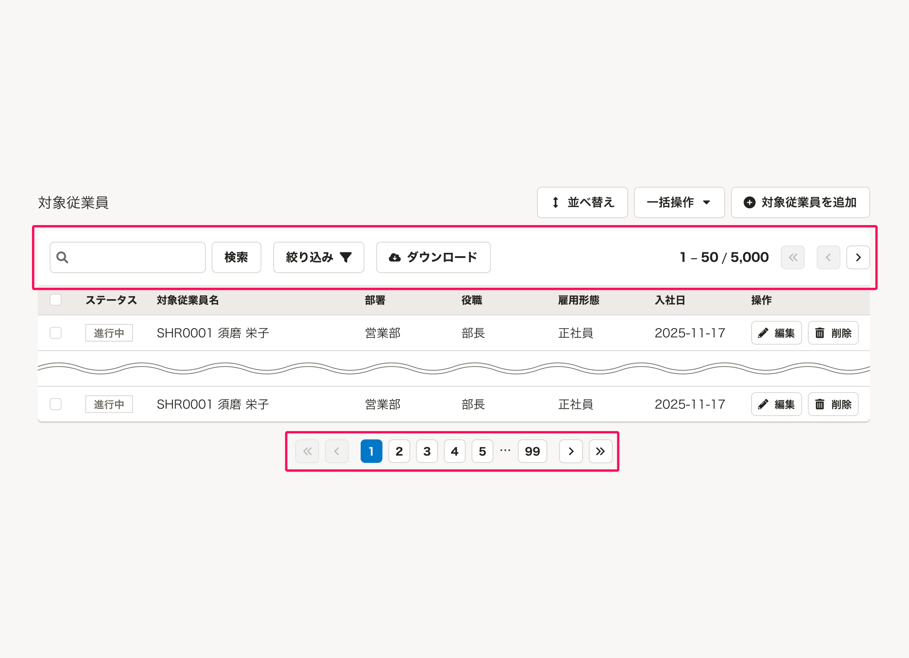
    </ImgWithDesc>
    <ImgWithDesc description="よくあるリストの一時操作エリア">
    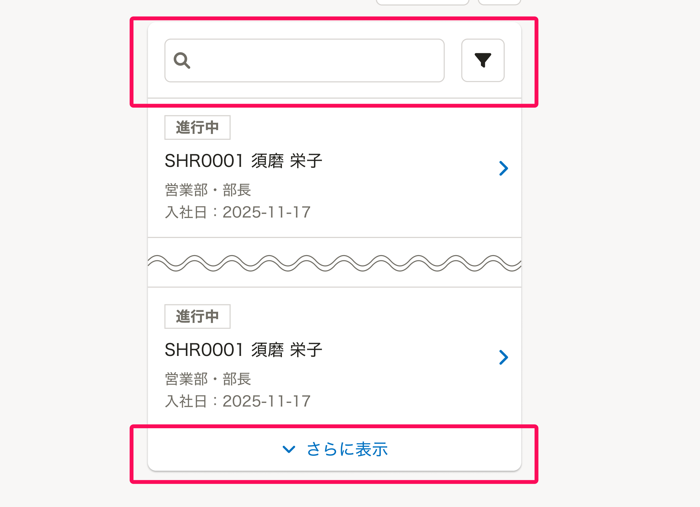
    </ImgWithDesc>
</Grid>

#### テーブル

`よくあるリスト`における[リスト](/products/design-patterns/smarthr-list/#h3-3)に相当します。

| 構成要素 | よくあるテーブル | よくあるリスト | 変換時の注意 |
| :--- | :--- | :--- | :--- |
| 1ページの表示件数 | 20件~50件程度 | 5件~20件程度 | - |
| オブジェクト名 | 詳細ビューへのリンクを設定できる | 詳細ビューへのリンクは設定しない | 詳細ビューがある場合は、リスト項目の領域全体をリンクとして設定します。 |
| オブジェクトの情報 | ユースケースに応じて表示 | ステータスと最大2行分の情報のみ表示（2行に収まる範囲で、3つ以上の情報の表示も可能です。） | `よくあるリスト`で表示しきれない情報は、詳細ビューで表示します。 |
| オブジェクトの操作 | ユースケースに応じて表示 | （オブジェクトが詳細ビューを持つ場合）オブジェクトの操作を表示しない<br />（オブジェクトが詳細ビューを持たない場合）通常サイズのアイコンボタン1つのみ表示 | アイコンだけでは意味が伝わりづらい操作や、複数の操作を表示したい場合は、[DropdownMenuButton](/products/components/dropdown/dropdown-menu-button/)を使います。 |

<Grid>
    <ImgWithDesc description="よくあるテーブルのテーブル（オブジェクトが詳細ビューを持っている場合）">
    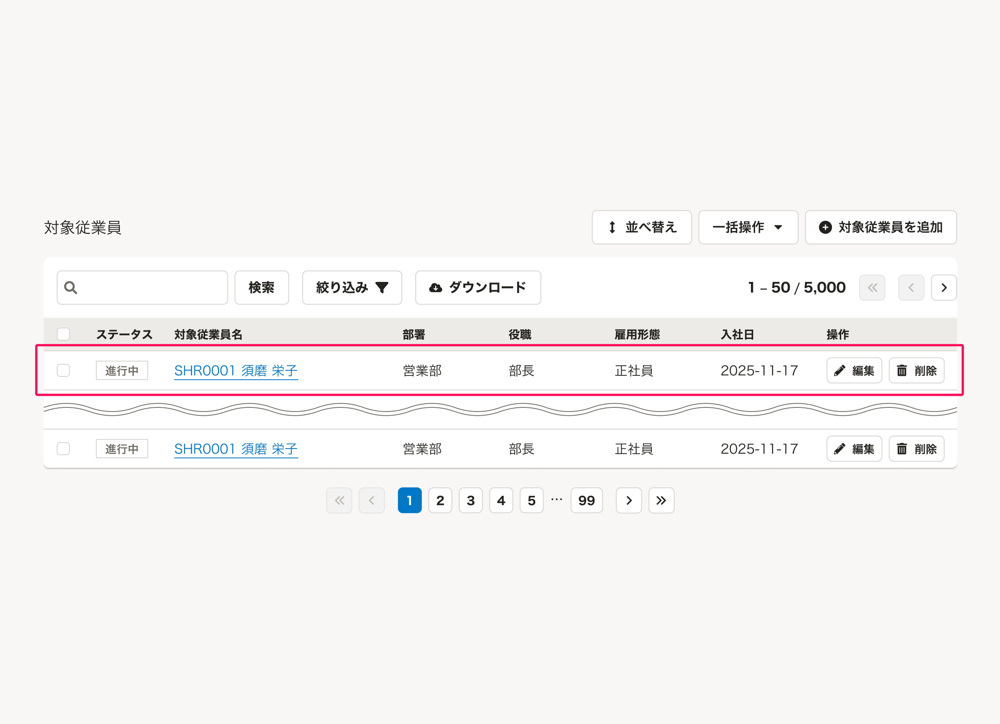
    </ImgWithDesc>
    <ImgWithDesc description="よくあるリストのリスト（オブジェクトが詳細ビューを持っている場合）">
    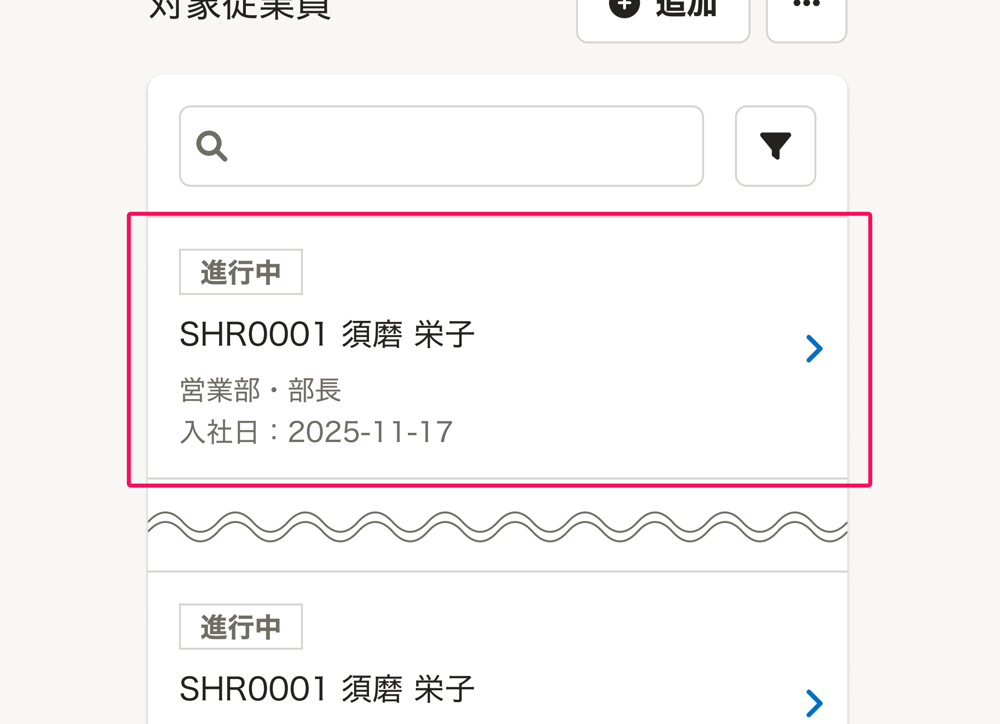
    </ImgWithDesc>
</Grid>

<Grid>
    <ImgWithDesc description="よくあるテーブルのテーブル（オブジェクトが詳細ビューを持たない場合）">
    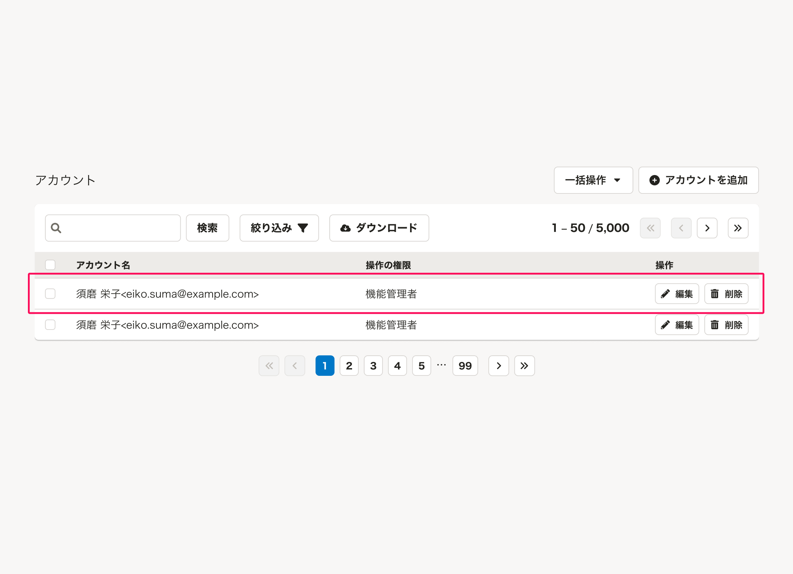
    </ImgWithDesc>
    <ImgWithDesc description="よくあるリストのリスト（オブジェクトが詳細ビューを持たない場合）">
    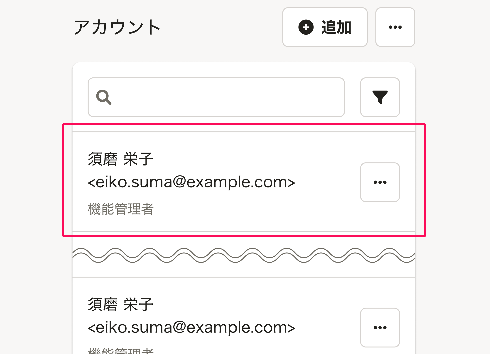
    </ImgWithDesc>
</Grid>
