UI設計における余白とは、情報を整理するために設ける要素間の視覚的な距離のことを指します。  
ここでは、マージン（Margin）やパディング（Padding）などの余白のパターンをまとめています。

## 基本的な考え方
余白は、要素間の距離に差をつけてかたまり（チャンク）を形成することで、要素同士の並列・内包などの関係性を視覚的に表現するために使います。  
適切な余白を設定することで、ユーザーの素早く、正しい情報の理解を助けられます。

UI設計において開発者は適切な余白について意識することが重要ですが、[SmartHR UIのコンポーネント](/products/components/)の中には、あらかじめ適切な余白が設定されており、余白の選定を意識することなく利用できるものがあります。[Layoutコンポーネント](/products/components/layout/)を使う場合や、コンポーネントを組み合わせて画面に配置する場合に、下記を参考に適切な余白を設定してください。

なお、ここで示す余白の基準は必ず従わなければならないものではありません。  
ただし、基準を逸脱した余白を設定する場合はその理由や効果を説明できるようにしておきましょう。

## 考慮する法則
SmartHRの製品開発では、人間の認知に関する以下の法則を考慮して余白を設計します。

- ゲシュタルト原則における近接の法則
- 視線誘導の法則

### ゲシュタルト原則における近接の法則
距離が近いもの同士を関連性があるものとして認識する傾向がある、という法則です。  
関連性の高い要素には小さな余白、関連性の低い要素には大きな余白を設定することで、ユーザーは情報のまとまりを認識できます。

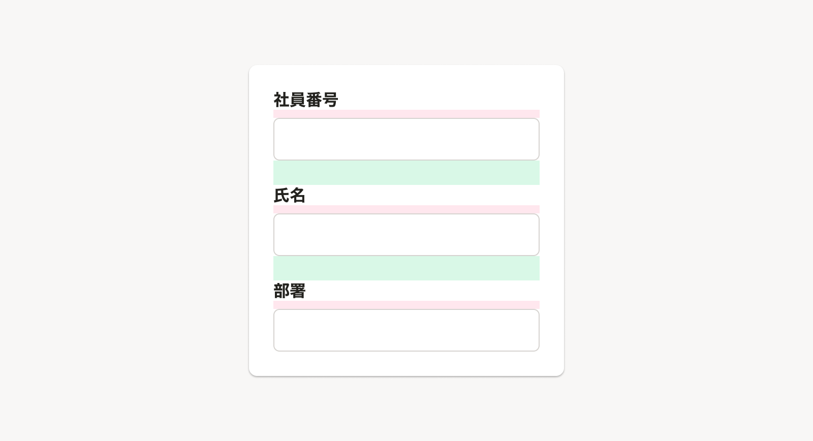

### 視線誘導の法則
[視線誘導の「視線は大きいものから小さいものへ移動する」法則](/products/design-patterns/visual-guidance/#h3-1)のとおり、余白は外側から内側に向かうにつれて狭くすることで、外側の要素から内側の要素に視線を誘導する効果を期待できます。

## 種類
以下の余白を定義します。

- マージン（Margin）
- パディング（Padding）

SmartHRにおいては、**基準サイズの16pxを`1`** とした[プリミティブトークン](/products/design-tokens/spacing/#h2-1)を使用します。

### マージン（Margin）
マージンとは、要素と要素の間に設定する余白のことです。

具体的な配置の基準は次の通りです。

- セクションやブロックの見出しレベルや階層を下げるにつれて、段階的に適用する。
- 同じ意味階層となる要素同士は、ぞれぞれ同じ大きさのマージンを適用する。

以下の構成で紹介します。

- 垂直方向のマージン
  - [代表的なページ内レイアウトのマージン](#h5-0)
  - [代表的なダイアログ内レイアウトのマージン](#h5-1)
  - [見出しとコンテンツのマージン](#h5-2)
  - [UpwardLinkと画面タイトルのマージン](#h5-3)
  - [小さい要素間のマージン](#h5-4)
  - [視覚的に余白が大きく見える場合のマージン](#h5-5)
- 水平方向のマージン
  - [アイコンやラベルなどの小さい要素間のマージン](#h5-6)

#### 垂直方向のマージン

垂直方向に要素を配置する場合は[Stack](/products/components/layout/stack/)を使用し、`gap` propsにマージンを設定してください。

##### 代表的なページ内レイアウトのマージン

1. セクション同士の間：`2（32px）`
	- 必要に応じて`1.5（24px）`（[視覚的に余白が大きく見える場合のマージン](#h5-5)を参照）
2. セクション内の要素同士の間：`1.5（24px）`
3. セクション内の見出しとコンテンツの間：`1（16px）`

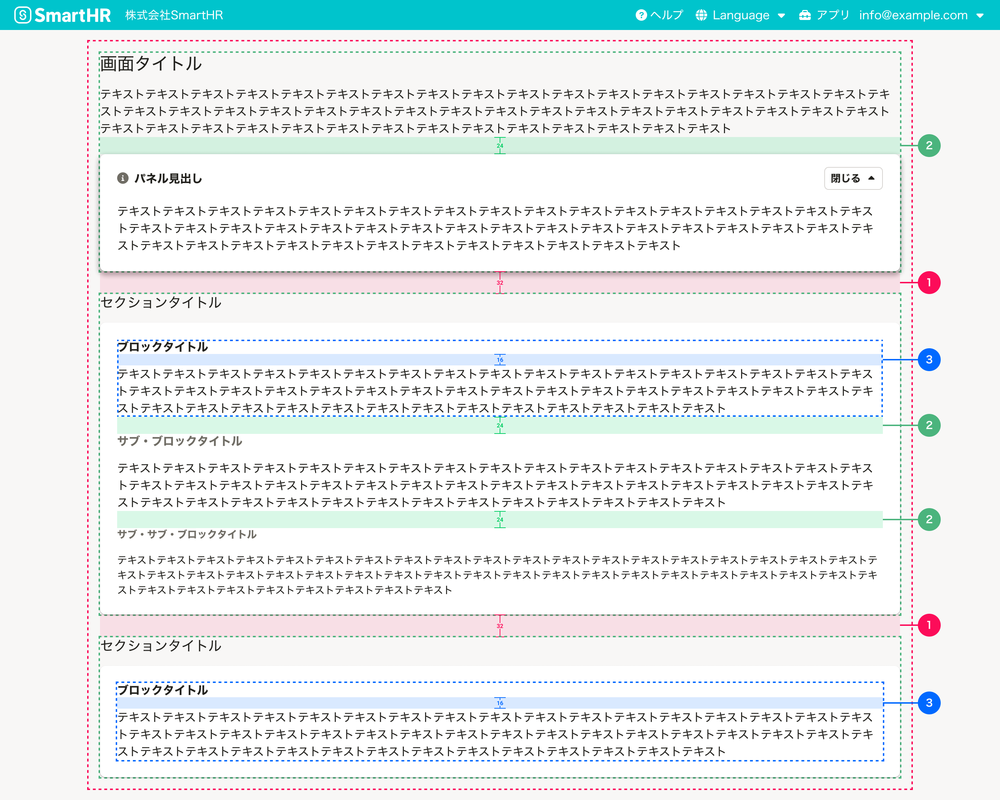

##### 代表的なダイアログ内レイアウトのマージン

1. 説明テキストとフォーム要素のセクションの間：`2（32px）`
2. フォーム要素同士の間：`1.5（24px）`
3. フォーム要素内の説明テキストとフォームの間：`1（16px）`

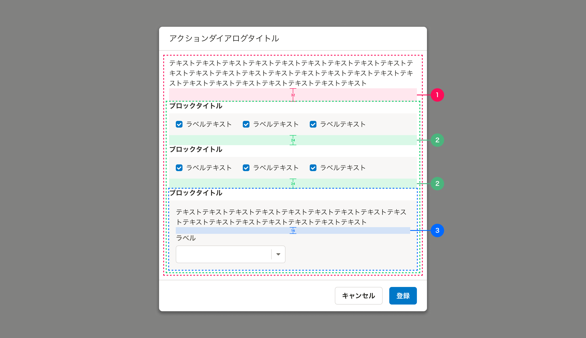

##### 見出しとコンテンツのマージン

- 各セクションの見出しとコンテンツの間：`1（16px）`

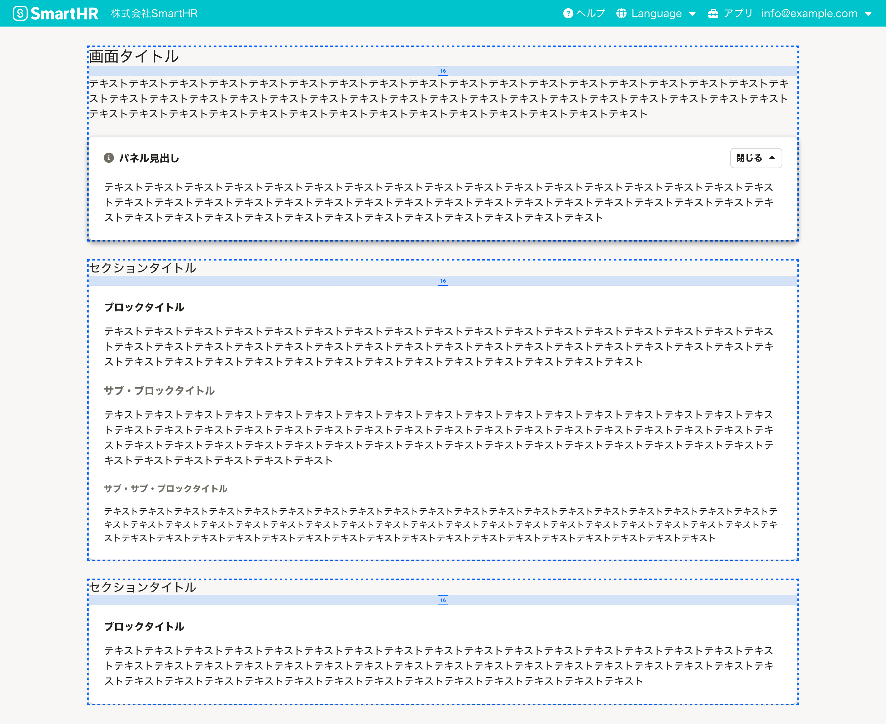

##### UpwardLinkと画面タイトルのマージン

- [UpwardLink](/products/components/text-link/upward-link/)と画面タイトルの間：`1（16px）`

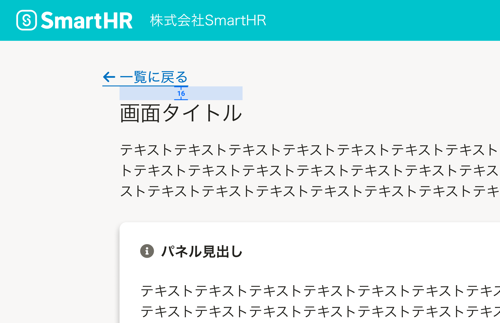

##### 小さい要素間のマージン

コンポーネント内で確保されているものと、個別で指定する必要のあるものがあります。

1. ブロックの見出しや[Input](/products/components/input/)にラベルや説明テキストを複合的に組み合わせる場合：`1（16px）`または`0.5（8px）`
    - [FormControl](/products/components/form-control/)や[Fieldset](/products/components/fieldset/)を利用することで、自動的に適用されます。
2. [CheckBox](/products/components/check-box/)や[RadioButton](/products/components/radio-button/)のrow-gap：`1（16px）`
    - [Stack](/products/components/layout/stack/)を使用して余白を指定してください。

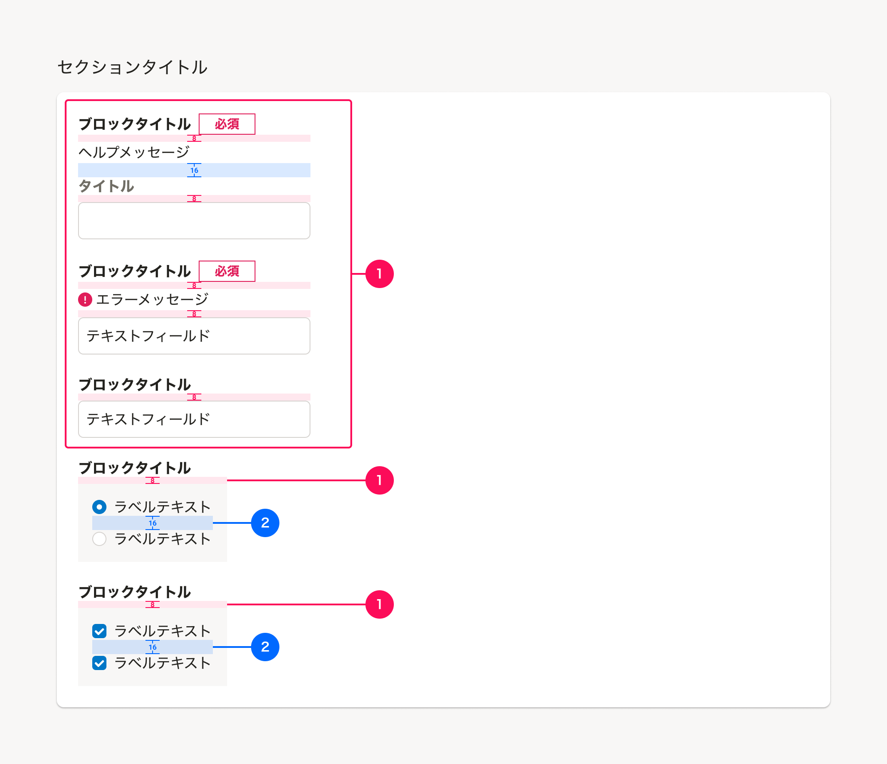

##### 視覚的に余白が大きく見える場合のマージン

配置するコンポーネントによっては、実際に指定した余白の値よりも**視覚的に余白が大きく見える**場合があります。以下のように例外的に小さな余白を設定することで、視覚的な余白を調整してください。

- タイトルエリアに[InformationPanel](/products/components/information-panel/)を**配置しない**場合のタイトルエリアと最初のセクションの間：`1.5（24px）`
  - [Heading](/products/components/heading/)や[Text](/products/components/text/)にはline-heightが設定されており、InformationPanelが配置されている場合と比べて余白が大きく見えるため
  - セクションの見出しとボタンが横に並んでいる場合、見出しの高さをボタンの高さに合わせることでさらに余白が大きく見えるため

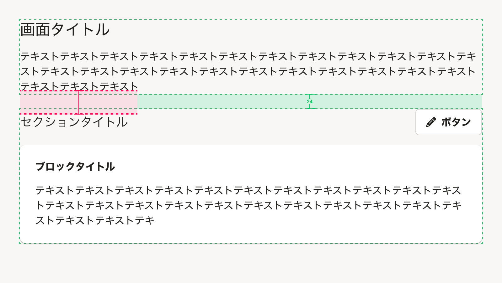

#### 水平方向のマージン

水平方向に要素を配置する場合は[Cluster](/products/components/layout/cluster/)や[Reel](/products/components/layout/reel/)を使用し、`gap` propsにマージンを設定してください。

##### アイコンやラベルなどの小さい要素間のマージン

コンポーネント内で確保されているものと、個別で指定する必要のあるものがあります。

1. [StatusLabel](/products/components/status-label/)やアイコンなどの要素をテキストと組み合わせる場合：`0.5（8px）`または`0.25（4px）`
    - [InformationPanel](/products/components/information-panel/)や[FormControl](/products/components/form-control/)、[Fieldset](/products/components/fieldset/)、[TextLink](/products/components/text-link/)を利用することで、自動的に適用されます。
    - その他の場合は、[Cluster](/products/components/layout/cluster/)を使用して余白を指定してください。
2. フォームを水平方向に配置する場合：`1（16px）`
3. [CheckBox](/products/components/check-box/)や[RadioButton](/products/components/radio-button/)のcolumn-gap：`1.5（24px）`
	- [Cluster](/products/components/layout/cluster/)を使用して余白を指定してください。
4. [Button](/products/components/button/)同士の間：`0.5（8px）`または`1（16px）`

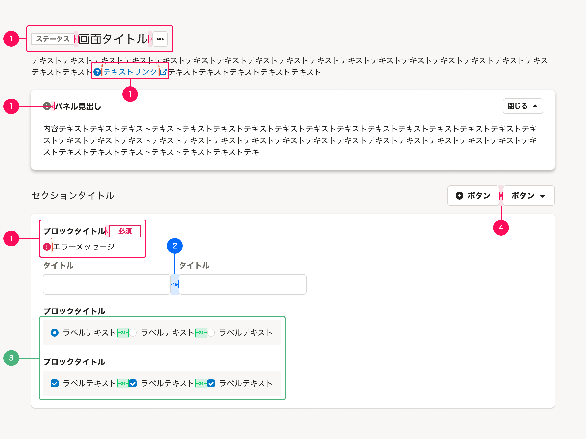

### パディング（Padding）
パディングとは、要素の内側に設定する余白のことです。

具体的な配置の基準は次の通りです。

- セクションやブロックの見出しレベルや階層を下げるにつれて、段階的に適用する。
- 同じ意味階層となる要素同士は、ぞれぞれ同じ大きさのパディングを適用する。

#### 代表的なページ内レイアウトのパディング

1. メインコンテンツのパディング：`2（32px）`
    - [UpwardLink](/products/components/text-link/upward-link/)がある場合は、[UpwardLinkがある場合のパディング](#h4-4)を参照してください。
2. コンテンツエリアのパディング：`1.5（24px）`
    - [Base](/products/components/base/)の `padding` propsに値を指定してください。
3. コンテンツエリア内のグループのパディング：`1（16px）`
    - [BaseColumn](/products/components/base/base-column/)を使用することで、自動的に適用されます。

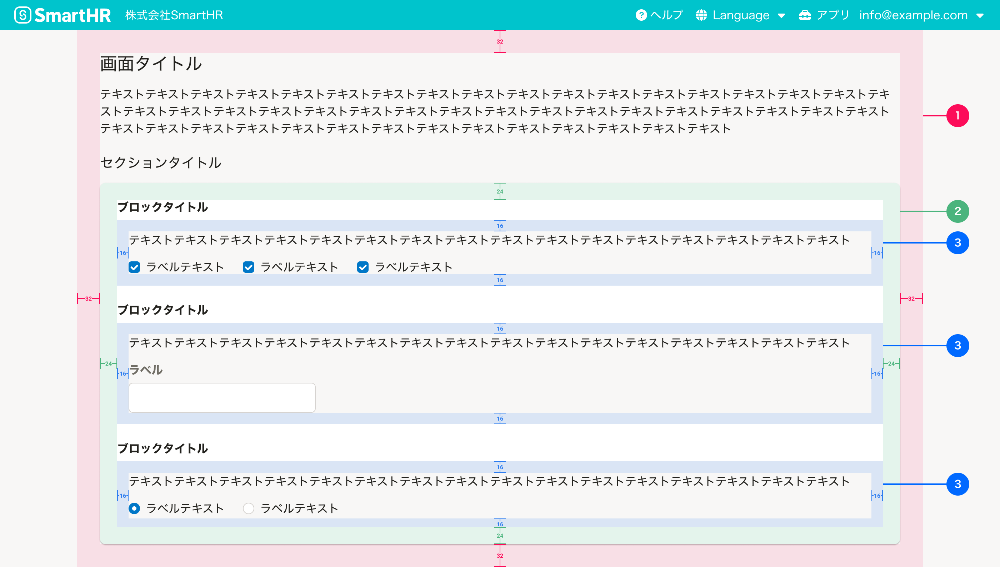

#### 代表的なダイアログ内レイアウトのパディング

1. コンテンツエリアのパディング：`1.5（24px）`
    - [Dialog](/products/components/dialog/)を使用することで、自動的に適用されます。
2. コンテンツエリア内のグループのパディング：`1（16px）`
    - [BaseColumn](/products/components/base/base-column/)を使用することで、自動的に適用されます。

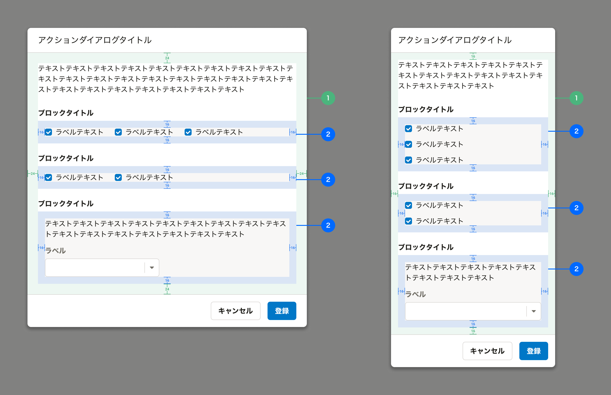

#### UpwardLinkがある場合のパディング

1. [UpwardLink](/products/components/text-link/upward-link/)がある場合のpadding-top：`2（32px）`
2. 基本機能の共通設定において[UpwardLink](/products/components/text-link/upward-link/)がある場合のpadding-top：`22px`
    - 基本機能のサイドナビゲーションとヘッダーの余白と揃えるため、この値としています。

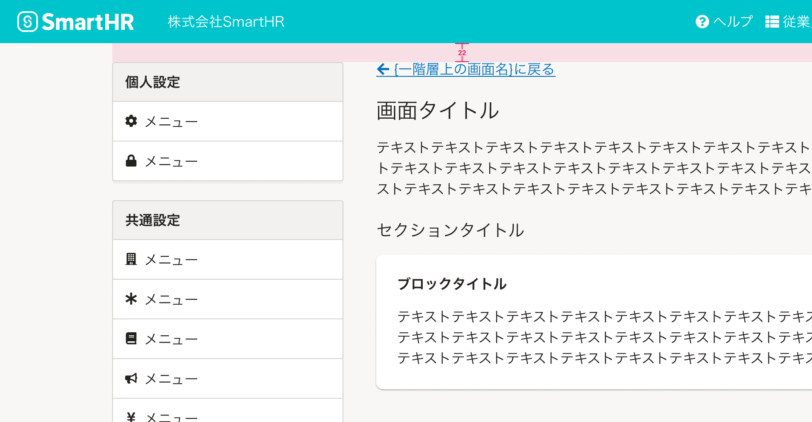
