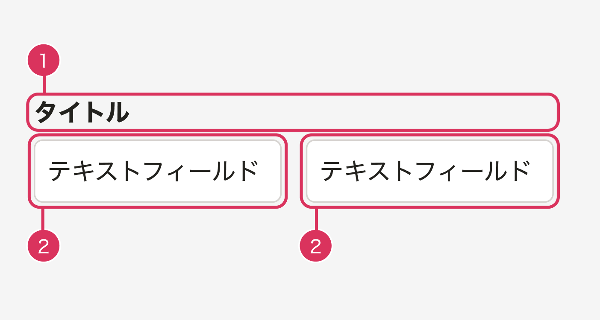

1つの項目に対して複数の入力欄（テキストフィールド）が並ぶUI（分割インプット）において、各セグメントに適切なアクセシブルネームを設定するためのルールを定義します。

分割インプットは、SmartHRプロダクトで多く見つかるアクセシビリティ上のNGパターンの1つであり、支援技術の利用者が各セグメントの意味を把握できるようにするための基準が必要です。


## 用語定義

| 用語 | 説明 |
| --- | --- |
| 分割インプット | 1つの可視ラベルに対して、複数の入力欄が並んでいるUI。例: 電話番号（3分割）、日付の期間指定（前〜後）など |
| セグメント | 分割されたそれぞれの入力欄のこと |
| アクセシブルネーム（accessible name） | 支援技術（スクリーンリーダーなど）がUI要素を識別するために使用する名前。FormControl コンポーネントを使用することで自動で付与される |
| 可視ラベル | 画面上に表示されているラベルテキスト。例:「年齢」「電話番号」「面談実施日」など |
| 補助文 | 各セグメントを区別するためにアクセシブルネームに追加するテキスト。例:「開始日」「最初の4桁」など |


## 基本的な考え方

分割インプットは、入力欄を分割することがデファクトスタンダードとなっている場合や、紙の書類のフォーマットに依存するため分割するほうが望ましい場合に採用します。

分割インプットは以下の2つの要素で構成されます。

1. 可視ラベル
2. 入力要素（セグメント）



### アクセシビリティ

入力フォームに紐づくラベルがない場合、アクセシブルネームがない状態になり、支援技術で操作するユーザーは入力要素の意味を判断できなくなります。そのため、以下の対応が必要です。

- セグメントのアクセシブルネームは **「可視ラベル + 補助文」** の形式で設定する
- 補助文によって、支援技術の利用者がセグメント欄の役割を理解できるようにする
- 視覚的な区切り文字や条件文（「〜」「歳以上」「-」など）は `aria-hidden="true"` で装飾テキストとして扱い、アクセシブルネームには含めない
- 分割インプットは大きく **2つの種類** にわかれ、それぞれ補助文のルールが異なる


## 種類

| 表示パターン | 説明 | 例 |
| --- | --- | --- |
| A | 2つの入力欄で範囲の開始と終了を指定するパターン | 日付、年齢、時刻 |
| B | 本来1つの値を桁数で分割して入力するパターン | 電話番号、郵便番号、被保険者番号 |

### A: 2つの入力欄で範囲の開始と終了を指定するパターン

#### 例

- 日付の期間:`入社年月日 開始日`〜`入社年月日 終了日`
- 年齢の範囲:`年齢 最小`〜`年齢 最大`
- 時刻の範囲:`勤務時間 開始`〜`勤務時間 終了`

#### ルール

1. 入力要素のアクセシブルネームは `aria-labelledby` で **「可視ラベルのテキスト + 補助文」** を指定する
2. 視覚的な条件文（「歳以上」「〜」「から」「まで」など）は `aria-hidden="true"` で装飾テキストとして表示する

#### 補助文のルール

補助文は以下のルールを参考にしつつ、コンテキストに合わせたテキストを採用します。

| データの種類 | 補助文（開始側） | 補助文（終了側） |
| --- | --- | --- |
| 日付 | 開始日 | 終了日 |
| 時刻 | 開始 | 終了 |
| 年齢 | 最小 | 最大 |
| 数値 | 最小 | 最大 |

### B: 1つの値が分割されている分割インプット

電話番号や被保険者番号など、本来1つの値を桁数で分割して入力するパターンです。

#### 例

- 電話番号（3分割）: 03-1234-5678
- 郵便番号（2分割）: 100-0001
- 雇用保険被保険者番号（3分割）: 4桁-6桁-1桁
- 基礎年金番号（2分割）: 4桁-6桁

#### ルール

1. 入力要素のアクセシブルネームは **「可視ラベル + 桁の位置を示す補助文」** で指定する
2. 視覚的な区切り文字（「-」など）は `aria-hidden="true"` で装飾テキストとして扱う

#### 補助文のルール

**入力欄が2つの場合:**

| 位置 | 補助文 |
| --- | --- |
| 1個目 | 最初のN桁 |
| 2個目 | 残りのM桁 |

**入力欄が3つ以上の場合:**

| 位置 | 補助文 |
| --- | --- |
| 1個目 | 最初のA桁 |
| 2〜N-1個目 | 次のB桁 |
| N個目 | 最後のC桁 |

**例外: 電話番号**

電話番号は場所によって桁数が異なるため、桁数ではなく意味で区別します。

| 位置 | 補助文 |
| --- | --- |
| 1つ目 | 市外局番 |
| 2つ目 | 市内局番 |
| 3つ目 | 個別番号 |


## 実装上の注意

### Fieldset + FormControl コンポーネントを使用する

可視ラベルには `Fieldset` コンポーネントの `legend` を使用し、補助文には `FormControl` の `label` を使用し、`label.unrecommendedHide: true` をつけることで、補助文を視覚的に隠すことができます。

SmartHR UI コンポーネントにはこの仕組みが実装されており、上記の組み合わせで各セグメントのアクセシブルネームが自動的に「可視ラベル + 補助文」の形式になります。

```tsx
<Fieldset legend="入社年月日">
  <FormControl label={{
    "text": "開始日",
    "unrecommendedHide": true
  }}>
    <Input type="date" name="start-date"/>
  </FormControl>
  <FormControl label={{
    "text": "終了日",
    "unrecommendedHide": true
  }}>
    <Input type="date" name="end-date"/>
  </FormControl>
</Fieldset>
```


## スクリーンリーダーの読み上げに関する注意

- 漢字の読み上げはスクリーンリーダーによって異なる（例:「歳以上」→「としいじょう」と読まれることがある）
- 意図通りの読み上げを完全に保証するにはひらがな表記が必要になるが、ルールが煩雑になるため現時点では漢字表記を許容する
- NVDAのブラウズモードでは `aria-labelledby` が読み上げられない場合がある（フォーカスモードでは読み上げられる）


## 参考文献

- [入力する内容や、操作がラベルとして表示されている | ウェブアクセシビリティ簡易チェックリスト | SmartHR Design System](https://smarthr.design/accessibility/check-list/label/)
- [フォームパーツにアクセシブルネームがある | ウェブアクセシビリティ簡易チェックリスト | SmartHR Design System](https://smarthr.design/accessibility/check-list/accessible-name/)
- [ARIA9: Using aria-labelledby to concatenate a label from several text nodes | WAI | W3C](https://www.w3.org/WAI/WCAG21/Techniques/aria/ARIA9)
