[よくあるテーブル](/products/design-patterns/smarthr-table/)で複数のオブジェクトに対して一括操作するUIのパターンです。

## 構成
「よくあるテーブル」のなかで、複数オブジェクトへの一括操作に関するUIは、以下の要素で構成されます。  
テーブル内のその他の要素については、[「よくあるテーブル」の構成](/products/design-patterns/smarthr-table/#h2-0)を参照してください。

1. 一括選択するチェックボックス（必須）
2. 個別選択するチェックボックス（必須）
3. テーブル内の一括操作エリア
    - [一括操作エリアの表示](#h4-0)
    - [選択状態の表示](#h4-1)
    - [わくわくチェック（すべてのオブジェクトの選択）](#h4-2)
    - [一括操作ボタン](#h4-3)

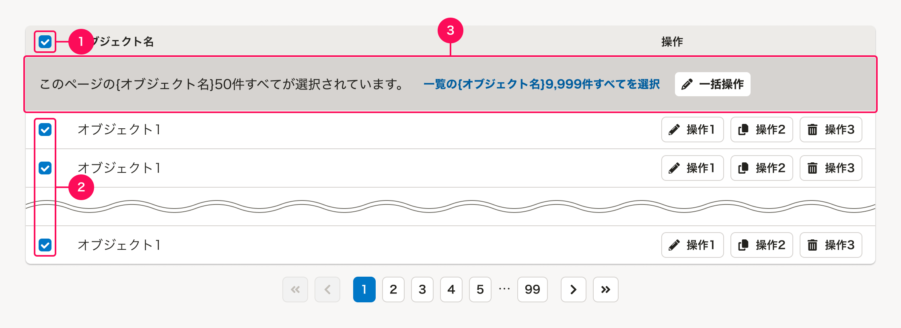

### 1. 一括選択するチェックボックス
テーブル内の要素をすべて選択できるチェックボックスです。  

デフォルトは未選択状態で、クリックされるとテーブルに表示されているオブジェクトをすべて選択状態にします。
表示しているページ外のオブジェクト（他のページのオブジェクト）は選択状態にしません。

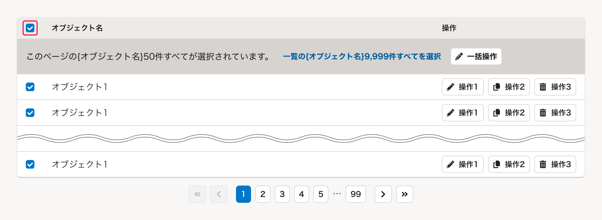

「一括選択するチェックボックス」が未選択状態のときに、テーブル内のオブジェクトが1つ以上選択された場合（選択状態と未選択状態が混ざっている場合）は、「一括選択するチェックボックス」を混在選択状態（`mixed=true`）にします。

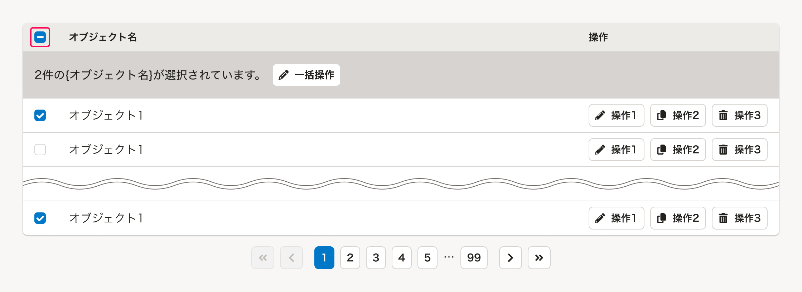

「一括選択するチェックボックス」の選択状態を解除すると、[「わくわくチェック」の選択解除](#h3-4)と同様にテーブルのページ送り上も含めたすべての選択状態を解除します。  

混在選択状態（`mixed=true`）で「一括選択するチェックボックス」をクリックした場合も同様に、すべての選択状態を解除します。

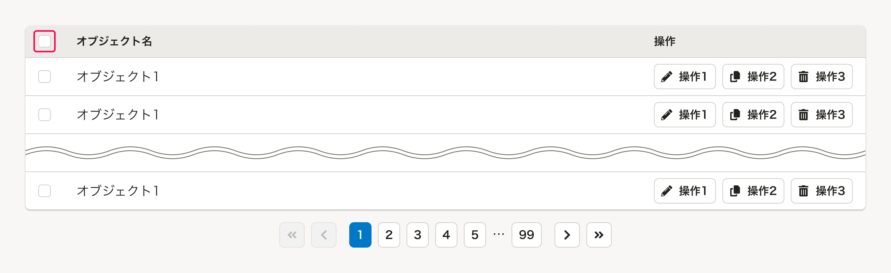

### 2. 個別選択するチェックボックス
テーブル内のオブジェクトを個別選択できるチェックボックスです。

ページ送りによって他のページに移動された場合は、選択状態は維持せずにすべてのオブジェクトの選択状態を解除します。

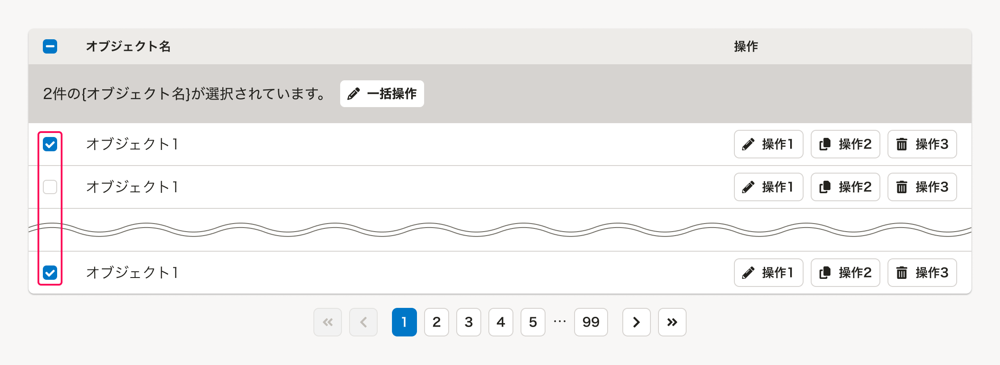

### 3. テーブル内の一括操作エリア
テーブル内で選択されたオブジェクトに対して一括操作を配置するエリアです。  
SmartHR UIではこのエリアを`BulkActionRow`と呼んでいます。

#### 一括操作エリアの表示
一括操作エリアは、基本的に「一括選択するチェックボックス」または「個別選択するチェックボックス」が1つ以上選択された際に表示します。

ただし、以下の場合には（未選択状態の）一括操作エリアを常に表示することを検討しましょう。
一括操作ボタンの表示は必須ではありません。

- 一括操作の存在をユーザーにあらかじめ認知させたい場合
- 「オブジェクトを選択して（一括）操作すること」が主たる操作である場合

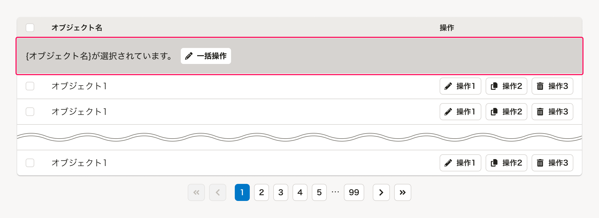

#### 選択状態の表示
一括操作エリアには、テーブル内でオブジェクトの選択状態を示すテキストを表示します。

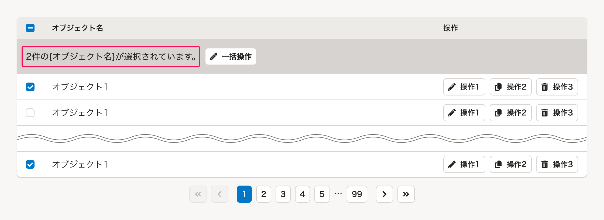

##### 選択状態のライティングパターン
オブジェクトの選択状態にあわせたライティングパターンは以下のとおりです。

- 句点を省略しないでください。
- 件数の単位は、オブジェクトの意味にあわせて「件」「名」などを使用してください。
  - 関連リンク：[従業員に関連する数え方の表記](/products/contents/app-writing/#h2-3)

| オブジェクトの選択状態 | テキストに表示する文言 |
| :--- | :--- |
| 未選択（常に表示する場合） | `{オブジェクト名}が選択されていません。` |
| 複数選択されている | `{件数}件の{オブジェクト名}が選択されています。` |
| 表示されているものすべてが選択されている | `このページの{オブジェクト名}{件数}件すべてが選択されています。` |
| テーブルのページ送り上のすべてが選択されている | `一覧の{オブジェクト名}{件数}件すべてが選択されています。` |

#### わくわくチェック（すべてのオブジェクトの選択）
複数のページに分けてオブジェクトを表示している場合に、ページの枠を超えてすべてのオブジェクトを選択できるUIを「*わくわくチェック*」と呼んでいます。  

具体的な動作については、[わくわくチェックの動作](#h2-2)を参照してください。

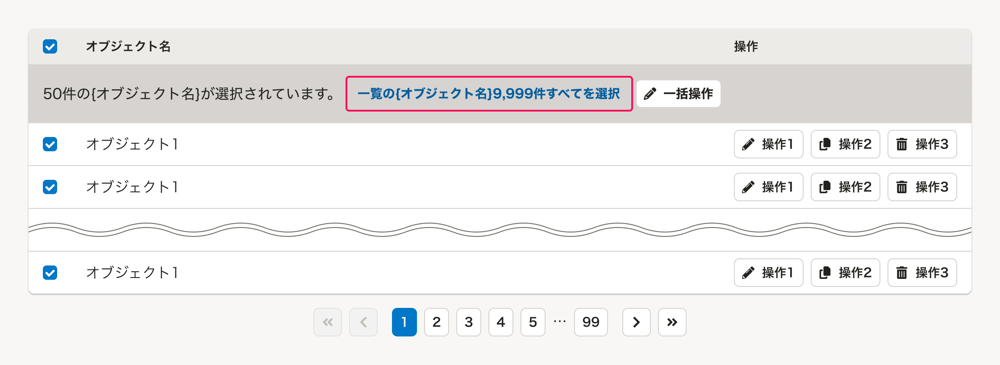

#### 一括操作ボタン
一括操作エリア内の要素として、データの削除・一括変更など、選択したオブジェクトを一括で操作するためのボタンを配置できます。

- [Button](/products/components/button/)や、類似する操作をまとめた[DropdownMenuButton](/products/components/dropdown/dropdown-menu-button/)を配置できます。
- ユーザーが迷わないよう、配置するボタンは多くても4つ程度とします。多数の操作ができる場合には、アクションの優先度を検討し、優先度が低いアクションは減らしたり、[DropdownMenuButton](/products/components/dropdown/dropdown-menu-button/)としてまとめて配置するなどを検討しましょう。

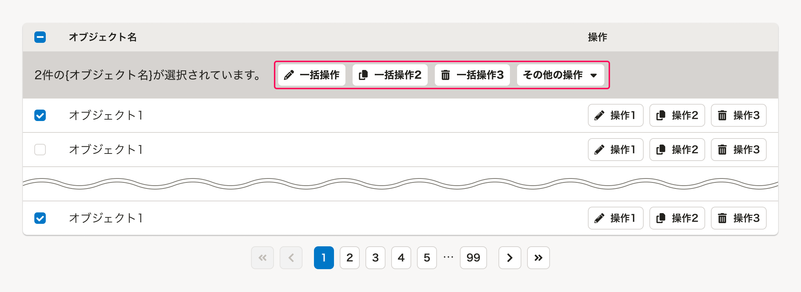

##### 一括操作ボタンの例
典型的な一括操作ボタンの例は以下のとおりです。  
以下に限らず、データの追加・一括変更など、扱う機能やユースケースによって配置できます。

| 操作名 | ボタンのラベル例 | 役割・動作 |
| :--- | :--- | :--- |
| オブジェクトへの一括操作 | `一括削除`,`一括ダウンロード` | オブジェクトへの一括操作をするためのボタンです。「一括`{操作名}`」と表記します。 クリックすると、多くの場合、操作実行内容の確認ダイアログを表示します。 |
| オブジェクトに関する通知 | `通知を一括送信`,`依頼を一括送信` | オブジェクトに関する通知や依頼を対象者に送信するためのボタンです。「`{送信対象名}`を一括送信」と表記します。 クリックすると、多くの場合、送信内容の確認ダイアログを表示します。 |
| タスクとしての一括操作 | `一括承認`,`一括確定`,`一括取り消し`,`PDFファイルを一括アップロード` | オブジェクトに対するタスクを実行するためのボタンです。「一括`{操作名}`」と表記します。一括操作の選択対象と操作対象が異なる場合、「`{操作対象オブジェクト名}`を一括`{操作名}`」とし、選択対象に対する操作対象を明示します。 クリックすると、多くの場合、操作実行内容の確認ダイアログを表示します。 |
| その他の操作 | `その他の操作` | 多数の操作ができる場合、一括操作をまとめて配置するために使用する[DropdownMenuButton](/products/components/dropdown/dropdown-menu-button/)です。 |

## レイアウト
基本的に[余白の取り方](/products/design-patterns/spacing-layout-pattern/)に従って配置します。  
[テーブル内の一括操作エリア](#h3-2)の要素間の余白は以下のとおりです。

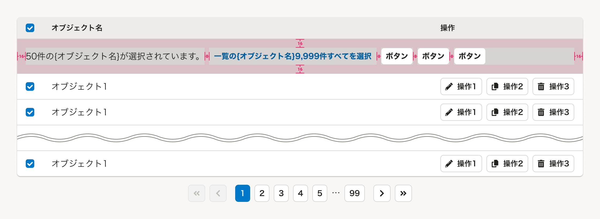

## わくわくチェックの動作
`わくわくチェック` の動作パターンは次のとおりです。

- すべてのオブジェクトを選択
- すべてのオブジェクトを選択解除

### すべてのオブジェクトを選択
現在表示されているページのオブジェクトがすべて選択されたときに `一覧の{オブジェクト名}{件数}件すべてを選択` というテキストリンクを表示し、ユーザーが**テーブルのページ送り上のすべてのオブジェクトを選択**できるようにします。

件数の表示が難しい場合は、`一覧の{オブジェクト名}すべてを選択` と省略しても構いません。

現在表示されているページに未選択のチェックボックスが１つ以上ある場合は、このテキストリンクは表示しません。

### すべてのオブジェクトを選択解除
`わくわくチェック` のオブジェクト選択中は、ユーザー自身で元の状態に戻せるように、テキストリンクを `選択解除` に置き換え、**（ページ送りも含めた）すべてのオブジェクトの選択状態を解除**できるようにします。

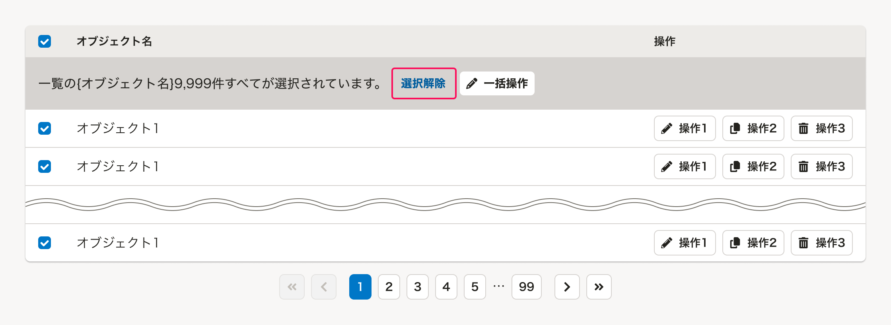

また、`わくわくチェック` のオブジェクト選択中に、ページ送りによって他のページに移動された場合は、**選択状態は維持せずにすべてのオブジェクトの選択状態を解除する**動作に統一します。
