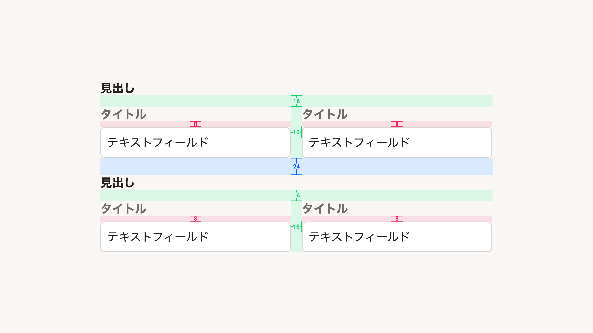
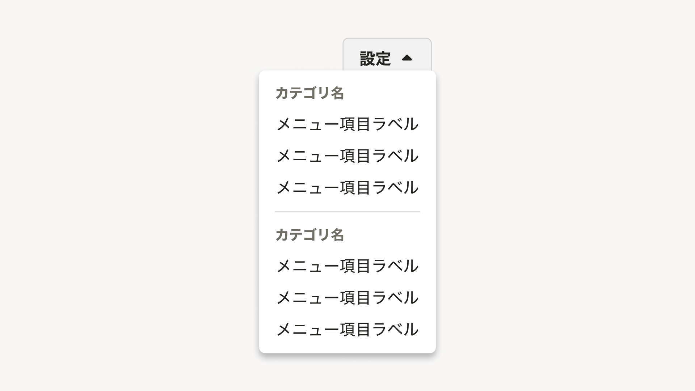
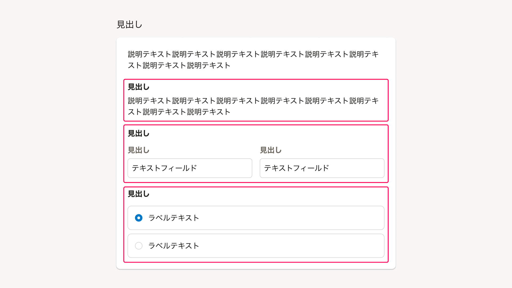
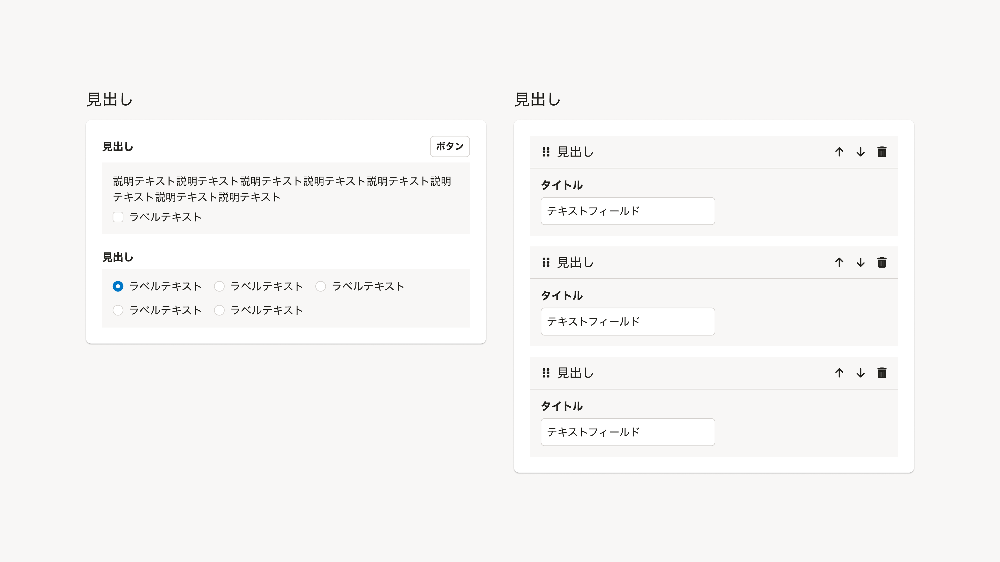
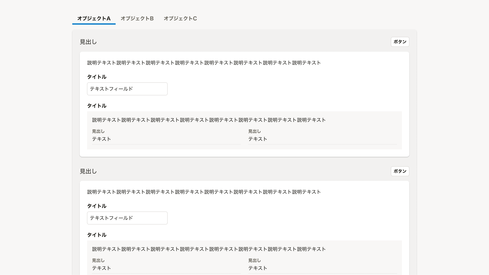
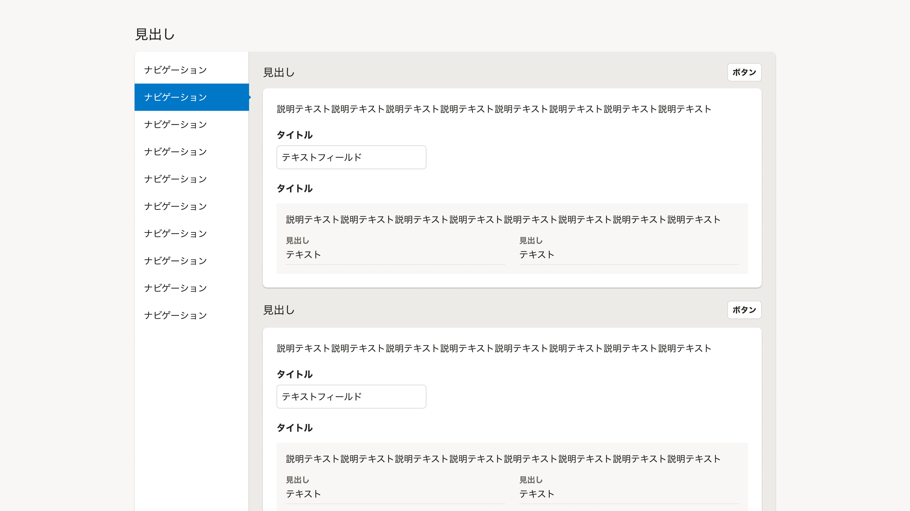

import { Image } from 'astro:assets'
import { Text, Cluster } from 'smarthr-ui'
import DoAndDont from '@/components/article/DoAndDont.astro'
import ImgWithDesc from '@/components/article/ImgWithDesc.astro'

余白・矩形・罫線などを用いて、関連性のある複数の要素に視覚的なまとまりをもたせることを視覚的グルーピングと呼びます。
SmartHRプロダクトの基本的な視覚的グルーピングのパターンをまとめています。

## 基本的な考え方
視覚的グルーピングは、情報の支配関係や意味的なまとまりといった情報の関係性を視覚的に表現するために使います。

余白・矩形・罫線によって要素を適切にグルーピングすることで以下を期待できます。

- 個々を詳細に確認することなく、視覚的な構成から素早く情報の関係性を認識し、目的の情報を見つけて操作できる
- アクションやナビゲーションの影響範囲を予期して操作できる

### 視覚的グルーピングの表現に一貫性を持たせる
SmartHR全体で一貫性のあるグルーピングをすることで、ユーザーは経験に基づいて情報の意味や階層を推測しながらアプリケーションを使えます。[デザインパターン](#h2-2)に基づいたグルーピングを検討してください。

また、階層や性質、コンテキストが同一の要素は、特別な理由がない限り同じ表現でグルーピングしてください。むやみに異なる表現をすると、それぞれが別の階層や性質であるかのような印象をユーザーに与えます。

<DoAndDont type="do">
  <Text slot="label">同じ画面に並んでいる同じ性質の要素が同一の表現でグルーピングされていることで、同じ階層や性質であることが理解しやすい。</Text>
  <div slot="img">
```tsx editable hideCode canvas=800 background=BACKGROUND
<Stack className="shr-w-full">
  <Sidebar right>
    <Heading>見出し</Heading>
    <Button>ボタン</Button>
  </Sidebar>
  <Base padding={1.5}>
    <Stack gap={1.5}>
      <Fieldset legend="見出し1" helpMessage="選択肢に関する説明です。説明テキスト説明テキスト説明テキスト説明テキスト説明テキスト説明テキスト説明テキスト説明テキスト説明テキスト説明テキスト説明テキスト。" innerMargin={0.5}>
        <BaseColumn className="shr-w-fit">
          <Cluster gap={{ row: 0.5, column: 1.5 }}>
            <RadioButton name="radio1">選択肢1</RadioButton>
            <RadioButton name="radio1">選択肢2</RadioButton>
          </Cluster>
        </BaseColumn>
      </Fieldset>
      <Fieldset legend="見出し2" innerMargin={0.5}>
        <BaseColumn className="shr-w-fit">
          <Cluster gap={{ row: 0.5, column: 1.5 }}>
            <RadioButton name="radio1">選択肢1</RadioButton>
            <RadioButton name="radio1">選択肢2</RadioButton>
          </Cluster>
        </BaseColumn>
      </Fieldset>
      <Fieldset legend="見出し2" innerMargin={0.5}>
        <BaseColumn className="shr-w-fit">
          <Cluster gap={{ row: 0.5, column: 1.5 }}>
            <RadioButton name="radio1">選択肢1</RadioButton>
            <RadioButton name="radio1">選択肢2</RadioButton>
            <RadioButton name="radio1">選択肢3</RadioButton>
            <RadioButton name="radio1">選択肢4</RadioButton>
            <RadioButton name="radio1">選択肢5</RadioButton>
            <RadioButton name="radio1">選択肢6</RadioButton>
            <RadioButton name="radio1">選択肢7</RadioButton>
            <RadioButton name="radio1">選択肢8</RadioButton>
            <RadioButton name="radio1">選択肢9</RadioButton>
            <RadioButton name="radio1">選択肢10</RadioButton>
          </Cluster>
        </BaseColumn>
      </Fieldset>
    </Stack>
  </Base>
</Stack>
```
  </div>
</DoAndDont>

<DoAndDont type="dont">
  <Text slot="label">見出し1~3それぞれグルーピングとしては適切だが、同じ画面に並んでいる同じ性質の要素が異なる表現でグルーピングされていることで別の性質を持つものに見えてしまう。</Text>
  <div slot="img">
```tsx editable hideCode canvas=800 background=BACKGROUND
<Stack className="shr-w-full">
  <Sidebar right>
    <Heading>見出し</Heading>
    <Button>ボタン</Button>
  </Sidebar>
  <Base padding={1.5}>
    <Stack gap={1.5}>
      <Fieldset legend="見出し1" helpMessage="選択肢に関する説明です。説明テキスト説明テキスト説明テキスト説明テキスト説明テキスト説明テキスト説明テキスト説明テキスト説明テキスト説明テキスト説明テキスト。" innerMargin={0.5}>
        <BaseColumn className="shr-w-fit">
          <Cluster gap={{ row: 0.5, column: 1.5 }}>
            <RadioButton name="radio1">選択肢1</RadioButton>
            <RadioButton name="radio1">選択肢2</RadioButton>
          </Cluster>
        </BaseColumn>
      </Fieldset>
      <Fieldset legend="見出し2" innerMargin={0.5}>
        <Cluster gap={{ row: 0.5, column: 1.5 }}>
          <RadioButton name="radio1">選択肢1</RadioButton>
          <RadioButton name="radio1">選択肢2</RadioButton>
        </Cluster>
      </Fieldset>
      <Fieldset legend="見出し2" innerMargin={0.5}>
        <Cluster gap={{ row: 0.5, column: 1.5 }}>
          <RadioButton name="radio1">選択肢1</RadioButton>
          <RadioButton name="radio1">選択肢2</RadioButton>
          <RadioButton name="radio1">選択肢3</RadioButton>
          <RadioButton name="radio1">選択肢4</RadioButton>
          <RadioButton name="radio1">選択肢5</RadioButton>
          <RadioButton name="radio1">選択肢6</RadioButton>
          <RadioButton name="radio1">選択肢7</RadioButton>
          <RadioButton name="radio1">選択肢8</RadioButton>
          <RadioButton name="radio1">選択肢9</RadioButton>
          <RadioButton name="radio1">選択肢10</RadioButton>
        </Cluster>
      </Fieldset>
    </Stack>
  </Base>
</Stack>
```
  </div>
</DoAndDont>

### 階層を深くしない
視覚的なグループの内部でさらに要素をグルーピングすることで、情報の階層を表現できます。ただし、階層が深くなるほど情報の関係性の把握が難しくなることに注意してください。

ユーザーのユースケースに基づいて情報設計やページ構成を見直し、階層が深くなることを避け、素早く理解できるレイアウトを提供してください。

## 考慮する法則
SmartHRの製品開発では、ゲシュタルト心理学におけるゲシュタルト原則を考慮して視覚的グルーピングを設計します。

[WIP]

## 種類

### 余白
関連の深い要素同士ほど近接させ、関連の薄い要素とはそれよりも大きな距離を取ることで要素のまとまりを示します。

<DoAndDont type="do">
  <div slot="label">
    <Text>関連の深い要素同士ほど近接し、関連の薄い要素はよりも大きな距離を取られているので要素のまとまりがわかりやすい。</Text>
    <details>
      <summary>参考：余白の設定値を可視化した図</summary>
      
    </details>
  </div>
  <div slot="img">
```tsx editable hideCode background=BACKGROUND
<Stack gap={1.5}>
  <Fieldset legend="見出し" innerMargin={1}>
    <Cluster gap={1}>
      <FormControl label={{ styleType: 'subBlockTitle', text: 'タイトル' }}>
        <Input />
      </FormControl>
      <FormControl label={{ styleType: 'subBlockTitle', text: 'タイトル' }}>
        <Input />
      </FormControl>
    </Cluster>
  </Fieldset>
  <Fieldset legend="見出し">
    <Cluster gap={1}>
      <FormControl label={{ styleType: 'subBlockTitle', text: 'タイトル' }}>
        <Input />
      </FormControl>
      <FormControl label={{ styleType: 'subBlockTitle', text: 'タイトル' }}>
        <Input />
      </FormControl>
    </Cluster>
  </Fieldset>
</Stack>
```
  </div>
</DoAndDont>

グルーピングのための視覚的な要素を用いずに要素間の距離でグループを表現するため、矩形や罫線に比べて大きく画面の複雑性を抑えることができます。

ただし、多重の階層など複雑なグループの表現には向いていません。


<DoAndDont type="dont">
  <Text slot="label">要素のまとまりを理解することが難しい。例えば、各ボタンや下部の「補足テキスト」はどの見出しに属しているのかわからない。</Text>
  <div slot="img">
```tsx editable hideCode canvas=1400 background=BACKGROUND
<Container size="NARROW">
  <Stack gap={2}>
    <Stack gap={1.5}>
      <Stack>
        <Sidebar right align="center">
          <Heading>見出し</Heading>
          <Button>ボタン</Button>
        </Sidebar>
        <p>説明テキスト説明テキスト説明テキスト説明テキスト説明テキスト説明テキスト説明テキスト説明テキスト</p>
      </Stack>
      <Sidebar right gap={1.5}>
        <Stack>
          <Sidebar align="center" right>
            <Heading type="blockTitle">見出し</Heading>
            <Button size="S" prefix={<FaPencilIcon />}>編集</Button>
          </Sidebar>
          <Stack gap={0.5} align="start">
            <StatusLabel>ラベル名</StatusLabel>
            <Text>テキストテキストテキストテキストテキストテキストテキストテキストテキストテキストテキストテキストテキスト</Text>
          </Stack>
          <Stack gap={0.5} align="start">
            <StatusLabel>ラベル名</StatusLabel>
            <Text>テキストテキストテキストテキストテキストテキストテキストテキストテキストテキストテキストテキストテキスト</Text>
          </Stack>
          <Text as="p" size="S" color="TEXT_GREY">補足テキスト</Text>
        </Stack>
        <Stack style={{ flexBasis: '15em' }}>
          <Sidebar align="center" right>
            <Heading type="blockTitle">見出し</Heading>
            <Button size="S" prefix={<FaPencilIcon />}>編集</Button>
          </Sidebar>
          <DefinitionList>
            <DefinitionListItem term={{ styleType: 'subSubBlockTitle', text: '見出し' }}>
              テキスト
            </DefinitionListItem>
            <DefinitionListItem term={{ styleType: 'subSubBlockTitle', text: '見出し' }}>
              テキスト
            </DefinitionListItem>
            <DefinitionListItem term={{ styleType: 'subSubBlockTitle', text: '見出し' }}>
              テキスト
            </DefinitionListItem>
          </DefinitionList>
        </Stack>
      </Sidebar>
      <Stack>
        <Sidebar right align="center">
          <Heading>見出し</Heading>
          <Button>ボタン</Button>
        </Sidebar>
        <p>説明テキスト説明テキスト説明テキスト説明テキスト説明テキスト説明テキスト説明テキスト説明テキスト</p>
      </Stack>
      <Sidebar right gap={1.5}>
        <Stack>
          <Sidebar align="center" right>
            <Heading type="blockTitle">見出し</Heading>
            <Button size="S" prefix={<FaPencilIcon />}>編集</Button>
          </Sidebar>
          <Stack gap={0.5} align="start">
            <StatusLabel>ラベル名</StatusLabel>
            <Text>テキストテキストテキストテキストテキストテキストテキストテキストテキストテキストテキストテキストテキスト</Text>
          </Stack>
          <Stack gap={0.5} align="start">
            <StatusLabel>ラベル名</StatusLabel>
            <Text>テキストテキストテキストテキストテキストテキストテキストテキストテキストテキストテキストテキストテキスト</Text>
          </Stack>
          <Text as="p" size="S" color="TEXT_GREY">補足テキスト</Text>
        </Stack>
        <Stack style={{ flexBasis: '15em' }}>
          <Sidebar align="center" right>
            <Heading type="blockTitle">見出し</Heading>
            <Button size="S" prefix={<FaPencilIcon />}>編集</Button>
          </Sidebar>
          <DefinitionList>
            <DefinitionListItem term={{ styleType: 'subSubBlockTitle', text: '見出し' }}>
              テキスト
            </DefinitionListItem>
            <DefinitionListItem term={{ styleType: 'subSubBlockTitle', text: '見出し' }}>
              テキスト
            </DefinitionListItem>
            <DefinitionListItem term={{ styleType: 'subSubBlockTitle', text: '見出し' }}>
              テキスト
            </DefinitionListItem>
          </DefinitionList>
        </Stack>
      </Sidebar>
    </Stack>
  </Stack>
</Container>
```
  </div>
</DoAndDont>

余白は[Cluster](/products/components/layout/cluster/)や[Stack](/products/components/layout/stack/)を用いて表現できます。[余白の取り方](/products/design-patterns/spacing-layout-pattern/)を参照してください。

### 矩形
関連する複数の要素を長方形の領域に収めることで要素のまとまりを示します。階層を示すため、[影](/products/design-tokens/shadow/)を併用することがあります。

```tsx editable hideCode canvas=800 background=BACKGROUND
<Container size="NARROW">
  <Stack className="shr-w-full">
    <Sidebar right align="center">
      <Heading>見出し</Heading>
      <Button>ボタン</Button>
    </Sidebar>
    <Base padding={1.5}>
      <Stack gap={1.5}>
        <p>説明テキスト説明テキスト説明テキスト説明テキスト説明テキスト説明テキスト説明テキスト説明テキスト</p>
        <Fieldset legend="見出し" innerMargin={0.5}>
          <BaseColumn className="shr-w-fit">
            <Cluster gap={1.5}>
              <RadioButton name="radio1">ラベルテキスト1</RadioButton>
              <RadioButton name="radio1">ラベルテキスト2</RadioButton>
            </Cluster>
          </BaseColumn>
        </Fieldset>
      </Stack>
    </Base>
  </Stack>
</Container>
```

グループの範囲を明確に示すため、レイアウト上要素を近接させづらい場合や、複数の子グループを内包する場合にも、ユーザーに情報の関係性を伝えられます。

ただし、大きな面積で領域を強く区切る意匠であるため、過度な使用は画面を冗長で複雑にします。特にモバイルでは画面幅が小さい影響でこの傾向が顕著になるため、より慎重な検討が必要です。
余白によるグルーピングでは不都合が生じる際に使用を検討してください。  

<DoAndDont type="do">
  <Text slot="label">必要な箇所のみ矩形によってグルーピングされており、要素のまとまりを素早く理解しやすい。</Text>
  <div slot="img">
```tsx editable hideCode canvas=800 background=BACKGROUND
<Container size="NARROW">
  <Stack className="shr-w-full">
    <Sidebar right align="center">
      <Heading>見出し</Heading>
      <Button>ボタン</Button>
    </Sidebar>
    <Base padding={1.5}>
      <Stack gap={1.5}>
        <Stack gap={0.5}>
          <Heading type="blockTitle">見出し</Heading>
          <p>説明テキスト説明テキスト説明テキスト説明テキスト説明テキスト説明テキスト</p>
        </Stack>
        <Fieldset legend="見出し" innerMargin={0.5} helpMessage="選択肢に関する説明です。">
          <BaseColumn className="shr-w-fit">
            <Cluster gap={1.5}>
              <RadioButton name="radio1">ラベルテキスト1</RadioButton>
              <RadioButton name="radio1">ラベルテキスト2</RadioButton>
            </Cluster>
          </BaseColumn>
        </Fieldset>
        <Stack gap={0.5}>
          <Heading type="blockTitle">見出し</Heading>
          <p>説明テキスト説明テキスト説明テキスト説明テキスト説明テキスト説明テキスト</p>
          <BaseColumn>
            <DefinitionList>
              <DefinitionListItem term={{ styleType: 'subBlockTitle', text: '見出し' }}>
                テキスト
              </DefinitionListItem>
              <DefinitionListItem term={{ styleType: 'subBlockTitle', text: '見出し' }}>
                テキスト
              </DefinitionListItem>
              <DefinitionListItem term={{ styleType: 'subBlockTitle', text: '見出し' }}>
                テキスト
              </DefinitionListItem>
              <DefinitionListItem term={{ styleType: 'subBlockTitle', text: '見出し' }}>
                テキスト
              </DefinitionListItem>
            </DefinitionList>
          </BaseColumn>
        </Stack>
      </Stack>
    </Base>
  </Stack>
</Container>
```
  </div>
</DoAndDont>

<DoAndDont type="dont">
  <Text slot="label">コンテンツの内容よりもまず矩形に意識が向き、内容の理解に時間がかかる。矩形で示されるまとまりの範囲を理解して得られる情報が少ない。</Text>
  <div slot="img">
```tsx editable hideCode canvas=800 background=BACKGROUND
<Container size="NARROW">
  <Stack className="shr-w-full">
    <Sidebar right align="center">
      <Heading>見出し</Heading>
      <Button>ボタン</Button>
    </Sidebar>
    <Base padding={1.5}>
      <Stack gap={1.5}>
        <Stack gap={0.5}>
          <Heading type="blockTitle">見出し</Heading>
          <BaseColumn>
            <p>説明テキスト説明テキスト説明テキスト説明テキスト説明テキスト説明テキスト</p>
          </BaseColumn>
        </Stack>
        <Stack gap={0.5}>
          <Heading type="blockTitle">見出し</Heading>
          <BaseColumn>
            <Stack gap={0.5}>
              <p>説明テキスト説明テキスト説明テキスト説明テキスト説明テキスト説明テキスト</p>
              <Fieldset legend={{ text: '見出し', unrecommendedHide: true }}>
                <BaseColumn bgColor="HEAD" className="shr-w-fit">
                  <Cluster gap={1.5}>
                    <RadioButton name="radio1">ラベルテキスト1</RadioButton>
                    <RadioButton name="radio1">ラベルテキスト2</RadioButton>
                  </Cluster>
                </BaseColumn>
              </Fieldset>
            </Stack>
          </BaseColumn>
        </Stack>
        <Stack gap={0.5}>
          <Heading type="blockTitle">見出し</Heading>
          <BaseColumn>
            <Stack gap={0.5}>
              <p>説明テキスト説明テキスト説明テキスト説明テキスト説明テキスト説明テキスト</p>
              <BaseColumn bgColor="HEAD">
                <DefinitionList>
                  <DefinitionListItem term={{ styleType: 'subBlockTitle', text: '見出し' }}>
                    テキスト
                  </DefinitionListItem>
                  <DefinitionListItem term={{ styleType: 'subBlockTitle', text: '見出し' }}>
                    テキスト
                  </DefinitionListItem>
                  <DefinitionListItem term={{ styleType: 'subBlockTitle', text: '見出し' }}>
                    テキスト
                  </DefinitionListItem>
                  <DefinitionListItem term={{ styleType: 'subBlockTitle', text: '見出し' }}>
                    テキスト
                  </DefinitionListItem>
                </DefinitionList>
              </BaseColumn>
            </Stack>
          </BaseColumn>
        </Stack>
      </Stack>
    </Base>
  </Stack>
</Container>
```
  </div>
</DoAndDont>

また、背景と異なる色で矩形の領域を表現してください。影を併用できますが、影だけで表現することは避けてください。

<Cluster gap={{ row: 0, column: 1 }}>
  <DoAndDont type="do" width="calc(50% - 8px)">
    <Text slot="label">右カラムの背景色が`OVER_BACKGROUND`になっており、画面の背景色`BACKGROUND`との境界を認識しやすい。</Text>
    <div slot="img">
```tsx editable hideCode canvas=800 background=BACKGROUND
<Container className="shr-w-full shr-bg-background">
  <Base>
    <BaseColumn rounded bgColor="OVER_BACKGROUND" padding={0}>
      <Sidebar gao={0}>
        <BaseColumn style={{ flexBasis: '10em' }} padding={{ block: 0.5, inline: 0 }} rounded="left" className="shr-shadow-layer-1" bgColor="WHITE">
          <SideNav className="shr-bg-white">
            <SideNavItemAnchor id="item1" href="#">ナビゲーション1</SideNavItemAnchor>
            <SideNavItemAnchor id="item2" href="#" current>ナビゲーション2</SideNavItemAnchor>
            <SideNavItemAnchor id="item3" href="#">ナビゲーション3</SideNavItemAnchor>
            <SideNavItemAnchor id="item4" href="#">ナビゲーション4</SideNavItemAnchor>
          </SideNav>
        </BaseColumn>
          <Section className="shr-p-1.5">
            <Stack gap={2}>
              <Section>
                <Stack>
                  <Sidebar right align="center">
                    <Heading>見出し</Heading>
                    <Button>操作</Button>
                  </Sidebar>
                  <Base padding={1.5}>
                    <Stack gap={1.5}>
                      <p>説明テキスト。</p>
                      <Fieldset legend="見出し">
                        <BaseColumn className="shr-w-fit">
                          <Cluster gap={1.5}>
                            <RadioButton name="radio1">ラベルテキスト1</RadioButton>
                            <RadioButton name="radio1">ラベルテキスト2</RadioButton>
                          </Cluster>
                        </BaseColumn>
                      </Fieldset>
                    </Stack>
                  </Base>
                </Stack>
              </Section>
              <Section>
                <Stack>
                  <Sidebar right align="center">
                    <Heading>見出し</Heading>
                    <Button>操作</Button>
                  </Sidebar>
                  <Base padding={1.5}>
                    <Stack gap={1.5}>
                      <p>説明テキスト。</p>
                      <Fieldset legend="見出し">
                        <BaseColumn className="shr-w-fit">
                          <Cluster gap={1.5}>
                            <RadioButton name="radio1">ラベルテキスト1</RadioButton>
                            <RadioButton name="radio1">ラベルテキスト2</RadioButton>
                          </Cluster>
                        </BaseColumn>
                      </Fieldset>
                    </Stack>
                  </Base>
                </Stack>
              </Section>
            </Stack>
          </Section>
      </Sidebar>
    </BaseColumn>
  </Base>
</Container>
```
    </div>
  </DoAndDont>

  <DoAndDont type="dont" width="calc(50% - 8px)">
    <Text slot="label">右カラムの背景色が画面の背景色`BACKGROUND`と同一で境界を認識しづらい（`BACKGROUND`と`COLUMN`は同色）。</Text>
    <div slot="img">
```tsx editable hideCode canvas=800 background=BACKGROUND
<Container className="shr-w-full shr-bg-background">
  <Base>
    <BaseColumn rounded bgColor="COLUMN" padding={0}>
      <Sidebar gao={0}>
        <BaseColumn style={{ flexBasis: '10em' }} padding={{ block: 0.5, inline: 0 }} rounded="left" className="shr-shadow-layer-1" bgColor="WHITE">
          <SideNav className="shr-bg-white">
            <SideNavItemAnchor id="item1" href="#">ナビゲーション1</SideNavItemAnchor>
            <SideNavItemAnchor id="item2" href="#" current>ナビゲーション2</SideNavItemAnchor>
            <SideNavItemAnchor id="item3" href="#">ナビゲーション3</SideNavItemAnchor>
            <SideNavItemAnchor id="item4" href="#">ナビゲーション4</SideNavItemAnchor>
          </SideNav>
        </BaseColumn>
          <Section className="shr-p-1.5">
            <Stack gap={2}>
              <Section>
                <Stack>
                  <Sidebar right align="center">
                    <Heading>見出し</Heading>
                    <Button>操作</Button>
                  </Sidebar>
                  <Base padding={1.5}>
                    <Stack gap={1.5}>
                      <p>説明テキスト。</p>
                      <Fieldset legend="見出し">
                        <BaseColumn className="shr-w-fit">
                          <Cluster gap={1.5}>
                            <RadioButton name="radio1">ラベルテキスト1</RadioButton>
                            <RadioButton name="radio1">ラベルテキスト2</RadioButton>
                          </Cluster>
                        </BaseColumn>
                      </Fieldset>
                    </Stack>
                  </Base>
                </Stack>
              </Section>
              <Section>
                <Stack>
                  <Sidebar right align="center">
                    <Heading>見出し</Heading>
                    <Button>操作</Button>
                  </Sidebar>
                  <Base padding={1.5}>
                    <Stack gap={1.5}>
                      <p>説明テキスト。</p>
                      <Fieldset legend="見出し">
                        <BaseColumn className="shr-w-fit">
                          <Cluster gap={1.5}>
                            <RadioButton name="radio1">ラベルテキスト1</RadioButton>
                            <RadioButton name="radio1">ラベルテキスト2</RadioButton>
                          </Cluster>
                        </BaseColumn>
                      </Fieldset>
                    </Stack>
                  </Base>
                </Stack>
              </Section>
            </Stack>
          </Section>
      </Sidebar>
    </BaseColumn>
  </Base>
</Container>
```
    </div>
  </DoAndDont>
</Cluster>

矩形は[Base](/products/components/layout/base)や[BaseColumn](/products/components/layout/base/base-column)を用いて表現できます。

### 罫線
関連する要素のグループと他のグループとの境界に線を引くことで要素のまとまりを示します。領域を直線の罫線で区切ったり、領域の四方を罫線で囲むことで明確な境界を示せます。



レイアウトする面積が小さいなど余白や矩形ではグルーピングが難しい場合でも明確にグループの境界を示すことができます。

ただし、**罫線は余白や矩形でグループを表現できない場合の最終手段**として使います。理由は以下のとおりです。
- グループそのものよりも境界に対して強くユーザーの注意を惹くため、多用すると逆にグループが把握しづらくなる
- SmartHR UIではInputやButtonなど操作可能な要素に対して罫線をつける意匠を使っているため、それらと競合し操作可能な領域がわかりづらくなる場合がある

<Cluster gap={{ row: 0, column: 1 }}>
  <DoAndDont type="do" width="calc(50% - 8px)">
    <Text slot="label">適切に余白を使ってレイアウトされており、素早く要素のまとまりを理解しやすい。</Text>
    <div slot="img">
```tsx editable hideCode canvas=800 background=BACKGROUND
<Container className="shr-bg-background">
  <Base padding={1.5}>
    <Stack gap={1.5}>
      <Fieldset legend="タイトル" statusLabels={<RequiredLabel />} supplementaryMessage="補足メッセージ">
        <Cluster gap={1} align="start" justify="stretch">
          <FormControl label={{ styleType: 'subBlockTitle', text: 'タイトル' }} className="shr-grow">
            <Input width="100%" />
          </FormControl>
          <FormControl label={{ styleType: 'subBlockTitle', text: 'タイトル' }} className="shr-grow">
            <Input width="100%" />
          </FormControl>
        </Cluster>
      </Fieldset>
      <Fieldset legend="タイトル" statusLabels={<RequiredLabel />} supplementaryMessage="補足メッセージ">
        <Cluster gap={1} align="start" justify="stretch">
          <FormControl label={{ styleType: 'subBlockTitle', text: 'タイトル' }} className="shr-grow">
            <Input width="100%" />
          </FormControl>
          <FormControl label={{ styleType: 'subBlockTitle', text: 'タイトル' }} className="shr-grow">
            <Input width="100%" />
          </FormControl>
        </Cluster>
      </Fieldset>
    </Stack>
  </Base>
</Container>
```
    </div>
  </DoAndDont>

  <DoAndDont type="dont" width="calc(50% - 8px)">
    <Text slot="label">どこまでの要素をどの見出しが支配するのか理解が難しい。操作可能な領域がわかりづらい。</Text>
    <div slot="img">
```tsx editable hideCode canvas=800 background=BACKGROUND
<Container className="shr-bg-background">
  <Base padding={0}>
    <Fieldset legend={{ text: 'タイトル', styleType: 'sectionTitle' }} statusLabels={<span className="shr-border-l-shorthand shr-ps-0.5"><RequiredLabel /></span>} supplementaryMessage="補足メッセージ" className="shr-p-1">
      <Cluster gap={1} align="start" justify="stretch" className="shr-border-t-shorthand shr-pt-1">
        <FormControl label={{ styleType: 'blockTitle', text: 'タイトル' }} className="shr-grow">
          <Input width="100%" />
        </FormControl>
        <FormControl label={{ styleType: 'blockTitle', text: 'タイトル' }} className="shr-grow">
          <Input width="100%" />
        </FormControl>
      </Cluster>
    </Fieldset>
    <Fieldset legend={{ text: 'タイトル', styleType: 'sectionTitle' }} statusLabels={<span className="shr-border-l-shorthand shr-ps-0.5"><RequiredLabel /></span>} supplementaryMessage="補足メッセージ" className="shr-border-t-shorthand shr-p-1 shr-border-solid">
      <Cluster gap={1} align="start" justify="stretch" className="shr-border-t-shorthand shr-pt-1">
        <FormControl label={{ styleType: 'subBlockTitle', text: 'タイトル' }} className="shr-grow">
          <Input width="100%" />
        </FormControl>
        <FormControl label={{ styleType: 'subBlockTitle', text: 'タイトル' }} className="shr-grow">
          <Input width="100%" />
        </FormControl>
      </Cluster>
    </Fieldset>
  </Base>
</Container>
```
    </div>
  </DoAndDont>
</Cluster>


## デザインパターン

### セクション
見出し領域（[セクションタイトル](/products/components/heading/#h3-1)と操作）とコンテンツを内包する[Base](/products/components/base/)によって構成されるグループをセクションと呼びます。セクションについての説明はBaseの内部に含めます。[よくあるテーブル](/products/design-patterns/smarthr-table/)もセクションの一種です。

```tsx editable hideCode canvas=800 background=BACKGROUND
<Container size="NARROW">
  <Stack className="shr-w-full">
    <Sidebar right align="center">
      <Heading>見出し</Heading>
      <Button>ボタン</Button>
    </Sidebar>
    <Base padding={1.5}>
      <Stack gap={1.5}>
        <p>説明テキスト説明テキスト説明テキスト説明テキスト説明テキスト説明テキスト説明テキスト説明テキスト</p>
        <FormControl label={{ styleType: 'blockTitle', text: 'タイトル' }}>
          <Input />
        </FormControl>
        <Stack gap={0.5}>
          <Sidebar right align="center">
            <Heading type="blockTitle">見出し</Heading>
            <Button size="S" prefix={<FaPencilIcon />}>編集</Button>
          </Sidebar>
          <BaseColumn>
            <Stack>
              <p>説明テキスト説明テキスト説明テキスト説明テキスト説明テキスト説明テキスト</p>
              <DefinitionList>
                <DefinitionListItem term={{ styleType: 'subBlockTitle', text: '見出し' }}>
                  テキスト
                </DefinitionListItem>
                <DefinitionListItem term={{ styleType: 'subBlockTitle', text: '見出し' }}>
                  テキスト
                </DefinitionListItem>
                <DefinitionListItem term={{ styleType: 'subBlockTitle', text: '見出し' }}>
                  テキスト
                </DefinitionListItem>
                <DefinitionListItem term={{ styleType: 'subBlockTitle', text: '見出し' }}>
                  テキスト
                </DefinitionListItem>
              </DefinitionList>
            </Stack>
          </BaseColumn>
        </Stack>
      </Stack>
    </Base>
  </Stack>
</Container>
```

基本的に見出し領域とBaseを垂直方向に積み重ねてレイアウトしますが、以下のようにセクションの範囲を視覚的に明確に示したい場合にはBaseの中に見出し領域を含めることもできます。

<DoAndDont type="do">
  <Text slot="label">ドラッグアンドドロップして並べ替えられるセクションは、Baseの中に見出し領域を含めることでセクション全体が一つのまとまりであることがわかりやすい。</Text>
  <div slot="img">
```tsx editable hideCode canvas=800 background=BACKGROUND
<Container size="NARROW">
  <Base draggable>
    <div className="shr-px-1.5 shr-py-0.5 shr-ps-0.5 shr-border-b-shorthand">
      <Sidebar right align="center">
        <Cluster align="center" gap={0}>
          <Button variant="text">
            <FaGripVerticalIcon alt="ドラッグして並べ替えられます" />
          </Button>
          <Heading>見出し</Heading>
        </Cluster>
        <Cluster align="center" gap={0.5}>
          <Button size="S"><FaArrowUpIcon alt="上に移動" /></Button>
          <Button size="S"><FaArrowDownIcon alt="下に移動" /></Button>
          <Button size="S"><FaTrashCanIcon alt="削除" /></Button>
        </Cluster>
      </Sidebar>
    </div>
    <div className="shr-p-1.5">
      <Stack gap={1.5}>
        <Fieldset legend="見出し">
          <Stack gap={1}>
            <RadioButton name="radio1" defaultChecked>ラベルテキスト1</RadioButton>
            <RadioButton name="radio1">ラベルテキスト2</RadioButton>
          </Stack>
        </Fieldset>
        <FormControl label={{ styleType: 'blockTitle', text: 'タイトル' }}>
          <Input />
        </FormControl>
        <FormControl label={{ styleType: 'blockTitle', text: 'タイトル' }}>
          <Textarea width="100%" />
        </FormControl>
      </Stack>
    </div>
  </Base>
</Container>
```
  </div>
</DoAndDont>

#### セクションの内容を切り替えるレイアウト
[TabBar](/products/components/tab-bar/)または[SideNav](/products/components/side-nav/)を使用し、セクションの内容を切り替えるコントロールを提供できます。

##### TabBarを使う場合
見出し領域にTabBarを配置し、Baseを切り替えます。

- 見出しは省略できます。（ただし、Headingの`visuallyHidden`propsを使うなどマシンリーダブルになるよう注意してください。）
- 操作の対象がタブごとに異なる場合は[DropdownMenuButton](/products/components/dropdown/dropdown-menu-button/)で操作をまとめます。

```tsx editable hideCode canvas=1400 background=BACKGROUND
<Container>
  <Stack>
    <Heading visuallyHidden>見出し</Heading>
    <Sidebar right align="center">
      <TabBar bordered={false}>
        <TabItem selected>オブジェクトA</TabItem>
        <TabItem>オブジェクトB</TabItem>
      </TabBar>
      <DropdownMenuButton trigger="追加">
        <Button>オブジェクトAを追加</Button>
        <Button>オブジェクトBを追加</Button>
      </DropdownMenuButton>
    </Sidebar>
    <Base>
      <Cluster justify="space-between" align="center" className="shr-p-1">
        <form onSubmit={(e) => e.preventDefault()}>
          <Cluster align="center" gap={1}>
            <Cluster gap={0.5}>
              <SearchInput tooltipMessage="オブジェクト名で検索できます。" name="search" />
              <Button type="submit">検索</Button>
            </Cluster>
            <FilterDropdown onApply={() => null}>絞り込みの中身</FilterDropdown>
            <Button type="submit" prefix={<FaCloudArrowDownIcon />}>
              ダウンロード
            </Button>
          </Cluster>
        </form>
        <Cluster gap={1} align="center">
          <PageCounter start={1} end={50} total={5000} />
          <Pagination current={1} total={50} withoutNumbers onClick={() => null} />
        </Cluster>
      </Cluster>
      <Table rounded="bottom">
        <thead>
          <tr>
            <ThCheckbox name="allRowCheckbox" />
            <Th>ステータス</Th>
            <Th>社員番号</Th>
            <Th>氏名</Th>
          </tr>
        </thead>
        <tbody>
          <tr>
            <TdCheckbox name="rowCheckbox1" />
            <Td contentWidth="1px">
              <StatusLabel>在籍</StatusLabel>
            </Td>
            <Td>0001</Td>
            <Td>須磨 英子</Td>
          </tr>
          <tr>
            <TdCheckbox name="rowCheckbox1" />
            <Td contentWidth="1px">
              <StatusLabel>在籍</StatusLabel>
            </Td>
            <Td>0001</Td>
            <Td>須磨 英子</Td>
          </tr>
          <tr>
            <TdCheckbox name="rowCheckbox1" />
            <Td contentWidth="1px">
              <StatusLabel>在籍</StatusLabel>
            </Td>
            <Td>0001</Td>
            <Td>須磨 英子</Td>
          </tr>
          <tr>
            <TdCheckbox name="rowCheckbox1" />
            <Td contentWidth="1px">
              <StatusLabel>在籍</StatusLabel>
            </Td>
            <Td>0001</Td>
            <Td>須磨 英子</Td>
          </tr>
          <tr>
            <TdCheckbox name="rowCheckbox1" />
            <Td contentWidth="1px">
              <StatusLabel>在籍</StatusLabel>
            </Td>
            <Td>0001</Td>
            <Td>須磨 英子</Td>
          </tr>
          <tr>
            <TdCheckbox name="rowCheckbox1" />
            <Td contentWidth="1px">
              <StatusLabel>在籍</StatusLabel>
            </Td>
            <Td>0001</Td>
            <Td>須磨 英子</Td>
          </tr>
          <tr>
            <TdCheckbox name="rowCheckbox1" />
            <Td contentWidth="1px">
              <StatusLabel>在籍</StatusLabel>
            </Td>
            <Td>0001</Td>
            <Td>須磨 英子</Td>
          </tr>
          <tr>
            <TdCheckbox name="rowCheckbox1" />
            <Td contentWidth="1px">
              <StatusLabel>在籍</StatusLabel>
            </Td>
            <Td>0001</Td>
            <Td>須磨 英子</Td>
          </tr>
        </tbody>
      </Table>
    </Base>
  </Stack>
</Container>
```

##### SideNavを使う場合
Baseを左右に2分割しSideNavとコンテンツを配置し、左のSideNavで右のコンテンツを切り替えます。

```tsx editable hideCode canvas=1400 background=BACKGROUND
<Container>
  <Stack>
    <Sidebar right align="center">
      <Heading>見出し</Heading>
      <Button>ボタン</Button>
    </Sidebar>
    <Base>
      <Sidebar gap={0}>
        <BaseColumn style={{ flexBasis: '12em' }} padding={{ block: 0.5, inline: 0 }} rounded="left" className="shr-shadow-layer-1" bgColor="WHITE">
          <SideNav className="shr-bg-white">
            <SideNavItemAnchor id="item1" href="#">ナビゲーション1</SideNavItemAnchor>
            <SideNavItemAnchor id="item2" href="#" current>ナビゲーション2</SideNavItemAnchor>
            <SideNavItemAnchor id="item3" href="#">ナビゲーション3</SideNavItemAnchor>
            <SideNavItemAnchor id="item4" href="#">ナビゲーション4</SideNavItemAnchor>
          </SideNav>
        </BaseColumn>
        <Section className="shr-p-1.5">
          <Stack>
            <Section>
              <Stack>
                <Heading>見出し</Heading>
                <p>説明テキスト説明テキスト説明テキスト説明テキスト説明テキスト説明テキスト説明テキスト説明テキスト</p>
              </Stack>
            </Section>
            <FormControl label={{ styleType: 'blockTitle', text: 'タイトル' }}>
              <Input />
            </FormControl>
            <Section>
              <Stack gap={0.5}>
                <Sidebar right align="center">
                  <Heading type="blockTitle">見出し</Heading>
                  <Button size="S" prefix={<FaPencilIcon />}>編集</Button>
                </Sidebar>
                <BaseColumn>
                  <Stack gap={1}>
                    <p>説明テキスト説明テキスト説明テキスト説明テキスト説明テキスト説明テキスト</p>
                    <DefinitionList>
                      <DefinitionListItem term={{ styleType: 'subBlockTitle', text: '見出し' }}>
                        テキスト
                      </DefinitionListItem>
                      <DefinitionListItem term={{ styleType: 'subBlockTitle', text: '見出し' }}>
                        テキスト
                      </DefinitionListItem>
                      <DefinitionListItem term={{ styleType: 'subBlockTitle', text: '見出し' }}>
                        テキスト
                      </DefinitionListItem>
                    </DefinitionList>
                  </Stack>
                </BaseColumn>
              </Stack>
            </Section>
          </Stack>
        </Section>
      </Sidebar>
    </Base>
  </Stack>
</Container>
```

### ブロック（セクション内のグループ）
見出し領域（[ブロックタイトル](/products/components/heading/#h3-2)と操作）とコンテンツによって構成される、セクション内の要素のグループをブロックと呼びます。



コンテンツは基本的に余白でグルーピングしますが、以下のようにまとまりを示しづらい場合には[BaseColumn](/products/components/base/base-column/)を使い、矩形により明確に領域を示すこともできます。

- RadioButtonやCheckboxが並んでおり、グループの領域がわかりづらい場合
- ドラッグ&amp;ドロップによって項目をユーザーが並べ替える場合
- 前後のブロックのコンテンツがBaseColumnでグルーピングされており、視覚的な印象を揃えたい場合（例：下記の画像左）



<DoAndDont type="do">
  <Text slot="label">RadioButtonやCheckboxのグループのまとまりがわかりやすい。</Text>
  <div slot="img">
```tsx editable hideCode background=WHITE
<Stack gap={1.5}>
  <Fieldset legend="見出し">
    <BaseColumn className="shr-w-fit">
      <Cluster gap={1.5}>
        <RadioButton name="radio1" defaultChecked>ラベルテキスト1</RadioButton>
        <RadioButton name="radio1">ラベルテキスト2</RadioButton>
        <RadioButton name="radio1">ラベルテキスト3</RadioButton>
        <RadioButton name="radio1">ラベルテキスト4</RadioButton>
        <RadioButton name="radio1">ラベルテキスト5</RadioButton>
      </Cluster>
    </BaseColumn>
  </Fieldset>
  <Fieldset legend="見出し">
    <BaseColumn className="shr-w-fit">
      <Cluster gap={1.5}>
        <Checkbox name="radio1" defaultChecked>ラベルテキスト1</Checkbox>
        <Checkbox name="radio1">ラベルテキスト2</Checkbox>
        <Checkbox name="radio1">ラベルテキスト3</Checkbox>
        <Checkbox name="radio1">ラベルテキスト4</Checkbox>
        <Checkbox name="radio1">ラベルテキスト5</Checkbox>
      </Cluster>
    </BaseColumn>
  </Fieldset>
</Stack>
```
  </div>
</DoAndDont>

<DoAndDont type="do">
  <Text slot="label">ブロックの内容がドラッグアンドドロップで並べ替えられることがわかりやすい。</Text>
  <div slot="img">
```tsx editable canvas=880 hideCode background=BACKGROUND
<Container size="NARROW">
  <Section>
    <Stack>
      <Heading size="XL">見出し</Heading>
      <Base padding={1.5}>
        <Stack gap={1}>
          <BaseColumn padding={0} draggable>
            <Section>
              <div className="shr-p-0.25 shr-border-b-shorthand">
                <Sidebar right align="center">
                  <Cluster align="center" gap={0}>
                    <Button variant="text">
                      <FaGripVerticalIcon alt="ドラッグして並べ替えられます" />
                    </Button>
                    <Heading>見出し</Heading>
                  </Cluster>
                  <Cluster align="center" gap={0.5}>
                    <Button size="S" variant="text"><FaArrowUpIcon alt="上に移動" /></Button>
                    <Button size="S" variant="text"><FaArrowDownIcon alt="下に移動" /></Button>
                    <Button size="S" variant="text"><FaTrashCanIcon alt="削除" /></Button>
                  </Cluster>
                </Sidebar>
              </div>
              <div className="shr-p-1">
                <FormControl label="タイトル">
                  <Input />
                </FormControl>
              </div>
            </Section>
          </BaseColumn>
          <BaseColumn padding={0} draggable>
            <Section>
              <div className="shr-p-0.25 shr-border-b-shorthand">
                <Sidebar right align="center">
                  <Cluster align="center" gap={0}>
                    <Button variant="text">
                      <FaGripVerticalIcon alt="ドラッグして並べ替えられます" />
                    </Button>
                    <Heading>見出し</Heading>
                  </Cluster>
                  <Cluster align="center" gap={0.5}>
                    <Button size="S" variant="text"><FaArrowUpIcon alt="上に移動" /></Button>
                    <Button size="S" variant="text"><FaArrowDownIcon alt="下に移動" /></Button>
                    <Button size="S" variant="text"><FaTrashCanIcon alt="削除" /></Button>
                  </Cluster>
                </Sidebar>
              </div>
              <div className="shr-p-1">
                <FormControl label="タイトル">
                  <Input />
                </FormControl>
              </div>
            </Section>
          </BaseColumn>
          <BaseColumn padding={0} draggable>
            <Section>
              <div className="shr-p-0.25 shr-border-b-shorthand">
                <Sidebar right align="center">
                  <Cluster align="center" gap={0}>
                    <Button variant="text">
                      <FaGripVerticalIcon alt="ドラッグして並べ替えられます" />
                    </Button>
                    <Heading>見出し</Heading>
                  </Cluster>
                  <Cluster align="center" gap={0.5}>
                    <Button size="S" variant="text"><FaArrowUpIcon alt="上に移動" /></Button>
                    <Button size="S" variant="text"><FaArrowDownIcon alt="下に移動" /></Button>
                    <Button size="S" variant="text"><FaTrashCanIcon alt="削除" /></Button>
                  </Cluster>
                </Sidebar>
              </div>
              <div className="shr-p-1">
                <FormControl label="タイトル">
                  <Input />
                </FormControl>
              </div>
            </Section>
          </BaseColumn>
        </Stack>
      </Base>
    </Stack>
  </Section>
</Container>
```
  </div>
</DoAndDont>

<DoAndDont type="do">
  <Text slot="label">前後のブロックのコンテンツがBaseColumnでグルーピングされており、視覚的な印象が揃っている。</Text>
  <div slot="img">
```tsx editable canvas=880 hideCode background=BACKGROUND
```
  </div>
</DoAndDont>

### 複数のセクションを内包するグループ
複数のセクションを[TabBar](/products/components/tab-bar/)や[SideNav](/products/components/side-nav/)で切り替える場合、複数のセクションを視覚的にグルーピングします。これによりユーザーが切り替えの影響範囲を明確に理解したうえで操作を行なえます。

ただし、このパターンでは階層が深くなりやすいため、情報設計やページ構成の妥当性について検討したうえで注意して設計してください。

#### TabBarを使う場合
TabBarを使う場合は以下のようなレイアウトを採用します。

- TabBarの下に複数セクションを配置したBaseを配置する。
- TabBarによって、Baseを切り替える。



モバイルにおけるレイアウトの詳細は[TabBar](/products/components/tab-bar/)を参照してください。

#### SideNavを使う場合
SideNavを使う場合は以下のようなレイアウトを採用します。

- Baseを左右に2分割しSideNavとコンテンツを配置する。
- 右カラムのコンテンツ内に複数のセクションを配置する。
- 左カラムのSideNavによって、右カラムのコンテンツを切り替える。



モバイルにおけるレイアウトの詳細は[SideNav](/products/components/side-nav/)を参照してください。

## アクセシビリティ

### 関連するチェックリスト
弱視・ロービジョンのユーザビリティチェックリスト
- [色のみで領域やグループを表現しない](/accessibility/low-vision-check-list/grouping/)
