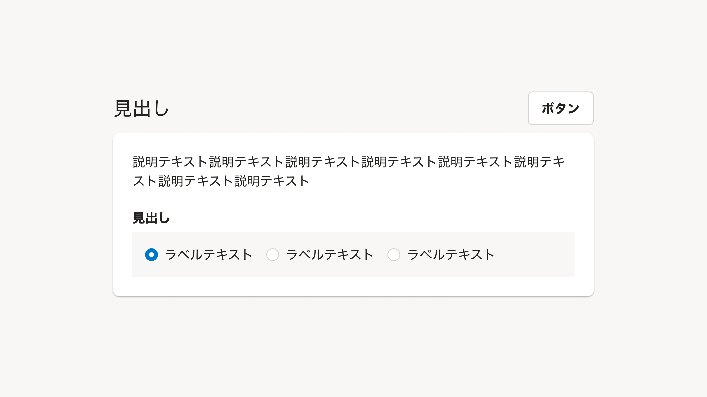
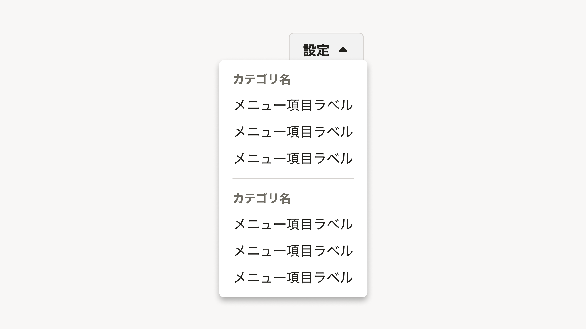
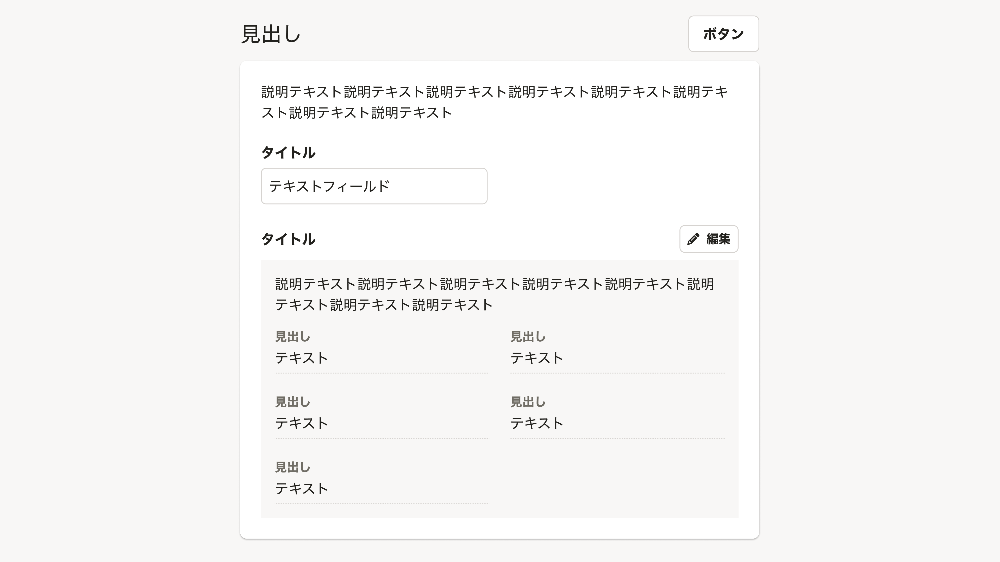
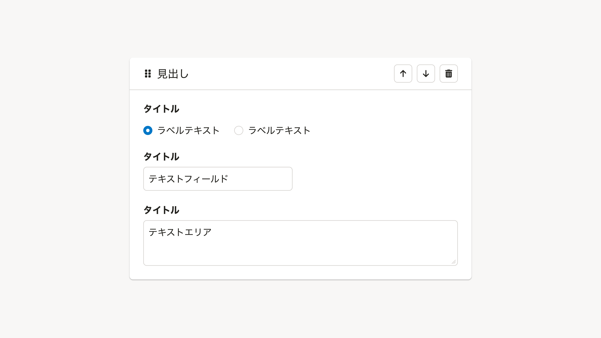
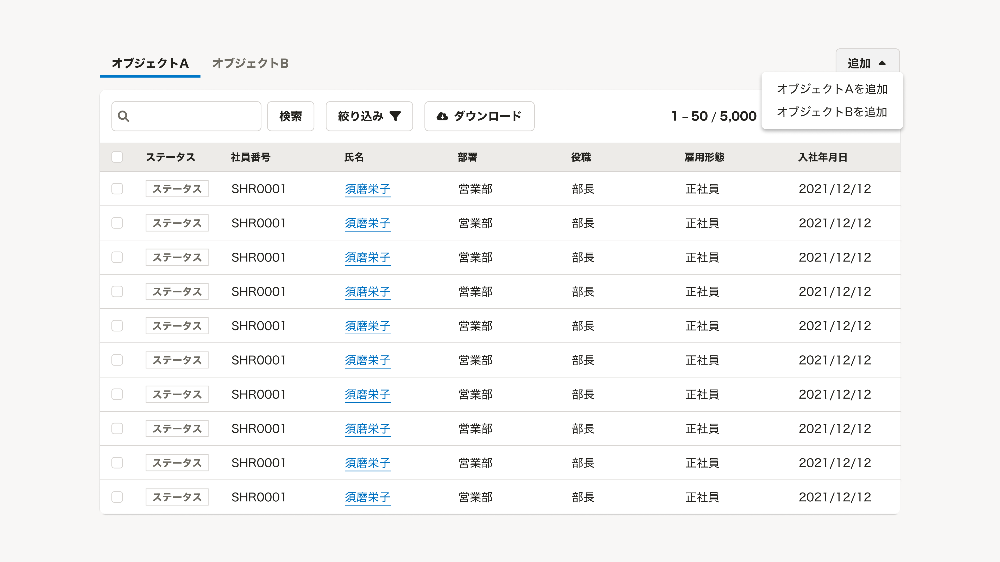
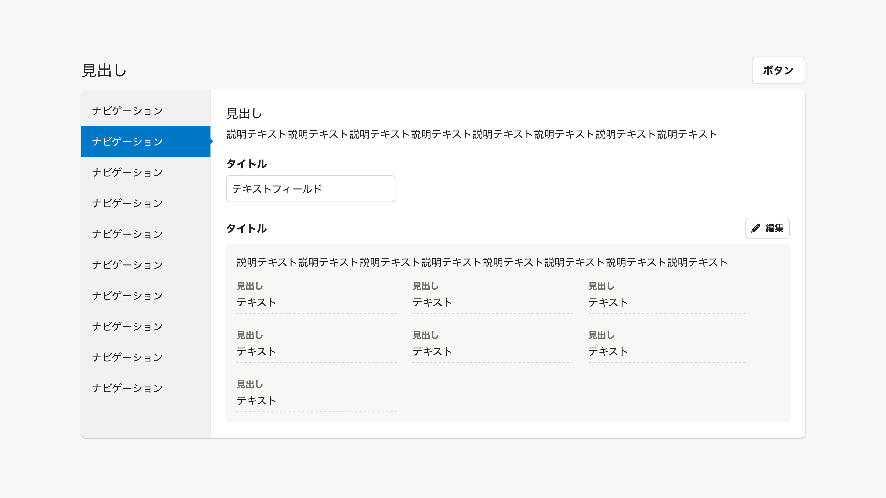
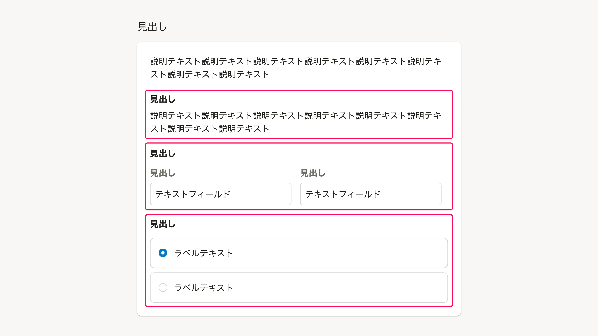
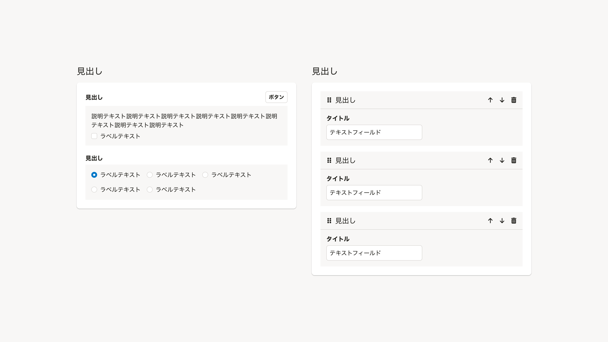
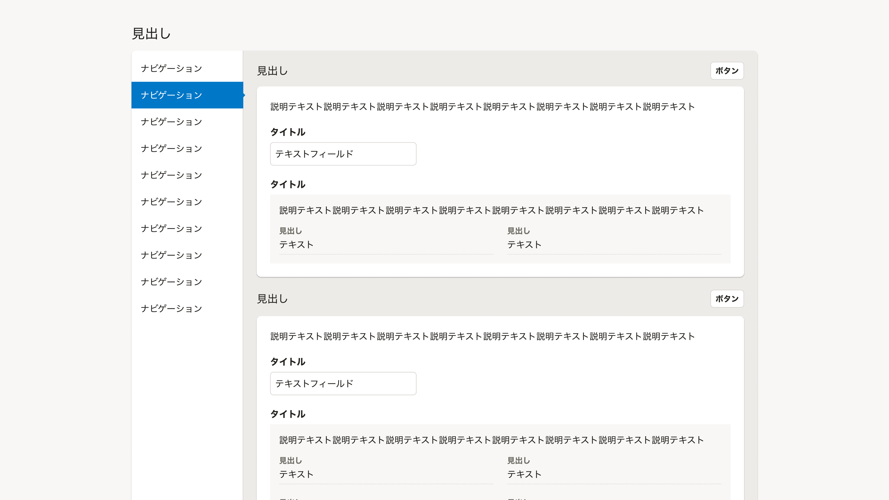

import { Image } from 'astro:assets'
import { Text, Cluster } from 'smarthr-ui'
import DoAndDont from '@/components/article/DoAndDont.astro'

import imageUrlConsistencyDont from './images/consistency-dont.png'
import imageUrlConsistencyDo from './images/consistency-do.png'
import imageUrlGapDont from './images/gap-dont.png'
import imageUrlRectangleDont from './images/rectangle-dont.png'
import imageUrlRectangleDo from './images/rectangle-do.png'
import imageUrlRectangleColorDont from './images/rectangle-color-dont.png'
import imageUrlRectangleColorDo from './images/rectangle-color-do.png'
import imageUrlBorderDont from './images/border-dont.png'
import imageUrlBorderDo from './images/border-do.png'

余白・矩形・罫線・影などを用いて、関連性のある複数の要素に視覚的なまとまりをもたせることを視覚的グルーピングと呼びます。
SmartHRプロダクトの基本的な視覚的グルーピングのパターンをまとめています。

## 基本的な考え方
視覚的グルーピングは、情報の支配関係や意味的なまとまりといった情報の関係性を視覚的に表現するために使います。

余白・矩形・罫線・影によって要素を適切にグルーピングすることで以下を期待できます。

- 個々を詳細に確認することなく、視覚的な構成から素早く情報の関係性を認識し、目的の情報を見つけて操作できる
- アクションやナビゲーションの影響範囲を予期して操作できる

### 視覚的グルーピングの表現に一貫性を持たせる
SmartHR全体で一貫性のあるグルーピングをすることで、ユーザーは経験に基づいて情報の意味や階層を推測しながらアプリケーションを利用できます。[デザインパターン](#h2-2)に基づいたグルーピングを検討してください。

また、同じ階層や似た性質、コンテキストが同一（一連の操作や同じ画面）の要素は、特別な理由がない限り同じ表現でグルーピングしてください。むやみに異なる表現をすると、それぞれが別の階層や性質であるかのような印象をユーザーに与えます。

<DoAndDont type="dont">
  <Image slot="img" src={imageUrlConsistencyDont} alt="Dont" />
  <Text slot="label">見出し1~3それぞれグルーピングとしては適切だが、同じ画面に並んでいる同じ性質の要素が異なる表現でグルーピングされていることで別の性質を持つものに見えてしまう。</Text>
</DoAndDont>

<DoAndDont type="do">
  <Image slot="img" src={imageUrlConsistencyDo} alt="Do" />
  <Text slot="label">同じ画面に並んでいる同じ性質の要素が同一の表現でグルーピングされていることで、同じ階層や性質であることが理解しやすい。</Text>
</DoAndDont>

### 階層を深くしない
視覚的なグループの内部でさらに要素をグルーピングすることで、情報の階層を表現できます。ただし、階層が深くなるほど情報の関係性の把握が難しくなることに注意してください。

ユーザーのユースケースに基づいて情報設計やページ構成を見直し、階層が深くなることを避け、素早く理解できるレイアウトを提供してください。

## 考慮する法則

SmartHRの製品開発では、ゲシュタルト心理学におけるゲシュタルト原則を考慮して視覚的グルーピングを設計します。

[WIP]

## 種類

### 余白

関連する要素同士を近接させ、関連しない要素とはそれ以上の距離を取ることで要素のまとまりを示します。

グルーピングのための視覚的な要素を用いずに要素間の距離でグループを表現するため、矩形や罫線に比べて大きく画面の複雑性を抑えることができます。

ただし、多重の階層など複雑なグループの表現には向いていません。

<DoAndDont type="dont">
  <Image slot="img" src={imageUrlGapDont} alt="Dont" />
  <Text slot="label">要素のまとまりを理解することが難しい。例えば、各ボタンや下部の「補足テキスト」はどの見出しに属しているのかわからない。</Text>
</DoAndDont>

余白は[Cluster](/products/components/layout/cluster/)や[Stack](/products/components/layout/stack/)を用いて表現できます。[余白の取り方](/products/design-patterns/spacing-layout-pattern/)を参照してください。

### 矩形

関連する複数の要素を長方形の領域に収めることで要素のまとまりを示します。階層を示すため、[影](/products/design-tokens/shadow/)を併用することがあります。

グループの範囲を明確に示すため、レイアウト上要素を近接させづらい場合や、複数の子グループを内包する場合にも、ユーザーに情報の関係性を伝えられます。

ただし、大きな面積で領域を強く区切る意匠であるため、過度な使用は画面を冗長で複雑にします。余白によるグルーピングでは不都合が生じる際に利用を検討してください。

<DoAndDont type="dont">
  <Image slot="img" src={imageUrlRectangleDont} alt="Dont" />
  <Text slot="label">コンテンツの内容よりもまず矩形に意識が向き、内容の理解に時間がかかる。矩形で示されるまとまりの範囲を理解して得られる情報が少ない。</Text>
</DoAndDont>

<DoAndDont type="do">
  <Image slot="img" src={imageUrlRectangleDo} alt="Do" />
  <Text slot="label">必要な箇所のみ矩形によってグルーピングされており、要素のまとまりを素早く理解しやすい。</Text>
</DoAndDont>

また、背景と異なる色で矩形の領域を表現してください。影を併用できますが、影だけで表現することは避けてください。

<Cluster gap={{ row: 0, column: 1 }}>
  <DoAndDont type="dont" width="calc(50% - 8px)">
    <Image slot="img" src={imageUrlRectangleColorDont} alt="Dont" />
    <Text slot="label">背景色`BACKGROUND`の上に同じ色のSideNavがあり、境界を認識しづらい。</Text>
  </DoAndDont>

  <DoAndDont type="do" width="calc(50% - 8px)">
    <Image slot="img" src={imageUrlRectangleColorDo} alt="Do" />
    <Text slot="label">背景色`BACKGROUND`の上に`OVER_BACKGROUND`のSideNavがあり、境界を認識しやすい。</Text>
  </DoAndDont>
</Cluster>
矩形は[Base](/products/components/layout/base)や[BaseColumn](/products/components/layout/base/base-column)を用いて表現できます。

### 罫線

関連する要素のグループと他のグループとの境界に線を引くことで要素のまとまりを示します。領域を直線の罫線で区切ったり、領域の四方を罫線で囲むことで明確な境界を示せます。

レイアウトする面積が小さいなど余白や矩形ではグルーピングが難しい場合でも明確にグループの境界を示すことができます。

ただし、**罫線は余白や矩形でグループを表現できない場合の最終手段**として利用してください。理由は以下のとおりです。
- グループそのものよりも境界に対して強くユーザーの注意を惹くため、多用すると逆にグループが把握しづらくなる
- SmartHR UIではInputやButtonなど操作可能な要素に対して罫線をつける意匠を使っているため、それらと競合し操作可能な領域がわかりづらくなる場合がある

<DoAndDont type="dont">
  <Image slot="img" src={imageUrlBorderDont} alt="Dont" />
  <Text slot="label">どこまでの要素をどの見出しが支配するのか理解が難しい。操作可能な領域がわかりづらい。</Text>
</DoAndDont>

<DoAndDont type="do">
  <Image slot="img" src={imageUrlBorderDo} alt="Do" />
  <Text slot="label">適切に余白を使ってレイアウトされており、素早く要素のまとまりを理解しやすい。</Text>
</DoAndDont>

## デザインパターン

### セクション

見出し領域（[セクションタイトル](/products/components/heading/#h3-1)と操作）とコンテンツを内包する[Base](/products/components/base/)によって構成されるグループをセクションと呼びます。セクションについての説明はBaseの内部に含めます。[よくあるテーブル](/products/design-patterns/smarthr-table/)もセクションの一種です。

基本的に見出し領域とBaseを垂直方向に積み重ねてレイアウトしますが、以下のようにセクションの範囲を視覚的に明確に示したい場合にはBaseの中に見出し領域を含めることもできます。
- ドラッグ&ドロップによってセクションをユーザーが並べ替える場合

セクションの内容を切り替えるコントロールを提供する場合には、[TabBar](/products/components/tab-bar/)または[SideNav](/products/components/side-nav/)を利用し以下のようにレイアウトします。

TabBarを使う場合、見出し領域にTabBarを配置し、Baseを切り替えます。見出しは省略できます。（ただし、Headingの`visuallyHidden`propsを使うなどマシンリーダブルになるよう注意してください。）操作の対象がタブごとに異なる場合は[DropdownMenuButton](/products/components/dropdown/dropdown-menu-button/)で操作をまとめます。

SideNavを使う場合、Baseを左右に2分割しSideNavとコンテンツを配置し、左のSideNavで右のコンテンツを切り替えます。

### ブロック（セクション内のグループ）

見出し領域（[ブロックタイトル](/products/components/heading/#h3-2)と操作）とコンテンツによって構成される、セクション内の要素のグループをブロックと呼びます。

コンテンツは基本的に余白でグルーピングしますが、以下のようにまとまりを示しづらい場合には[BaseColumn](/products/components/base/base-column/)を利用して矩形により明確に領域を示すこともできます。
- RadioButtonやCheckBoxが並んでおり、グループの領域がわかりづらい場合
- ドラッグ&ドロップによって項目をユーザーが並べ替える場合
- 前後のブロックのコンテンツがBaseColumnでグルーピングされており、視覚的な印象を揃えたい場合（例：下記の画像左）

### 複数のセクションを内包するグループ

複数のセクションを[TabBar](/products/components/tab-bar/)や[SideNav](/products/components/side-nav/)で切り替える場合、複数のセクションを視覚的にグルーピングします。これによりユーザーが切り替えの影響範囲を明確に理解したうえで操作を行なえます。

ただし、このパターンでは階層が深くなりやすいため、情報設計やページ構成の妥当性について検討したうえで注意して設計してください。

WIP: TabBarを利用する場合のデザインパターンについては検討中です。

SideNavを使う場合は以下のようなレイアウトを採用します。

- Baseを左右に2分割しSideNavとコンテンツを配置する。
- 右カラムのコンテンツ内に複数のセクションを配置する。
- 左カラムのSideNavによって、右カラムのコンテンツを切り替える。

